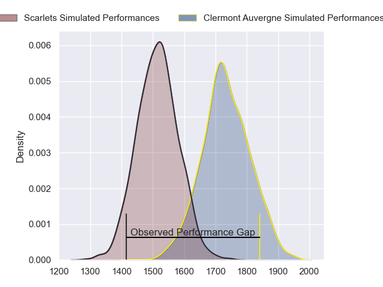
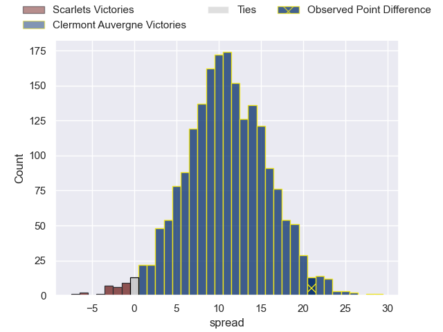
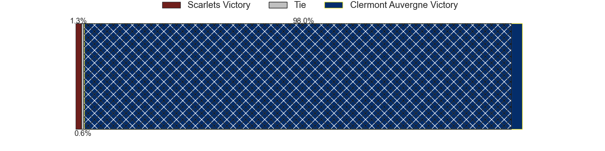
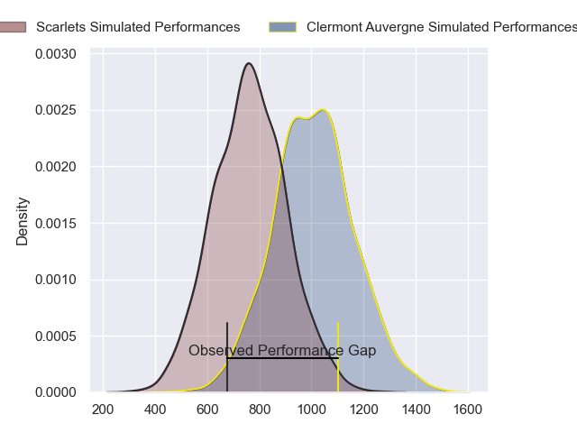
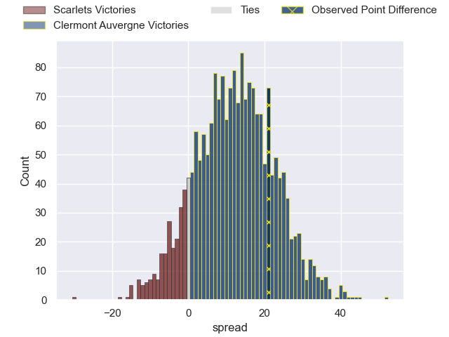
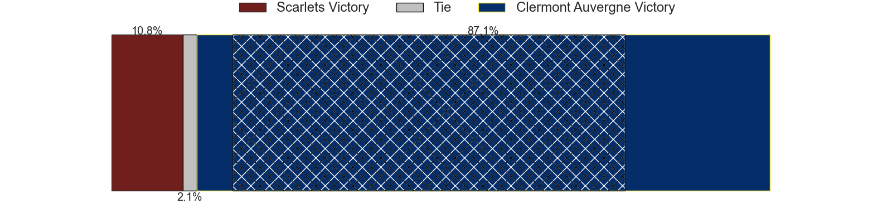
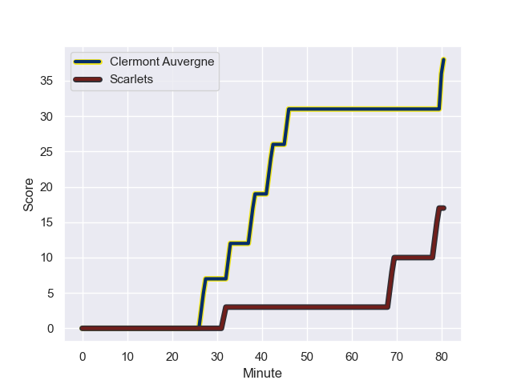
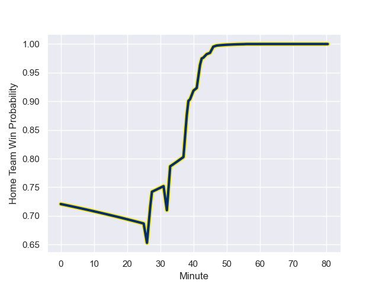

---  
layout: page  
title: Scarlets at Clermont Auvergne; 17-38  
date: 2024-01-13 18:00:00 -0500  
categories: "European Rugby Challenge Cup 2023" match review  
---
# Scarlets at Clermont Auvergne; 17-38

# Club Level Predictions

The first set of predictions treats a club as the smallest object, as the club develops its members, organizes a gameplan, and deploys its players as needed for each match. This club model has a prediction of 0.775, which translates to predicting Clermont Auvergne to win by 11.0.

Our Over/Under is 57.5 - and combined with the spread above, we have a predicted scoreline of 23 to 34

Each club has a rating and a rating deviation (similar to a Glicko rating), and expected performances can be generated. This allows for simulated matches and spreads like the ones below.
## Projected Performances - Club Model

## Projected Spreads - Club Model

## Projected Results - Club Model

# Player Level Predictions - Version 2

Treating teams instead as an entity made up of the currently active players, I have ratings for each player in an altogether different system. These can be combined to form team ratings once teamsheets are announced, weighting starters a bit higher than the reserves. After the match is played, players can be weighted by their minutes on the field, allowing for an accurate measure of the team's composition. With these compiled team ratings, we can make predictions, measure inaccuracy, and update the individual player ratings.
## Prediction with Player Minutes: Clermont Auvergne by 10.4

Clermont Auvergne by 2.7 on a neutral field
## Prediction without Player Minutes: Clermont Auvergne by 9.3

Clermont Auvergne by 1.6 on a neutral pitch

## Projected Performances - Player Model

## Projected Spreads - Player Model

## Projected Results - Player Model

## Scores over Time

## Win Probability over Time

There were 7 large changes in win probability in this match

|   Away Minutes | Away Player     |   Away elo |   Number |   Home elo | Home Player          |   Home Minutes |
|---------------:|:----------------|-----------:|---------:|-----------:|:---------------------|---------------:|
|             44 | Kemsley Mathias |      69.66 |        1 |      43.13 | Giorgi Beria         |             80 |
|             56 | Ryan Elias      |      95.1  |        2 |      36.94 | Etienne Fourcade     |             51 |
|             47 | Sam Wainwright  |      43.48 |        3 |      55.17 | Rabah Slimani        |             51 |
|             80 | Alex Craig      |      35.21 |        4 |      83.72 | Rob Simmons          |             58 |
|             47 | Jac Price       |       4.82 |        5 |      62.29 | Tomas Lavanini       |             80 |
|             63 | Josh MacLeod    |      49.14 |        6 |      48.34 | Killian Tixeront     |             74 |
|             40 | Dan Davis       |      82.81 |        7 |      88.78 | Pita Gus Sowakula    |             80 |
|             80 | Vaea Fifita     |     115.79 |        8 |      75.7  | Fritz Lee            |             51 |
|             51 | Archie Hughes   |      42.18 |        9 |      22.41 | Baptiste Jauneau     |             59 |
|             40 | Sam Costelow    |      37.75 |       10 |      63.77 | Anthony Belleau      |             80 |
|             80 | Steffan Evans   |      75.29 |       11 |      27.51 | Alivereti Raka       |             80 |
|             80 | Johnny Williams |      75.79 |       12 |      41.24 | Leon Darricarrere    |             80 |
|             80 | Joe Roberts     |      58.98 |       13 |      45.39 | Julien Heriteau      |             26 |
|             80 | Tom Rogers      |      37.41 |       14 |      55.23 | Joris Jurand         |             58 |
|             80 | Ioan Lloyd      |       8.19 |       15 |      54.42 | Alex Newsome         |             80 |
|             36 | Steffan Thomas  |      35.3  |       16 |      92.14 | Folau Fainga'a       |             29 |
|             24 | Eduan Swart     |      82.08 |       17 |      57.53 | Cristian Ojovan      |             29 |
|             33 | Harri O'Connor  |      23.67 |       18 |     103.37 | Peceli Yato Senibitu |             22 |
|             33 | Morgan Jones    |     -18.93 |       19 |      42.62 | Daniel Bibi Biziwu   |              6 |
|             17 | Ben Williams    |      35.64 |       20 |      71.72 | Lucas Dessaigne      |             29 |
|             40 | Shaun Evans     |      14.84 |       21 |      71.61 | Sebastien Bezy       |             21 |
|             29 | Kieran Hardy    |      49.73 |       22 |      16.33 | Pierre Fouyssac      |             54 |
|             40 | Ioan Nicholas   |      42.92 |       23 |      77.73 | Jules Plisson        |             22 |

