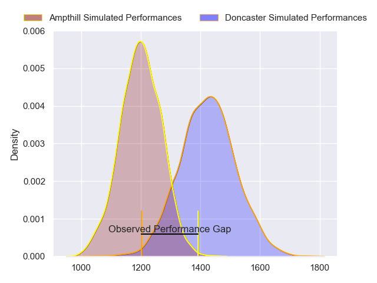
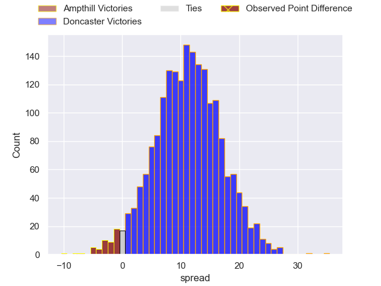
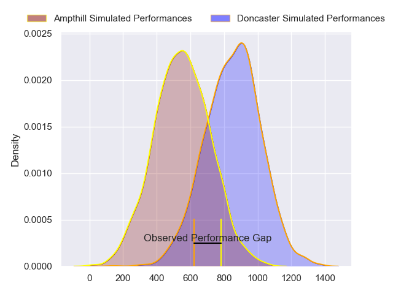
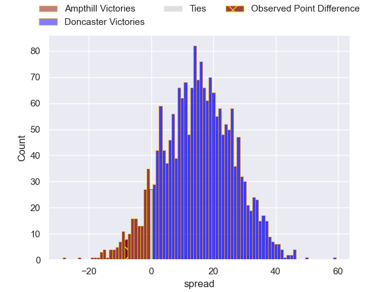
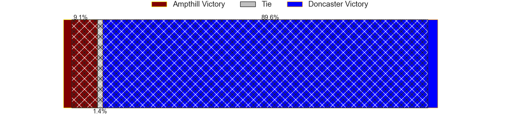
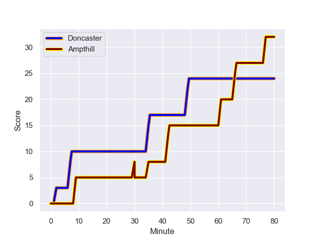
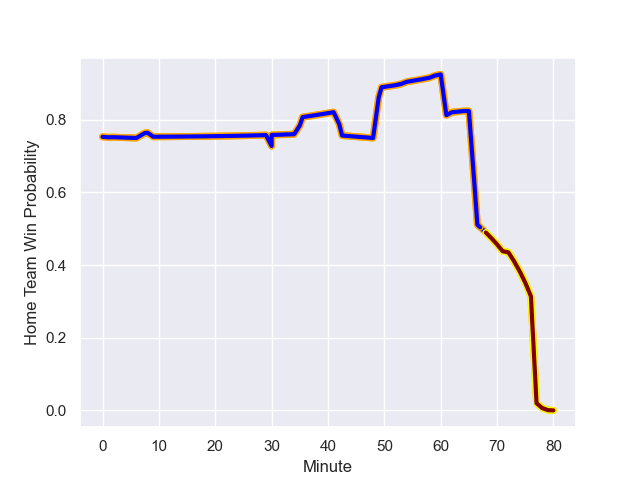

---  
layout: page  
title: Ampthill at Doncaster; 32-24  
date: 2024-01-13 18:00:00 -0500  
categories: "RFU Championship 2023" match review  
---
# Ampthill at Doncaster; 32-24

# Club Level Predictions

The first set of predictions treats a club as the smallest object, as the club develops its members, organizes a gameplan, and deploys its players as needed for each match. This club model has a prediction of 0.781, which translates to predicting Doncaster to win by 11.3.

Our Over/Under is 53.5 - and combined with the spread above, we have a predicted scoreline of 21 to 32

Each club has a rating and a rating deviation (similar to a Glicko rating), and expected performances can be generated. This allows for simulated matches and spreads like the ones below.
## Projected Performances - Club Model

## Projected Spreads - Club Model

## Projected Results - Club Model

# Player Level Predictions - Version 2

Treating teams instead as an entity made up of the currently active players, I have ratings for each player in an altogether different system. These can be combined to form team ratings once teamsheets are announced, weighting starters a bit higher than the reserves. After the match is played, players can be weighted by their minutes on the field, allowing for an accurate measure of the team's composition. With these compiled team ratings, we can make predictions, measure inaccuracy, and update the individual player ratings.
## Prediction with Player Minutes: Doncaster by 12.3

Doncaster by 8.5 on a neutral field
## Prediction without Player Minutes: Doncaster by 10.3

Doncaster by 6.5 on a neutral pitch

## Projected Performances - Player Model

## Projected Spreads - Player Model

## Projected Results - Player Model

## Scores over Time

## Win Probability over Time

There were 13 large changes in win probability in this match

|   Away Minutes | Away Player                 |   Away elo |   Number |   Home elo | Home Player              |   Home Minutes |
|---------------:|:----------------------------|-----------:|---------:|-----------:|:-------------------------|---------------:|
|             49 | Jasper McGuire              |      41.09 |        1 |      40.99 | Conor Davidson           |             62 |
|             65 | Beck Cutting                |      15.28 |        2 |      33.42 | Tom Doughty              |             54 |
|             59 | Harvey Beaton               |      36.99 |        3 |      38.23 | Corrie Barrett           |             49 |
|             53 | Joe Peard                   |      40.1  |        4 |      28.84 | Fyn Brown                |             42 |
|             80 | Kaden Pearce-Paul           |      50.81 |        5 |      11.88 | Ehize Ehizode            |             80 |
|             80 | Ollie Stonham               |      27.98 |        6 |      32.46 | Harry Wilson             |             77 |
|             61 | Josh Smart                  |      14.2  |        7 |      42.42 | Rhys Tait                |             59 |
|             80 | Morgan Strong               |      32.9  |        8 |      68.85 | Jack Digby               |             80 |
|             65 | Peter White                 |      63.76 |        9 |      73.59 | Alex Dolly               |             77 |
|             80 | Josh Barton                 |       1.61 |       10 |      19.91 | Sam Olver                |             80 |
|             80 | Ben Harris                  |      30.43 |       11 |      57.99 | Westleigh Alleyne Holden |             80 |
|             72 | Fraser James Kevin Strachan |      76.06 |       12 |      79.83 | Sam Bedlow               |             80 |
|             80 | Brandon Jackson-Richards    |      26.64 |       13 |      61.22 | Joe Margetts             |             80 |
|             80 | Tobias Elliott              |      46.86 |       14 |      49.48 | George Simpson           |             80 |
|             80 | Tomas Bacon                 |      46.24 |       15 |      65.41 | Billy McBryde            |             80 |
|             31 | Zac Nearchou                |      38.57 |       16 |      91.7  | Evan Mintern             |             38 |
|             27 | Izaiha Moore-Aiono          |      36.78 |       17 |      88.55 | Lewis Thiede             |             31 |
|             21 | Dominic Hardman             |      30.84 |       18 |      45.41 | George Roberts           |             26 |
|             19 | Sid Blackmore               |      59.14 |       19 |      50.05 | Archie Smeaton           |             21 |
|             15 | Benjamin Chapman            |      40.94 |       20 |      59.26 | Harrison Courtney        |             18 |
|             15 | Joe Green                   |      44.92 |       21 |     -15.93 | Ollie Fox                |              3 |
|              8 | Alexandrer Harmes           |      27.38 |       22 |      46.85 | Adam Hopkinson           |              3 |

