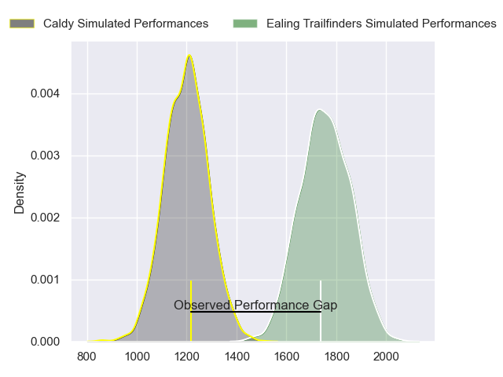
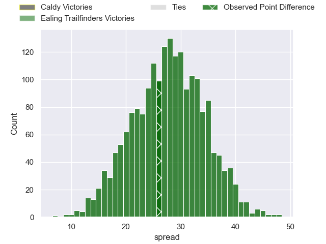
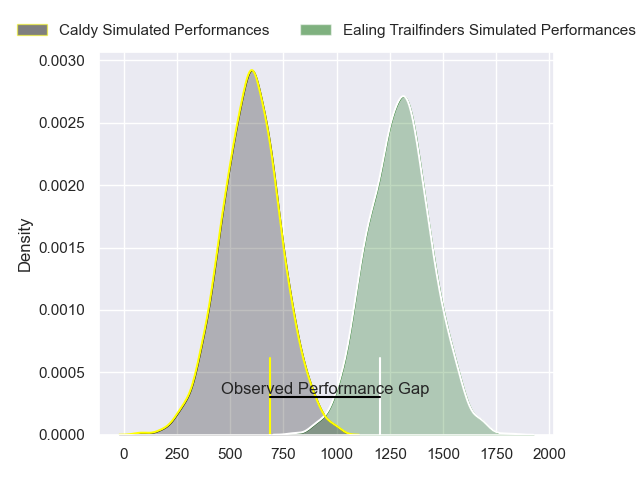
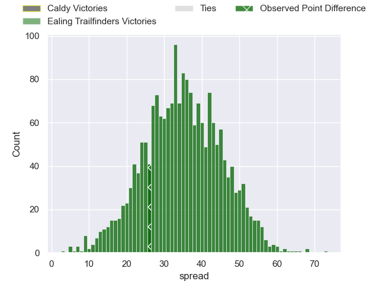
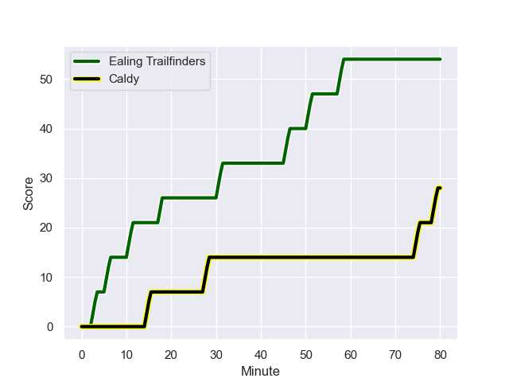
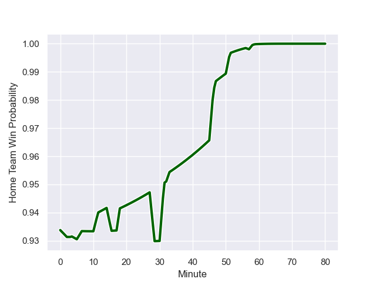

---  
layout: page  
title: Caldy at Ealing Trailfinders; 28-54  
date: 2024-01-13 18:00:00 -0500  
categories: "RFU Championship 2023" match review  
---
# Caldy at Ealing Trailfinders; 28-54

# Club Level Predictions

The first set of predictions treats a club as the smallest object, as the club develops its members, organizes a gameplan, and deploys its players as needed for each match. This club model has a prediction of 0.956, which translates to predicting Ealing Trailfinders to win by 27.7.

Our Over/Under is 66.5 - and combined with the spread above, we have a predicted scoreline of 19 to 47

Each club has a rating and a rating deviation (similar to a Glicko rating), and expected performances can be generated. This allows for simulated matches and spreads like the ones below.
## Projected Performances - Club Model

## Projected Spreads - Club Model

## Projected Results - Club Model

# Player Level Predictions - Version 2

Treating teams instead as an entity made up of the currently active players, I have ratings for each player in an altogether different system. These can be combined to form team ratings once teamsheets are announced, weighting starters a bit higher than the reserves. After the match is played, players can be weighted by their minutes on the field, allowing for an accurate measure of the team's composition. With these compiled team ratings, we can make predictions, measure inaccuracy, and update the individual player ratings.
## Prediction with Player Minutes: Ealing Trailfinders by 28.9

Ealing Trailfinders by 25.3 on a neutral field
## Prediction without Player Minutes: Ealing Trailfinders by 28.6

Ealing Trailfinders by 25.0 on a neutral pitch

## Projected Performances - Player Model

## Projected Spreads - Player Model

## Projected Results - Player Model

## Scores over Time

## Win Probability over Time

|   Away Minutes | Away Player      |   Away elo |   Number |   Home elo | Home Player         |   Home Minutes |
|---------------:|:-----------------|-----------:|---------:|-----------:|:--------------------|---------------:|
|             47 | Nathan Rushton   |      32.16 |        1 |      70.88 | Kyle John Whyte     |             59 |
|             47 | Oliver Hearn     |      31.9  |        2 |      67.34 | Mike Willemse       |             47 |
|             47 | Monty Weatherby  |      56.1  |        3 |      99.53 | Biyi Alo            |             47 |
|             80 | Sam Olyott       |      33.62 |        4 |     100.33 | Bobby de Wee        |             53 |
|             80 | Martin Gerrard   |      50.68 |        5 |      72.91 | Barney Maddison     |             80 |
|             80 | Ewan Murphy      |      58.53 |        6 |      46.65 | Jordan Reid         |             53 |
|             53 | Ciaran Booth     |      61.75 |        7 |      41.56 | Richard Hardwick    |             59 |
|             47 | Josiah Dickinson |      38.57 |        8 |     110.65 | Ryan Smid           |             80 |
|             80 | Joseph Murray    |      39.11 |        9 |      66.98 | Lloyd Williams      |             64 |
|             33 | Rhys Hayes       |      32.36 |       10 |     114.55 | Craig Willis        |             57 |
|             80 | Benjamin Jones   |      29.06 |       11 |     119.95 | Tom Collins         |             80 |
|             49 | Michael Barlow   |      60.39 |       12 |      85.93 | Billy Twelvetrees   |             80 |
|             80 | Michael Cartmill |       0.83 |       13 |      46.92 | Reuben Bird-Tulloch |             80 |
|             53 | Nick Royle       |      34.24 |       14 |      91.69 | Jonah Holmes        |             80 |
|             80 | Matt Kilcourse   |      59.29 |       15 |     119.04 | Cian Kelleher       |             80 |
|             47 | Lewis Barker     |      16.34 |       16 |      35.72 | Henry Walker        |             33 |
|             33 | Ryan Higginson   |      42.37 |       17 |      57.82 | George Davis        |             33 |
|             33 | Matt Gallagher   |      56.95 |       18 |       8.54 | Callum Chick        |             27 |
|             33 | Joe Sproston     |      15.29 |       19 |      46.31 | Josh Taylor         |             27 |
|             33 | Luke Cox         |      46.96 |       20 |      92.53 | Simon Uzokwe        |             21 |
|             31 | William Robinson |      44.36 |       21 |      73.69 | Sami Mavinga        |             21 |
|             27 | Callum Ridgway   |      27.16 |       22 |     110.93 | James Cordy-Redden  |             23 |
|             27 | Louis Beer       |      49.1  |       23 |      77.83 | Jordan Burns        |             16 |

