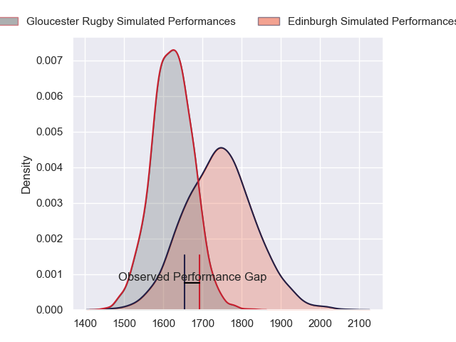
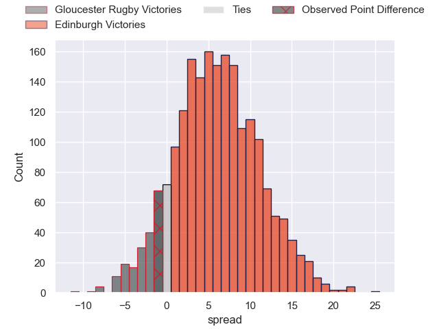
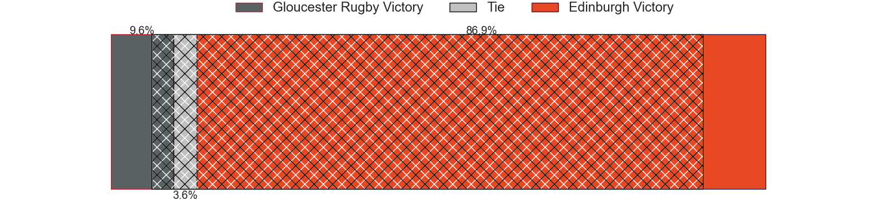
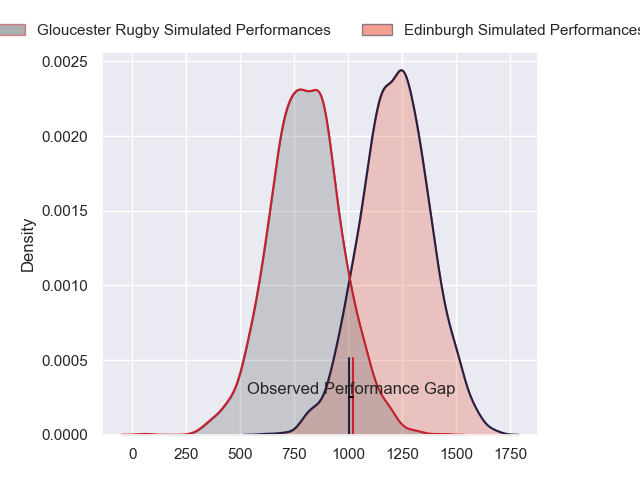
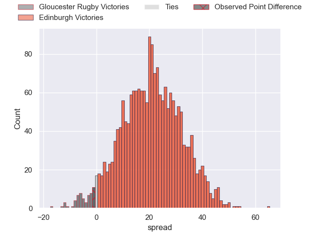
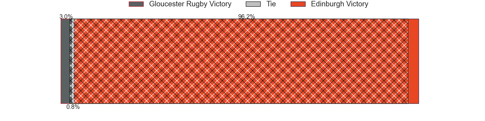
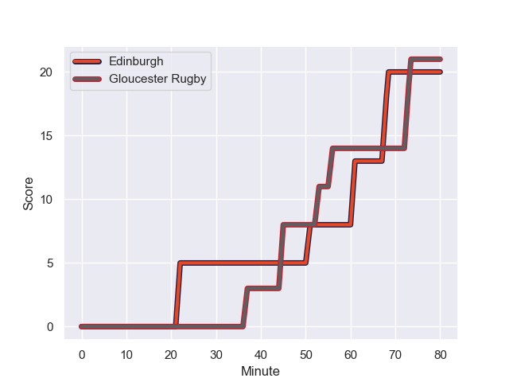
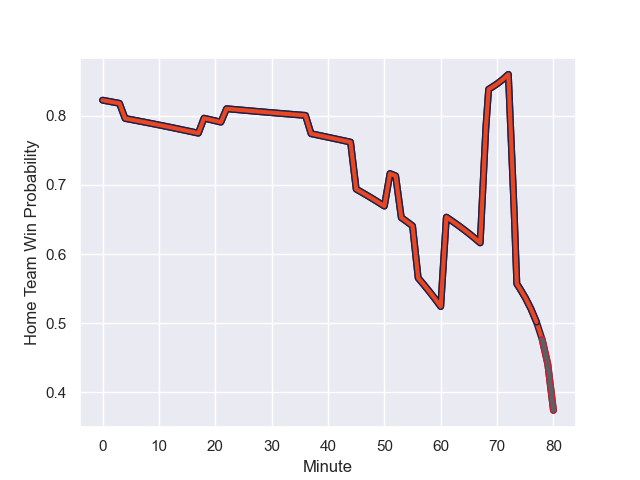

---  
layout: page  
title: Gloucester Rugby at Edinburgh; 21-20  
date: 2024-01-13 18:00:00 -0500  
categories: "European Rugby Challenge Cup 2023" match review  
---
# Gloucester Rugby at Edinburgh; 21-20

# Club Level Predictions

The first set of predictions treats a club as the smallest object, as the club develops its members, organizes a gameplan, and deploys its players as needed for each match. This club model has a prediction of 0.667, which translates to predicting Edinburgh to win by 6.1.

Our Over/Under is 39.5 - and combined with the spread above, we have a predicted scoreline of 16 to 23

Each club has a rating and a rating deviation (similar to a Glicko rating), and expected performances can be generated. This allows for simulated matches and spreads like the ones below.
## Projected Performances - Club Model

## Projected Spreads - Club Model

## Projected Results - Club Model

# Player Level Predictions - Version 2

Treating teams instead as an entity made up of the currently active players, I have ratings for each player in an altogether different system. These can be combined to form team ratings once teamsheets are announced, weighting starters a bit higher than the reserves. After the match is played, players can be weighted by their minutes on the field, allowing for an accurate measure of the team's composition. With these compiled team ratings, we can make predictions, measure inaccuracy, and update the individual player ratings.
## Prediction with Player Minutes: Edinburgh by 17.0

Edinburgh by 10.9 on a neutral field
## Prediction without Player Minutes: Edinburgh by 19.0

Edinburgh by 12.9 on a neutral pitch

## Projected Performances - Player Model

## Projected Spreads - Player Model

## Projected Results - Player Model

## Scores over Time

## Win Probability over Time

There were 13 large changes in win probability in this match

|   Away Minutes | Away Player         |   Away elo |   Number |   Home elo | Home Player       |   Home Minutes |
|---------------:|:--------------------|-----------:|---------:|-----------:|:------------------|---------------:|
|             59 | Jamal Ford-Robinson |      10.67 |        1 |      70.85 | Pierre Schoeman   |             61 |
|             52 | Sebastian Blake     |      30.09 |        2 |      59.1  | Dave Cherry       |             53 |
|             18 | Kirill Gotovtsev    |      71.09 |        3 |     129.89 | WP Nel            |             61 |
|             59 | Freddie Clarke      |      50.41 |        4 |      80.34 | Sam Skinner       |             53 |
|             80 | Matias Alemanno     |      51.04 |        5 |      97.78 | Grant Gilchrist   |             80 |
|             80 | Jack Clement        |      34.18 |        6 |      -1.2  | Glen Young        |             80 |
|             80 | Lewis Ludlow        |      41.67 |        7 |      72.61 | Hamish Watson     |             69 |
|             80 | Zach Mercer         |      50.63 |        8 |      73.95 | Viliame Mata      |             80 |
|             71 | Caolan Englefield   |      56.15 |        9 |      88    | Ali Price         |             61 |
|             80 | Adam Hastings       |     122.22 |       10 |      77.91 | Ben Healy         |             80 |
|             80 | Ollie Thorley       |      87.7  |       11 |      90.15 | Wes Goosen        |              4 |
|             69 | Sebastien Atkinson  |       6.67 |       12 |      89.31 | Matt Currie       |             80 |
|             80 | Chris Harris        |      53.38 |       13 |      59.48 | Mark Bennett      |             69 |
|             80 | Jonny May           |      45.83 |       14 |      61.72 | Darcy Graham      |             80 |
|             80 | Louis Rees-Zammit   |      96.34 |       15 |      79.51 | Emiliano Boffelli |             80 |
|             21 | Harry Elrington     |      26.24 |       16 |      32.45 | Robin Hislop      |             19 |
|             28 | George McGuigan     |      64.72 |       17 |      62.24 | Ewan Ashman       |             27 |
|             62 | Fraser Balmain      |      25.09 |       18 |      47.35 | Angus Williams    |             19 |
|             21 | Cameron Jordan      |      88.4  |       19 |      74.5  | Marshall Sykes    |             27 |
|              9 | Stephen Varney      |       5.51 |       20 |      93.35 | Thomas Dodd       |             11 |
|             11 | Max Llewellyn       |      92.15 |       21 |      79.91 | Ben Vellacott     |             19 |
|            nan | nan                 |     nan    |       22 |      51.81 | Harry Paterson    |             76 |
|            nan | nan                 |     nan    |       23 |      96.52 | James Lang        |             11 |

