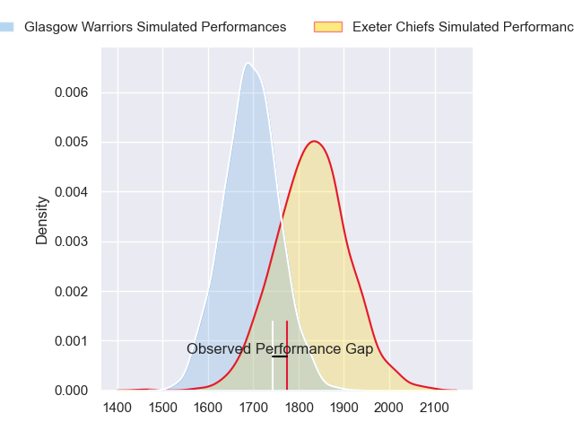
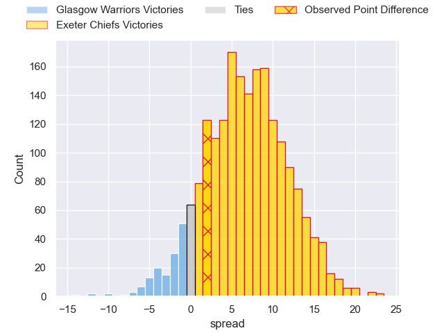
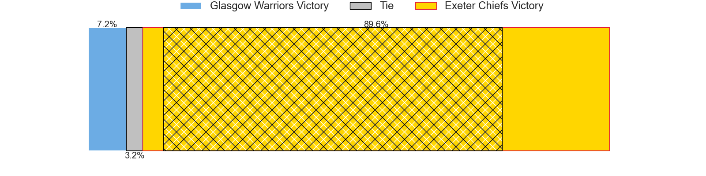
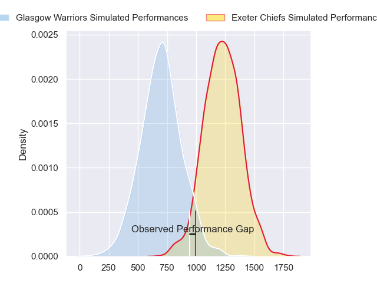
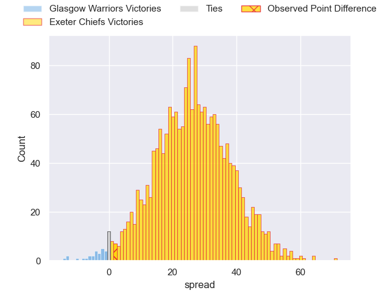
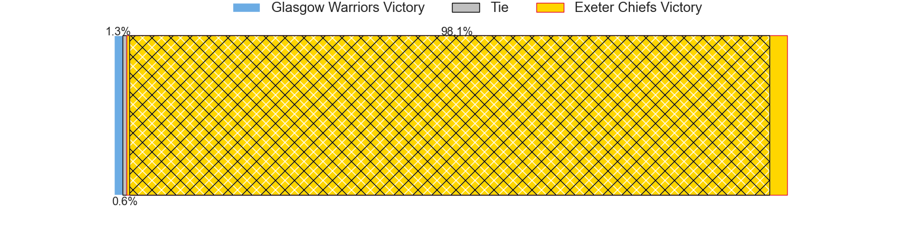
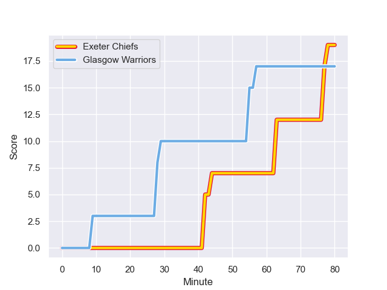
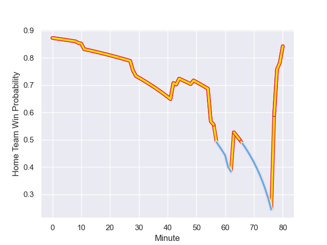

---  
layout: page  
title: Glasgow Warriors at Exeter Chiefs; 17-19  
date: 2024-01-13 18:00:00 -0500  
categories: "European Rugby Champions Cup 2023" match review  
---
# Glasgow Warriors at Exeter Chiefs; 17-19

# Club Level Predictions

The first set of predictions treats a club as the smallest object, as the club develops its members, organizes a gameplan, and deploys its players as needed for each match. This club model has a prediction of 0.681, which translates to predicting Exeter Chiefs to win by 6.7.

Our Over/Under is 56.5 - and combined with the spread above, we have a predicted scoreline of 25 to 32

Each club has a rating and a rating deviation (similar to a Glicko rating), and expected performances can be generated. This allows for simulated matches and spreads like the ones below.
## Projected Performances - Club Model

## Projected Spreads - Club Model

## Projected Results - Club Model

# Player Level Predictions - Version 2

Treating teams instead as an entity made up of the currently active players, I have ratings for each player in an altogether different system. These can be combined to form team ratings once teamsheets are announced, weighting starters a bit higher than the reserves. After the match is played, players can be weighted by their minutes on the field, allowing for an accurate measure of the team's composition. With these compiled team ratings, we can make predictions, measure inaccuracy, and update the individual player ratings.
## Prediction with Player Minutes: Exeter Chiefs by 21.4

Exeter Chiefs by 15.7 on a neutral field
## Prediction without Player Minutes: Exeter Chiefs by 22.0

Exeter Chiefs by 16.3 on a neutral pitch

## Projected Performances - Player Model

## Projected Spreads - Player Model

## Projected Results - Player Model

## Scores over Time

## Win Probability over Time

There were 14 large changes in win probability in this match

|   Away Minutes | Away Player       |   Away elo |   Number |   Home elo | Home Player          |   Home Minutes |
|---------------:|:------------------|-----------:|---------:|-----------:|:---------------------|---------------:|
|             54 | Oli Kebble        |      46.65 |        1 |      65.66 | Alec Hepburn         |             49 |
|             54 | Gregor Hiddleston |      46.65 |        2 |      87.37 | Jack Yeandle         |             49 |
|             80 | Zander Fagerson   |      46.65 |        3 |      54.44 | Ehren Painter        |             49 |
|             80 | Scott Cummings    |      46.65 |        4 |      32.26 | Rusiate Tuima        |             80 |
|             54 | Alex Samuel       |      48.12 |        5 |      53.32 | Lewis Pearson        |             80 |
|             79 | Ally Miller       |      46.65 |        6 |      83.7  | Ethan Roots          |             80 |
|             80 | Matt Fagerson     |      46.65 |        7 |      85.39 | Jacques Vermeulen    |             80 |
|             80 | Henco Venter      |      46.65 |        8 |      83.25 | Greg Fisilau         |             57 |
|             80 | George Horne      |      46.65 |        9 |      59.58 | Tom Cairns           |             57 |
|             59 | Duncan Weir       |      46.65 |       10 |      56.73 | Harvey Skinner       |             80 |
|             80 | Kyle Rowe         |      46.65 |       11 |      64.06 | Ben Hammersley       |             80 |
|             80 | Stafford McDowall |      46.65 |       12 |      68.56 | Rory O'Loughlin      |             11 |
|             80 | Sione Tuipulotu   |      46.65 |       13 |     131.47 | Henry Slade          |             80 |
|             80 | Huw Jones         |      46.65 |       14 |      77.82 | Immanuel Feyi-Waboso |             80 |
|             80 | Josh McKay        |      46.65 |       15 |     109.41 | Tom Wyatt            |             61 |
|             26 | George Turner     |      46.65 |       16 |      64.33 | Dan Frost            |             31 |
|             26 | Jamie Bhatti      |      46.65 |       17 |      85.01 | Nika Abuladze        |             31 |
|              0 | Lucio Sordoni     |      46.65 |       18 |      99.46 | Josh Iosefa-Scott    |             31 |
|             26 | Richie Gray       |      46.65 |       19 |      46.65 | Matt Postlethwaite   |              0 |
|              0 | Max Williamson    |      46.65 |       20 |      53.18 | Ross Vintcent        |             23 |
|              1 | Euan Ferrie       |      46.65 |       21 |      90    | Stu Townsend         |             23 |
|              0 | Ben Afshar        |      46.65 |       22 |      29.44 | Joe Hawkins          |             69 |
|             21 | Tom Jordan        |      46.65 |       23 |      48.69 | Zack Wimbush         |             19 |

