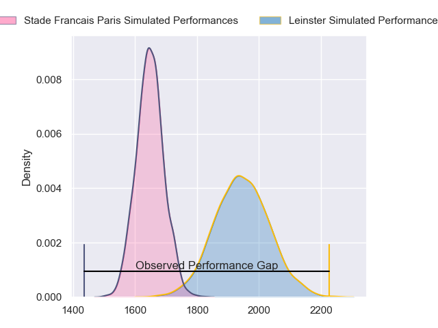
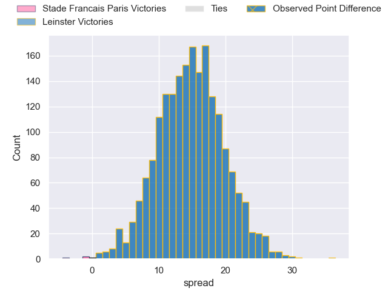
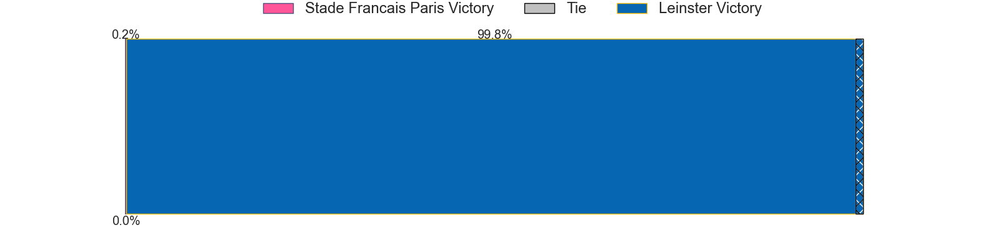
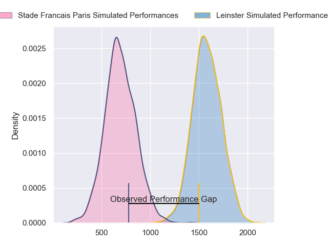
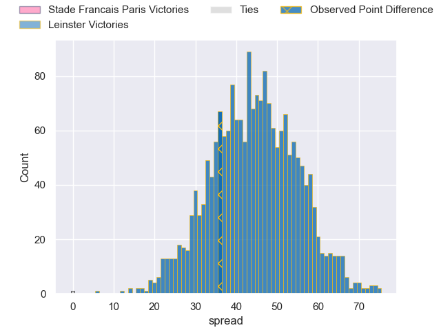
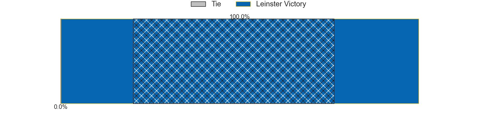
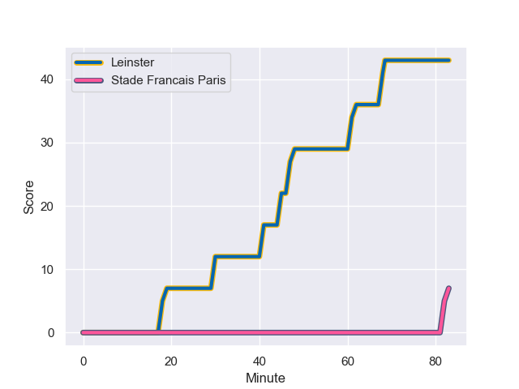
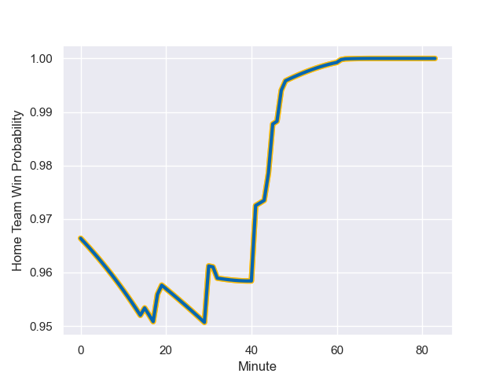

---  
layout: page  
title: Stade Francais Paris at Leinster; 7-43  
date: 2024-01-13 18:00:00 -0500  
categories: "European Rugby Champions Cup 2023" match review  
---
# Stade Francais Paris at Leinster; 7-43

# Club Level Predictions

The first set of predictions treats a club as the smallest object, as the club develops its members, organizes a gameplan, and deploys its players as needed for each match. This club model has a prediction of 0.846, which translates to predicting Leinster to win by 15.0.

Our Over/Under is 50.5 - and combined with the spread above, we have a predicted scoreline of 18 to 33

Each club has a rating and a rating deviation (similar to a Glicko rating), and expected performances can be generated. This allows for simulated matches and spreads like the ones below.
## Projected Performances - Club Model

## Projected Spreads - Club Model

## Projected Results - Club Model

# Player Level Predictions - Version 2

Treating teams instead as an entity made up of the currently active players, I have ratings for each player in an altogether different system. These can be combined to form team ratings once teamsheets are announced, weighting starters a bit higher than the reserves. After the match is played, players can be weighted by their minutes on the field, allowing for an accurate measure of the team's composition. With these compiled team ratings, we can make predictions, measure inaccuracy, and update the individual player ratings.
## Prediction with Player Minutes: Leinster by 36.9

Leinster by 30.8 on a neutral field
## Prediction without Player Minutes: Leinster by 35.3

Leinster by 29.2 on a neutral pitch

## Projected Performances - Player Model

## Projected Spreads - Player Model

## Projected Results - Player Model

## Scores over Time

## Win Probability over Time

|   Away Minutes | Away Player             |   Away elo |   Number |   Home elo | Home Player         |   Home Minutes |
|---------------:|:------------------------|-----------:|---------:|-----------:|:--------------------|---------------:|
|             49 | Clement Castets         |      37.89 |        1 |      79.67 | Andrew Porter       |             52 |
|             66 | Lucas Peyresblanques    |      43.72 |        2 |      68.16 | Dan Sheehan         |             52 |
|             61 | Hugo Ndiaye             |      47.14 |        3 |     100.67 | Tadhg Furlong       |             52 |
|             83 | Pierre-Henri Azagoh     |      46    |        4 |      66.62 | Joe McCarthy        |             83 |
|             61 | JJ van der Mescht       |      46.65 |        5 |      46.65 | Jason Jenkins       |             44 |
|             61 | Mathieu Hirigoyen       |      24.23 |        6 |      87.2  | Ryan Baird          |             83 |
|             83 | Ryan Chapuis            |      46.65 |        7 |     117.13 | Josh van der Flier  |             83 |
|             63 | Giovanni Habel-Kueffner |      92.99 |        8 |     125.53 | Caelan Doris        |             63 |
|             66 | Brad Weber              |      46.65 |        9 |     106.3  | Jamison Gibson-Park |             52 |
|             83 | Zack Henry              |      46.65 |       10 |      46.65 | Ciaran Frawley      |             44 |
|             83 | Kylan Hamdaoui          |      46.65 |       11 |     161.81 | James Lowe          |             83 |
|             63 | Noah Nene               |      46.72 |       12 |      82.9  | Robbie Henshaw      |             83 |
|             83 | Stephane Ahmed          |      46.27 |       13 |     114.97 | Garry Ringrose      |             69 |
|             83 | Peniasi Dakuwaqa        |      46.42 |       14 |      65.89 | Jordan Larmour      |             83 |
|             83 | Leo Monin               |      46.65 |       15 |     149.44 | Hugo Keenan         |             83 |
|             17 | Mamoudou Meite          |      46.65 |       16 |      90.76 | Ronan Kelleher      |             31 |
|             34 | Vasil Kakovin           |      24.21 |       17 |      71.87 | Cian Healy          |             31 |
|             22 | Paul Alo-Emile          |      46.65 |       18 |      89.84 | Michael Ala'alatoa  |             31 |
|             20 | Giorgi Tsutskiridze     |      46.65 |       19 |     103.73 | James Ryan          |             39 |
|             22 | Andy Timo               |      46.65 |       20 |     100.9  | Jack Conan          |             20 |
|             17 | Jules Gimbert           |      19.76 |       21 |     123.48 | Luke McGrath        |             31 |
|             22 | Paul Gabrillagues       |      44.83 |       22 |      46.65 | Sam Prendergast     |             39 |
|             20 | Joris Segonds           |      45.08 |       23 |      61.68 | Tommy O'Brien       |             14 |

