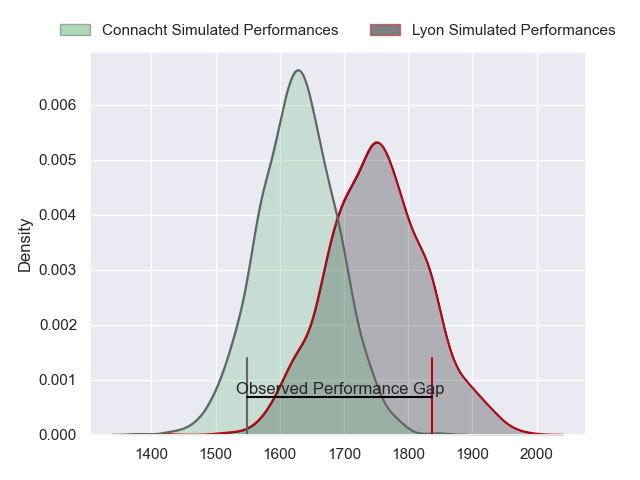
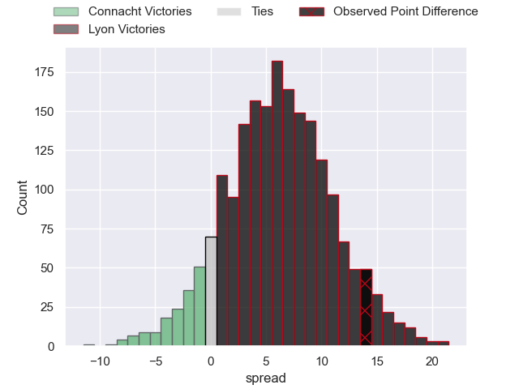
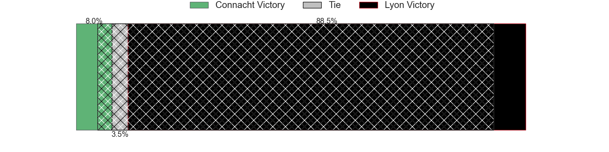
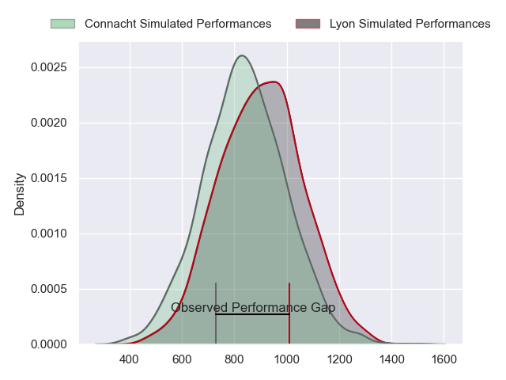
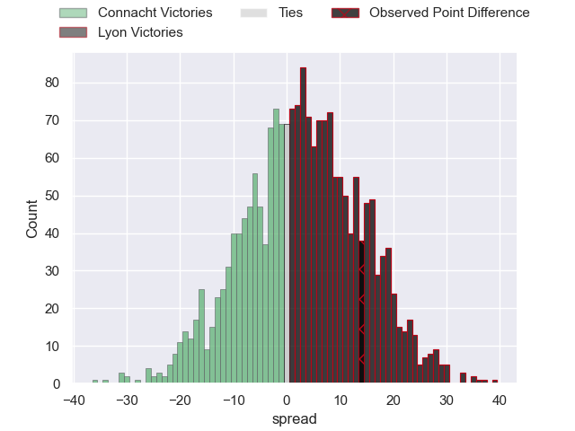
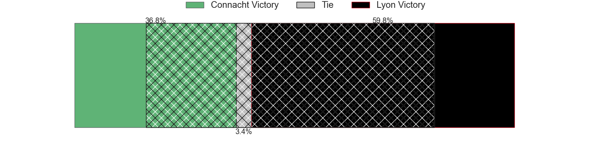
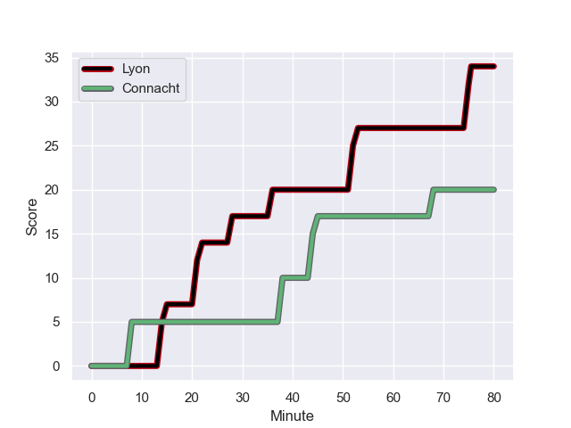
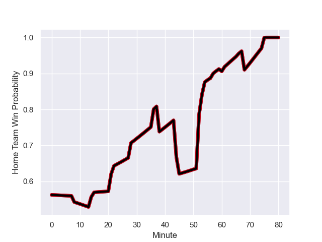

---  
layout: page  
title: Connacht at Lyon; 20-34  
date: 2024-01-13 18:00:00 -0500  
categories: "European Rugby Champions Cup 2023" match review  
---
# Connacht at Lyon; 20-34

# Club Level Predictions

The first set of predictions treats a club as the smallest object, as the club develops its members, organizes a gameplan, and deploys its players as needed for each match. This club model has a prediction of 0.661, which translates to predicting Lyon to win by 5.9.

Our Over/Under is 47.5 - and combined with the spread above, we have a predicted scoreline of 21 to 27

Each club has a rating and a rating deviation (similar to a Glicko rating), and expected performances can be generated. This allows for simulated matches and spreads like the ones below.
## Projected Performances - Club Model

## Projected Spreads - Club Model

## Projected Results - Club Model

# Player Level Predictions - Version 2

Treating teams instead as an entity made up of the currently active players, I have ratings for each player in an altogether different system. These can be combined to form team ratings once teamsheets are announced, weighting starters a bit higher than the reserves. After the match is played, players can be weighted by their minutes on the field, allowing for an accurate measure of the team's composition. With these compiled team ratings, we can make predictions, measure inaccuracy, and update the individual player ratings.
## Prediction with Player Minutes: Lyon by 2.8

Connacht by 4.5 on a neutral field
## Prediction without Player Minutes: Lyon by 2.1

Connacht by 5.1 on a neutral pitch

## Projected Performances - Player Model

## Projected Spreads - Player Model

## Projected Results - Player Model

## Scores over Time

## Win Probability over Time

There were 12 large changes in win probability in this match

|   Away Minutes | Away Player             |   Away elo |   Number |   Home elo | Home Player          |   Home Minutes |
|---------------:|:------------------------|-----------:|---------:|-----------:|:---------------------|---------------:|
|             54 | Peter Dooley            |     111.38 |        1 |      46.65 | Hamza Kaabeche       |             60 |
|             66 | Tadgh McElroy           |      40.73 |        2 |      47.25 | Yanis Charcosset     |             51 |
|             54 | Dominic Robertson-McCoy |      46.65 |        3 |      46.65 | Demba Bamba          |             60 |
|             59 | Darragh Murray          |      39.58 |        4 |      44.53 | Joel Kpoku           |             80 |
|             80 | Joe Joyce               |     119.44 |        5 |      46.65 | Romain Taofifenua    |             57 |
|             80 | Cian Prendergast        |      34.39 |        6 |      46.65 | Liam Allen           |             80 |
|             80 | Jarrad Butler           |      60.28 |        7 |      46.65 | Arno Botha           |             80 |
|             61 | Sean Jansen             |      46.65 |        8 |      46.65 | Mickael Guillard     |             71 |
|             80 | Michael McDonald        |      46.66 |        9 |      46.65 | Martin Page-Relo     |             57 |
|             61 | Jack Carty              |      87.82 |       10 |      46.65 | Paddy Jackson        |             57 |
|             80 | Shayne Bolton           |      46.35 |       11 |      46.65 | Thaakir Abrahams     |             80 |
|             80 | Tom Daly                |      46.65 |       12 |      46.65 | Thibault Regard      |             80 |
|             56 | Tom Farrell             |      46.65 |       13 |      27.38 | Josiah Maraku        |             66 |
|             80 | Andrew Smith            |       9.25 |       14 |      98.98 | Monty Ioane          |             80 |
|             80 | JJ Hanrahan             |      79.14 |       15 |      47.43 | Alexandre Tchaptchet |             80 |
|             14 | Eoin de Buitléar        |      46.65 |       16 |      46.65 | Guillaume Marchand   |             29 |
|             26 | Denis Buckley           |      50.06 |       17 |      14.3  | Jerome Rey           |             20 |
|             26 | Sam Illo                |      43.67 |       18 |      32.23 | Paulo Tafili         |             20 |
|             21 | Oisin Dowling           |      41.32 |       19 |      46.91 | Ugo Vignolles        |              9 |
|             19 | Conor Oliver            |      68.22 |       20 |      41.19 | Maxime Gouzou        |             23 |
|              4 | Matthew Devine          |      46.65 |       21 |      46.65 | Liam Rimet           |             23 |
|             24 | David Hawkshaw          |      51    |       22 |      72.7  | Leo Berdeu           |             23 |
|             15 | Shane Jennings          |      46.65 |       23 |      46.82 | Alfred Parisien      |             14 |

