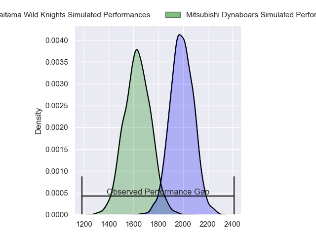
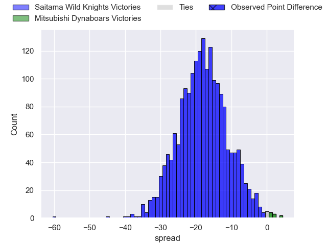
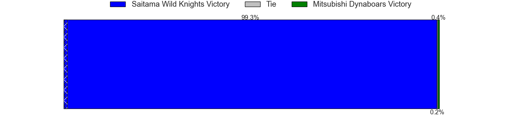
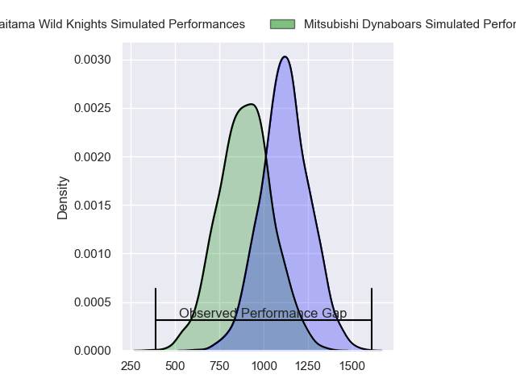
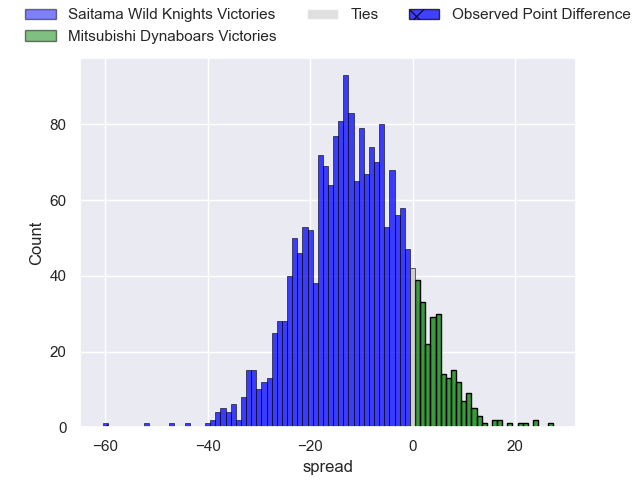
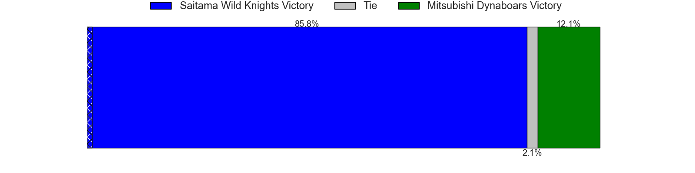
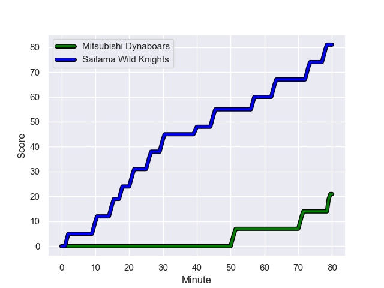
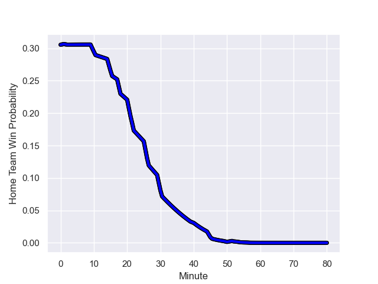

---  
layout: page  
title: Saitama Wild Knights at Mitsubishi Dynaboars; 81-21  
date: 2024-01-13 18:00:00 -0500  
categories: "Japan Rugby League One 2023" match review  
---
# Saitama Wild Knights at Mitsubishi Dynaboars; 81-21

# Club Level Predictions

The first set of predictions treats a club as the smallest object, as the club develops its members, organizes a gameplan, and deploys its players as needed for each match. This club model has a prediction of 0.117, which translates to predicting Saitama Wild Knights to win by 18.3.

Our Over/Under is 60.5 - and combined with the spread above, we have a predicted scoreline of 40 to 21

Each club has a rating and a rating deviation (similar to a Glicko rating), and expected performances can be generated. This allows for simulated matches and spreads like the ones below.
## Projected Performances - Club Model

## Projected Spreads - Club Model

## Projected Results - Club Model

# Player Level Predictions - Version 2

Treating teams instead as an entity made up of the currently active players, I have ratings for each player in an altogether different system. These can be combined to form team ratings once teamsheets are announced, weighting starters a bit higher than the reserves. After the match is played, players can be weighted by their minutes on the field, allowing for an accurate measure of the team's composition. With these compiled team ratings, we can make predictions, measure inaccuracy, and update the individual player ratings.
## Prediction with Player Minutes: Saitama Wild Knights by 9.0

Saitama Wild Knights by 12.3 on a neutral field
## Prediction without Player Minutes: Saitama Wild Knights by 10.5

Saitama Wild Knights by 13.8 on a neutral pitch

## Projected Performances - Player Model

## Projected Spreads - Player Model

## Projected Results - Player Model

## Scores over Time

## Win Probability over Time

There were 2 large changes in win probability in this match

|   Away Minutes | Away Player       |   Away elo |   Number |   Home elo | Home Player            |   Home Minutes |
|---------------:|:------------------|-----------:|---------:|-----------:|:-----------------------|---------------:|
|             40 | Keita Inagaki     |      89.36 |        1 |      40.84 | Jun Morimoto           |             40 |
|             40 | Atsushi Sakate    |      49.55 |        2 |      39.74 | Yuki Miyazato          |             47 |
|             40 | Asaeli Ai Valu    |      97.5  |        3 |      45.31 | Chinen Yu              |             40 |
|             80 | Liam Mitchell     |      37.69 |        4 |      42.7  | Daniel Linde           |             80 |
|             52 | Lood de Jager     |      65.88 |        5 |      64.18 | Walt Steenkamp         |             68 |
|             80 | Shota Fukui       |      55    |        6 |      76.57 | Kyo Yoshida            |             80 |
|             80 | Lachlan Boshier   |      89.05 |        7 |      89.85 | Masataka Tsuruya       |             65 |
|             52 | Jack Cornelsen    |      93.63 |        8 |      -4.66 | Epineri Uluiviti       |             80 |
|             52 | Taiki Koyama      |      85.89 |        9 |      77.89 | Kota Iwamura           |             54 |
|             80 | Rikiya Matsuda    |     121.99 |       10 |      61.56 | James Grayson          |             80 |
|             80 | Ryuji Noguchi     |     118.19 |       11 |      61.73 | Kento Nakai            |             80 |
|             40 | Damian de Allende |      72.53 |       12 |      53.31 | Matt To'omua           |             50 |
|             52 | Dylan Riley       |     125.31 |       13 |      58.35 | Matt Vaega             |             80 |
|             80 | Tomoki Osada      |      19.77 |       14 |      61.9  | Ben Paltridge          |             22 |
|             80 | Kyohei Yamasawa   |      47.95 |       15 |      62.63 | Roland Alaiasa         |             80 |
|             40 | Craig Millar      |      51.55 |       16 |      42.28 | Brackin Karauria-Henry |             58 |
|             40 | Shota Horie       |      77.73 |       17 |     115.76 | Tomoaki Ishii          |             40 |
|             40 | Taiki Fujii       |      57.3  |       18 |      30.65 | Mototsugu Hachiya      |             40 |
|             40 | Vince Aso         |      26.06 |       19 |      34.17 | Atsuro Nakamura        |             33 |
|             28 | Mark Abbott       |      17.34 |       20 |      37.23 | Marino Mikaele-Tu'u    |             30 |
|             28 | Itsuki Onishi     |      88.36 |       21 |      45.25 | Ryuta Nakamori         |             26 |
|             28 | Keisuke Uchida    |     159.41 |       22 |      35.13 | Timote Tavalea         |             15 |
|             28 | Marika Koroibete  |      93.11 |       23 |      60.69 | Jackson Hemopo         |             12 |

