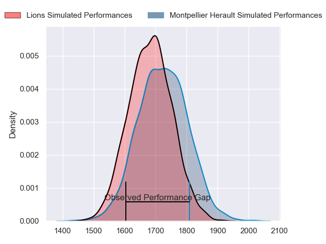
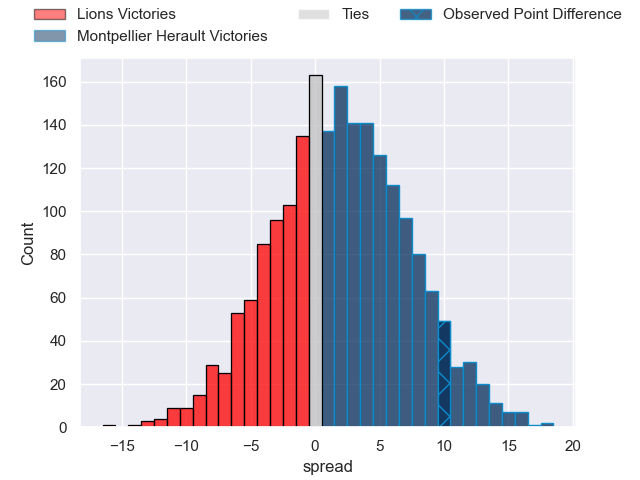
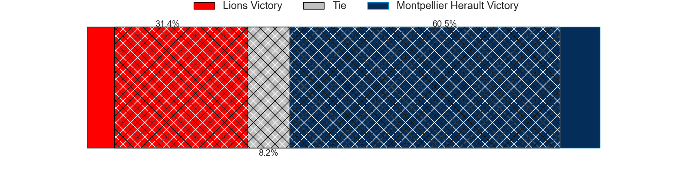
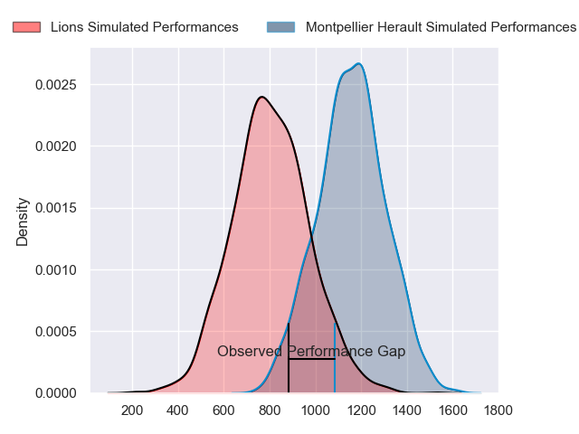
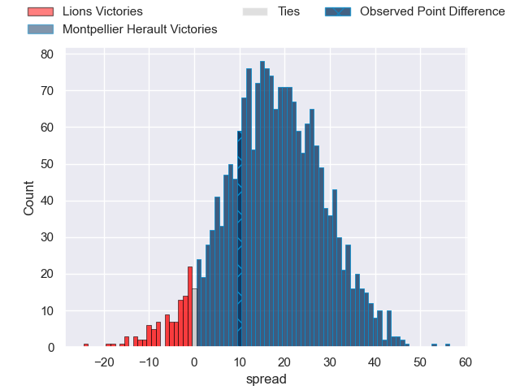
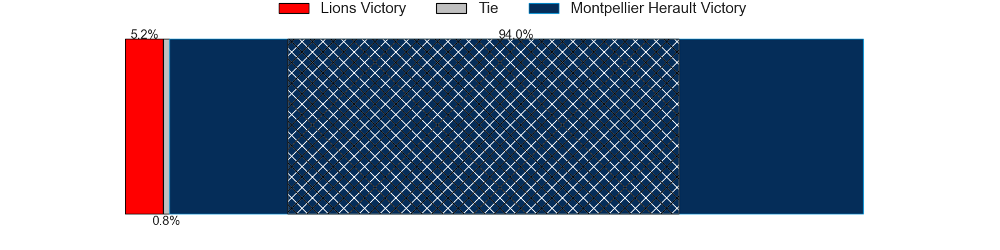
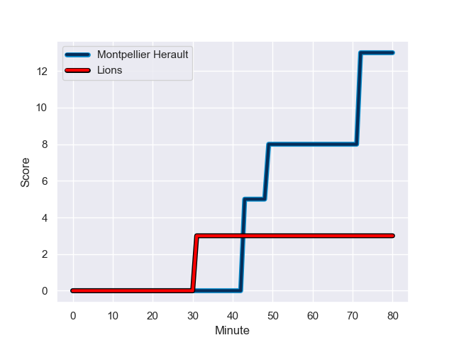
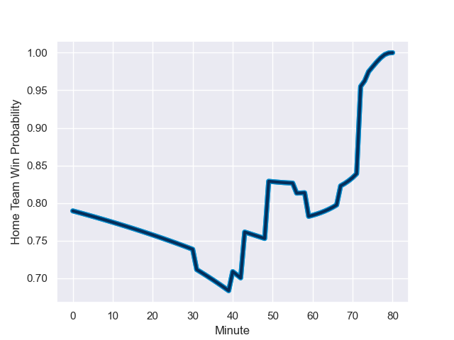

---  
layout: page  
title: Lions at Montpellier Herault; 3-13  
date: 2024-01-13 18:00:00 -0500  
categories: "European Rugby Challenge Cup 2023" match review  
---
# Lions at Montpellier Herault; 3-13

# Club Level Predictions

The first set of predictions treats a club as the smallest object, as the club develops its members, organizes a gameplan, and deploys its players as needed for each match. This club model has a prediction of 0.553, which translates to predicting Montpellier Herault to win by 1.9.

Our Over/Under is 50.5 - and combined with the spread above, we have a predicted scoreline of 24 to 26

Each club has a rating and a rating deviation (similar to a Glicko rating), and expected performances can be generated. This allows for simulated matches and spreads like the ones below.
## Projected Performances - Club Model

## Projected Spreads - Club Model

## Projected Results - Club Model

# Player Level Predictions - Version 2

Treating teams instead as an entity made up of the currently active players, I have ratings for each player in an altogether different system. These can be combined to form team ratings once teamsheets are announced, weighting starters a bit higher than the reserves. After the match is played, players can be weighted by their minutes on the field, allowing for an accurate measure of the team's composition. With these compiled team ratings, we can make predictions, measure inaccuracy, and update the individual player ratings.
## Prediction with Player Minutes: Montpellier Herault by 14.7

Montpellier Herault by 7.4 on a neutral field
## Prediction without Player Minutes: Montpellier Herault by 12.8

Montpellier Herault by 5.5 on a neutral pitch

## Projected Performances - Player Model

## Projected Spreads - Player Model

## Projected Results - Player Model

## Scores over Time

## Win Probability over Time

There were 7 large changes in win probability in this match

|   Away Minutes | Away Player            |   Away elo |   Number |   Home elo | Home Player                 |   Home Minutes |
|---------------:|:-----------------------|-----------:|---------:|-----------:|:----------------------------|---------------:|
|             49 | Morgan Naude           |      47.76 |        1 |      27.18 | Gregory Fichten             |             40 |
|             74 | Jaco Visagie           |      51.29 |        2 |      39.75 | Vano Karkadze               |             40 |
|             49 | Conraad Van Vuuren     |      42.02 |        3 |      33.47 | Lasha Macharashvili         |             40 |
|             56 | Etienne Oosthuizen     |      47.79 |        4 |      40.61 | Tyler Duguid                |             80 |
|             80 | Darrien-Lane Landsberg |      20.85 |        5 |      70.63 | Bastien Chalureau           |             67 |
|             80 | Johannes JC Pretorius  |      74.69 |        6 |      78.8  | Nicolaas Janse van Rensburg |             80 |
|             71 | Izan Esterhuizen       |      46.69 |        7 |      42.01 | Clément Doumenc             |             59 |
|             80 | Hanru Sirgel           |     113.69 |        8 |      46.65 | Mael Perrin                 |             40 |
|             74 | Nico Steyn             |      54.14 |        9 |      91.57 | Cobus Reinach               |             59 |
|             80 | Jordan Hendrikse       |      25.49 |       10 |      53.66 | Paolo Garbisi               |             80 |
|             80 | Boldwin Hansen         |      17.19 |       11 |      80.66 | Masivesi Dakuwaqa           |             80 |
|             59 | Rynardt Jonker         |      75.6  |       12 |      90.01 | Jan Serfontein              |             71 |
|             80 | Erich Cronje           |       3.89 |       13 |     116.8  | Geoffrey Doumayrou          |             80 |
|             80 | Stean Pienaar          |      94.96 |       14 |     106.57 | George Bridge               |             80 |
|             80 | Andries Coetzee        |      58.51 |       15 |      61.75 | Julien Tisseron             |             80 |
|             31 | Corne Fourie           |      90.86 |       16 |      60.78 | Enzo Forletta               |             40 |
|              6 | Morné Brandon          |      36.19 |       17 |      49.96 | Brandon Paenga-Amosa        |             40 |
|             31 | Ruan Smith             |      64.64 |       18 |      46.42 | Henry Thomas                |             40 |
|             24 | Raynard Roets          |      61.13 |       19 |       6.47 | Thomas Darmon               |             13 |
|              9 | Ruhan Straeuli         |      55.71 |       20 |      47.23 | Cantin Foguet               |             21 |
|              6 | Johan Mulder           |      68.87 |       21 |      64.92 | Paul Willemse               |             40 |
|             21 | Gianni Lombard         |      89.05 |       22 |      40.57 | Louis Foursans-Bourdette    |             21 |
|            nan | nan                    |     nan    |       23 |      16.01 | Auguste Cadot               |              9 |

