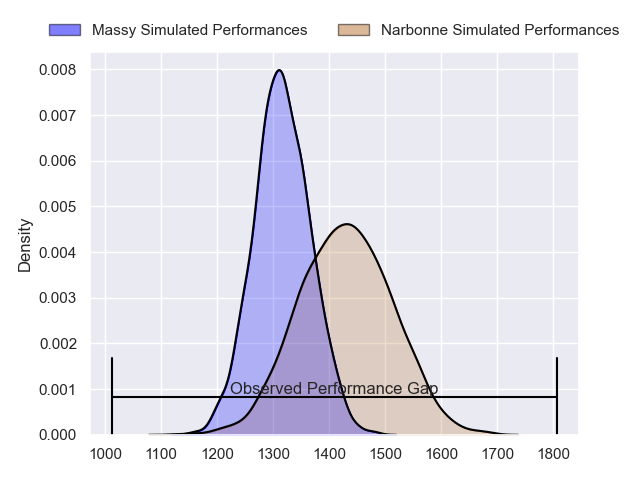
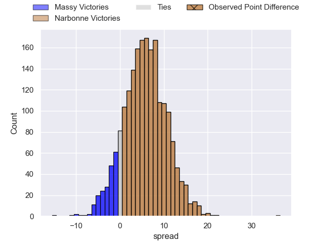
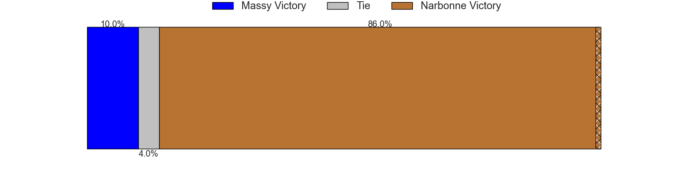
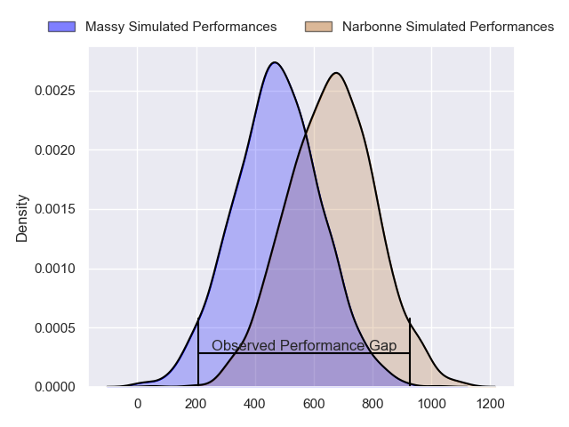
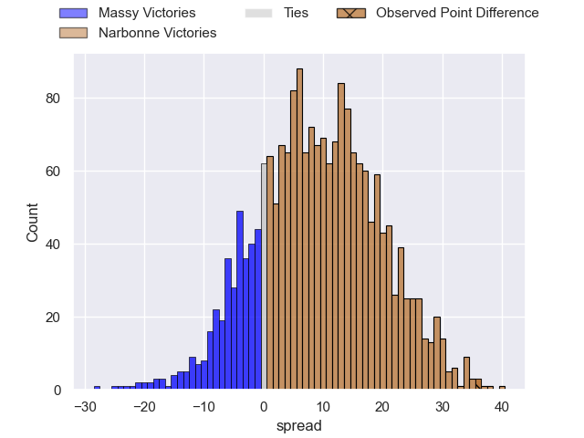
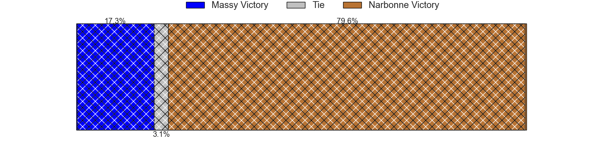
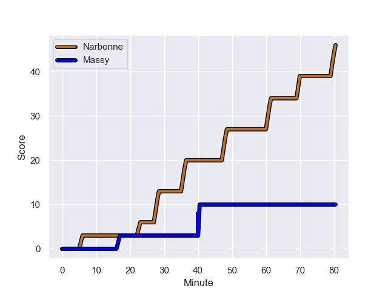
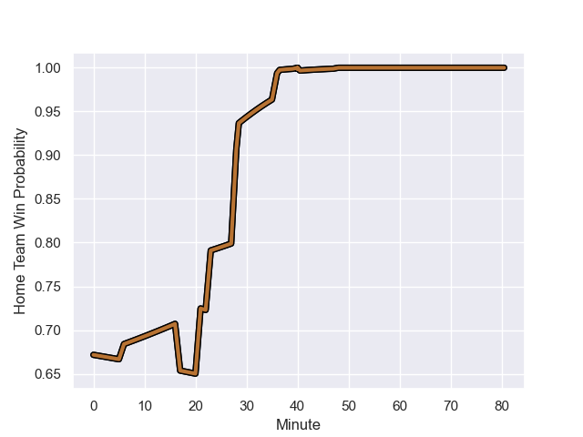

---  
layout: page  
title: Massy at Narbonne; 10-46  
date: 2024-01-13 18:00:00 -0500  
categories: "Nationale 2023" match review  
---
# Massy at Narbonne; 10-46

# Club Level Predictions

The first set of predictions treats a club as the smallest object, as the club develops its members, organizes a gameplan, and deploys its players as needed for each match. This club model has a prediction of 0.659, which translates to predicting Narbonne to win by 5.8.

Our Over/Under is 49.5 - and combined with the spread above, we have a predicted scoreline of 22 to 27

Each club has a rating and a rating deviation (similar to a Glicko rating), and expected performances can be generated. This allows for simulated matches and spreads like the ones below.
## Projected Performances - Club Model

## Projected Spreads - Club Model

## Projected Results - Club Model

# Player Level Predictions - Version 2

Treating teams instead as an entity made up of the currently active players, I have ratings for each player in an altogether different system. These can be combined to form team ratings once teamsheets are announced, weighting starters a bit higher than the reserves. After the match is played, players can be weighted by their minutes on the field, allowing for an accurate measure of the team's composition. With these compiled team ratings, we can make predictions, measure inaccuracy, and update the individual player ratings.
## Prediction with Player Minutes: Narbonne by 7.8

Massy by 0.8 on a neutral field
## Prediction without Player Minutes: Narbonne by 4.0

Massy by 3.0 on a neutral pitch

## Projected Performances - Player Model

## Projected Spreads - Player Model

## Projected Results - Player Model

## Scores over Time

## Win Probability over Time

There were 6 large changes in win probability in this match

|   Away Minutes | Away Player              |   Away elo |   Number |   Home elo | Home Player            |   Home Minutes |
|---------------:|:-------------------------|-----------:|---------:|-----------:|:-----------------------|---------------:|
|             80 | Alexandre Candel         |      33.04 |        1 |      18.41 | Geoffrey Moise         |             50 |
|             55 | Mike Tadjer              |       5.88 |        2 |      30.56 | Clément Esteriola      |             80 |
|             50 | Tijde Visser             |      48.53 |        3 |      44.61 | Jamie Hagan            |             46 |
|             80 | Koen Bloemen             |       2.62 |        4 |      53.12 | Marius Antonescu       |             80 |
|             21 | Andrei Mahu              |      10.91 |        5 |      35.08 | Mohamed Kbaier         |             61 |
|             40 | Pierre Trassoudaine      |      92.81 |        6 |      49    | Thibault Clauzade      |             42 |
|             55 | Alexandre Loubiere       |      78.1  |        7 |      34.3  | Baptiste Abescat-Leroy |             80 |
|             80 | Samuel Nollet            |      17.71 |        8 |      -2.65 | Charles Malet          |             61 |
|             50 | Benjamin Prier           |      49.53 |        9 |      35.87 | Pierrick Nova          |             50 |
|             80 | Hugo Verdu               |      25.37 |       10 |       3.22 | Gilles Bosch           |             63 |
|             50 | Martin Carre             |      72.15 |       11 |      21.83 | Ambrose Curtis         |             50 |
|             80 | Victorien Jacomme        |      77.24 |       12 |      17.13 | Sébastien Giorgis      |             80 |
|             55 | Arthur Seigneuret        |      59.21 |       13 |      39.05 | Pierre Nueno           |             80 |
|             80 | Kimami Sitauti           |     -24.72 |       14 |      22.32 | Pierre-Hugo Ducom      |             80 |
|             80 | Tom Deleuze              |      24.24 |       15 |      49.15 | Paul Auradou           |             80 |
|             25 | Pierre-Alexandre Duclieu |      44.71 |       16 |      52.36 | Théo Castinel          |             30 |
|             30 | Nolan Pienaar            |      50.41 |       17 |      46.47 | Morgan Maga            |             19 |
|             59 | Abongile Nonkontwana     |     -16.25 |       18 |      49.78 | Mehdi Boundjema        |             38 |
|             40 | Fernandez Correa         |      -8.99 |       19 |      44.44 | Arthur Christienne     |             19 |
|             30 | Lucas Rubio              |      17.36 |       20 |      46.5  | Pablo Barbaste         |             30 |
|             30 | Giorgi Gogoladze         |      40.96 |       21 |      38.23 | Tom Chauvet            |             17 |
|             25 | Tom Cusson               |      30.55 |       22 |      22.73 | Théo Mias              |             30 |
|             25 | Clément Vidoni           |      44.69 |       23 |      46.79 | Levi Tikoipau          |             34 |

