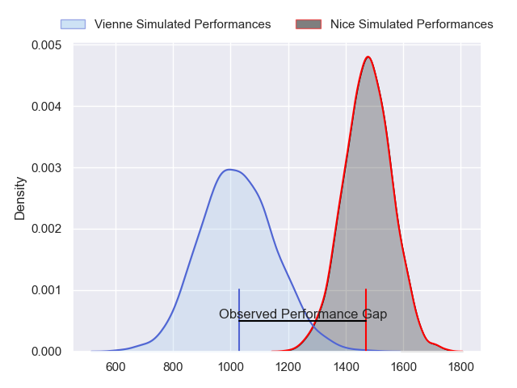
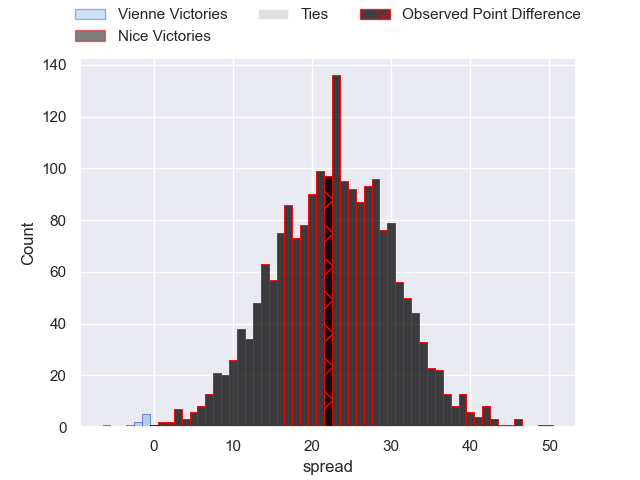
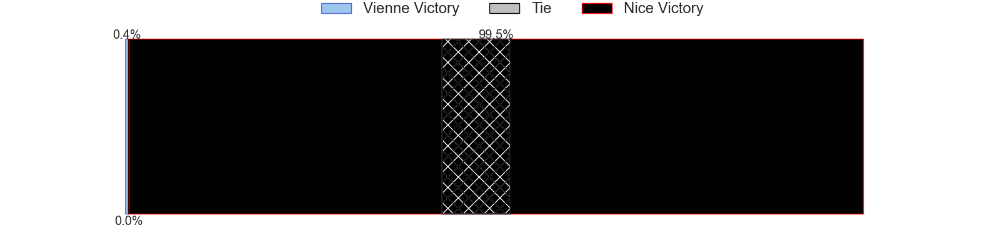
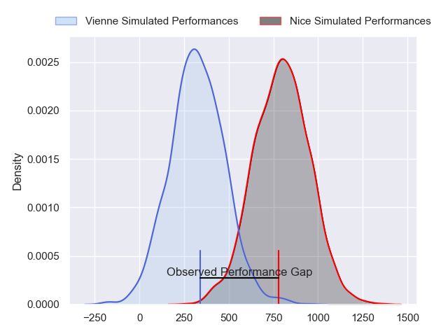
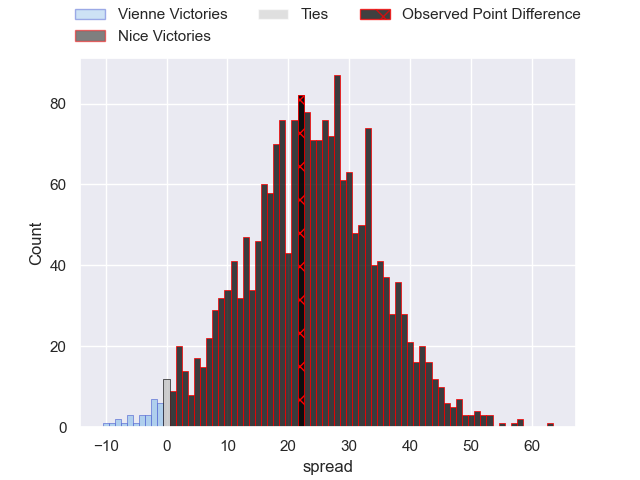
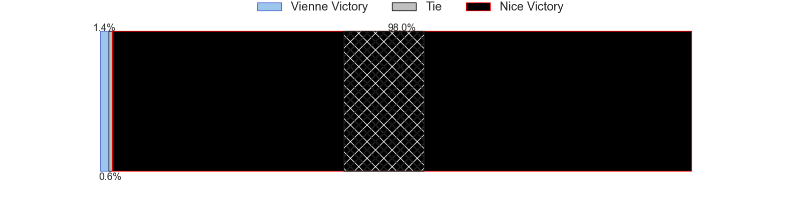
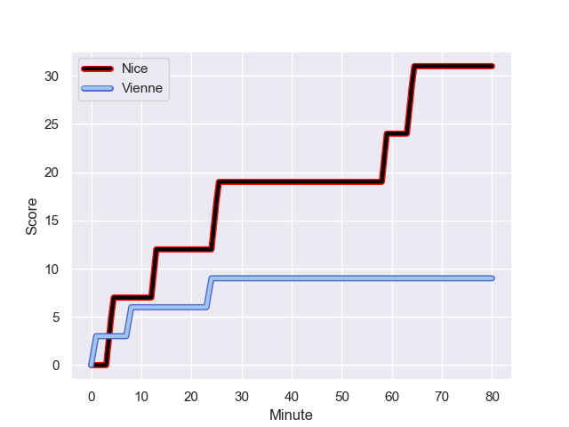
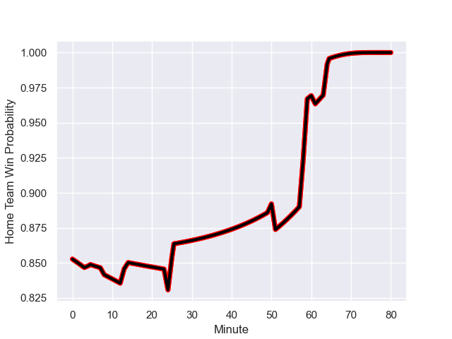

---  
layout: page  
title: Vienne at Nice; 9-31  
date: 2024-01-13 18:00:00 -0500  
categories: "Nationale 2023" match review  
---
# Vienne at Nice; 9-31

# Club Level Predictions

The first set of predictions treats a club as the smallest object, as the club develops its members, organizes a gameplan, and deploys its players as needed for each match. This club model has a prediction of 0.914, which translates to predicting Nice to win by 22.2.

Our Over/Under is 41.5 - and combined with the spread above, we have a predicted scoreline of 10 to 32

Each club has a rating and a rating deviation (similar to a Glicko rating), and expected performances can be generated. This allows for simulated matches and spreads like the ones below.
## Projected Performances - Club Model

## Projected Spreads - Club Model

## Projected Results - Club Model

# Player Level Predictions - Version 2

Treating teams instead as an entity made up of the currently active players, I have ratings for each player in an altogether different system. These can be combined to form team ratings once teamsheets are announced, weighting starters a bit higher than the reserves. After the match is played, players can be weighted by their minutes on the field, allowing for an accurate measure of the team's composition. With these compiled team ratings, we can make predictions, measure inaccuracy, and update the individual player ratings.
## Prediction with Player Minutes: Nice by 19.3

Nice by 15.9 on a neutral field
## Prediction without Player Minutes: Nice by 19.1

Nice by 15.7 on a neutral pitch

## Projected Performances - Player Model

## Projected Spreads - Player Model

## Projected Results - Player Model

## Scores over Time

## Win Probability over Time

There were 2 large changes in win probability in this match

|   Away Minutes | Away Player              |   Away elo |   Number |   Home elo | Home Player               |   Home Minutes |
|---------------:|:-------------------------|-----------:|---------:|-----------:|:--------------------------|---------------:|
|             50 | Loïc Reynaud             |      45.91 |        1 |      57.09 | Sunia Vola                |             61 |
|             50 | Pierre Bourquin          |      34.67 |        2 |      41.81 | Santiago Benjamin Ovejero |             58 |
|             50 | Pierre-Mathieu Fernandes |      25.49 |        3 |      44.88 | Nicolas Ciancio           |             61 |
|             50 | Victor Comptat           |      18.22 |        4 |      71.33 | Yann Tivoli               |             58 |
|             61 | Ciaran O'Flynn           |      13.57 |        5 |      78.61 | Adrien Vigne              |             61 |
|             80 | Guillaume Moroldo        |      18.11 |        6 |      49.47 | Arthur Vignolles          |             51 |
|             80 | Steven Giroud            |      14.86 |        7 |       4.35 | Bastien Berenguel         |             80 |
|             80 | Théo Minodier            |      46.77 |        8 |      56.5  | Martin Freytes            |             80 |
|             58 | Enzo Ravanello           |      42.59 |        9 |      21.94 | Matéo Jeune-Joly          |             58 |
|             80 | Charles Hager            |      40.81 |       10 |      59.16 | Mathis Viard              |             61 |
|             14 | Antoine Grange           |      18.36 |       11 |      47.82 | Simon Delas               |             80 |
|             80 | Matthias Giovale         |      19.97 |       12 |      38.64 | Luca Cutayar              |             80 |
|             80 | Bastien Colliat          |     -39.57 |       13 |      59    | Nathan Courtade           |             80 |
|             80 | Hippolyte Massa          |      36.43 |       14 |      33.65 | Gautier Lacointa          |             80 |
|             80 | Brandon Bellavia         |       4.83 |       15 |      53    | Corentin Penc'hoat        |             80 |
|             30 | Louan Capuano            |      22.86 |       16 |      53.95 | Julien Beaufils           |             19 |
|             30 | Yanis Gimenez            |      46.16 |       17 |      70.17 | Sione Anga'aelangi        |             22 |
|             30 | Guram Kavtidze           |      20.37 |       18 |      16.26 | Kevin Yameogo             |             19 |
|             30 | Pierre Chapelle          |      17.9  |       19 |     161.79 | Tom Murday                |             22 |
|             19 | Antoine Frambourg        |      36.39 |       20 |      39.64 | Louis Vincent             |             19 |
|             22 | Alexandre Jarguel        |      31.38 |       21 |     -24.11 | Alban Conduche            |             29 |
|             66 | Pierre Mollard           |       8.17 |       22 |      51.81 | Jules Solinas             |             22 |
|            nan | nan                      |     nan    |       23 |      52.9  | Romain Riguet             |             19 |

