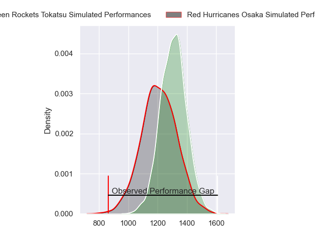
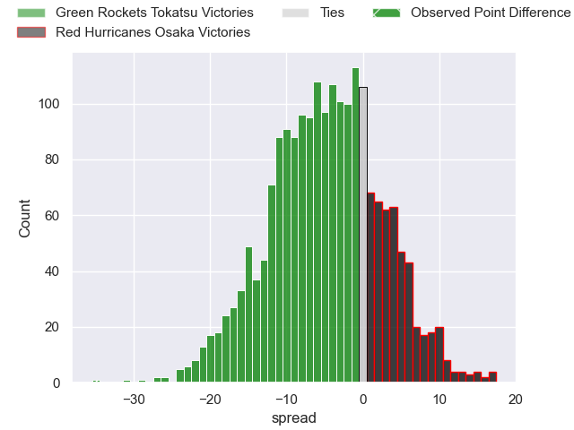
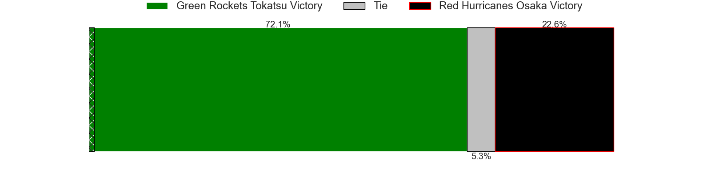
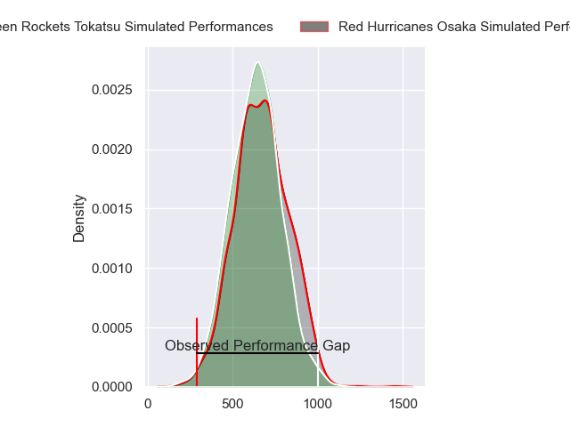
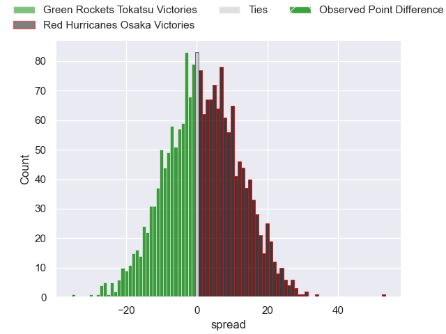
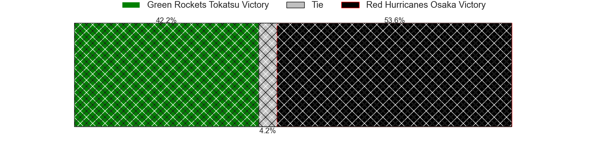
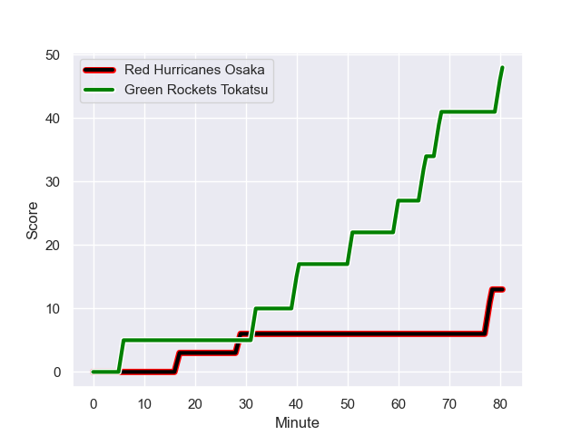
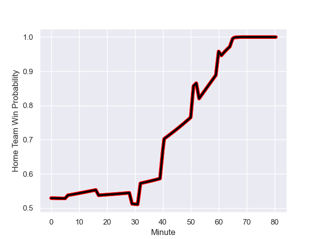

---  
layout: page  
title: Green Rockets Tokatsu at Red Hurricanes Osaka; 48-13  
date: 2024-01-13 18:00:00 -0500  
categories: "Japan Rugby League One D2 2023" match review  
---
# Green Rockets Tokatsu at Red Hurricanes Osaka; 48-13

# Club Level Predictions

The first set of predictions treats a club as the smallest object, as the club develops its members, organizes a gameplan, and deploys its players as needed for each match. This club model has a prediction of 0.369, which translates to predicting Green Rockets Tokatsu to win by 4.9.

Our Over/Under is 51.5 - and combined with the spread above, we have a predicted scoreline of 28 to 23

Each club has a rating and a rating deviation (similar to a Glicko rating), and expected performances can be generated. This allows for simulated matches and spreads like the ones below.
## Projected Performances - Club Model

## Projected Spreads - Club Model

## Projected Results - Club Model

# Player Level Predictions - Version 2

Treating teams instead as an entity made up of the currently active players, I have ratings for each player in an altogether different system. These can be combined to form team ratings once teamsheets are announced, weighting starters a bit higher than the reserves. After the match is played, players can be weighted by their minutes on the field, allowing for an accurate measure of the team's composition. With these compiled team ratings, we can make predictions, measure inaccuracy, and update the individual player ratings.
## Prediction with Player Minutes: Red Hurricanes Osaka by 1.3

Green Rockets Tokatsu by 2.0 on a neutral field
## Prediction without Player Minutes: Green Rockets Tokatsu by 0.3

Green Rockets Tokatsu by 3.6 on a neutral pitch

## Projected Performances - Player Model

## Projected Spreads - Player Model

## Projected Results - Player Model

## Scores over Time

## Win Probability over Time

There were 7 large changes in win probability in this match

|   Away Minutes | Away Player           |   Away elo |   Number |   Home elo | Home Player          |   Home Minutes |
|---------------:|:----------------------|-----------:|---------:|-----------:|:---------------------|---------------:|
|             53 | Kosei Yamamoto        |      51.46 |        1 |      40.93 | Hiromichi Sakamoto   |             61 |
|             53 | Ash Dixon             |      82.99 |        2 |      62.41 | Hisamitsu Shimada    |             61 |
|             53 | Keisuke Kikuta        |      56.67 |        3 |      62.1  | Munekata Sashida     |             61 |
|             66 | Jake Ball             |      24    |        4 |      20.27 | Michael Allardice    |             80 |
|             80 | Daiki Yamagiwa        |      17.15 |        5 |      70.64 | Tom Jeffries         |             80 |
|             53 | Viliami Lutua Ahofono |      52.52 |        6 |      14.24 | Toru Sugishita       |             80 |
|             80 | Ryoi Kamei            |      40.5  |        7 |      58.99 | Taro Sato            |             63 |
|             80 | Aseri Masivou         |      35.85 |        8 |      28.69 | Josh Fenner          |             69 |
|             66 | Nick Phipps           |      76.93 |        9 |      20.76 | Akira Inoue          |             53 |
|             53 | Taisetsu Kanai        |      90.86 |       10 |      60.55 | Oh Ryong Tee         |             63 |
|             80 | Kenta Omata           |      46.47 |       11 |      34.65 | Michael Zakhia       |             80 |
|             63 | Nathanael Tupou       |      47    |       12 |       8.48 | Mifiposeti Paea      |             61 |
|             80 | Maritino Nemani       |       4.71 |       13 |      42.85 | Kaoru Tsuruta        |             80 |
|             80 | Koichi Matsura        |      16.78 |       14 |      50.77 | Kenta Komura         |             80 |
|             80 | Lomano Lemeki         |      47.75 |       15 |       7.2  | Bryce Hegarty        |             80 |
|             27 | Suguru Kubo           |      51.71 |       16 |      61.4  | Toshihiro Yamamouchi |             27 |
|             27 | Myuu Arai             |      57.39 |       17 |      48.01 | Yuichiro Hosono      |             19 |
|             27 | Kanta Higashionna     |      41.26 |       18 |      59.88 | Shosuke Fukasawa     |             19 |
|             27 | Isi Manu              |     -16.86 |       19 |      30.69 | Yo Sato              |             19 |
|             27 | Tiaan Swanepoel       |      53.35 |       20 |      40.27 | Daisuke Iba          |             19 |
|             17 | Kakeru Miyaso         |      46.65 |       21 |      36.59 | Dobashi Fumiya       |             17 |
|             14 | Ika Motulalr Takau    |      49.35 |       22 |      45.49 | Isono Kaito          |             17 |
|             14 | Tatsuya Fujii         |      28.62 |       23 |      18.46 | Tatsunari Fujita     |             11 |

