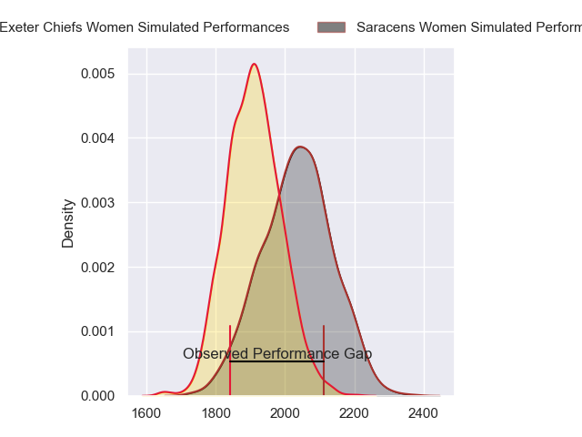
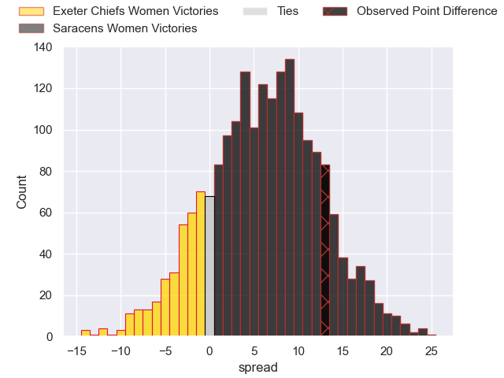
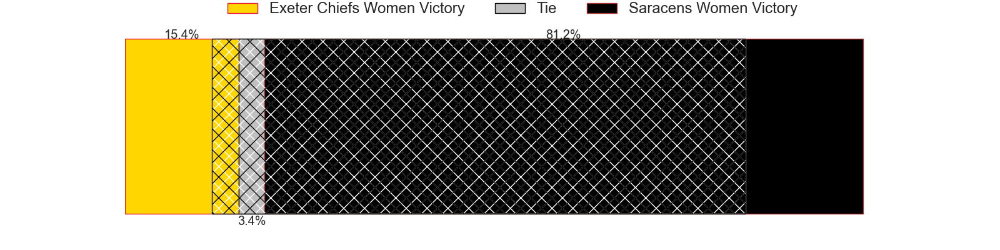

---  
layout: page  
title: Exeter Chiefs Women at Saracens Women; 26-39  
date: 2024-01-13 18:00:00 -0500  
categories: "Allianz Premier 15s 2023" match review  
---
# Exeter Chiefs Women at Saracens Women; 26-39

# Club Level Predictions

The first set of predictions treats a club as the smallest object, as the club develops its members, organizes a gameplan, and deploys its players as needed for each match. This club model has a prediction of 0.669, which translates to predicting Saracens Women to win by 6.3.

Our Over/Under is 46.5 - and combined with the spread above, we have a predicted scoreline of 20 to 26

Each club has a rating and a rating deviation (similar to a Glicko rating), and expected performances can be generated. This allows for simulated matches and spreads like the ones below.
## Projected Performances - Club Model

## Projected Spreads - Club Model

## Projected Results - Club Model

