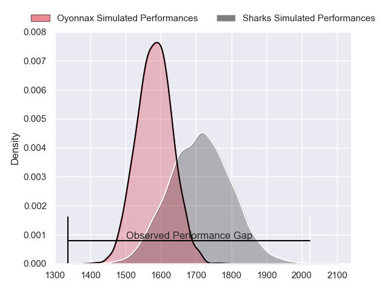
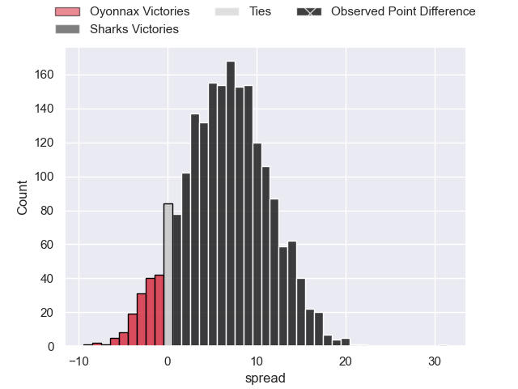
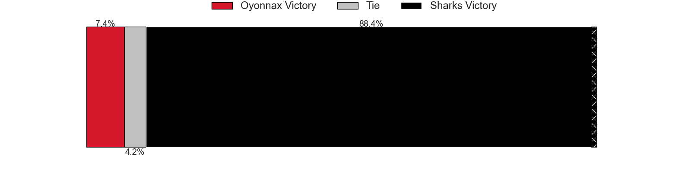
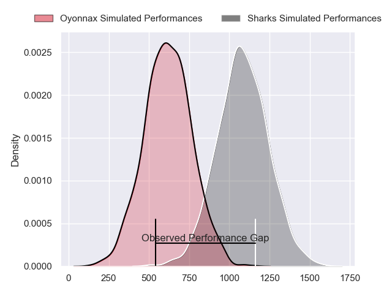
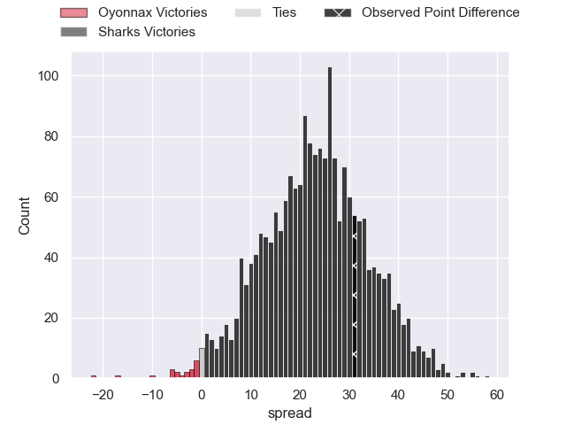
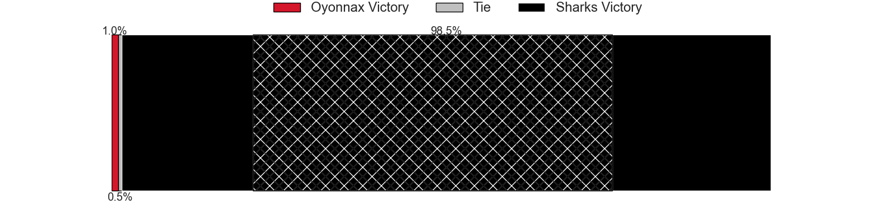
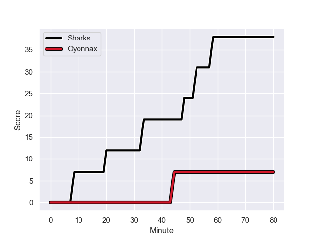
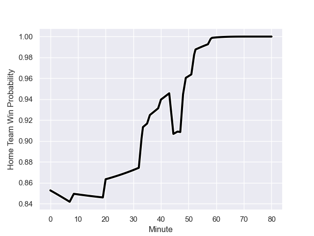

---  
layout: page  
title: Oyonnax at Sharks; 7-38  
date: 2024-01-13 18:00:00 -0500  
categories: "European Rugby Challenge Cup 2023" match review  
---
# Oyonnax at Sharks; 7-38

# Club Level Predictions

The first set of predictions treats a club as the smallest object, as the club develops its members, organizes a gameplan, and deploys its players as needed for each match. This club model has a prediction of 0.682, which translates to predicting Sharks to win by 6.7.

Our Over/Under is 46.5 - and combined with the spread above, we have a predicted scoreline of 20 to 27

Each club has a rating and a rating deviation (similar to a Glicko rating), and expected performances can be generated. This allows for simulated matches and spreads like the ones below.
## Projected Performances - Club Model

## Projected Spreads - Club Model

## Projected Results - Club Model

# Player Level Predictions - Version 2

Treating teams instead as an entity made up of the currently active players, I have ratings for each player in an altogether different system. These can be combined to form team ratings once teamsheets are announced, weighting starters a bit higher than the reserves. After the match is played, players can be weighted by their minutes on the field, allowing for an accurate measure of the team's composition. With these compiled team ratings, we can make predictions, measure inaccuracy, and update the individual player ratings.
## Prediction with Player Minutes: Sharks by 19.3

Sharks by 14.5 on a neutral field
## Prediction without Player Minutes: Sharks by 19.2

Sharks by 14.5 on a neutral pitch

## Projected Performances - Player Model

## Projected Spreads - Player Model

## Projected Results - Player Model

## Scores over Time

## Win Probability over Time

There were 3 large changes in win probability in this match

|   Away Minutes | Away Player          |   Away elo |   Number |   Home elo | Home Player               |   Home Minutes |
|---------------:|:---------------------|-----------:|---------:|-----------:|:--------------------------|---------------:|
|             47 | Adrien Bordenave     |      21.48 |        1 |     136.13 | Ox Nche                   |             55 |
|             36 | Benjamin Geledan     |      16.34 |        2 |      76.4  | Fez Mbatha                |             55 |
|             49 | Thibault Berthaud    |      40.67 |        3 |      43.98 | Hanro Jacobs              |             67 |
|             80 | Steve Mafi           |      34    |        4 |      23.82 | Corne Rahl                |             49 |
|             73 | Ewan Thomas Johnson  |      49.77 |        5 |      22.11 | Gerbrandt Grobler         |             80 |
|             80 | Filimo Taofifenua    |      67.23 |        6 |      78.13 | Tinotenda Blithe Mavesere |             80 |
|             80 | Hugo Hermet          |      21.09 |        7 |      43.36 | Jeandre Labuschagne       |             80 |
|             53 | Loic Godener         |      27.99 |        8 |      53.8  | Phepsi Buthelezi          |             64 |
|             80 | Charlie Cassang      |      88.4  |        9 |      55.48 | Grant Williams            |             80 |
|             40 | Jules Soulan         |      72.26 |       10 |      61.33 | Curwin Bosch              |             80 |
|             80 | Joe Ravouvou         |      70.73 |       11 |     144.68 | Makazole Mapimpi          |             80 |
|             65 | Pedro Bettencourt    |      13.87 |       12 |      42.74 | Francois Venter           |             73 |
|             55 | Leo Treilles         |      40.01 |       13 |      61.14 | Lukhanyo Am               |             80 |
|             80 | Maxime Salles        |      55.04 |       14 |      56.59 | Werner Kok                |             64 |
|             80 | Justin Bouraux       |      25.87 |       15 |      96.35 | Aphelele Fassi            |             59 |
|             33 | Rory Sutherland      |      29.88 |       16 |      27.27 | Ntuthuko Mchunu           |             25 |
|             31 | Christopher Vaotoa   |      38.07 |       17 |      25.14 | Kerron van Vuuren         |             25 |
|             44 | Manu Leiataua        |      -7.72 |       18 |      45.13 | Khwezi Mona               |             13 |
|              7 | Antonin Corso        |      45.6  |       19 |     120.99 | Eben Etzebeth             |             31 |
|             27 | Wandrille Picault    |      42.93 |       20 |      36.99 | James Venter              |             16 |
|             40 | Souleymane Coulibaly |      41.5  |       21 |      81.13 | Jaden Hendrikse           |             21 |
|             15 | David Odiase         |      45.45 |       22 |      64.52 | Diego Appollis            |              7 |
|             25 | Ilan El Khattabi     |      18.47 |       23 |      36.81 | Eduan Keyter              |             16 |

