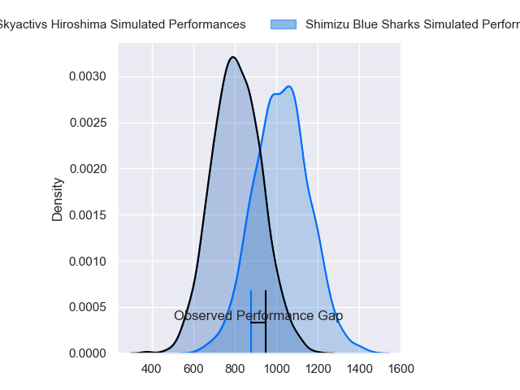
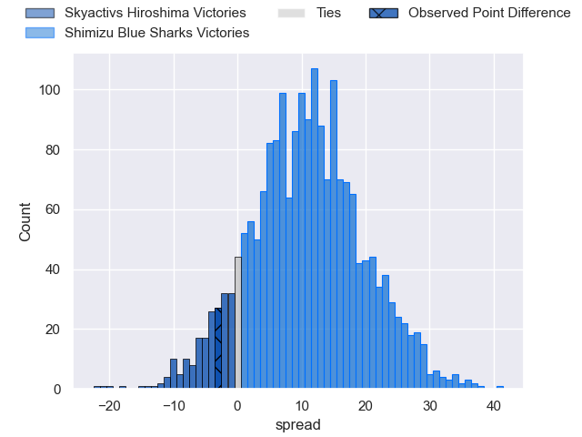
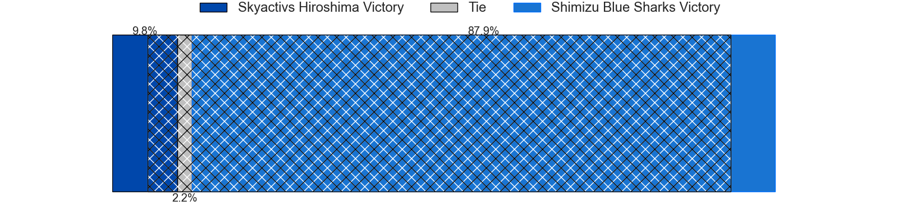
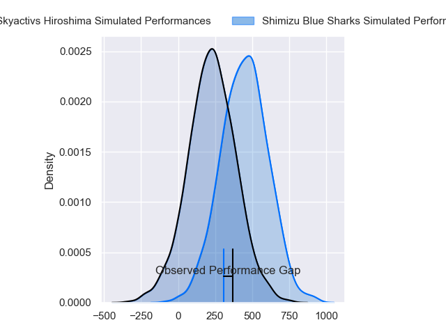
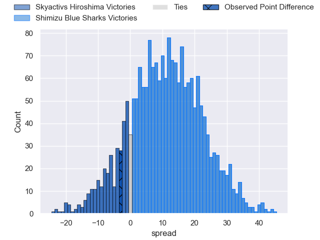
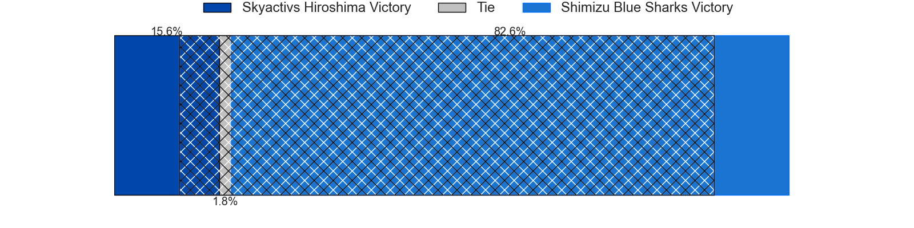
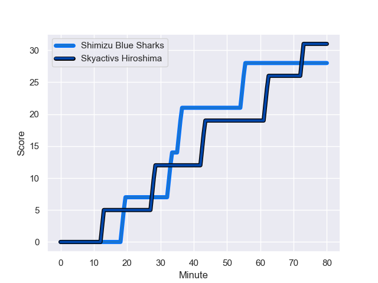
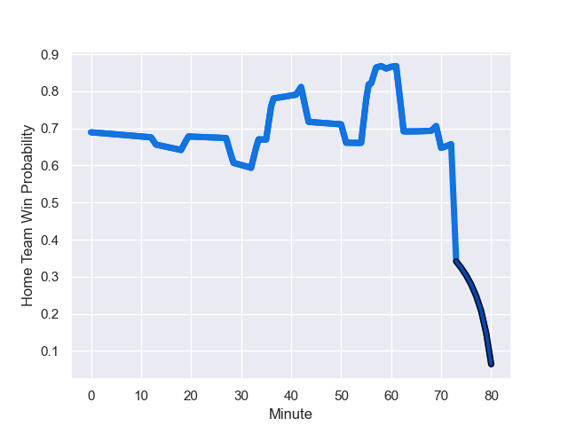

---  
layout: page  
title: Skyactivs Hiroshima at Shimizu Blue Sharks; 31-28  
date: 2024-01-13 18:00:00 -0500  
categories: "Japan Rugby League One D3 2023" match review  
---
# Skyactivs Hiroshima at Shimizu Blue Sharks; 31-28

# Club Level Predictions

The first set of predictions treats a club as the smallest object, as the club develops its members, organizes a gameplan, and deploys its players as needed for each match. This club model has a prediction of 0.762, which translates to predicting Shimizu Blue Sharks to win by 10.8.

Our Over/Under is 62.5 - and combined with the spread above, we have a predicted scoreline of 26 to 37

Each club has a rating and a rating deviation (similar to a Glicko rating), and expected performances can be generated. This allows for simulated matches and spreads like the ones below.
## Projected Performances - Club Model

## Projected Spreads - Club Model

## Projected Results - Club Model

# Player Level Predictions - Version 2

Treating teams instead as an entity made up of the currently active players, I have ratings for each player in an altogether different system. These can be combined to form team ratings once teamsheets are announced, weighting starters a bit higher than the reserves. After the match is played, players can be weighted by their minutes on the field, allowing for an accurate measure of the team's composition. With these compiled team ratings, we can make predictions, measure inaccuracy, and update the individual player ratings.
## Prediction with Player Minutes: Shimizu Blue Sharks by 8.8

Shimizu Blue Sharks by 5.6 on a neutral field
## Prediction without Player Minutes: Shimizu Blue Sharks by 8.5

Shimizu Blue Sharks by 5.3 on a neutral pitch

## Projected Performances - Player Model

## Projected Spreads - Player Model

## Projected Results - Player Model

## Scores over Time

## Win Probability over Time

There were 18 large changes in win probability in this match

|   Away Minutes | Away Player        |   Away elo |   Number |   Home elo | Home Player        |   Home Minutes |
|---------------:|:-------------------|-----------:|---------:|-----------:|:-------------------|---------------:|
|             70 | Koshi Kato         |     -22.64 |        1 |      41.9  | Fumiyake Mato      |             57 |
|             70 | Tomohiro Takeda    |      -8.23 |        2 |      20.84 | Kaito Tamori       |             57 |
|             36 | Tadatsugu Kanayama |      48.61 |        3 |      46.48 | Uha Lee            |             59 |
|             80 | Yutaro Tanaka      |      32.07 |        4 |     -38.4  | Yutaro Shirako     |             80 |
|             80 | Lachlan Osborne    |     -13.88 |        5 |      26.46 | Tom Rowe           |             70 |
|             51 | Tomoki Ashida      |     -29.76 |        6 |      46.2  | Usa Baleilautoka   |             80 |
|             69 | Koki Nakano        |      56.53 |        7 |      23.64 | Ryo Sato           |             80 |
|             80 | Tevin Ferris       |      17.54 |        8 |      35.52 | Koudai Takahashi   |             61 |
|             42 | Syoya Maeda        |      53.43 |        9 |      38.24 | Kayne Hammington   |             61 |
|             79 | Beaudein Waaka     |     -56.21 |       10 |      32.11 | Soichiro Kuwata    |             80 |
|             80 | Kaito Sasaoka      |      39.57 |       11 |      59.51 | John-Ben Kotze     |             65 |
|             80 | Jacob Abel         |      57    |       12 |     -17.54 | Orbyn Leger        |             80 |
|             80 | Haruki Kitajima    |      -6.03 |       13 |      41.66 | Takuya Kanemura    |             61 |
|             80 | Yuto Nanamura      |      53.43 |       14 |      42.01 | Toru Kanazawa      |             80 |
|             57 | Keisuke Nakamoto   |      46.48 |       15 |      -1.7  | Coenie van Wyk     |             80 |
|             44 | Tomoya Otake       |      -2.88 |       16 |      13.11 | Daiki Shimura      |             23 |
|             38 | Hayato Kanamuru    |      14    |       17 |      35.3  | Kunpei Oonishi     |             23 |
|             29 | Tye Nash           |      64.48 |       18 |       6.85 | Takatoshi Sugawara |             21 |
|             23 | Ginjiro Sakiguchi  |     -90.75 |       19 |      14.05 | Haruki Matsudo     |             19 |
|             11 | Iori Suzuki        |      37.34 |       20 |      12.87 | Taishi Sakurai     |             19 |
|             10 | Taichi Yoko        |      46.65 |       21 |      76.55 | Siale Piutau       |             19 |
|             10 | Tomonori Koyanagi  |      48.7  |       22 |     -20.62 | Tatsuhiro Ozaki    |             15 |
|              1 | Ryoutarou Saito    |     -13.79 |       23 |      33.45 | Tetsunori Osaki    |             10 |

