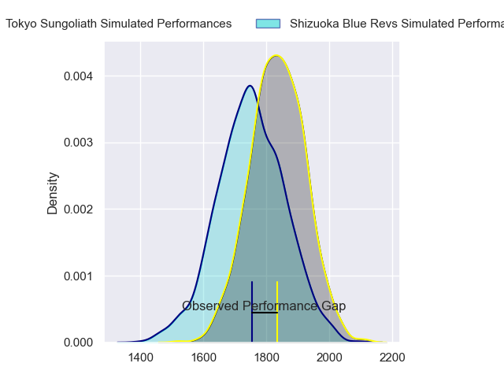
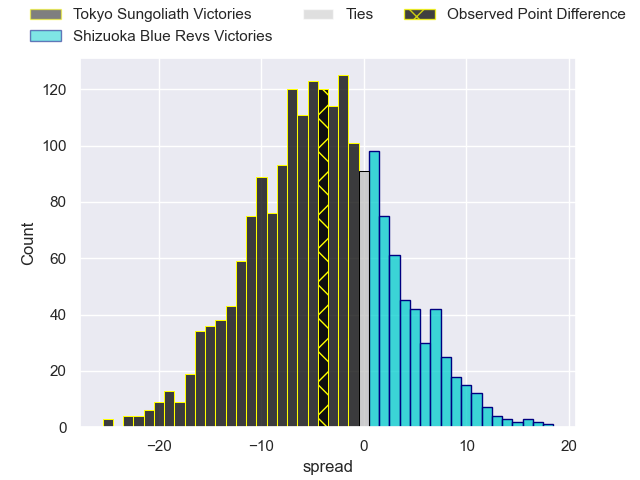
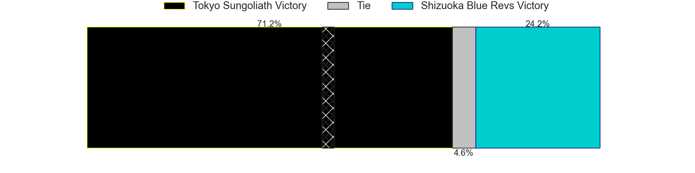
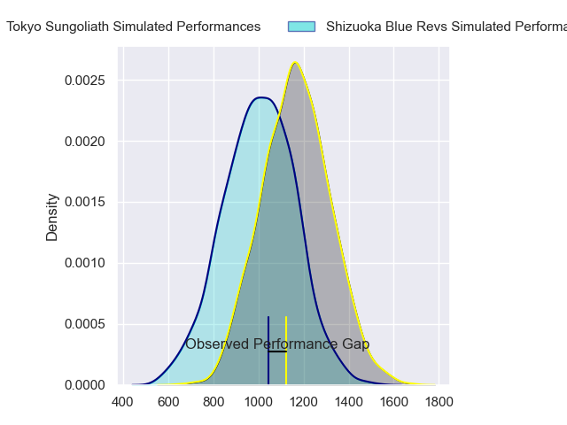
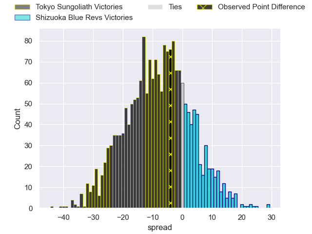
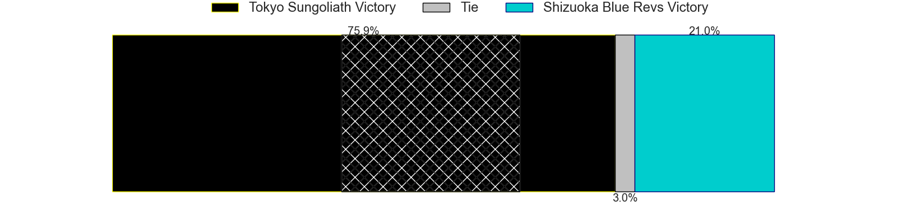
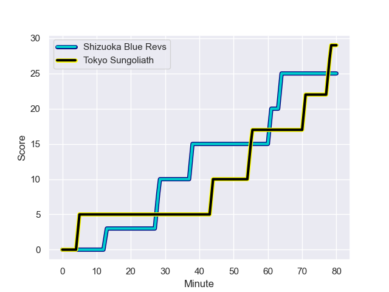
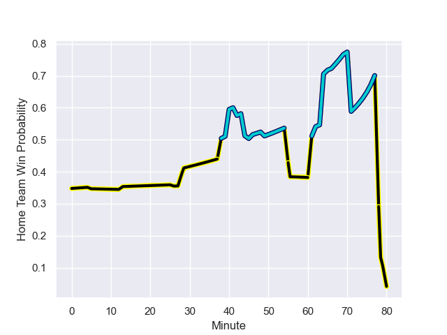

---  
layout: page  
title: Tokyo Sungoliath at Shizuoka Blue Revs; 29-25  
date: 2024-01-13 18:00:00 -0500  
categories: "Japan Rugby League One 2023" match review  
---
# Tokyo Sungoliath at Shizuoka Blue Revs; 29-25

# Club Level Predictions

The first set of predictions treats a club as the smallest object, as the club develops its members, organizes a gameplan, and deploys its players as needed for each match. This club model has a prediction of 0.377, which translates to predicting Tokyo Sungoliath to win by 4.5.

Our Over/Under is 58.5 - and combined with the spread above, we have a predicted scoreline of 31 to 27

Each club has a rating and a rating deviation (similar to a Glicko rating), and expected performances can be generated. This allows for simulated matches and spreads like the ones below.
## Projected Performances - Club Model

## Projected Spreads - Club Model

## Projected Results - Club Model

# Player Level Predictions - Version 2

Treating teams instead as an entity made up of the currently active players, I have ratings for each player in an altogether different system. These can be combined to form team ratings once teamsheets are announced, weighting starters a bit higher than the reserves. After the match is played, players can be weighted by their minutes on the field, allowing for an accurate measure of the team's composition. With these compiled team ratings, we can make predictions, measure inaccuracy, and update the individual player ratings.
## Prediction with Player Minutes: Tokyo Sungoliath by 6.9

Tokyo Sungoliath by 10.6 on a neutral field
## Prediction without Player Minutes: Tokyo Sungoliath by 8.3

Tokyo Sungoliath by 11.9 on a neutral pitch

## Projected Performances - Player Model

## Projected Spreads - Player Model

## Projected Results - Player Model

## Scores over Time

## Win Probability over Time

There were 14 large changes in win probability in this match

|   Away Minutes | Away Player       |   Away elo |   Number |   Home elo | Home Player       |   Home Minutes |
|---------------:|:------------------|-----------:|---------:|-----------:|:------------------|---------------:|
|             40 | Yukio Morikawa    |      91.43 |        1 |      19.88 | Kazuhiro Kawata   |             70 |
|             66 | Kosuke Horikoshi  |      43.28 |        2 |      85.25 | Takeshi Hino      |             70 |
|             26 | Kan Nakano        |      43.75 |        3 |      62.43 | Heiichiro Ito     |             61 |
|             46 | Takayasu Tsuji    |      75.19 |        4 |      86.8  | Eishin Kuwano     |             80 |
|             72 | Harry Hockings    |     137.5  |        5 |     100.98 | Murray Douglas    |             80 |
|             80 | Kanji Shimokawa   |      45.85 |        6 |      88.98 | Yuya Odo          |             80 |
|             80 | Sam Cane          |     121.39 |        7 |      83.15 | Kwagga Smith      |             42 |
|             80 | Ryuga Hashimoto   |      42.03 |        8 |      58.34 | Malgene Ilaua     |             66 |
|             62 | Yutaka Nagare     |      89.09 |        9 |      46.65 | Kodai Okazaki     |             45 |
|             80 | Mikiya Takamoto   |      56.43 |       10 |      58.78 | Kenta Iemura      |             80 |
|             49 | Shota Emi         |      60.64 |       11 |      66.87 | Malo Tuitama      |             80 |
|             40 | Ryoto Nakamura    |     135.46 |       12 |      50.78 | Viliami Tahitu'a  |             80 |
|             80 | Taiga Ozaki       |      57.32 |       13 |      72.39 | Charles Piutau    |             80 |
|             80 | Cheslin Kolbe     |     143.81 |       14 |      18.8  | Kakeru Okumura    |             42 |
|             80 | Kotaro Matsushima |     113.74 |       15 |      69.41 | Futo Yamaguchi    |             80 |
|             54 | Kotaro Hosoki     |      51.03 |       16 |      44.78 | Shoji Takuma      |             38 |
|             40 | Kenta Kobayashi   |      49.56 |       17 |       0.48 | Sam Greene        |             38 |
|             40 | Isaiah Punivai    |      35.18 |       18 |      23.4  | Hironori Yatomi   |             35 |
|             34 | Sione Lavemai     |      58.73 |       19 |      31.23 | Sohei Nishimura   |             19 |
|             31 | Seiya Ozaki       |      94.19 |       20 |      42.74 | Ryosuke Funahashi |             14 |
|             18 | Naoto Saito       |      24.68 |       21 |      46.87 | Takayoshi Mohara  |             10 |
|             14 | Kienori Go        |      51.93 |       22 |      18.92 | Toshiya Hirakawa  |             10 |
|              8 | Trevor Hosea      |      30.83 |       23 |     nan    | nan               |            nan |

