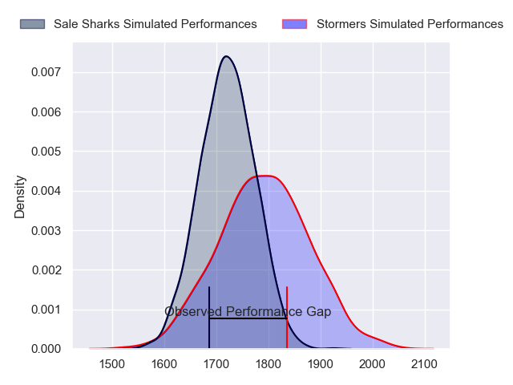
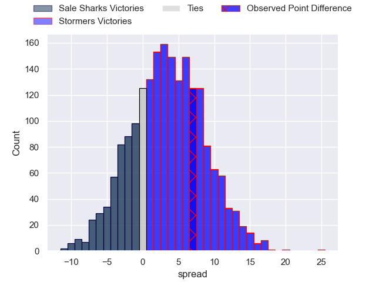
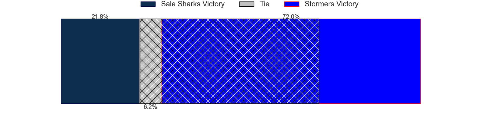
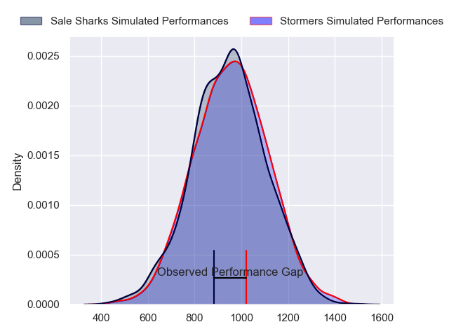
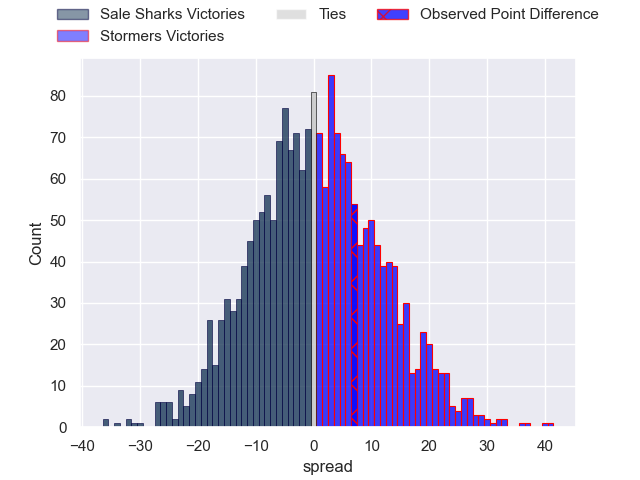
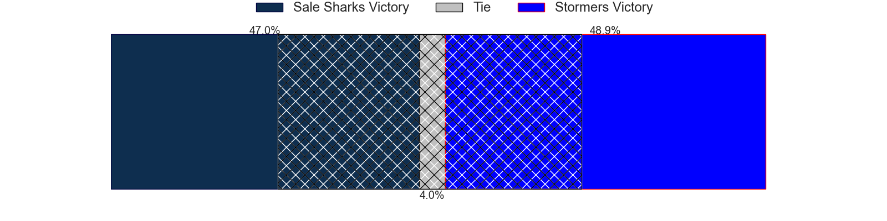
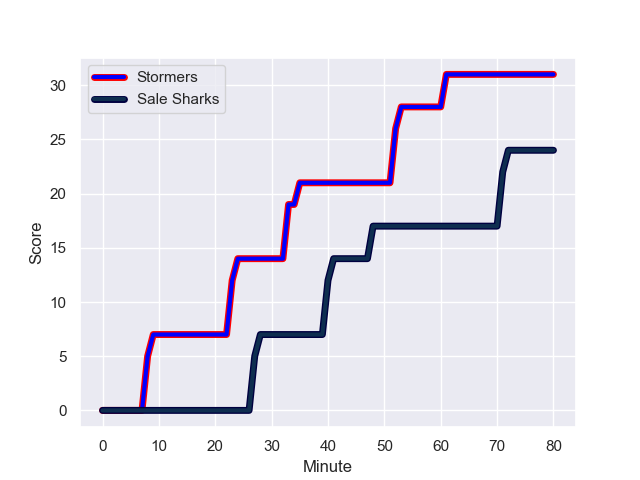
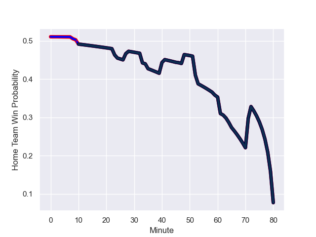

---  
layout: page  
title: Sale Sharks at Stormers; 24-31  
date: 2024-01-13 18:00:00 -0500  
categories: "European Rugby Champions Cup 2023" match review  
---
# Sale Sharks at Stormers; 24-31

# Club Level Predictions

The first set of predictions treats a club as the smallest object, as the club develops its members, organizes a gameplan, and deploys its players as needed for each match. This club model has a prediction of 0.6, which translates to predicting Stormers to win by 3.6.

Our Over/Under is 48.5 - and combined with the spread above, we have a predicted scoreline of 22 to 26

Each club has a rating and a rating deviation (similar to a Glicko rating), and expected performances can be generated. This allows for simulated matches and spreads like the ones below.
## Projected Performances - Club Model

## Projected Spreads - Club Model

## Projected Results - Club Model

# Player Level Predictions - Version 2

Treating teams instead as an entity made up of the currently active players, I have ratings for each player in an altogether different system. These can be combined to form team ratings once teamsheets are announced, weighting starters a bit higher than the reserves. After the match is played, players can be weighted by their minutes on the field, allowing for an accurate measure of the team's composition. With these compiled team ratings, we can make predictions, measure inaccuracy, and update the individual player ratings.
## Prediction with Player Minutes: Stormers by 0.5

Sale Sharks by 4.4 on a neutral field
## Prediction without Player Minutes: Sale Sharks by 0.5

Sale Sharks by 5.4 on a neutral pitch

## Projected Performances - Player Model

## Projected Spreads - Player Model

## Projected Results - Player Model

## Scores over Time

## Win Probability over Time

There were 10 large changes in win probability in this match

|   Away Minutes | Away Player          |   Away elo |   Number |   Home elo | Home Player          |   Home Minutes |
|---------------:|:---------------------|-----------:|---------:|-----------:|:---------------------|---------------:|
|             10 | Ross Harrison        |      75.69 |        1 |      46.65 | Sti Sithole          |             48 |
|             46 | Agustin Creevy       |      90.38 |        2 |      45.2  | Andre-Hugo Venter    |             62 |
|             41 | James Harper         |      60.23 |        3 |      46.65 | Neethling Fouche     |             67 |
|             80 | Ben Bamber           |      46.65 |        4 |      46.65 | Adre Smith           |             64 |
|             80 | Jonny Hill           |      57.43 |        5 |      46.65 | Ruben van Heerden    |             80 |
|             80 | Sam Dugdale          |      33.97 |        6 |      67.59 | Deon Fourie          |             62 |
|             64 | Ben Curry            |      36.74 |        7 |      44.8  | Ben-Jason Dixon      |             51 |
|             59 | Josh Beaumont        |      61.15 |        8 |      46.65 | Hacjivah Dayimani    |             80 |
|             46 | Gus Warr             |      41.1  |        9 |      46.65 | Herschel Jantjies    |             64 |
|             73 | Robert du Preez      |      39.55 |       10 |      78.38 | Manie Libbok         |             80 |
|             65 | Arron Reed           |      82.13 |       11 |      46.65 | Leolin Zas           |             80 |
|             80 | Sam Bedlow           |      76.09 |       12 |      46.65 | Daniel du Plessis    |             80 |
|             80 | Sam James            |      98.49 |       13 |      47.96 | Suleiman Hartzenberg |             80 |
|             80 | Alex Wills           |      46.65 |       14 |      46.65 | Courtnall Skosan     |             48 |
|             80 | Telusa Veainu        |     143.46 |       15 |     137.91 | Damian Willemse      |             80 |
|             34 | Luke Cowan-Dickie    |      88.34 |       16 |      46.65 | Joseph Dweba         |             18 |
|             70 | Tumy Onasanya        |      46.69 |       17 |      46.65 | Alistair Vermaak     |             32 |
|             39 | Asher Opoku-Fordjour |      47.85 |       18 |      46.65 | Brok Harris          |             13 |
|             21 | Rouban Birch         |      46.65 |       19 |      46.65 | Connor Evans         |             16 |
|             16 | Tommy Taylor         |      15.35 |       20 |      46.65 | Marcel Theunissen    |             29 |
|             34 | Nye Thomas           |      46.69 |       21 |      46.65 | Nama Xaba            |             18 |
|              7 | Tom Curtis           |      39.24 |       22 |      46.65 | Paul de Wet          |             16 |
|             15 | Rekeiti Ma'asi-White |      48.24 |       23 |      46.65 | Warrick Gelant       |             32 |

