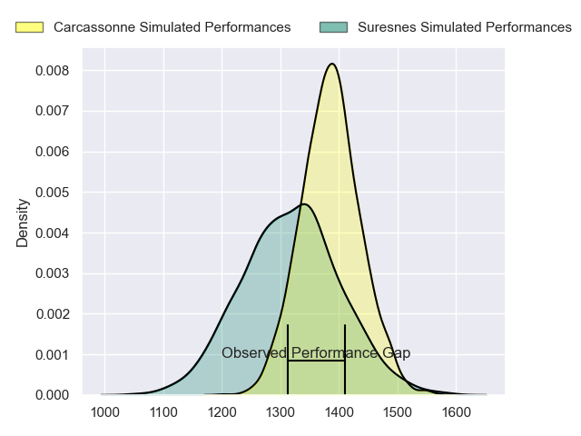
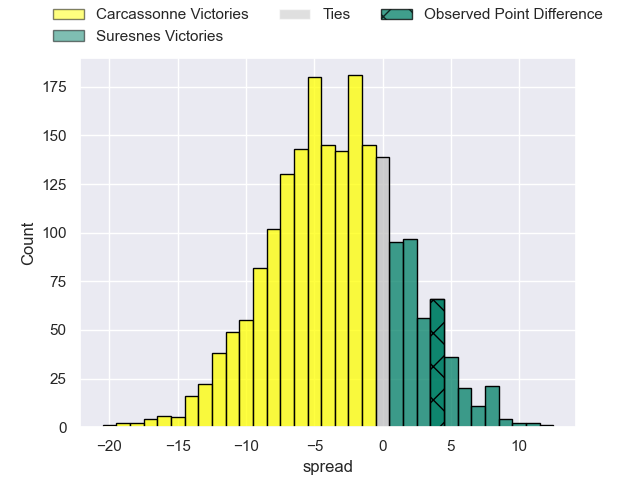
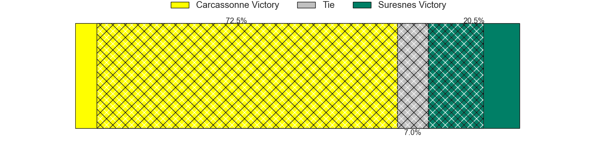
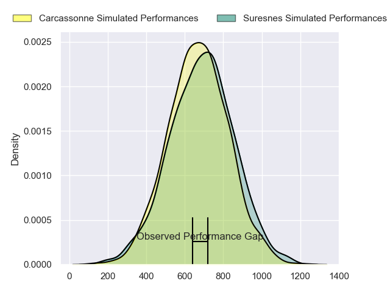
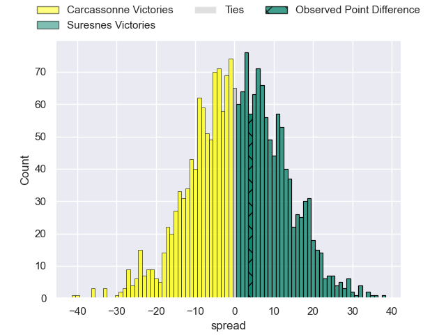
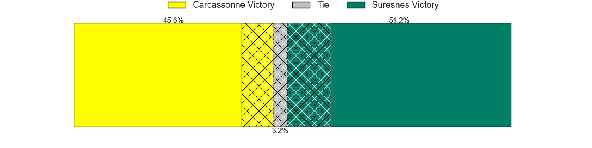
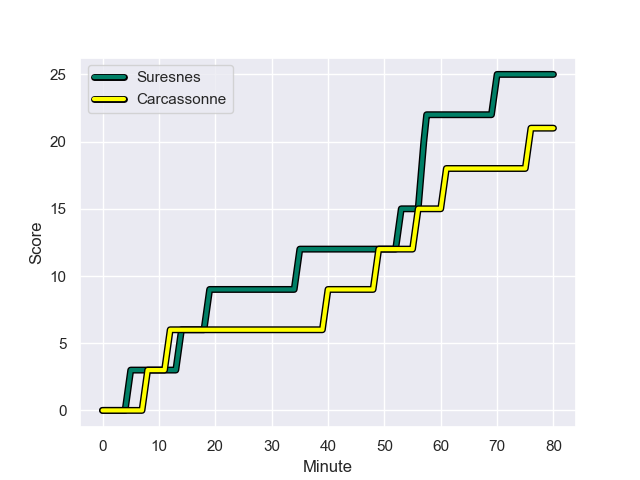
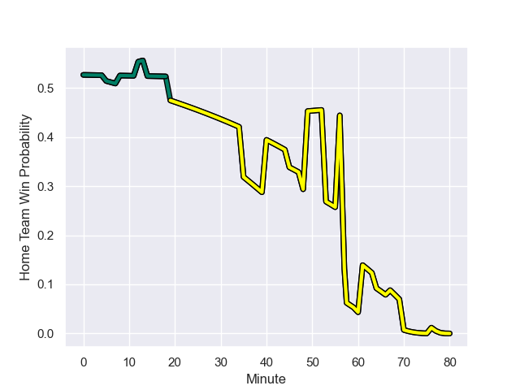

---  
layout: page  
title: Carcassonne at Suresnes; 21-25  
date: 2024-01-13 18:00:00 -0500  
categories: "Nationale 2023" match review  
---
# Carcassonne at Suresnes; 21-25

# Club Level Predictions

The first set of predictions treats a club as the smallest object, as the club develops its members, organizes a gameplan, and deploys its players as needed for each match. This club model has a prediction of 0.401, which translates to predicting Carcassonne to win by 3.5.

Our Over/Under is 27.5 - and combined with the spread above, we have a predicted scoreline of 16 to 12

Each club has a rating and a rating deviation (similar to a Glicko rating), and expected performances can be generated. This allows for simulated matches and spreads like the ones below.
## Projected Performances - Club Model

## Projected Spreads - Club Model

## Projected Results - Club Model

# Player Level Predictions - Version 2

Treating teams instead as an entity made up of the currently active players, I have ratings for each player in an altogether different system. These can be combined to form team ratings once teamsheets are announced, weighting starters a bit higher than the reserves. After the match is played, players can be weighted by their minutes on the field, allowing for an accurate measure of the team's composition. With these compiled team ratings, we can make predictions, measure inaccuracy, and update the individual player ratings.
## Prediction with Player Minutes: Suresnes by 1.2

Carcassonne by 2.3 on a neutral field
## Prediction without Player Minutes: Suresnes by 0.9

Carcassonne by 2.5 on a neutral pitch

## Projected Performances - Player Model

## Projected Spreads - Player Model

## Projected Results - Player Model

## Scores over Time

## Win Probability over Time

There were 15 large changes in win probability in this match

|   Away Minutes | Away Player           |   Away elo |   Number |   Home elo | Home Player            |   Home Minutes |
|---------------:|:----------------------|-----------:|---------:|-----------:|:-----------------------|---------------:|
|             60 | Andrei Ursache        |      57.57 |        1 |      57.43 | Elias Coulibaly        |             69 |
|             76 | Raphael Carbou        |      50.51 |        2 |      37.89 | Hayam El Bibouji       |             60 |
|             48 | Nikoloz Narmania      |      56.88 |        3 |      39.03 | Leandro Mario Assi     |             60 |
|             80 | Jason Nel             |      44.44 |        4 |      41.52 | Sacha Yahi             |             67 |
|             56 | Clément Fontaine      |      26.73 |        5 |      30.45 | Yakine Djebarri        |             80 |
|             64 | Gary Graham           |      89.33 |        6 |      40.11 | Florian Desbordes      |             80 |
|             80 | Valentin Sese         |      33.41 |        7 |      31.81 | Wian Vosloo            |             67 |
|             80 | Romain Guyot          |      45.56 |        8 |      47.96 | Lakisipone Lee         |             80 |
|             70 | Martin Landajo        |     -26.36 |        9 |      29.42 | Thomas Lacroix         |             80 |
|             80 | Gaetan Pichon         |      24.63 |       10 |      63.38 | Jean Chezeau           |             80 |
|             64 | Clement Egiziano      |      70.78 |       11 |      11.18 | Alexis Clement         |             80 |
|             80 | Jordan Puletua        |      14.92 |       12 |      15.77 | JJ Taulagi             |             80 |
|             80 | Tutuila Vaea          |      45.49 |       13 |      61.28 | Petero Tuwai           |             45 |
|             80 | Léo Darrelatour       |      89.87 |       14 |      84.28 | Faraj Fartass          |             79 |
|             48 | Maxime Gianet         |      69.55 |       15 |       7.03 | Thomas Baudy           |             80 |
|             20 | Florent Lorenzon      |      38.81 |       16 |      61.2  | Beqa Kakabadze         |             11 |
|              4 | Baptiste Moreno       |      46.75 |       17 |      28.67 | Jean-Étienne Lesueur   |             20 |
|             32 | Fabien Lorenzon       |      61.58 |       18 |      42.17 | Victor Damian Arias    |             20 |
|             24 | Marius Iftimiciuc     |      16.43 |       19 |      52.48 | Damien Bozic           |             13 |
|             16 | Ferdinand Dreno       |      44.46 |       20 |      57.65 | Jean-Baptiste Lachaise |             13 |
|             16 | Sakiusa Bureitakiyaca |      21.05 |       21 |      80.9  | Victor Barnier         |             35 |
|             10 | Enahemo Artaud        |      46.65 |       22 |      37.18 | Lilan Savioz Fouillet  |              1 |
|             32 | Damien Añon           |      43.78 |       23 |     nan    | nan                    |            nan |

