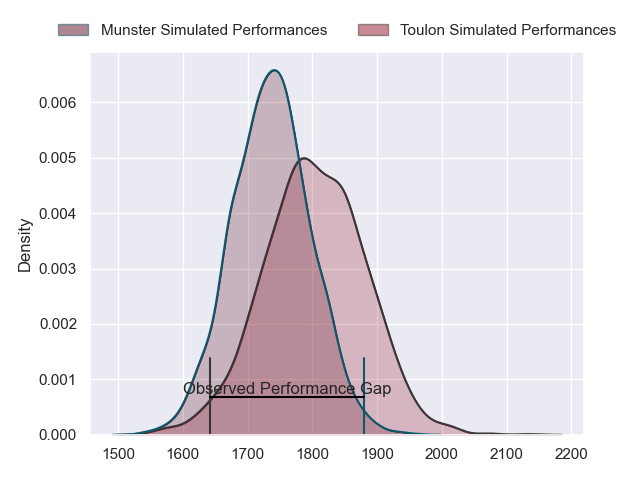
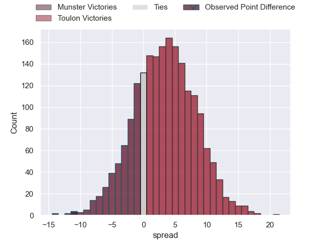
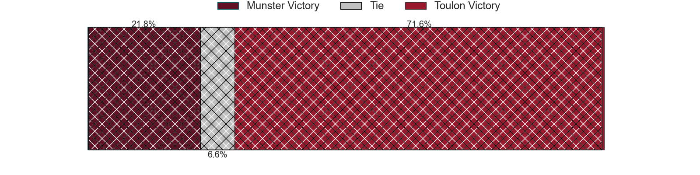
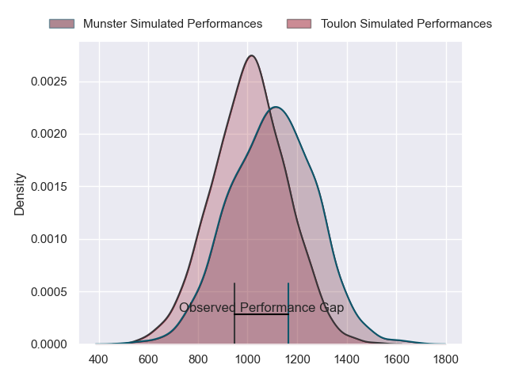
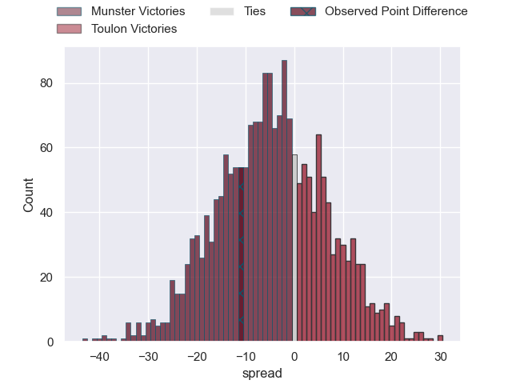
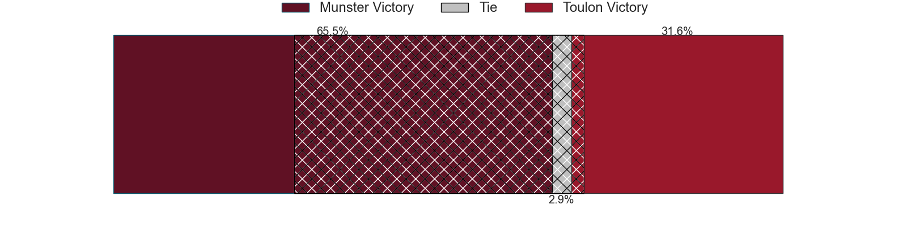
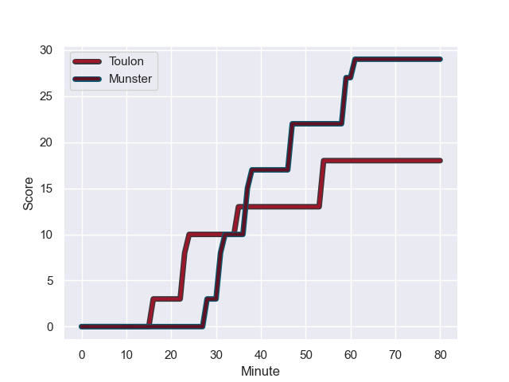
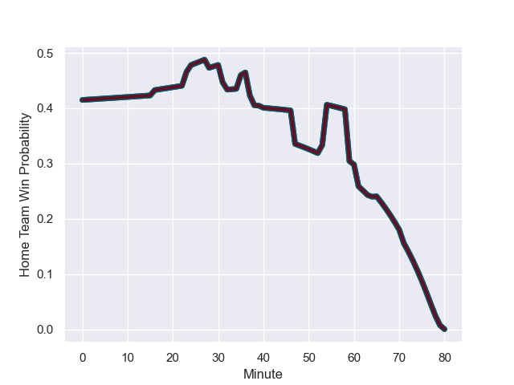

---  
layout: page  
title: Munster at Toulon; 29-18  
date: 2024-01-13 18:00:00 -0500  
categories: "European Rugby Champions Cup 2023" match review  
---
# Munster at Toulon; 29-18

# Club Level Predictions

The first set of predictions treats a club as the smallest object, as the club develops its members, organizes a gameplan, and deploys its players as needed for each match. This club model has a prediction of 0.587, which translates to predicting Toulon to win by 3.1.

Our Over/Under is 37.5 - and combined with the spread above, we have a predicted scoreline of 17 to 20

Each club has a rating and a rating deviation (similar to a Glicko rating), and expected performances can be generated. This allows for simulated matches and spreads like the ones below.
## Projected Performances - Club Model

## Projected Spreads - Club Model

## Projected Results - Club Model

# Player Level Predictions - Version 2

Treating teams instead as an entity made up of the currently active players, I have ratings for each player in an altogether different system. These can be combined to form team ratings once teamsheets are announced, weighting starters a bit higher than the reserves. After the match is played, players can be weighted by their minutes on the field, allowing for an accurate measure of the team's composition. With these compiled team ratings, we can make predictions, measure inaccuracy, and update the individual player ratings.
## Prediction with Player Minutes: Munster by 3.8

Munster by 11.1 on a neutral field
## Prediction without Player Minutes: Munster by 3.0

Munster by 10.3 on a neutral pitch

## Projected Performances - Player Model

## Projected Spreads - Player Model

## Projected Results - Player Model

## Scores over Time

## Win Probability over Time

There were 6 large changes in win probability in this match

|   Away Minutes | Away Player     |   Away elo |   Number |   Home elo | Home Player            |   Home Minutes |
|---------------:|:----------------|-----------:|---------:|-----------:|:-----------------------|---------------:|
|             77 | Jeremy Loughman |      82.23 |        1 |      46.65 | Dany Priso             |             53 |
|             77 | Niall Scannell  |      50.18 |        2 |      46.65 | Christopher Tolofua    |             53 |
|             65 | John Ryan       |      74.51 |        3 |      34.22 | Kieran Brookes         |             53 |
|             80 | Thomas Ahern    |      45.5  |        4 |      43.99 | Matthias Halagahu      |             61 |
|             80 | Tadhg Beirne    |     158.81 |        5 |      76.87 | David Ribbans          |             80 |
|             64 | Peter O'Mahony  |      88.02 |        6 |      84.17 | Cornell du Preez       |             80 |
|             80 | John Hodnett    |      65.75 |        7 |      46.65 | Selevasio Tolofua      |             57 |
|             77 | Gavin Coombes   |      66.34 |        8 |      95.69 | Facundo Isa            |             80 |
|             71 | Craig Casey     |      58.07 |        9 |      46.65 | Ben White              |             65 |
|             80 | Jack Crowley    |      36.48 |       10 |      46.65 | Dan Biggar             |             61 |
|             80 | Shane Daly      |     106.27 |       11 |      46.65 | Leicester Fainga'anuku |             80 |
|             71 | Alex Nankivell  |      53.71 |       12 |      46.65 | Duncan Paia'aua        |             80 |
|             80 | Antoine Frisch  |      70.25 |       13 |      46.65 | Waisea Nayacalevu      |             67 |
|             80 | Calvin Nash     |      86.05 |       14 |      46.65 | Jiuta Wainiqolo        |             80 |
|             72 | Simon Zebo      |      81.07 |       15 |      46.65 | Melvyn Jaminet         |             80 |
|              3 | Eoghan Clarke   |      46.65 |       16 |     103.99 | Jack Singleton         |             27 |
|              3 | Josh Wycherley  |      37.06 |       17 |      36.56 | Bruce Devaux           |             27 |
|             15 | Stephen Archer  |      46.65 |       18 |      46.65 | Beka Gigashvili        |             27 |
|              3 | Brian Gleeson   |      46.65 |       19 |      46.65 | Brian Alainu'uese      |             19 |
|             16 | Alex Kendellen  |      61.44 |       20 |      54.07 | Jules Coulon           |             23 |
|              9 | Conor Murray    |      46.65 |       21 |      68.94 | Jules Danglot          |             15 |
|              9 | Joey Carbery    |      26.06 |       22 |      46.65 | Jeremy Sinzelle        |             19 |
|              8 | Sean O'Brien    |      10.3  |       23 |      60.45 | Seta Tuicuvu           |             13 |

