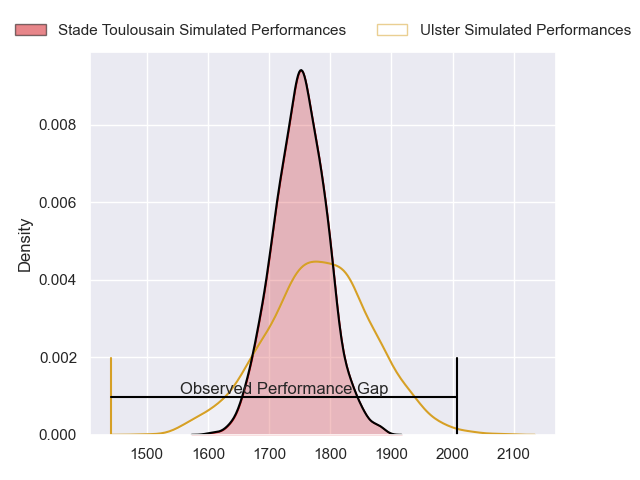
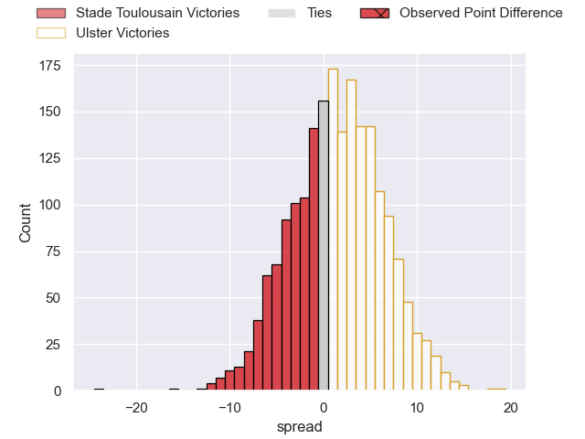
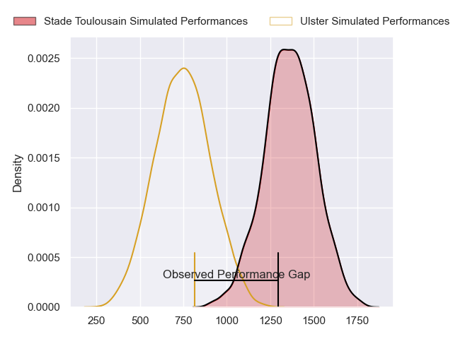
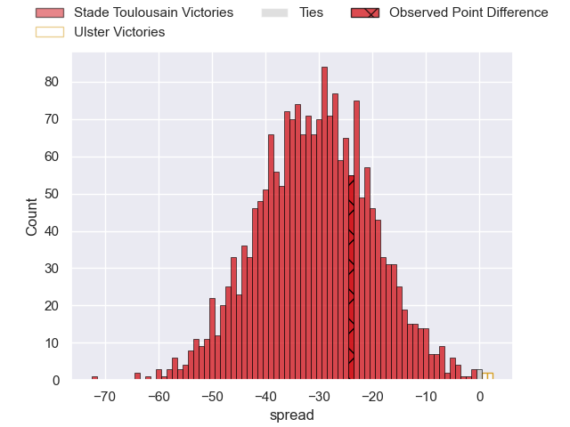
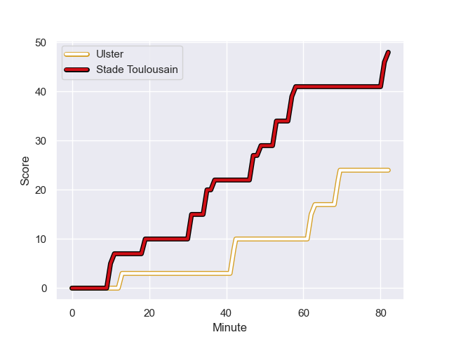
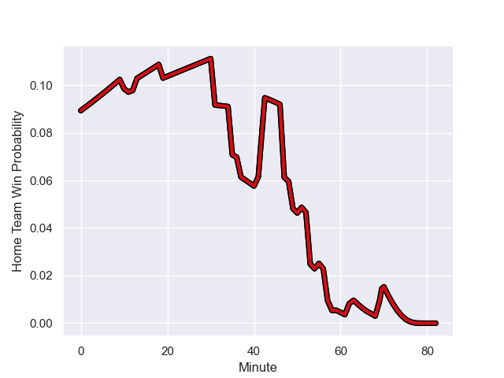

---  
layout: page  
title: Stade Toulousain at Ulster; 48-24  
date: 2024-01-13 18:00:00 -0500  
categories: "European Rugby Champions Cup 2023" match review  
---
# Stade Toulousain at Ulster; 48-24

# Club Level Predictions

The first set of predictions treats a club as the smallest object, as the club develops its members, organizes a gameplan, and deploys its players as needed for each match. This club model has a prediction of 0.546, which translates to predicting Ulster to win by 1.6.

Our Over/Under is 48.5 - and combined with the spread above, we have a predicted scoreline of 23 to 25

Each club has a rating and a rating deviation (similar to a Glicko rating), and expected performances can be generated. This allows for simulated matches and spreads like the ones below.
## Projected Performances - Club Model

## Projected Spreads - Club Model

## Projected Results - Club Model

# Player Level Predictions - Version 2

Treating teams instead as an entity made up of the currently active players, I have ratings for each player in an altogether different system. These can be combined to form team ratings once teamsheets are announced, weighting starters a bit higher than the reserves. After the match is played, players can be weighted by their minutes on the field, allowing for an accurate measure of the team's composition. With these compiled team ratings, we can make predictions, measure inaccuracy, and update the individual player ratings.
## Prediction with Player Minutes: Stade Toulousain by 25.4

Stade Toulousain by 31.3 on a neutral field
## Prediction without Player Minutes: Stade Toulousain by 25.7

Stade Toulousain by 31.6 on a neutral pitch

## Projected Performances - Player Model

## Projected Spreads - Player Model

## Projected Results - Player Model

## Scores over Time

## Win Probability over Time

There were 1 large changes in win probability in this match

|   Away Minutes | Away Player         |   Away elo |   Number |   Home elo | Home Player       |   Home Minutes |
|---------------:|:--------------------|-----------:|---------:|-----------:|:------------------|---------------:|
|             51 | Cyril Baille        |      96.5  |        1 |      64.99 | Steven Kitshoff   |             63 |
|             55 | Peato Mauvaka       |     105.05 |        2 |       0.67 | Tom Stewart       |             55 |
|             41 | Dorian Aldegheri    |     103.96 |        3 |      27.98 | Tom O'Toole       |             55 |
|             82 | Richie Arnold       |      30.04 |        4 |      27.44 | Kieran Treadwell  |             82 |
|             82 | Emmanuel Meafou     |      65.59 |        5 |      78.83 | Iain Henderson    |             82 |
|             82 | Francois Cros       |     117.32 |        6 |      46.65 | Dave Ewers        |              8 |
|             55 | Anthony Jelonch     |     128.14 |        7 |      46.65 | Sean Reffell      |             42 |
|             59 | Alexandre Roumat    |      46.65 |        8 |      41.25 | Nick Timoney      |             82 |
|             70 | Antoine Dupont      |     140.99 |        9 |      60.62 | John Cooney       |             55 |
|             59 | Thomas Ramos        |     115.87 |       10 |      40.58 | Billy Burns       |             82 |
|             82 | Matthis Lebel       |     130.42 |       11 |      36.11 | Jacob Stockdale   |             60 |
|             73 | Pita Ahki           |      22.24 |       12 |      38.5  | Stuart McCloskey  |             82 |
|             82 | Dimitri Delibes     |      63.08 |       13 |      28.58 | James Hume        |             82 |
|             82 | Juan Cruz Mallia    |     104.26 |       14 |       5.39 | Robert Baloucoune |             82 |
|             82 | Blair Kinghorn      |     157.9  |       15 |      46.65 | Mike Lowry        |             82 |
|             27 | Julien Marchand     |      95.82 |       16 |      30.18 | John Andrew       |             27 |
|             31 | David Ainu'u        |      59.13 |       17 |      36.37 | Andrew Warwick    |             19 |
|             41 | Nepo Laulala        |      71.82 |       18 |      70.87 | Marty Moore       |             27 |
|             23 | Joshua Brennan      |      48.62 |       19 |      46.65 | Alan O'Connor     |             40 |
|             27 | Jack Willis         |     112.43 |       20 |      46.65 | Matty Rea         |             74 |
|             12 | Paul Graou          |      46.65 |       21 |      32.32 | Nathan Doak       |             27 |
|              9 | Santiago Chocobares |      46.65 |       22 |      83.01 | Luke Marshall     |              0 |
|             23 | Setareki Bituniyata |      46.65 |       23 |      46.11 | Will Addison      |             22 |

