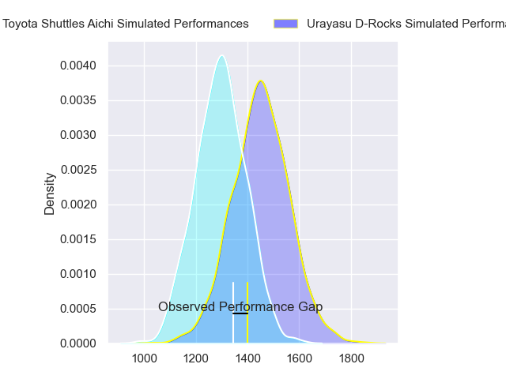
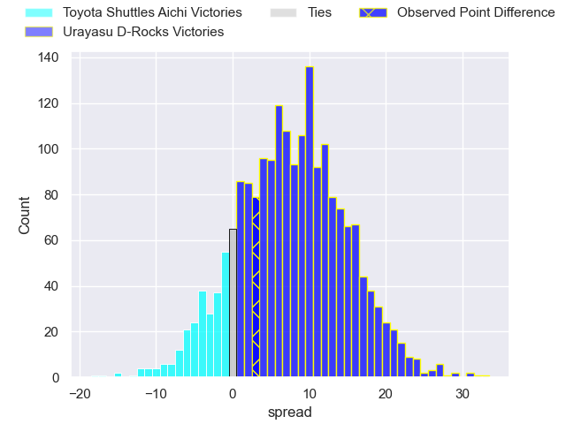
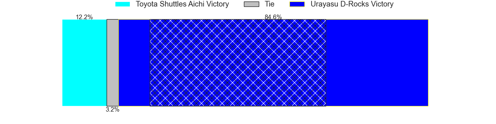
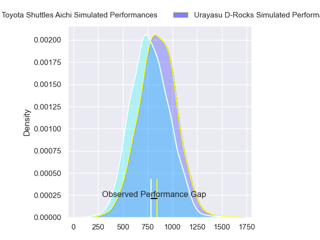
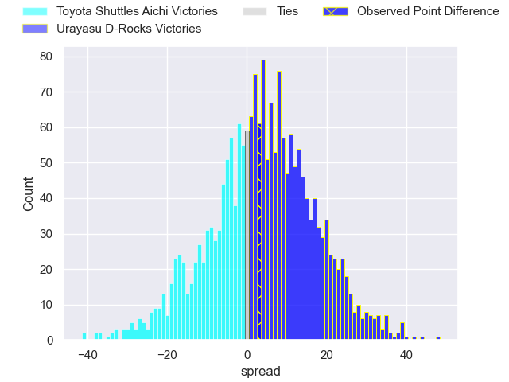
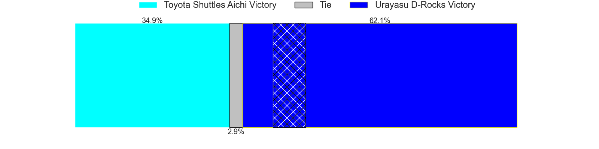
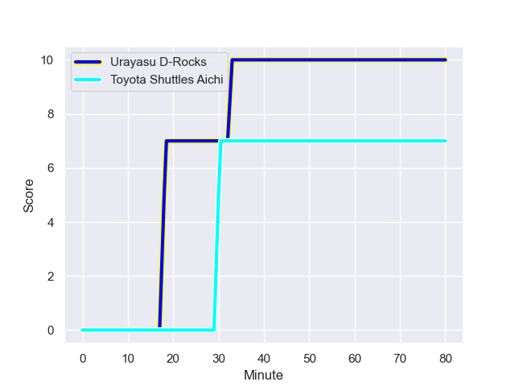
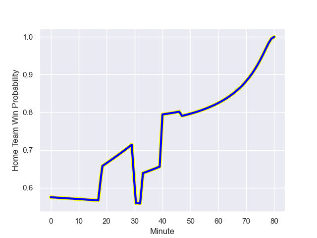

---  
layout: page  
title: Toyota Shuttles Aichi at Urayasu D-Rocks; 7-10  
date: 2024-01-13 18:00:00 -0500  
categories: "Japan Rugby League One D2 2023" match review  
---
# Toyota Shuttles Aichi at Urayasu D-Rocks; 7-10

# Club Level Predictions

The first set of predictions treats a club as the smallest object, as the club develops its members, organizes a gameplan, and deploys its players as needed for each match. This club model has a prediction of 0.707, which translates to predicting Urayasu D-Rocks to win by 8.0.

Our Over/Under is 53.5 - and combined with the spread above, we have a predicted scoreline of 23 to 31

Each club has a rating and a rating deviation (similar to a Glicko rating), and expected performances can be generated. This allows for simulated matches and spreads like the ones below.
## Projected Performances - Club Model

## Projected Spreads - Club Model

## Projected Results - Club Model

# Player Level Predictions - Version 2

Treating teams instead as an entity made up of the currently active players, I have ratings for each player in an altogether different system. These can be combined to form team ratings once teamsheets are announced, weighting starters a bit higher than the reserves. After the match is played, players can be weighted by their minutes on the field, allowing for an accurate measure of the team's composition. With these compiled team ratings, we can make predictions, measure inaccuracy, and update the individual player ratings.
## Prediction with Player Minutes: Urayasu D-Rocks by 3.4

Urayasu D-Rocks by 0.3 on a neutral field
## Prediction without Player Minutes: Urayasu D-Rocks by 4.1

Urayasu D-Rocks by 0.4 on a neutral pitch

## Projected Performances - Player Model

## Projected Spreads - Player Model

## Projected Results - Player Model

## Scores over Time

## Win Probability over Time

There were 6 large changes in win probability in this match

|   Away Minutes | Away Player       |   Away elo |   Number |   Home elo | Home Player          |   Home Minutes |
|---------------:|:------------------|-----------:|---------:|-----------:|:---------------------|---------------:|
|             80 | Tomoki Minami     |      52.66 |        1 |      23.67 | Kazuma Nishikawa     |             80 |
|             40 | Kei Sato          |      69.66 |        2 |      59.61 | Ryuji Fujimura       |             47 |
|             80 | Ryota Fukamura    |      25.97 |        3 |      32.76 | Syuhei Takeuchi      |             80 |
|             80 | Seta Naivaluwaga  |      37.4  |        4 |      15.94 | Levi Douglas         |             40 |
|             80 | James Gaskell     |      56.41 |        5 |      70.25 | Wimpie van der Walt  |             80 |
|             80 | Kavaia Tagivetaua |      66.21 |        6 |      46.74 | Shin Takeuchi        |             80 |
|             80 | Yamato Matsuoka   |      46.31 |        7 |      82.89 | Liam Gill            |             80 |
|             80 | Taleni Seu        |      69.11 |        8 |      94.34 | Tyler Paul           |             80 |
|             80 | Keita Fujiwara    |      92.8  |        9 |      40.22 | Ren Iinuma           |             80 |
|             80 | Freddie Burns     |      80.23 |       10 |      50.25 | Hayden Cripps        |             80 |
|             80 | Jone Kerevi       |      28.86 |       11 |       0.18 | Kai Ishii            |             80 |
|             80 | James Mollentze   |       8.24 |       12 |      82.97 | Otere Black          |             80 |
|             80 | Hitoshi Matsumoto |      63.05 |       13 |      31.17 | Samisoni Ahokovi Tua |             80 |
|             80 | Go Nakano         |      28.97 |       14 |      84.55 | Takuhei Yasuda       |             80 |
|             80 | Takumi Suzuki     |      63.39 |       15 |      18.67 | Yu Tamura            |             80 |
|             40 | Akito Fujinami    |      37.04 |       16 |      46.97 | Kazuki Ban           |             33 |
|            nan | nan               |     nan    |       17 |      89.18 | Yuta Kojima          |             40 |

