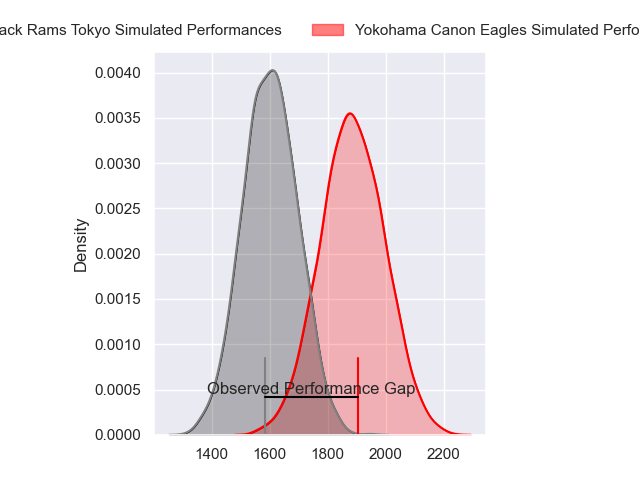
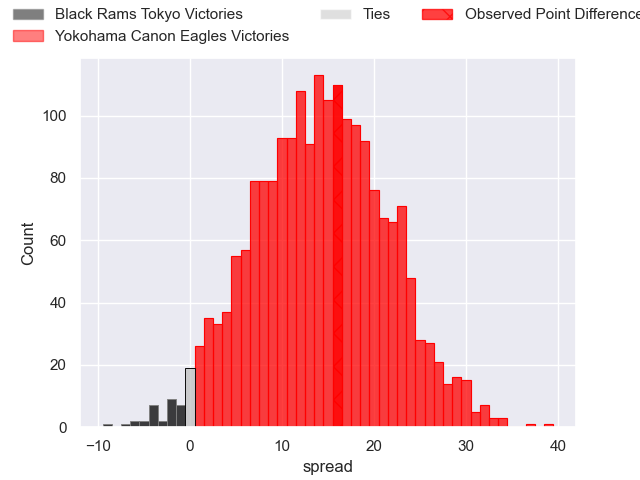
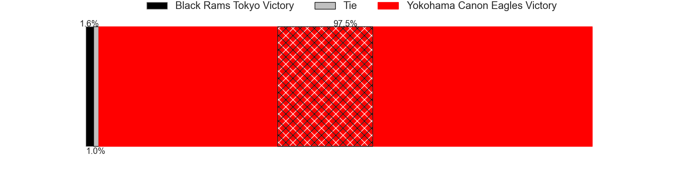
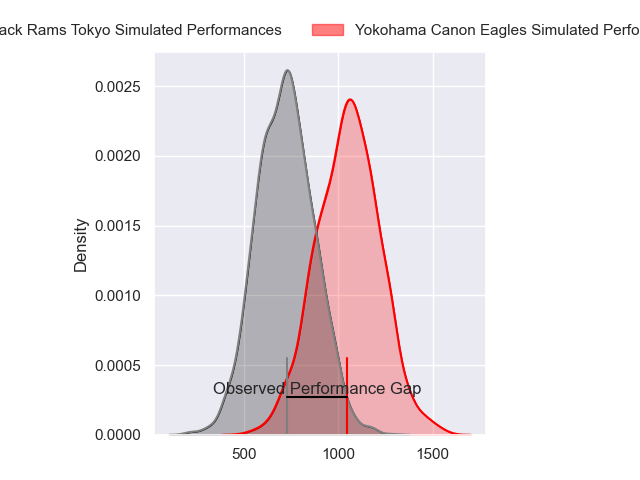
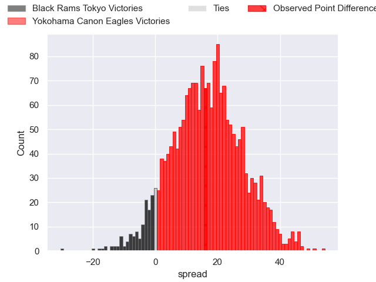
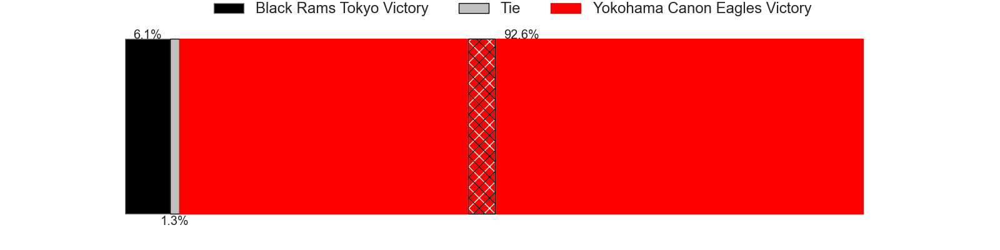
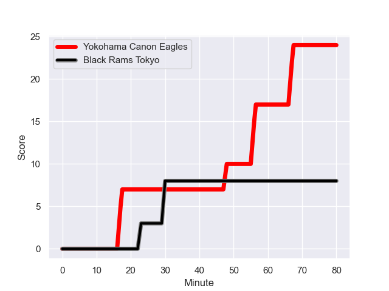
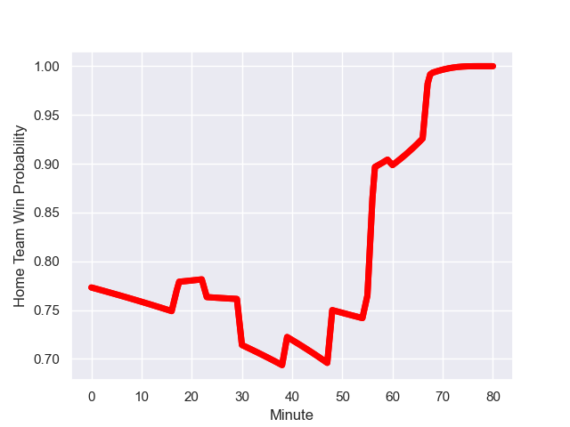

---  
layout: page  
title: Black Rams Tokyo at Yokohama Canon Eagles; 8-24  
date: 2024-01-13 18:00:00 -0500  
categories: "Japan Rugby League One 2023" match review  
---
# Black Rams Tokyo at Yokohama Canon Eagles; 8-24

# Club Level Predictions

The first set of predictions treats a club as the smallest object, as the club develops its members, organizes a gameplan, and deploys its players as needed for each match. This club model has a prediction of 0.831, which translates to predicting Yokohama Canon Eagles to win by 14.4.

Our Over/Under is 52.5 - and combined with the spread above, we have a predicted scoreline of 19 to 34

Each club has a rating and a rating deviation (similar to a Glicko rating), and expected performances can be generated. This allows for simulated matches and spreads like the ones below.
## Projected Performances - Club Model

## Projected Spreads - Club Model

## Projected Results - Club Model

# Player Level Predictions - Version 2

Treating teams instead as an entity made up of the currently active players, I have ratings for each player in an altogether different system. These can be combined to form team ratings once teamsheets are announced, weighting starters a bit higher than the reserves. After the match is played, players can be weighted by their minutes on the field, allowing for an accurate measure of the team's composition. With these compiled team ratings, we can make predictions, measure inaccuracy, and update the individual player ratings.
## Prediction with Player Minutes: Yokohama Canon Eagles by 13.5

Yokohama Canon Eagles by 9.9 on a neutral field
## Prediction without Player Minutes: Yokohama Canon Eagles by 10.9

Yokohama Canon Eagles by 7.2 on a neutral pitch

## Projected Performances - Player Model

## Projected Spreads - Player Model

## Projected Results - Player Model

## Scores over Time

## Win Probability over Time

There were 6 large changes in win probability in this match

|   Away Minutes | Away Player        |   Away elo |   Number |   Home elo | Home Player       |   Home Minutes |
|---------------:|:-------------------|-----------:|---------:|-----------:|:------------------|---------------:|
|             60 | Yuichiro Taniguchi |      73.15 |        1 |      53.17 | Chang Ho Ahn      |             39 |
|             60 | Ko Sato            |      71.7  |        2 |      25.32 | Yusuke Niwai      |             68 |
|             57 | Paddy Ryan         |      42.66 |        3 |       2.57 | Tatsuro Sugimoto  |             55 |
|             80 | Mike Stolberg      |     -16.81 |        4 |      71.3  | Max Douglas       |             80 |
|             68 | Pohiva Lotoahea    |      53.97 |        5 |      51.17 | Matt Philip       |             80 |
|             80 | Talau Fakatava     |      63.63 |        6 |      51.24 | Kobus Van Dyk     |             80 |
|             80 | Shuhei Matsuhashi  |      65.08 |        7 |      30.19 | Naoto Shimada     |             61 |
|             63 | Nathan Hughes      |      91.2  |        8 |      70.48 | Amanaki Mafi      |             55 |
|             72 | Toshiya Takahashi  |      50.75 |        9 |      50.24 | Kafazumi Yamasuga |             69 |
|             60 | Ichigo Nakakusu    |      46.65 |       10 |      18.67 | Yu Tamura         |             80 |
|             80 | Netani Vakayalia   |      69.99 |       11 |     113.14 | Viliame Takayawa  |             77 |
|             80 | Yuta Kurihara      |      21.16 |       12 |      47.47 | Ryo Tabata        |             80 |
|             80 | Viliami Lolohea    |      -5.31 |       13 |     129.34 | Jesse Kriel       |             80 |
|             57 | Daisuke Nishikawa  |      30.52 |       14 |      92.97 | Inoke Burua       |             80 |
|             80 | Isaac Lucas        |      60.22 |       15 |     115.63 | Jumpei Ogura      |             80 |
|             23 | Semisi Tupou       |      60.63 |       16 |     103.04 | Takato Okabe      |             41 |
|             23 | Shohei Oyama       |      46.62 |       17 |      52.56 | Ryosuke Iwaihara  |             25 |
|             20 | Kazuma Nishi       |      62.37 |       18 |      74.25 | Sione Halasili    |             25 |
|             20 | Kazuhiro Koike     |      43.36 |       19 |       3.69 | Liaki Moli        |             19 |
|             20 | Matt McGahan       |      80.39 |       20 |      54.94 | Shunta Nakamura   |             12 |
|             17 | Brodi McCurran     |      84.86 |       21 |      46.92 | Toshiki Amano     |             11 |
|             12 | Josh Goodhue       |      43.09 |       22 |      46.65 | Ryu Fukuhara      |              3 |
|              8 | Takanobu Minami    |      30.81 |       23 |     nan    | nan               |            nan |

