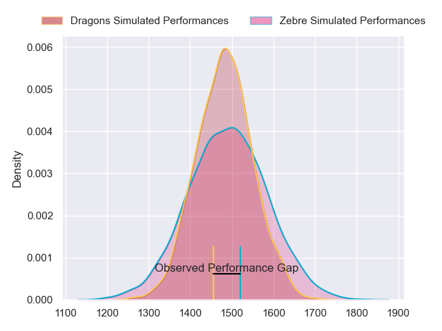
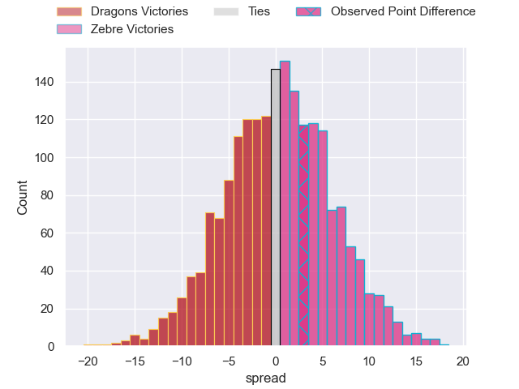
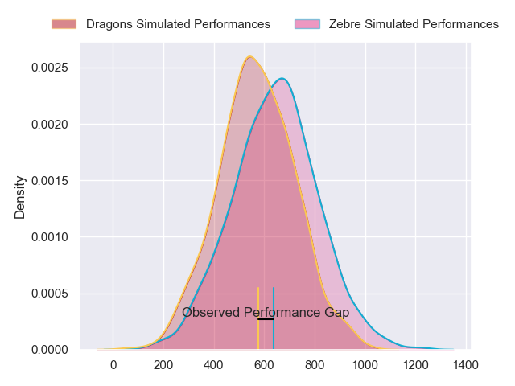
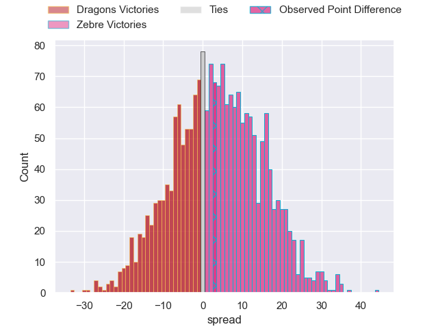
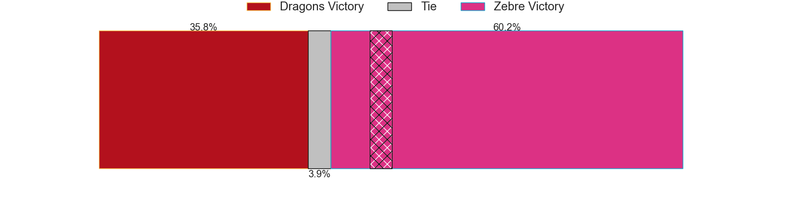
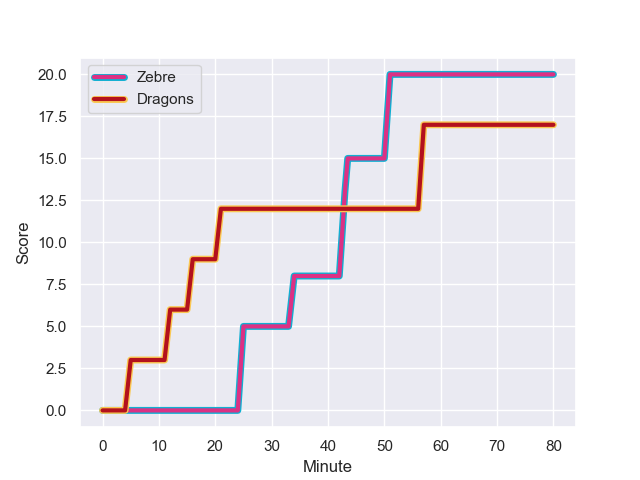
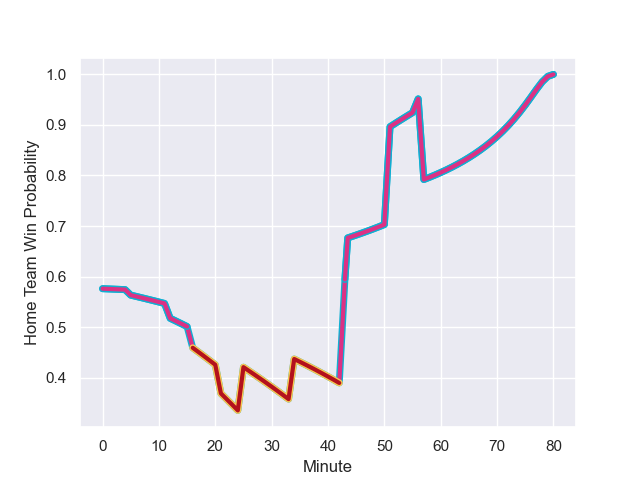

---  
layout: page  
title: Dragons at Zebre; 17-20  
date: 2024-01-13 18:00:00 -0500  
categories: "European Rugby Challenge Cup 2023" match review  
---
# Dragons at Zebre; 17-20

# Club Level Predictions

The first set of predictions treats a club as the smallest object, as the club develops its members, organizes a gameplan, and deploys its players as needed for each match. This club model has a prediction of 0.506, which translates to predicting Zebre to win by 0.2.

Our Over/Under is 51.5 - and combined with the spread above, we have a predicted scoreline of 26 to 26

Each club has a rating and a rating deviation (similar to a Glicko rating), and expected performances can be generated. This allows for simulated matches and spreads like the ones below.
## Projected Performances - Club Model

## Projected Spreads - Club Model

## Projected Results - Club Model

# Player Level Predictions - Version 2

Treating teams instead as an entity made up of the currently active players, I have ratings for each player in an altogether different system. These can be combined to form team ratings once teamsheets are announced, weighting starters a bit higher than the reserves. After the match is played, players can be weighted by their minutes on the field, allowing for an accurate measure of the team's composition. With these compiled team ratings, we can make predictions, measure inaccuracy, and update the individual player ratings.
## Prediction with Player Minutes: Zebre by 3.4

Dragons by 1.1 on a neutral field
## Prediction without Player Minutes: Zebre by 2.3

Dragons by 2.2 on a neutral pitch

## Projected Performances - Player Model

## Projected Spreads - Player Model

## Projected Results - Player Model

## Scores over Time

## Win Probability over Time

There were 10 large changes in win probability in this match

|   Away Minutes | Away Player      |   Away elo |   Number |   Home elo | Home Player            |   Home Minutes |
|---------------:|:-----------------|-----------:|---------:|-----------:|:-----------------------|---------------:|
|             60 | Rhodri Jones     |      26.66 |        1 |      53.3  | Danilo Fischetti       |             64 |
|             52 | James Benjamin   |      32.64 |        2 |       8.92 | Marco Manfredi         |             64 |
|             52 | Luke Yendle      |      53.24 |        3 |      -3.52 | Matteo Nocera          |             61 |
|             80 | Sean Lonsdale    |      34.94 |        4 |       3.82 | Leonard Krumov         |             61 |
|             56 | George Nott      |      28.19 |        5 |      34.67 | Andrea Zambonin        |             80 |
|             52 | Dan Lydiate      |      64.06 |        6 |      60.79 | Guido Volpi            |             80 |
|             80 | Harrison Keddie  |     -30.45 |        7 |      12.49 | Iacopo Bianchi         |             80 |
|             80 | Aaron Wainwright |      80.03 |        8 |      37.27 | Davide Ruggeri         |             61 |
|             52 | Rhodri Williams  |      78.36 |        9 |      24.94 | Gonzalo Jesus Garcia   |             78 |
|             80 | Will Reed        |      45.02 |       10 |      -0.8  | Giovanni Montemauri    |             80 |
|             80 | Jared Rosser     |      14.78 |       11 |      11.35 | Simone Gesi            |             76 |
|             56 | Harri Ackerman   |      47.14 |       12 |      83.36 | Enrico Lucchin         |             80 |
|             80 | Aneurin Owen     |      53.51 |       13 |     109.11 | Luca Morisi            |             80 |
|             80 | Rio Dyer         |      24.81 |       14 |      44.51 | Pierre Bruno           |             80 |
|             80 | Cai Evans        |      26.82 |       15 |      23.67 | Lorenzo Pani           |             68 |
|             20 | Rodrigo Martinez |      58.56 |       16 |      30.64 | Luca Rizzoli           |             16 |
|             28 | Chris Coleman    |      37.49 |       17 |      40.44 | Juan Manuel Pitinari   |             19 |
|             28 | Bradley Roberts  |      35.79 |       18 |      32.54 | Giampietro Ribaldi     |             16 |
|             24 | Matthew Screech  |     -13.18 |       19 |      55.47 | Matteo Canali          |             19 |
|             28 | Ollie Griffiths  |      86.17 |       20 |      45.11 | Giacomo Ferrari        |             19 |
|             28 | Dane Blacker     |      17.49 |       21 |      47.26 | Thomas Dominguez       |              2 |
|             24 | Steffan Hughes   |      88.08 |       22 |      88.49 | Geronimo Prisciantelli |             12 |
|            nan | nan              |     nan    |       23 |      68.8  | Scott Gregory          |              4 |

