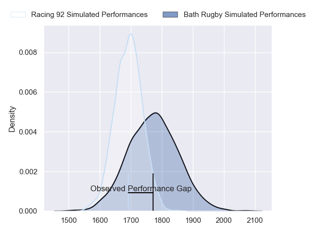
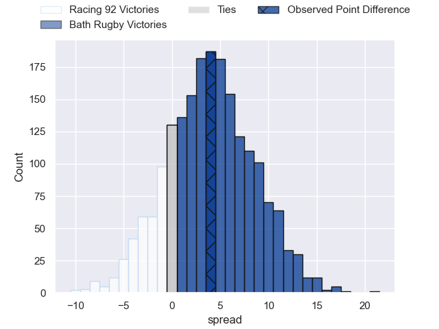
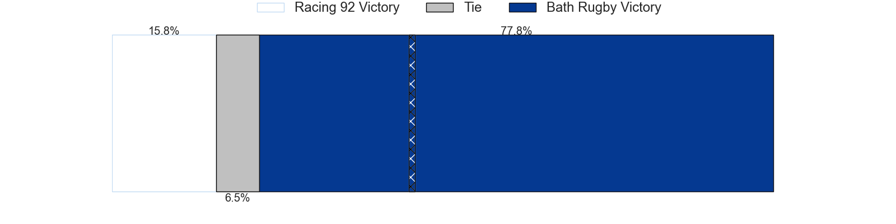
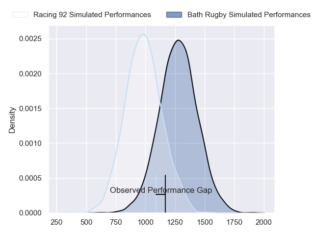
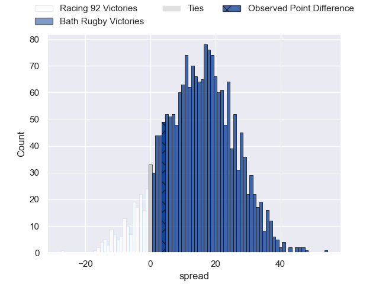
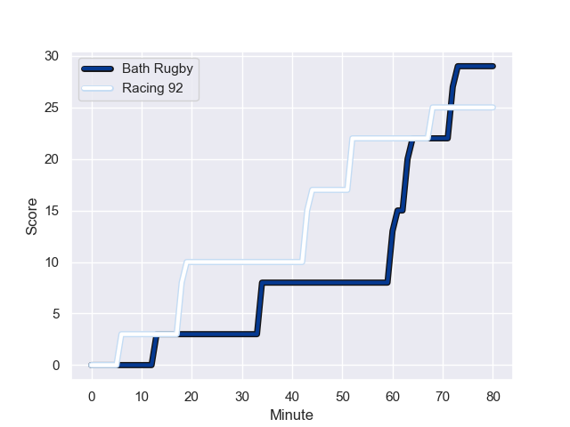
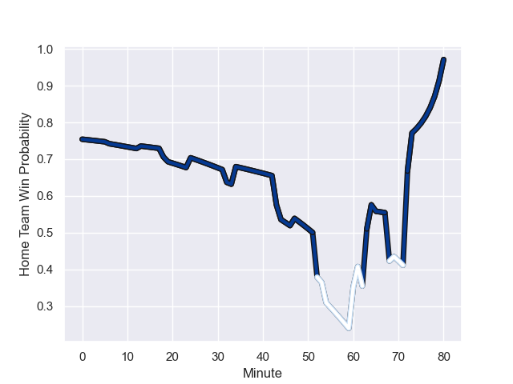

---  
layout: page  
title: Racing 92 at Bath Rugby; 25-29  
date: 2024-01-14 18:00:00 -0500  
categories: "European Rugby Champions Cup 2023" match review  
---
# Racing 92 at Bath Rugby; 25-29

# Club Level Predictions

The first set of predictions treats a club as the smallest object, as the club develops its members, organizes a gameplan, and deploys its players as needed for each match. This club model has a prediction of 0.614, which translates to predicting Bath Rugby to win by 4.1.

Our Over/Under is 59.5 - and combined with the spread above, we have a predicted scoreline of 28 to 32

Each club has a rating and a rating deviation (similar to a Glicko rating), and expected performances can be generated. This allows for simulated matches and spreads like the ones below.
## Projected Performances - Club Model

## Projected Spreads - Club Model

## Projected Results - Club Model

# Player Level Predictions - Version 2

Treating teams instead as an entity made up of the currently active players, I have ratings for each player in an altogether different system. These can be combined to form team ratings once teamsheets are announced, weighting starters a bit higher than the reserves. After the match is played, players can be weighted by their minutes on the field, allowing for an accurate measure of the team's composition. With these compiled team ratings, we can make predictions, measure inaccuracy, and update the individual player ratings.
## Prediction with Player Minutes: Bath Rugby by 12.3

Bath Rugby by 4.6 on a neutral field
## Prediction without Player Minutes: Bath Rugby by 13.1

Bath Rugby by 5.4 on a neutral pitch

## Projected Performances - Player Model

## Projected Spreads - Player Model

## Projected Results - Player Model

## Scores over Time

## Win Probability over Time

There were 18 large changes in win probability in this match

|   Away Minutes | Away Player        |   Away elo |   Number |   Home elo | Home Player      |   Home Minutes |
|---------------:|:-------------------|-----------:|---------:|-----------:|:-----------------|---------------:|
|             52 | Hassane Kolingar   |      42.29 |        1 |      78.63 | Beno Obano       |             62 |
|             52 | Camille Chat       |     108.85 |        2 |     119.19 | Tom Dunn         |             54 |
|             52 | Thomas Laclayat    |      46.65 |        3 |      97.55 | Thomas du Toit   |             62 |
|             61 | Cameron Woki       |      68.02 |        4 |      94.47 | Quinn Roux       |             54 |
|             80 | Will Rowlands      |      39.73 |        5 |      54.1  | Charlie Ewels    |             80 |
|             69 | Wenceslas Lauret   |      46.65 |        6 |      54.01 | GJ van Velze     |             54 |
|             80 | Siya Kolisi        |     108.39 |        7 |     114.36 | Miles Reid       |             69 |
|             47 | Kitione Kamikamica |      92.67 |        8 |      55.15 | Alfie Barbeary   |             80 |
|             80 | Nolann Le Garrec   |      71.37 |        9 |      44.46 | Ben Spencer      |             80 |
|             80 | Antoine Gibert     |      94.05 |       10 |     162.37 | Finn Russell     |             80 |
|             80 | Henry Arundell     |      43.26 |       11 |      -0.8  | Will Muir        |             72 |
|             73 | Henry Chavancy     |      46.65 |       12 |      66.45 | Cameron Redpath  |             80 |
|             80 | Gael Fickou        |      97.53 |       13 |      65.27 | Ollie Lawrence   |             80 |
|             80 | Vinaya Habosi      |      46.65 |       14 |     100.62 | Joe Cokanasiga   |             80 |
|             65 | Max Spring         |      46.65 |       15 |      28.07 | Tom de Glanville |             80 |
|             28 | Janick Tarrit      |      46.65 |       16 |      55.26 | Niall Annett     |             26 |
|             28 | Eddy Ben Arous     |     103.3  |       17 |      35.9  | Juan Schoeman    |             18 |
|             28 | Trevor Nyakane     |      51.57 |       18 |      37.15 | Will Stuart      |             18 |
|             19 | Boris Palu         |      46.65 |       19 |      84.39 | Elliott Stooke   |             26 |
|             33 | Maxime Baudonne    |      42.03 |       20 |      36.7  | Josh Bayliss     |             26 |
|             11 | Ibrahim Diallo     |      31.27 |       21 |      46.37 | Louis Schreuder  |              0 |
|             15 | Tristan Tedder     |      87.38 |       22 |      47.3  | Sam Harris       |              8 |
|              7 | Francis Saili      |      46.65 |       23 |     164.01 | Chris Cloete     |             11 |

