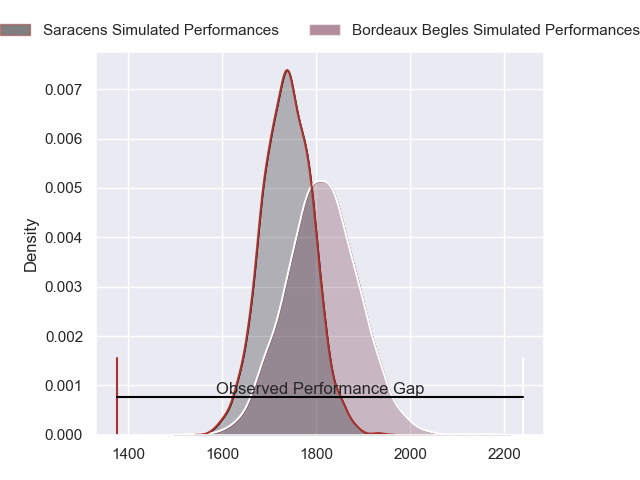
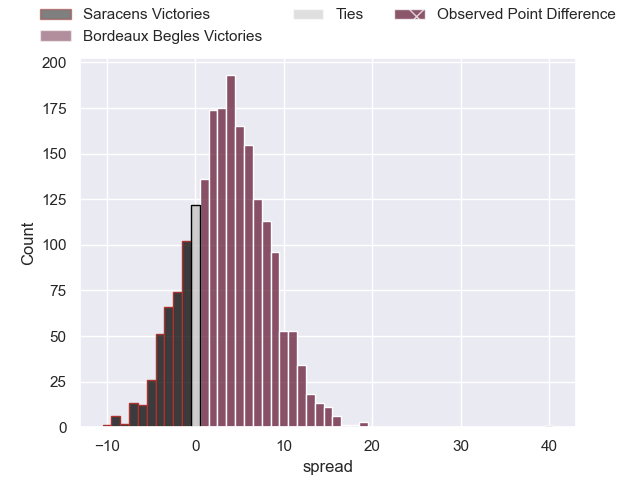
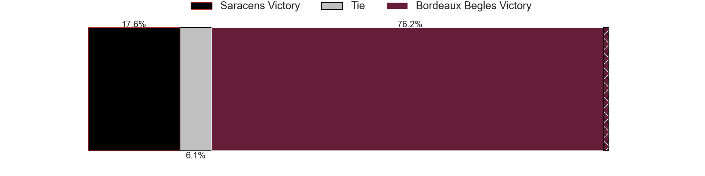
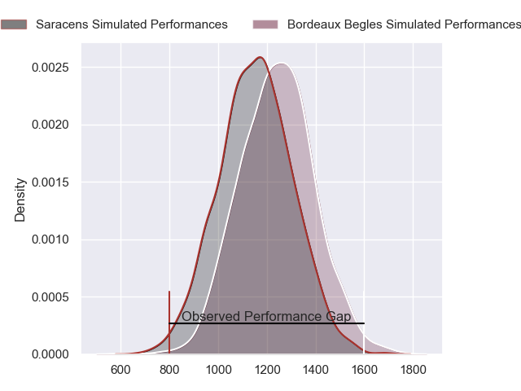
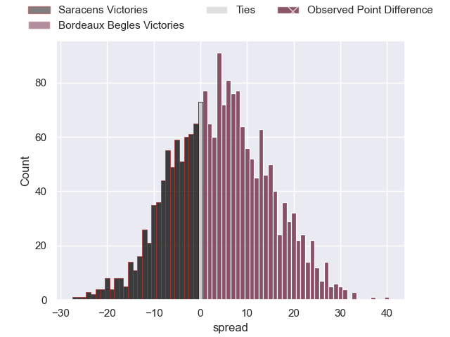
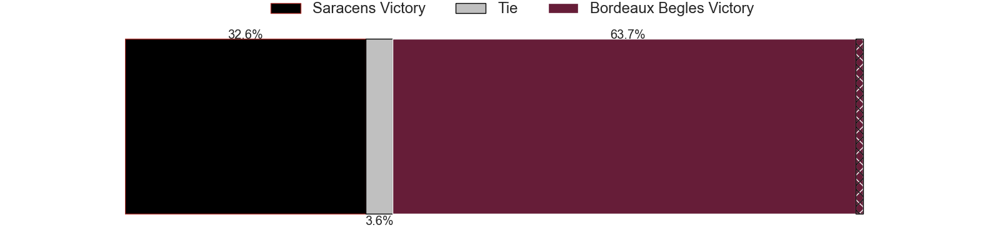
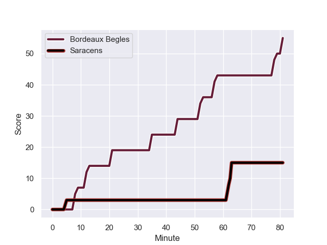
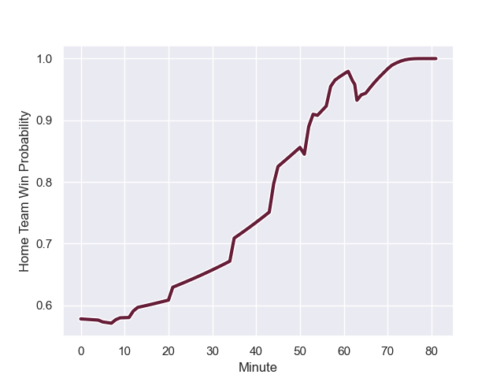

---  
layout: page  
title: Saracens at Bordeaux Begles; 15-55  
date: 2024-01-14 18:00:00 -0500  
categories: "European Rugby Champions Cup 2023" match review  
---
# Saracens at Bordeaux Begles; 15-55

# Club Level Predictions

The first set of predictions treats a club as the smallest object, as the club develops its members, organizes a gameplan, and deploys its players as needed for each match. This club model has a prediction of 0.6, which translates to predicting Bordeaux Begles to win by 3.6.

Our Over/Under is 46.5 - and combined with the spread above, we have a predicted scoreline of 21 to 25

Each club has a rating and a rating deviation (similar to a Glicko rating), and expected performances can be generated. This allows for simulated matches and spreads like the ones below.
## Projected Performances - Club Model

## Projected Spreads - Club Model

## Projected Results - Club Model

# Player Level Predictions - Version 2

Treating teams instead as an entity made up of the currently active players, I have ratings for each player in an altogether different system. These can be combined to form team ratings once teamsheets are announced, weighting starters a bit higher than the reserves. After the match is played, players can be weighted by their minutes on the field, allowing for an accurate measure of the team's composition. With these compiled team ratings, we can make predictions, measure inaccuracy, and update the individual player ratings.
## Prediction with Player Minutes: Bordeaux Begles by 3.5

Saracens by 3.9 on a neutral field
## Prediction without Player Minutes: Bordeaux Begles by 5.0

Saracens by 2.4 on a neutral pitch

## Projected Performances - Player Model

## Projected Spreads - Player Model

## Projected Results - Player Model

## Scores over Time

## Win Probability over Time

There were 6 large changes in win probability in this match

|   Away Minutes | Away Player          |   Away elo |   Number |   Home elo | Home Player               |   Home Minutes |
|---------------:|:---------------------|-----------:|---------:|-----------:|:--------------------------|---------------:|
|             45 | Logovi'i Mulipola    |     104.71 |        1 |      56.35 | Jefferson Poirot          |             60 |
|             74 | Theo Dan             |      54.99 |        2 |      61.35 | Maxime Lamothe            |             72 |
|             45 | Christian Judge      |      57.74 |        3 |     119.62 | Ben Tameifuna             |             51 |
|             81 | Maro Itoje           |     126.88 |        4 |      82.06 | Guido Petti               |             58 |
|             54 | Hugh Tizard          |      41.21 |        5 |     138.33 | Adam Coleman              |             62 |
|             81 | Nick Isiekwe         |      80.67 |        6 |     107.48 | Pierre Bochaton           |             81 |
|             81 | Andy Christie        |      36.23 |        7 |      55.47 | Marko Gazzotti            |             58 |
|             62 | Ben Earl             |     105.1  |        8 |      72.38 | Pete Samu                 |             81 |
|             70 | Ivan van Zyl         |      71.62 |        9 |      46.65 | Maxime Lucu               |             60 |
|             81 | Owen Farrell         |     130.54 |       10 |      46.65 | Matthieu Jalibert         |             81 |
|             54 | Sean Maitland        |      73.29 |       11 |      78.19 | Louis Bielle-Biarrey      |             81 |
|             81 | Nick Tompkins        |     100.97 |       12 |      46.65 | Yoram Moefana             |             81 |
|             71 | Elliot Daly          |      80.85 |       13 |      70.4  | Nicolas Depoortere        |             81 |
|             81 | Alex Lewington       |      61.68 |       14 |      46.65 | Damian Penaud             |             81 |
|             81 | Alex Goode           |      63.22 |       15 |     124.99 | Romain Buros              |             65 |
|              7 | James Hadfield       |      46.65 |       16 |      46.65 | Romain Latterrade         |              9 |
|             36 | Sam Crean            |      47.76 |       17 |      80.32 | Ugo Boniface              |             21 |
|             36 | Alec Clarey          |      26.85 |       18 |      28.7  | Carlu Sadie               |             30 |
|             27 | Billy Vunipola       |     140.94 |       19 |      27.93 | Kane Douglas              |             19 |
|             19 | Juan Martin Gonzalez |      93.92 |       20 |      46.65 | Bastien Vergnes Taillefer |             23 |
|             11 | Gareth Simpson       |      31.03 |       21 |      46.65 | Antoine Miquel            |             23 |
|             10 | Olly Hartley         |      20.19 |       22 |      21.47 | Paul Abadie               |             21 |
|             27 | Rotimi Segun         |      42.01 |       23 |      36.46 | Pablo Uberti              |             16 |

