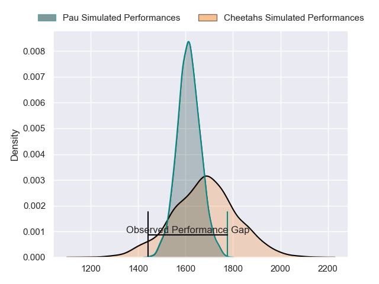
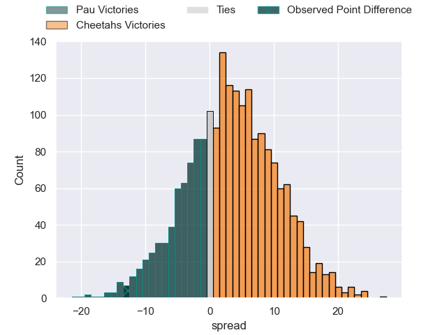
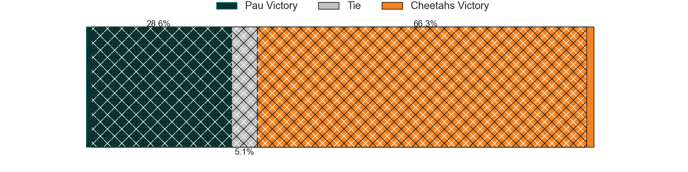
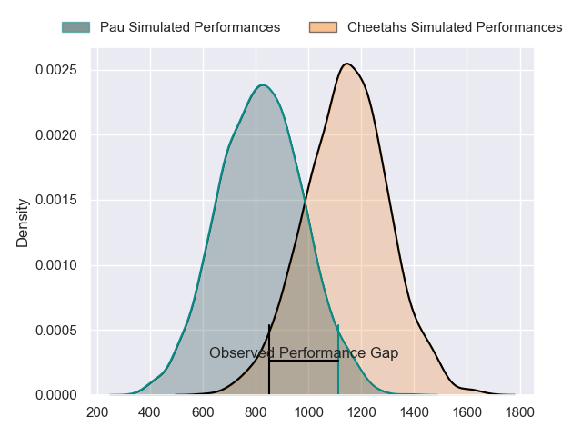
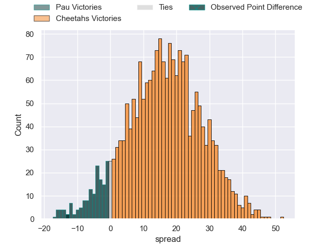
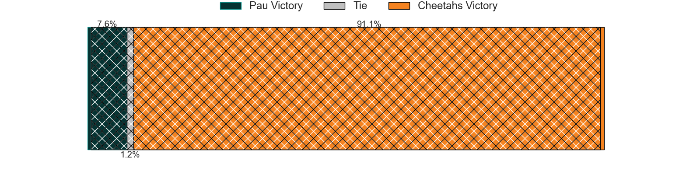
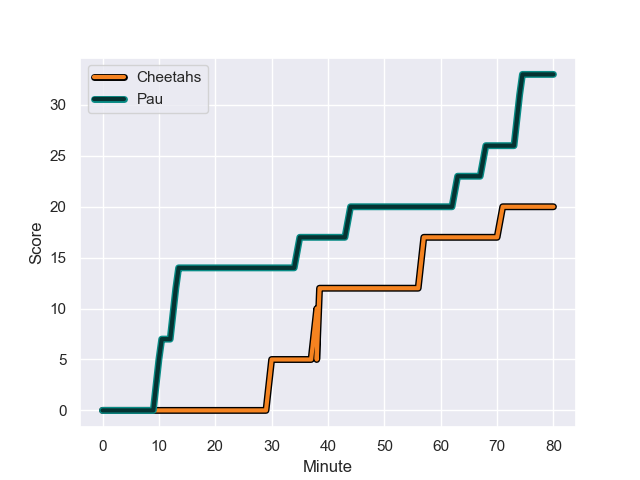
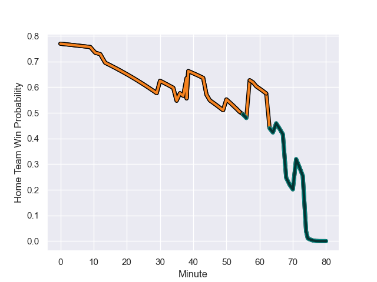

---  
layout: page  
title: Pau at Cheetahs; 33-20  
date: 2024-01-14 18:00:00 -0500  
categories: "European Rugby Challenge Cup 2023" match review  
---
# Pau at Cheetahs; 33-20

# Club Level Predictions

The first set of predictions treats a club as the smallest object, as the club develops its members, organizes a gameplan, and deploys its players as needed for each match. This club model has a prediction of 0.599, which translates to predicting Cheetahs to win by 3.5.

Our Over/Under is 48.5 - and combined with the spread above, we have a predicted scoreline of 22 to 26

Each club has a rating and a rating deviation (similar to a Glicko rating), and expected performances can be generated. This allows for simulated matches and spreads like the ones below.
## Projected Performances - Club Model

## Projected Spreads - Club Model

## Projected Results - Club Model

# Player Level Predictions - Version 2

Treating teams instead as an entity made up of the currently active players, I have ratings for each player in an altogether different system. These can be combined to form team ratings once teamsheets are announced, weighting starters a bit higher than the reserves. After the match is played, players can be weighted by their minutes on the field, allowing for an accurate measure of the team's composition. With these compiled team ratings, we can make predictions, measure inaccuracy, and update the individual player ratings.
## Prediction with Player Minutes: Cheetahs by 13.3

Cheetahs by 9.0 on a neutral field
## Prediction without Player Minutes: Cheetahs by 13.4

Cheetahs by 9.1 on a neutral pitch

## Projected Performances - Player Model

## Projected Spreads - Player Model

## Projected Results - Player Model

## Scores over Time

## Win Probability over Time

There were 18 large changes in win probability in this match

|   Away Minutes | Away Player              |   Away elo |   Number |   Home elo | Home Player                    |   Home Minutes |
|---------------:|:-------------------------|-----------:|---------:|-----------:|:-------------------------------|---------------:|
|             50 | Facundo Gigena           |      30.43 |        1 |      32.46 | Schalk Ferreira                |             36 |
|             59 | Romain Ruffenach         |      31.15 |        2 |      73.91 | Louis van der Westhuizen       |             70 |
|             50 | Guram Papidze            |      21.24 |        3 |      30.34 | Aranos Coetzee                 |             36 |
|             55 | Guillaume Ducat          |      14.58 |        4 |      70.73 | Rynier Bernardo                |             80 |
|             80 | Fabrice Metz             |      79.36 |        5 |      74.3  | Victor Kutlwano Sekekete       |             78 |
|             80 | Martin Puech             |      52.42 |        6 |      86.23 | Gideon van der Merwe           |             65 |
|             59 | Mehdi Tlili              |      32.06 |        7 |     106.72 | Friedle Olivier                |             80 |
|             80 | Reece Hewat              |      44.68 |        8 |      47.46 | Jeandre Rudolph                |             70 |
|             78 | Dan Robson               |     129.76 |        9 |     117.93 | Ruan Pienaar                   |             80 |
|             68 | Axel Desperes            |      36.68 |       10 |      51.04 | George Lourens                 |             65 |
|             65 | Aminiasi Tuimaba         |      78.78 |       11 |      74.21 | Cohen Jasper                   |             45 |
|             80 | Nathan Decron            |      66.72 |       12 |      95.85 | Reinhardt Fortuin              |             80 |
|             80 | Tumua Manu               |      86.31 |       13 |       1.36 | Evardi Boshoff                 |             80 |
|             80 | Thomas Carol             |      51.87 |       14 |      92.47 | Munier Hartzenberg             |             80 |
|             80 | Jack Maddocks            |      68.62 |       15 |      46.48 | Tapiwa Lloyd Mafura            |             80 |
|             21 | Lucas Rey                |      29.58 |       16 |      82.2  | Alulutho Tshakweni             |             44 |
|             30 | Remi Seneca              |      66.16 |       17 |      55.37 | Hencus van Wyk                 |             44 |
|             30 | Nicolas Corato           |      14.49 |       18 |      79.65 | Marko Louis Janse van Rensburg |             10 |
|             25 | Hugo Auradou             |       8.34 |       19 |      30.15 | Carl Wegner                    |              2 |
|             21 | Paulo Tauiliili-Palesasa |      46.65 |       20 |      75.35 | Daniel Johannes Maartens       |             15 |
|              2 | Thomas Souverbie         |      46.06 |       21 |      74.29 | Sibabalo Qoma                  |             10 |
|             12 | Thibault Debaes          |      48.82 |       22 |     102.28 | Rewan Kruger                   |             15 |
|             15 | Samuel Ezeala            |       3.81 |       23 |      43.99 | Ali Mgijima                    |             35 |

