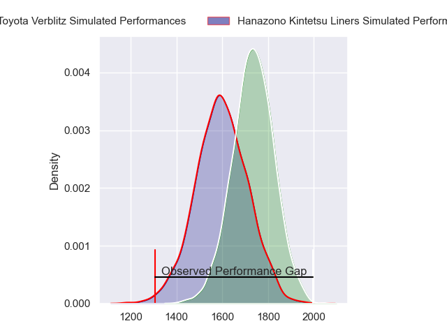
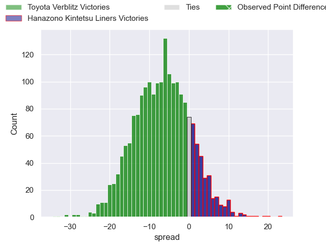
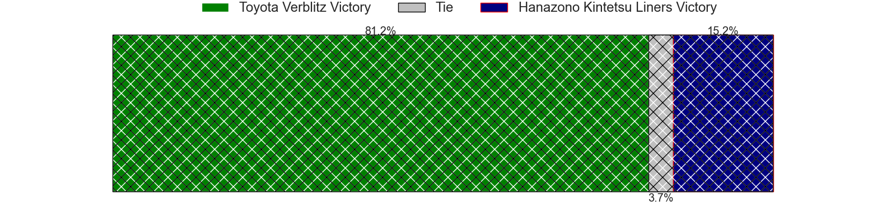
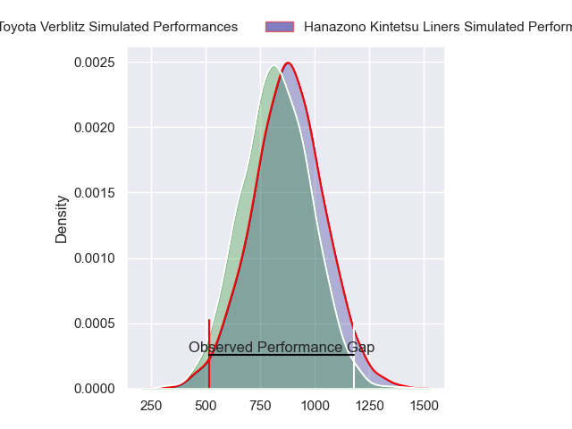
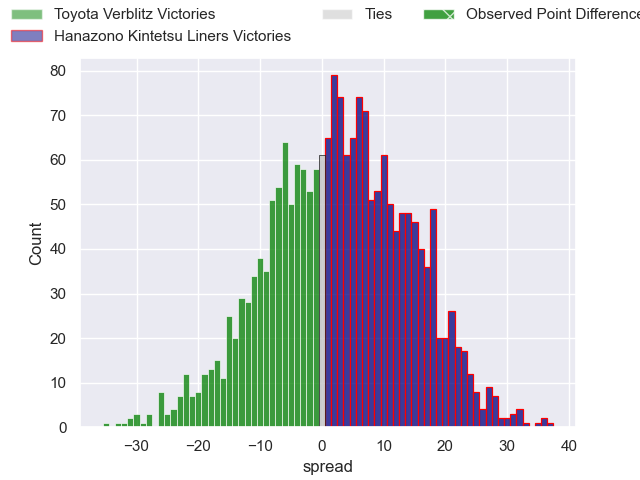
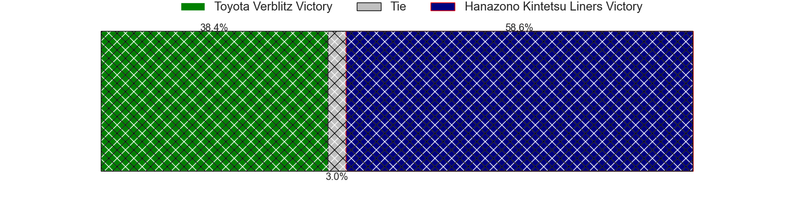
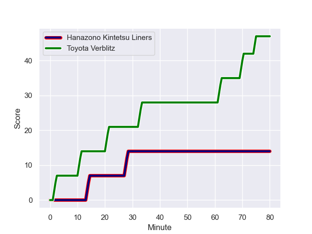
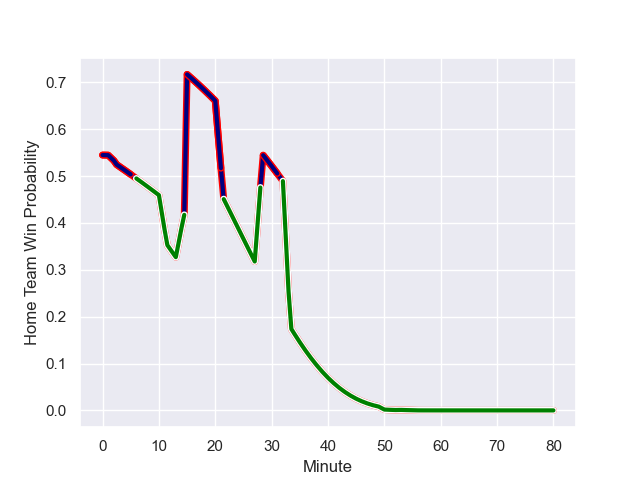

---  
layout: page  
title: Toyota Verblitz at Hanazono Kintetsu Liners; 47-14  
date: 2024-01-14 18:00:00 -0500  
categories: "Japan Rugby League One 2023" match review  
---
# Toyota Verblitz at Hanazono Kintetsu Liners; 47-14

# Club Level Predictions

The first set of predictions treats a club as the smallest object, as the club develops its members, organizes a gameplan, and deploys its players as needed for each match. This club model has a prediction of 0.329, which translates to predicting Toyota Verblitz to win by 6.4.

Our Over/Under is 63.5 - and combined with the spread above, we have a predicted scoreline of 35 to 29

Each club has a rating and a rating deviation (similar to a Glicko rating), and expected performances can be generated. This allows for simulated matches and spreads like the ones below.
## Projected Performances - Club Model

## Projected Spreads - Club Model

## Projected Results - Club Model

# Player Level Predictions - Version 2

Treating teams instead as an entity made up of the currently active players, I have ratings for each player in an altogether different system. These can be combined to form team ratings once teamsheets are announced, weighting starters a bit higher than the reserves. After the match is played, players can be weighted by their minutes on the field, allowing for an accurate measure of the team's composition. With these compiled team ratings, we can make predictions, measure inaccuracy, and update the individual player ratings.
## Prediction with Player Minutes: Hanazono Kintetsu Liners by 2.0

Toyota Verblitz by 1.8 on a neutral field
## Prediction without Player Minutes: Toyota Verblitz by 1.2

Toyota Verblitz by 4.9 on a neutral pitch

## Projected Performances - Player Model

## Projected Spreads - Player Model

## Projected Results - Player Model

## Scores over Time

## Win Probability over Time

There were 11 large changes in win probability in this match

|   Away Minutes | Away Player          |   Away elo |   Number |   Home elo | Home Player       |   Home Minutes |
|---------------:|:---------------------|-----------:|---------:|-----------:|:------------------|---------------:|
|             63 | Shogo Miura          |      55.9  |        1 |      33.14 | Kenta Tanaka      |             60 |
|             63 | Yoshikatsu Hikosaka  |      93.86 |        2 |      39.08 | Keiichi Kaneko    |             50 |
|             63 | Genki Sudo           |      63.94 |        3 |      45.51 | Yuchol Mun        |             70 |
|             63 | Ryusei Koike         |      47.6  |        4 |      10.57 | Tsuyoshi Murata   |             67 |
|             80 | Isaiah Mapusua       |      85.04 |        5 |      34.27 | James Blackwell   |             80 |
|             80 | Pieter-Steph du Toit |      68.31 |        6 |      49.86 | Jed Brown         |             67 |
|             53 | Masato Furukawa      |      47.12 |        7 |      66.49 | Shohei Nonaka     |             80 |
|             80 | Kazuki Himeno        |      48.38 |        8 |      75.09 | Jose Seru         |             80 |
|             15 | Aaron Smith          |     149.43 |        9 |      97.38 | Will Genia        |             67 |
|             80 | Tiaan Falcon         |      65.79 |       10 |     181.89 | Quade Cooper      |             80 |
|             63 | Vatiliai Tuidraki    |      37.84 |       11 |      54.61 | Tomoya Kimura     |             80 |
|             80 | Charlie Lawrence     |      95.98 |       12 |      36.35 | Takumi Yoshimoto  |             80 |
|             80 | Siosaia Fifita       |     -43.63 |       13 |      57.87 | Tom Hendrickson   |             50 |
|             80 | Taichi Takahashi     |      78.54 |       14 |      39.15 | Liekina Kaufusi   |             69 |
|             56 | Dick Wilson          |       9.04 |       15 |       3.21 | Daisuke Noguchi   |             80 |
|             65 | Kenta Fukuda         |      54.67 |       16 |      24.2  | Andrew Makalio    |             30 |
|             27 | Will Tupou           |      10.67 |       17 |       5.81 | Joshua Nohra      |             30 |
|             24 | Rintaro Maruyama     |      59.17 |       18 |      44.6  | Nesta Mahina      |             20 |
|             17 | Ryuhei Arita         |      37.76 |       19 |     -22.11 | Takahito Sugahara |             13 |
|             17 | Ryoma Nishimura      |      62.03 |       20 |      15.1  | Patrick Tafa      |             13 |
|             17 | Shuhei Yamaguchi     |      47.2  |       21 |      39.93 | Keitaro Hitora    |             13 |
|             17 | Shunsuke Asaoka      |      40.85 |       22 |      36.91 | Yoshizumi Takeda  |             11 |
|             17 | Runya Choi           |      85.75 |       23 |      36.56 | Shinki Ushikubo   |             10 |

