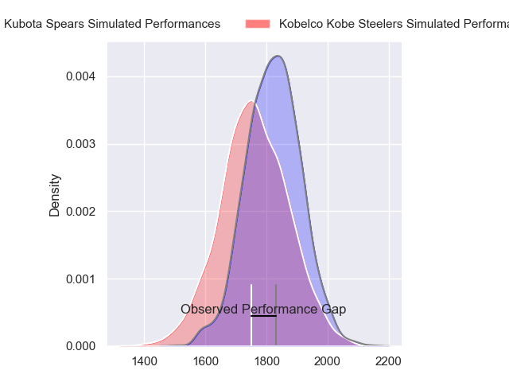
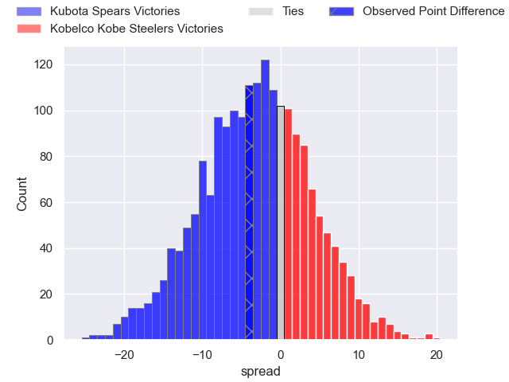
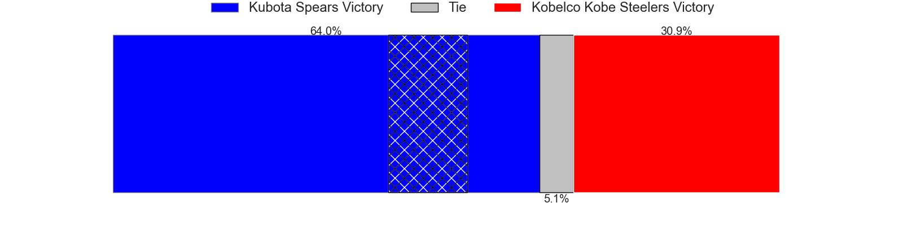
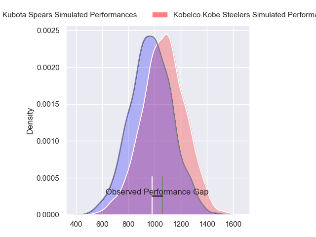
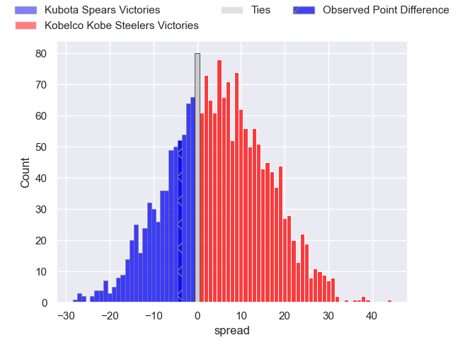
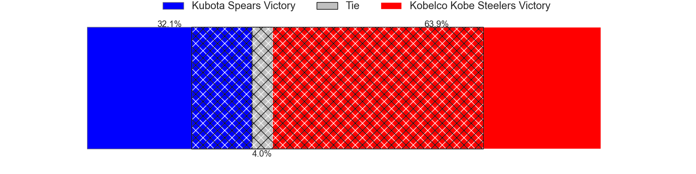
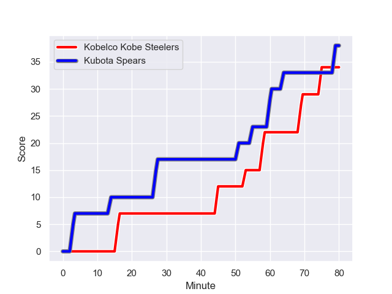
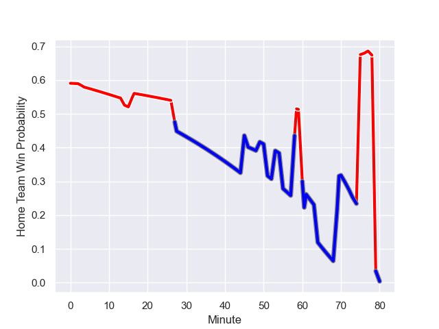

---  
layout: page  
title: Kubota Spears at Kobelco Kobe Steelers; 38-34  
date: 2024-01-14 18:00:00 -0500  
categories: "Japan Rugby League One 2023" match review  
---
# Kubota Spears at Kobelco Kobe Steelers; 38-34

# Club Level Predictions

The first set of predictions treats a club as the smallest object, as the club develops its members, organizes a gameplan, and deploys its players as needed for each match. This club model has a prediction of 0.413, which translates to predicting Kubota Spears to win by 3.2.

Our Over/Under is 62.5 - and combined with the spread above, we have a predicted scoreline of 33 to 30

Each club has a rating and a rating deviation (similar to a Glicko rating), and expected performances can be generated. This allows for simulated matches and spreads like the ones below.
## Projected Performances - Club Model

## Projected Spreads - Club Model

## Projected Results - Club Model

# Player Level Predictions - Version 2

Treating teams instead as an entity made up of the currently active players, I have ratings for each player in an altogether different system. These can be combined to form team ratings once teamsheets are announced, weighting starters a bit higher than the reserves. After the match is played, players can be weighted by their minutes on the field, allowing for an accurate measure of the team's composition. With these compiled team ratings, we can make predictions, measure inaccuracy, and update the individual player ratings.
## Prediction with Player Minutes: Kobelco Kobe Steelers by 4.0

Kubota Spears by 0.2 on a neutral field
## Prediction without Player Minutes: Kobelco Kobe Steelers by 2.9

Kubota Spears by 1.0 on a neutral pitch

## Projected Performances - Player Model

## Projected Spreads - Player Model

## Projected Results - Player Model

## Scores over Time

## Win Probability over Time

There were 20 large changes in win probability in this match

|   Away Minutes | Away Player            |   Away elo |   Number |   Home elo | Home Player              |   Home Minutes |
|---------------:|:-----------------------|-----------:|---------:|-----------:|:-------------------------|---------------:|
|             61 | Kota Kaishi            |      75.94 |        1 |      79.27 | Isileli Nakajima Vakauta |             61 |
|             61 | Dane Coles             |     119.01 |        2 |      47.98 | Kenta Matsuoka           |             61 |
|             66 | Shoya Matsunami        |     -15.15 |        3 |       1.29 | Koo Ji-won               |             61 |
|             46 | Uwe Helu               |      78.77 |        4 |      53.41 | Waisake Raratubua        |             66 |
|             80 | David Bulbring         |      82.72 |        5 |     166.64 | Brodie Retallick         |             80 |
|             80 | Lappies Labuschagne    |      69.23 |        6 |      45.85 | Amanaki Saumaki          |             78 |
|             80 | Takeo Suenaga          |      54.65 |        7 |     140.88 | Ardie Savea              |             80 |
|             49 | Faulua Makisi          |      98.38 |        8 |      45.67 | Tiennan Costley          |             80 |
|             70 | Shinobu Fujiwara       |      45.8  |        9 |      44.52 | Daiki Nakajima           |             62 |
|             80 | Harumichi Tatekawa     |      36.57 |       10 |      81.71 | Bryn Gatland             |             66 |
|             80 | Haruto Kida            |      83.74 |       11 |      23.89 | Junta Hamano             |             80 |
|             80 | Rikus Pretorius        |      48.95 |       12 |      66.9  | Ngani Laumape            |             58 |
|             62 | Sione Teaupa           |      35.79 |       13 |       8.78 | Seungsin Lee             |             80 |
|             74 | Koga Nezuka            |      87.14 |       14 |     100.1  | Rakuhei Yamashita        |             80 |
|             80 | Gerhard van den Heever |      76.37 |       15 |      51.35 | Kanta Matsunaga          |             80 |
|             34 | Ruan Botha             |     114.73 |       16 |      74.48 | Michael Little           |             22 |
|             31 | Finau Tupa             |      57.88 |       17 |      45.5  | Shigure Takao            |             19 |
|             19 | Yota Kaminori          |      49.22 |       18 |      88.83 | Hiroshi Yamashita        |             19 |
|             19 | Hiraoki Sugimoto       |      50.63 |       19 |      71.72 | Takuya Kitade            |             19 |
|             18 | Halatoa Vailea         |      72.74 |       20 |      61.35 | Atsushi Hiwasa           |             18 |
|             14 | Satoshi Saita          |      47.15 |       21 |      60.47 | Timothy Lafaele          |             14 |
|             10 | Tomoki Kishioka        |      59.03 |       22 |      56.71 | Gerard Cowley-Tuioti     |             14 |
|              6 | Suryung Kim            |      66.6  |       23 |      33.5  | Takara Imamura           |              2 |

