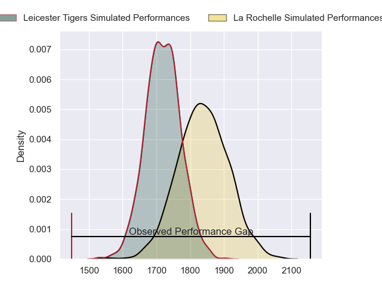
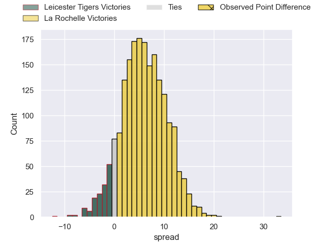
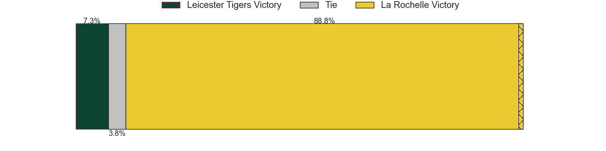
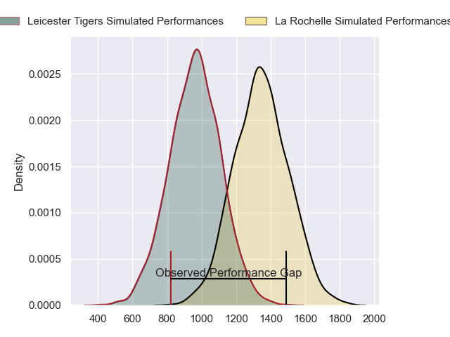
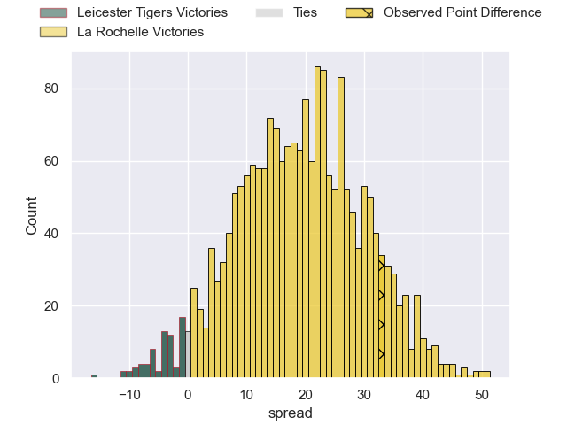
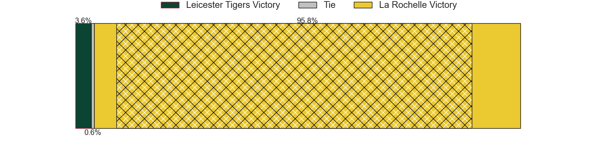
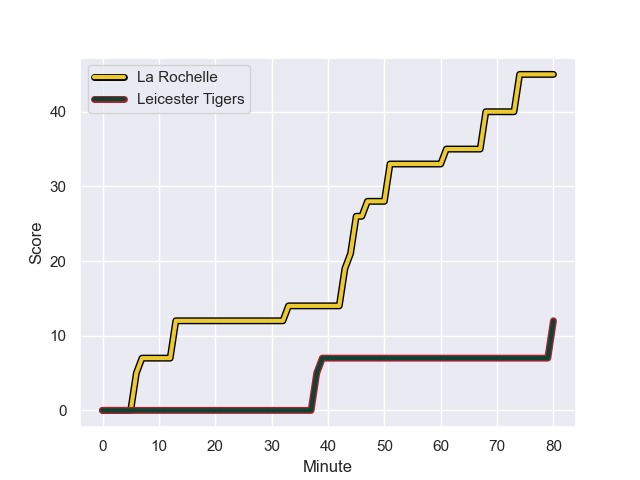
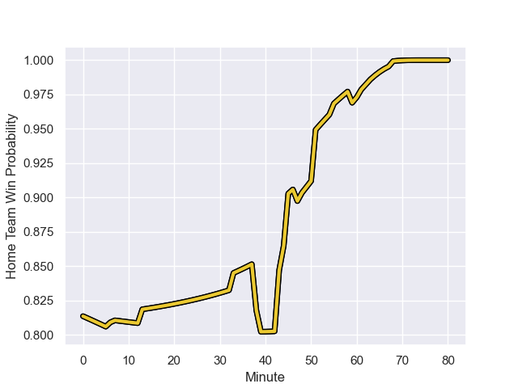

---  
layout: page  
title: Leicester Tigers at La Rochelle; 12-45  
date: 2024-01-14 18:00:00 -0500  
categories: "European Rugby Champions Cup 2023" match review  
---
# Leicester Tigers at La Rochelle; 12-45

# Club Level Predictions

The first set of predictions treats a club as the smallest object, as the club develops its members, organizes a gameplan, and deploys its players as needed for each match. This club model has a prediction of 0.659, which translates to predicting La Rochelle to win by 5.8.

Our Over/Under is 49.5 - and combined with the spread above, we have a predicted scoreline of 22 to 28

Each club has a rating and a rating deviation (similar to a Glicko rating), and expected performances can be generated. This allows for simulated matches and spreads like the ones below.
## Projected Performances - Club Model

## Projected Spreads - Club Model

## Projected Results - Club Model

# Player Level Predictions - Version 2

Treating teams instead as an entity made up of the currently active players, I have ratings for each player in an altogether different system. These can be combined to form team ratings once teamsheets are announced, weighting starters a bit higher than the reserves. After the match is played, players can be weighted by their minutes on the field, allowing for an accurate measure of the team's composition. With these compiled team ratings, we can make predictions, measure inaccuracy, and update the individual player ratings.
## Prediction with Player Minutes: La Rochelle by 16.2

La Rochelle by 8.9 on a neutral field
## Prediction without Player Minutes: La Rochelle by 17.3

La Rochelle by 10.0 on a neutral pitch

## Projected Performances - Player Model

## Projected Spreads - Player Model

## Projected Results - Player Model

## Scores over Time

## Win Probability over Time

There were 4 large changes in win probability in this match

|   Away Minutes | Away Player          |   Away elo |   Number |   Home elo | Home Player        |   Home Minutes |
|---------------:|:---------------------|-----------:|---------:|-----------:|:-------------------|---------------:|
|             51 | James Cronin         |      87.09 |        1 |     104.57 | Reda Wardi         |             59 |
|             72 | Julian Montoya       |     108.61 |        2 |      46.65 | Pierre Bourgarit   |             48 |
|             47 | Dan Cole             |      27.79 |        3 |     131.91 | Uini Atonio        |             59 |
|             80 | George Martin        |      80.98 |        4 |      54.46 | Ultan Dillane      |             80 |
|             61 | Ollie Chessum        |      62.82 |        5 |      97.89 | Will Skelton       |             61 |
|             47 | Matt Rogerson        |      66.68 |        6 |      24.41 | Paul Boudehent     |             80 |
|             80 | Olly Cracknell       |      59.46 |        7 |     106.25 | Levani Botia       |             59 |
|             80 | Kyle Hatherell       |     -19.24 |        8 |     138.02 | Gregory Alldritt   |             80 |
|             55 | Ben Youngs           |      77.6  |        9 |     113.23 | Tawera Kerr-Barlow |             80 |
|             47 | Jamie Shillcock      |      46.36 |       10 |      42.48 | Antoine Hastoy     |             80 |
|             80 | Josh Bassett         |      79.62 |       11 |     109.31 | Dillyn Leyds       |             80 |
|             61 | Solomone Kata        |      46.66 |       12 |      46.65 | Jonathan Danty     |             63 |
|             80 | Dan Kelly            |      88.96 |       13 |      43.3  | Ulupano Seuteni    |             80 |
|             80 | Harry Simmons        |      37.75 |       14 |      72.74 | Teddy Thomas       |             70 |
|             80 | Mike Brown           |      80.73 |       15 |     108.94 | Brice Dulin        |             70 |
|              8 | Finn Theobald-Thomas |      46.22 |       16 |      55.57 | Quentin Lespiaucq  |             32 |
|             29 | Francois van Wyk     |      62.21 |       17 |      65.62 | Joel Sclavi        |             21 |
|             33 | Joe Heyes            |      82.91 |       18 |      46.65 | Alexandre Kuntelia |             21 |
|             19 | Sam Carter           |     107.68 |       19 |      46.65 | Remi Picquette     |             19 |
|             33 | Jasper Wiese         |      78.37 |       20 |      38.43 | Judicael Cancoriet |             21 |
|             25 | Tom Whiteley         |      19.46 |       21 |      58.06 | Yoan Tanga         |             17 |
|             33 | Handre Pollard       |     102.76 |       22 |      82.77 | Thomas Berjon      |             10 |
|             19 | Matt Scott           |      59.24 |       23 |      46.65 | Hugo Reus          |             10 |

