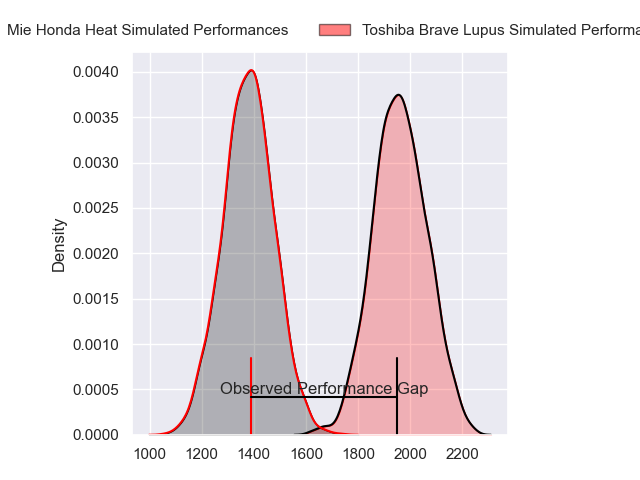
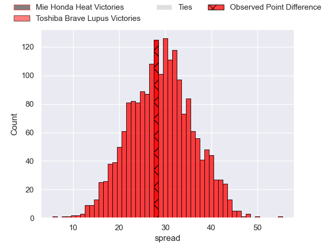
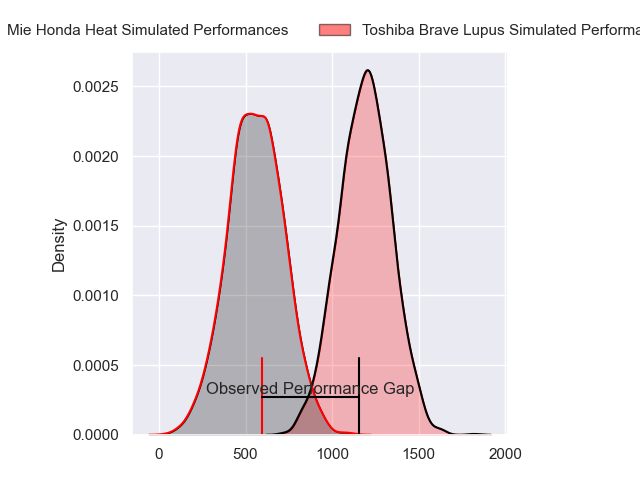
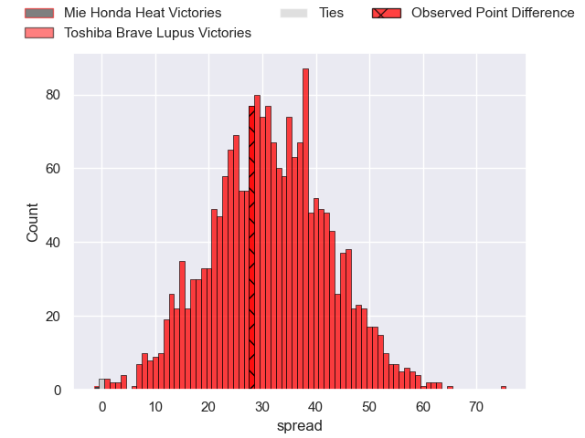
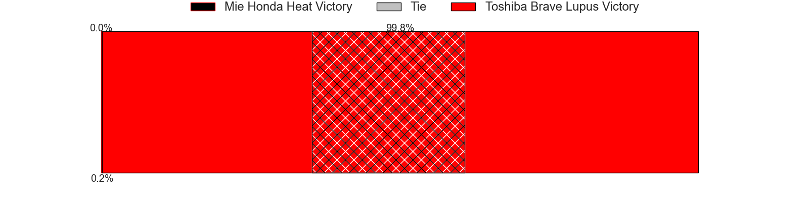
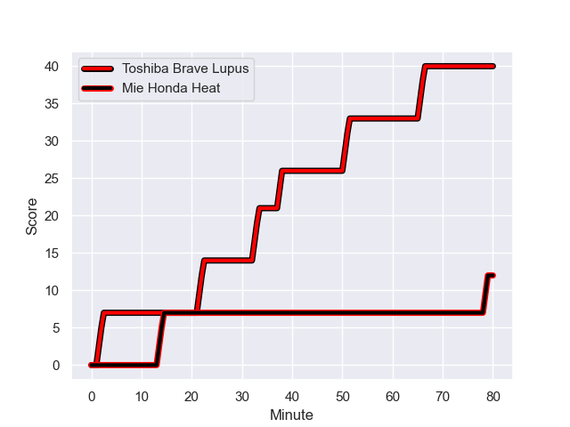
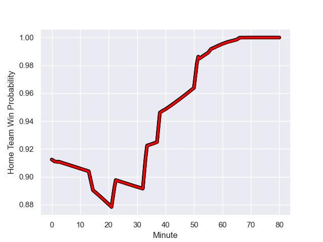

---  
layout: page  
title: Mie Honda Heat at Toshiba Brave Lupus; 12-40  
date: 2024-01-14 18:00:00 -0500  
categories: "Japan Rugby League One 2023" match review  
---
# Mie Honda Heat at Toshiba Brave Lupus; 12-40

# Club Level Predictions

The first set of predictions treats a club as the smallest object, as the club develops its members, organizes a gameplan, and deploys its players as needed for each match. This club model has a prediction of 0.961, which translates to predicting Toshiba Brave Lupus to win by 29.1.

Our Over/Under is 65.5 - and combined with the spread above, we have a predicted scoreline of 18 to 47

Each club has a rating and a rating deviation (similar to a Glicko rating), and expected performances can be generated. This allows for simulated matches and spreads like the ones below.
## Projected Performances - Club Model

## Projected Spreads - Club Model

## Projected Results - Club Model

# Player Level Predictions - Version 2

Treating teams instead as an entity made up of the currently active players, I have ratings for each player in an altogether different system. These can be combined to form team ratings once teamsheets are announced, weighting starters a bit higher than the reserves. After the match is played, players can be weighted by their minutes on the field, allowing for an accurate measure of the team's composition. With these compiled team ratings, we can make predictions, measure inaccuracy, and update the individual player ratings.
## Prediction with Player Minutes: Toshiba Brave Lupus by 25.8

Toshiba Brave Lupus by 22.5 on a neutral field
## Prediction without Player Minutes: Toshiba Brave Lupus by 25.4

Toshiba Brave Lupus by 22.0 on a neutral pitch

## Projected Performances - Player Model

## Projected Spreads - Player Model

## Projected Results - Player Model

## Scores over Time

## Win Probability over Time

|   Away Minutes | Away Player          |   Away elo |   Number |   Home elo | Home Player       |   Home Minutes |
|---------------:|:---------------------|-----------:|---------:|-----------:|:------------------|---------------:|
|             63 | Tatsuhiko Tsurukawa  |      15.51 |        1 |      70.6  | Sena Kimura       |             57 |
|             63 | Lee Seung Hyok       |      17.84 |        2 |      39.64 | Daigo Hashimoto   |             63 |
|             63 | Katsuyuki Hoshino    |      40.31 |        3 |      76.43 | Yuta Kokaji       |             52 |
|             80 | Ryota Kobayashi      |      13.84 |        4 |      19.04 | PJ Steenkamp      |             52 |
|             80 | Franco Mostert       |     108.13 |        5 |      76.55 | Warner Dearns     |             80 |
|             63 | Waimana Kapa         |      50.34 |        6 |      74.18 | Shannon Frizell   |             52 |
|             80 | Ryo Furuta           |      -1.31 |        7 |      69.33 | Takeshi Sasaki    |             80 |
|             52 | Viliami Afu Kaipouli |      16.43 |        8 |      90.16 | Michael Leitch    |             80 |
|             63 | Shogo Nezuka         |      38.48 |        9 |      60.45 | Takahiro Ogawa    |             80 |
|             66 | Gwangtee Oh          |      42.26 |       10 |     134.06 | Richie Mo'unga    |             71 |
|             66 | Dawid Kellerman      |      29.74 |       11 |      87.43 | Masaki Hamada     |             80 |
|             80 | Fraser Quirk         |      19.74 |       12 |      73.81 | Taichi Mano       |             40 |
|             80 | Clinton Knox         |      30.48 |       13 |      97.58 | Seta Tamanivalu   |             80 |
|             80 | Haruhiko Uemura      |      45.36 |       14 |      55.53 | Atsuki Kuwayama   |             56 |
|             80 | Tom Banks            |      77.22 |       15 |      85.97 | Takuro Matsunaga  |             80 |
|             28 | Sosiceni Tokoqio     |      26.33 |       16 |      72.36 | Nicholas McCurran |             40 |
|             17 | Kanato Hirano        |      42.91 |       17 |      49.96 | Taufa Latu        |             28 |
|             17 | Matthys Basson       |      31.69 |       18 |      17.32 | Samuela Anise     |             28 |
|             17 | Taichi Takenaka      |      34.05 |       19 |      70.4  | Shin Ito          |             28 |
|             17 | Koki Hida            |      44.77 |       20 |     103.77 | Michael Collins   |             24 |
|             17 | Yoji Akiyama         |      32.59 |       21 |      64.35 | Yuma Fujino       |             23 |
|             14 | Mitch Hunt           |      70.77 |       22 |      45.28 | Futoshi Mori      |             17 |
|             14 | Kanta Watanabe       |      45    |       23 |      64.78 | Yuhei Sugiyama    |              9 |

