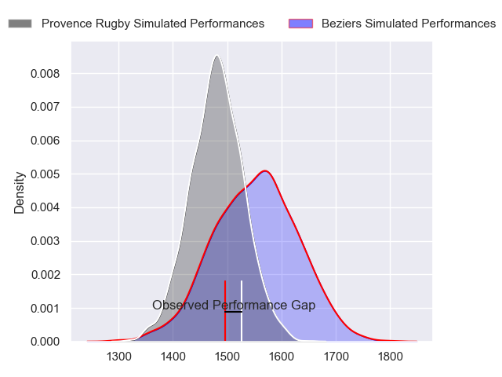
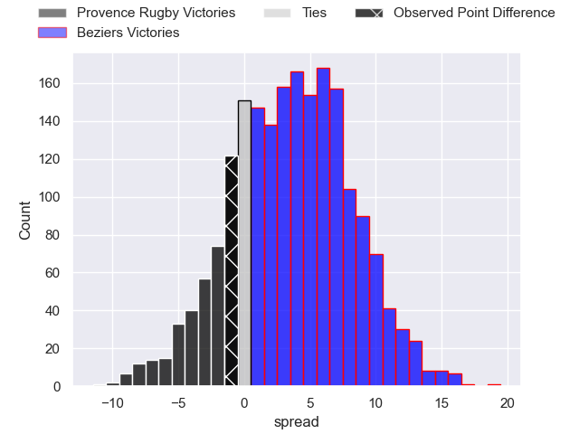
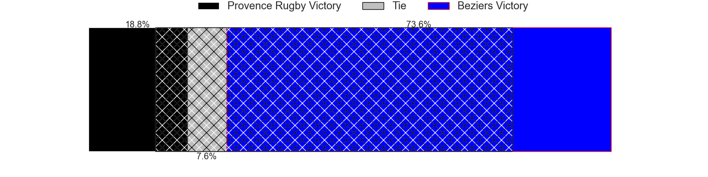
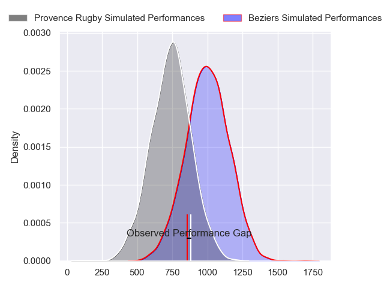
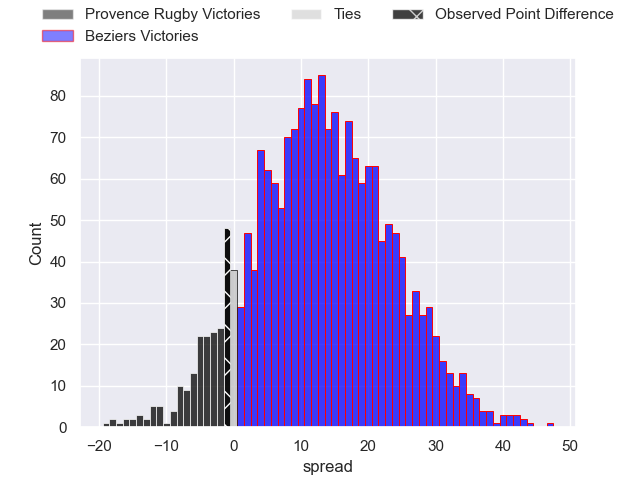
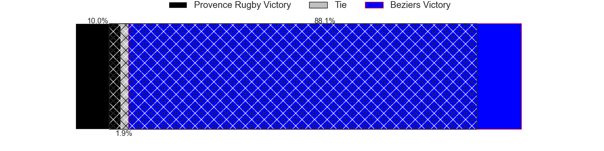
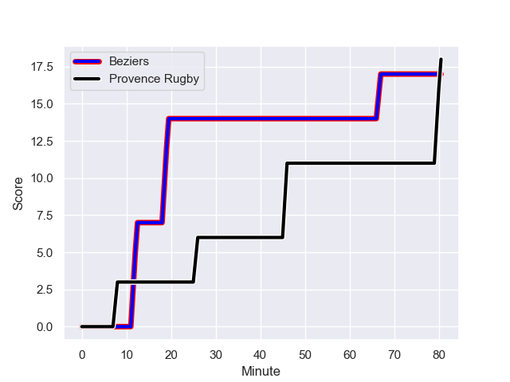
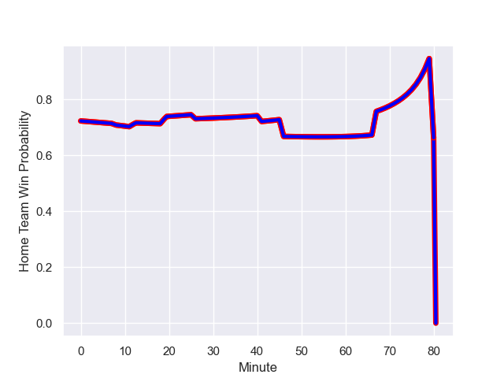

---  
layout: page  
title: Provence Rugby at Beziers; 18-17  
date: 2024-01-18 18:00:00 -0500  
categories: "Pro D2 2023" match review  
---
# Provence Rugby at Beziers; 18-17

# Club Level Predictions

The first set of predictions treats a club as the smallest object, as the club develops its members, organizes a gameplan, and deploys its players as needed for each match. This club model has a prediction of 0.598, which translates to predicting Beziers to win by 3.5.

Our Over/Under is 40.5 - and combined with the spread above, we have a predicted scoreline of 19 to 22

Each club has a rating and a rating deviation (similar to a Glicko rating), and expected performances can be generated. This allows for simulated matches and spreads like the ones below.
## Projected Performances - Club Model

## Projected Spreads - Club Model

## Projected Results - Club Model

# Player Level Predictions - Version 2

Treating teams instead as an entity made up of the currently active players, I have ratings for each player in an altogether different system. These can be combined to form team ratings once teamsheets are announced, weighting starters a bit higher than the reserves. After the match is played, players can be weighted by their minutes on the field, allowing for an accurate measure of the team's composition. With these compiled team ratings, we can make predictions, measure inaccuracy, and update the individual player ratings.
## Prediction with Player Minutes: Beziers by 10.5

Beziers by 3.2 on a neutral field
## Prediction without Player Minutes: Beziers by 11.2

Beziers by 3.9 on a neutral pitch

## Projected Performances - Player Model

## Projected Spreads - Player Model

## Projected Results - Player Model

## Scores over Time

## Win Probability over Time

There were 6 large changes in win probability in this match

|   Away Minutes | Away Player           |   Away elo |   Number |   Home elo | Home Player         |   Home Minutes |
|---------------:|:----------------------|-----------:|---------:|-----------:|:--------------------|---------------:|
|             46 | Thomas Vernet         |      47.46 |        1 |      25.13 | Francisco Fernandes |             54 |
|             46 | Loick Jammes          |      -4.03 |        2 |      61.67 | Yvann Lalevee       |             54 |
|             46 | Paul Mallez           |      54.75 |        3 |      73.55 | Jon Zabala Arrieta  |             54 |
|             46 | Clément Chartier      |      62.78 |        4 |      -0.56 | Hans N'kinsi        |             53 |
|             80 | Theo Hannoyer         |      31.66 |        5 |      10.29 | John Madigan        |             80 |
|             80 | Baptiste Belhadj      |      53.74 |        6 |      37.96 | William van Bost    |             54 |
|             80 | Jessy Jegerlehner     |       7.75 |        7 |      31.45 | Clement Ancely      |             80 |
|             46 | Malohi Suta           |      49.61 |        8 |      62.26 | Sias Koen           |             80 |
|             46 | Joris Cazenave        |      38.14 |        9 |      77.87 | Samuel Marques      |             80 |
|             80 | Enzo Selponi          |      61.55 |       10 |      70.82 | Charly Malie        |             80 |
|             80 | Léo Drouet            |      46.51 |       11 |      61.1  | Paul Reau           |             67 |
|             41 | Hugo Navizet          |      51.93 |       12 |      54.92 | Taleta Tupuola      |             59 |
|             46 | Louis Marrou          |      65.54 |       13 |      68.17 | Paul Recor          |             80 |
|             80 | Sione Tui             |      78.42 |       14 |      99.95 | Raffaele Storti     |             80 |
|             80 | Adrien Lapegue-Lafaye |      19.06 |       15 |     103.24 | Gabin Lorre         |             80 |
|             39 | Kaveinga Finau        |     107.26 |       16 |     -32.18 | Pierrick Gunther    |             27 |
|             34 | Charly Gambini        |      52.02 |       17 |      22.16 | Gillian Benoy       |             26 |
|             34 | Arthur Coville        |      48.24 |       18 |      48.25 | Wilmar Arnoldi      |             26 |
|             34 | Federico Wegrzyn      |      52.02 |       19 |      62.99 | Yannick Arroyo      |             26 |
|             34 | Lucas Martin          |      88.15 |       20 |      32.27 | Youssef Amrouni     |             26 |
|             34 | Tomas Francis         |     143.04 |       21 |      87.79 | Watisoni Votu       |             21 |
|             34 | Jimmy Gopperth        |      61    |       22 |      43.66 | Harry Glynn         |             13 |
|             34 | Andres Zafra Tarazona |      -5.77 |       23 |     nan    | nan                 |            nan |

