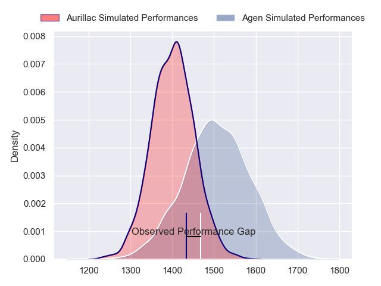
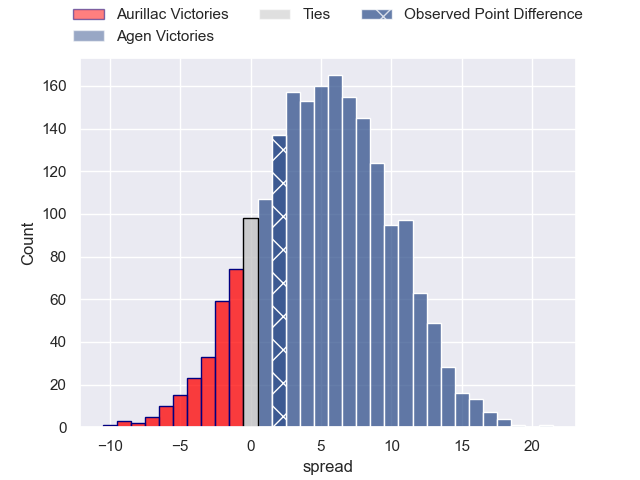
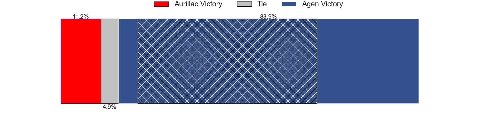
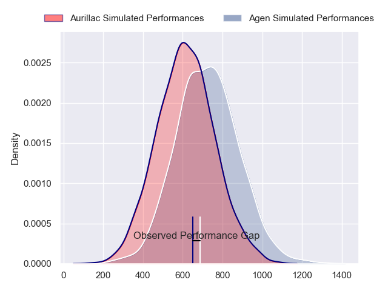
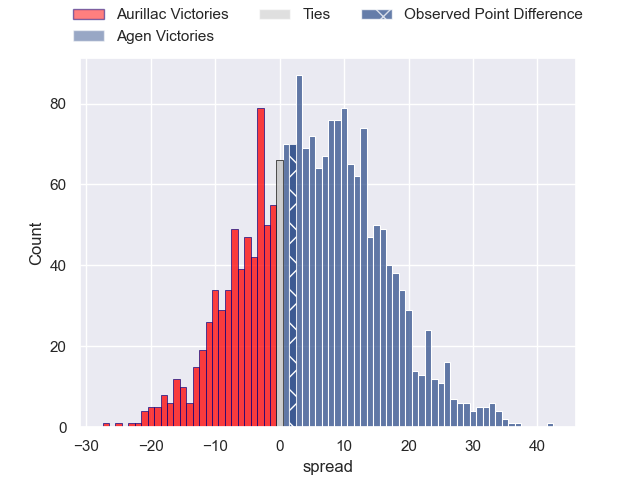
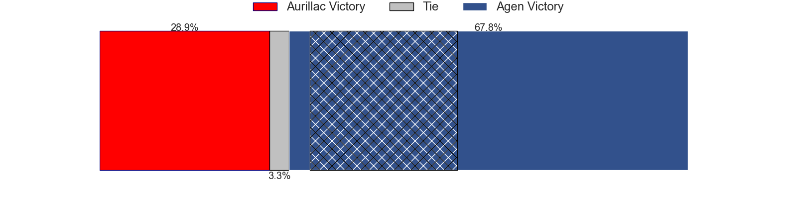
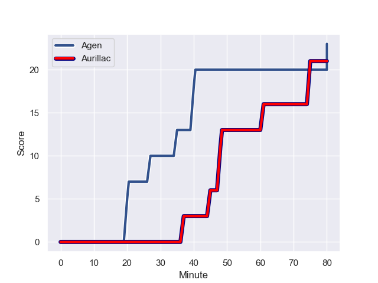
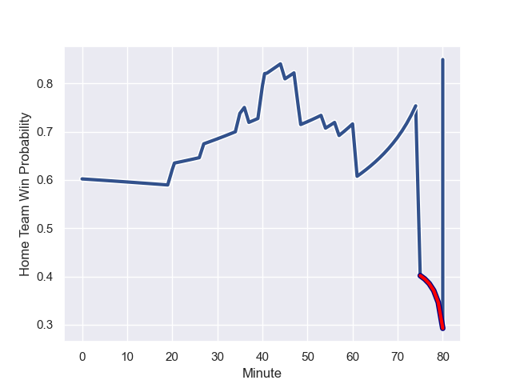

---  
layout: page  
title: Aurillac at Agen; 21-23  
date: 2024-01-19 18:00:00 -0500  
categories: "Pro D2 2023" match review  
---
# Aurillac at Agen; 21-23

# Club Level Predictions

The first set of predictions treats a club as the smallest object, as the club develops its members, organizes a gameplan, and deploys its players as needed for each match. This club model has a prediction of 0.643, which translates to predicting Agen to win by 5.2.

Our Over/Under is 51.5 - and combined with the spread above, we have a predicted scoreline of 23 to 28

Each club has a rating and a rating deviation (similar to a Glicko rating), and expected performances can be generated. This allows for simulated matches and spreads like the ones below.
## Projected Performances - Club Model

## Projected Spreads - Club Model

## Projected Results - Club Model

# Player Level Predictions - Version 2

Treating teams instead as an entity made up of the currently active players, I have ratings for each player in an altogether different system. These can be combined to form team ratings once teamsheets are announced, weighting starters a bit higher than the reserves. After the match is played, players can be weighted by their minutes on the field, allowing for an accurate measure of the team's composition. With these compiled team ratings, we can make predictions, measure inaccuracy, and update the individual player ratings.
## Prediction with Player Minutes: Agen by 4.5

Aurillac by 3.0 on a neutral field
## Prediction without Player Minutes: Agen by 5.3

Aurillac by 2.3 on a neutral pitch

## Projected Performances - Player Model

## Projected Spreads - Player Model

## Projected Results - Player Model

## Scores over Time

## Win Probability over Time

There were 15 large changes in win probability in this match

|   Away Minutes | Away Player               |   Away elo |   Number |   Home elo | Home Player        |   Home Minutes |
|---------------:|:--------------------------|-----------:|---------:|-----------:|:-------------------|---------------:|
|             41 | Robert Rodgers            |      17.81 |        1 |       0.09 | Florent Guion      |             57 |
|             41 | Ronan Loughnane           |      42.54 |        2 |      38.04 | Pierre Jouvin      |             61 |
|             36 | Giorgi Kartvelishvili     |      52.04 |        3 |      57.1  | Alex Burin         |             73 |
|             25 | Heath Backhouse           |      53.49 |        4 |      -3.76 | Evan Olmstead      |             80 |
|             80 | Cam Dodson                |      68.81 |        5 |      71.9  | William Demotte    |             61 |
|             80 | Yohann Gbizie             |      84.41 |        6 |      20.71 | Julien Lebian      |             80 |
|             57 | Théo Cambon               |      23.12 |        7 |      57.56 | Arnaud Duputs      |             80 |
|             54 | Latuka Maituku            |     -16.55 |        8 |      28.34 | Fotu Lokotui       |             61 |
|             61 | Mikheil Alania            |      34.85 |        9 |       8.69 | Sonatane Takulua   |             61 |
|             80 | Antoine Aucagne           |      31.82 |       10 |      59.44 | Thomas Vincent     |             80 |
|             80 | Jordon Janse Van Rensburg |      30.7  |       11 |      62.01 | Tevita Railevu     |             80 |
|             61 | Ofa Manuofetoa            |      62.18 |       12 |      59.94 | Harry Sloan        |             57 |
|             80 | Hugo Bastard              |      50.34 |       13 |      55    | Clement Garrigues  |             80 |
|             80 | Juun Pieters              |      47.06 |       14 |     -21.16 | Loris Tolot        |             80 |
|             80 | Marc Palmier              |      34.53 |       15 |      46.62 | Romain Darchen     |             57 |
|             55 | Martial Rolland           |      39.6  |       16 |      48.38 | Hans Lombard-Buret |             23 |
|             44 | Thomas Cretu              |      46.67 |       17 |      39.23 | Emile Dayral       |             23 |
|             39 | Luka Nioradze             |      18.87 |       18 |      29.88 | Theo Belan         |             23 |
|             39 | Irakli Mtchedlidze        |      49.38 |       19 |      20.16 | Mike Sosene-Feagai |             19 |
|             26 | Didier Tison              |      54.24 |       20 |      33.15 | Corentin Vernet    |             19 |
|             23 | Mosa'ati Moala            |      22.96 |       21 |      61.51 | Vincent Farre      |             19 |
|             19 | David Delarue             |      31.46 |       22 |      45.32 | Dorian Bellot      |             19 |
|             19 | Christa Powell            |      10.29 |       23 |      46.45 | Mamuka Mstoiani    |              7 |

