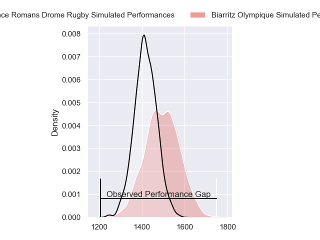
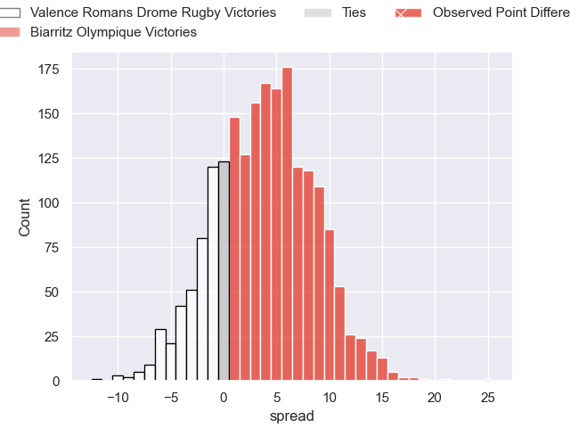
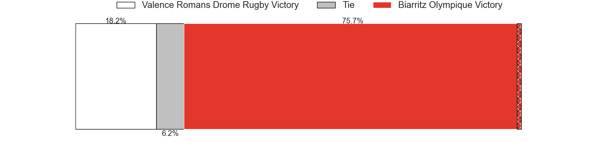
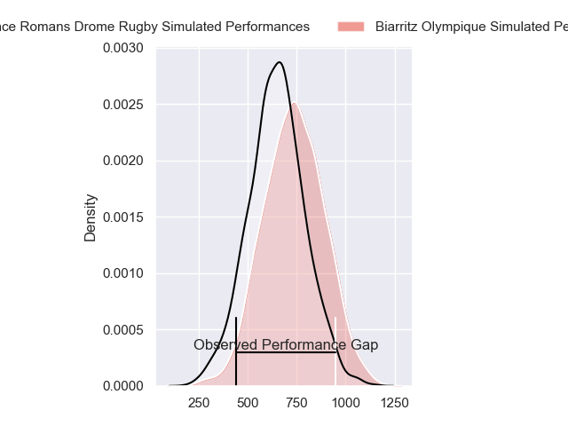
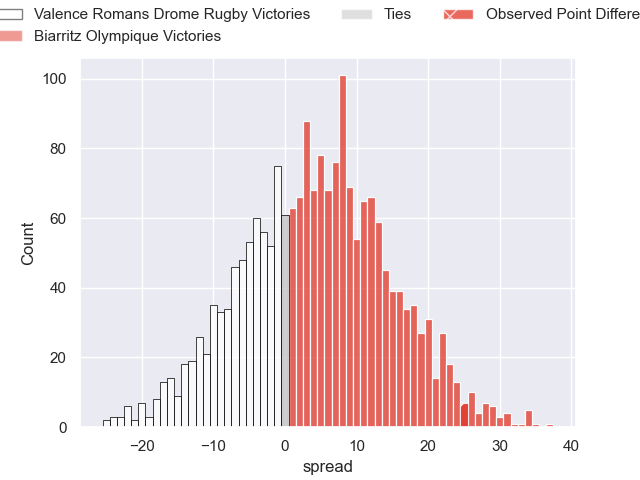
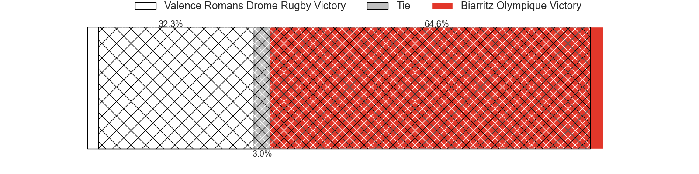
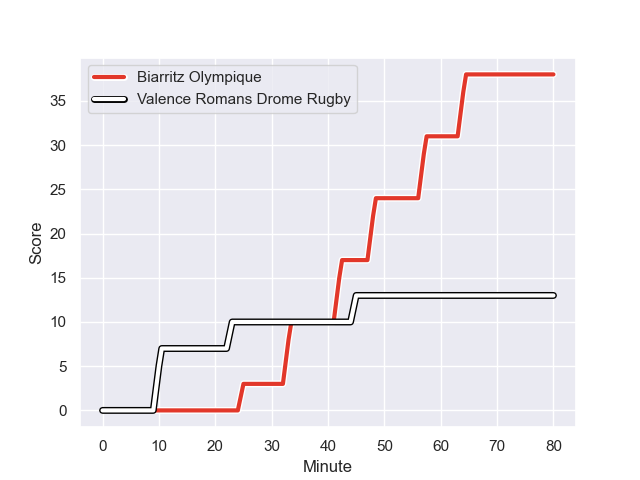
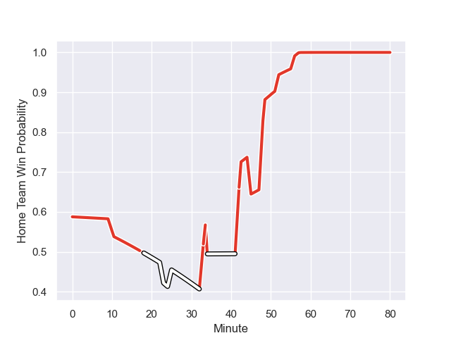

---  
layout: page  
title: Valence Romans Drome Rugby at Biarritz Olympique; 13-38  
date: 2024-01-19 18:00:00 -0500  
categories: "Pro D2 2023" match review  
---
# Valence Romans Drome Rugby at Biarritz Olympique; 13-38

# Club Level Predictions

The first set of predictions treats a club as the smallest object, as the club develops its members, organizes a gameplan, and deploys its players as needed for each match. This club model has a prediction of 0.605, which translates to predicting Biarritz Olympique to win by 3.7.

Our Over/Under is 41.5 - and combined with the spread above, we have a predicted scoreline of 19 to 23

Each club has a rating and a rating deviation (similar to a Glicko rating), and expected performances can be generated. This allows for simulated matches and spreads like the ones below.
## Projected Performances - Club Model

## Projected Spreads - Club Model

## Projected Results - Club Model

# Player Level Predictions - Version 2

Treating teams instead as an entity made up of the currently active players, I have ratings for each player in an altogether different system. These can be combined to form team ratings once teamsheets are announced, weighting starters a bit higher than the reserves. After the match is played, players can be weighted by their minutes on the field, allowing for an accurate measure of the team's composition. With these compiled team ratings, we can make predictions, measure inaccuracy, and update the individual player ratings.
## Prediction with Player Minutes: Biarritz Olympique by 3.9

Valence Romans Drome Rugby by 4.5 on a neutral field
## Prediction without Player Minutes: Biarritz Olympique by 3.0

Valence Romans Drome Rugby by 5.4 on a neutral pitch

## Projected Performances - Player Model

## Projected Spreads - Player Model

## Projected Results - Player Model

## Scores over Time

## Win Probability over Time

There were 13 large changes in win probability in this match

|   Away Minutes | Away Player         |   Away elo |   Number |   Home elo | Home Player         |   Home Minutes |
|---------------:|:--------------------|-----------:|---------:|-----------:|:--------------------|---------------:|
|             51 | Anthony Aléo        |      20.53 |        1 |      20.63 | Zakaria El Fakir    |             56 |
|             55 | Dorian Marco Pena   |      45.34 |        2 |      62.2  | Thomas Sauveterre   |             62 |
|             43 | Gareth Milasinovich |      42.31 |        3 |      53.02 | Mohamed Haouas      |             68 |
|             80 | Ryan McCauley       |      18.17 |        4 |      61.16 | Charlie Matthews    |             80 |
|             49 | Yassine Maamry      |      39.92 |        5 |     -10.21 | Adrian Motoc        |             68 |
|             34 | Éloi Massot         |      -6.2  |        6 |      15.87 | Dave O'Callaghan    |             80 |
|             80 | Loan Real           |      41.1  |        7 |      -1.08 | Charlie Francoz     |             52 |
|             52 | Thembelani Bholi    |      77.93 |        8 |      37.18 | Temo Matiu          |             80 |
|             56 | Thomas Lhusero      |      78.89 |        9 |      48.31 | Kerman Aurrekoetxea |             56 |
|             80 | Lucas Meret         |       0.18 |       10 |       3.58 | Billy Searle        |             80 |
|             80 | Mosese Mawalu       |      65.03 |       11 |      50.05 | Steeve Barry        |             80 |
|             80 | Ben Neiceru         |      50.04 |       12 |     -11.99 | Francois Vergnaud   |             51 |
|             80 | Anatole Pauvert     |      58.63 |       13 |      86.91 | Jonathan Joseph     |             80 |
|             80 | Adam Vargas         |      94.12 |       14 |      21.06 | Gervais Cordin      |             46 |
|             51 | George Worth        |      28.71 |       15 |      61.59 | Joe Jonas           |             80 |
|             46 | Charles Brayer      |      44.19 |       16 |      56.57 | Baptiste Fariscot   |             34 |
|             37 | Chris Talakai       |      35.65 |       17 |      19.18 | Vincent Martin      |             29 |
|             31 | Florian Goumat      |      39.01 |       18 |      36.48 | Simon Augry         |             28 |
|             29 | Julien Royer        |     -12.04 |       19 |      31.88 | Killian Taofifenua  |             24 |
|             29 | Joris Moura         |      77.61 |       20 |      44.12 | Imanol Biscay       |             24 |
|             28 | Adrien Roux         |      44.71 |       21 |      38.06 | Brendan Lebrun      |             18 |
|             25 | Cyril Deligny       |     -22.32 |       22 |      22.45 | Alfie Petch         |             12 |
|             24 | Tim Menzel          |      56.86 |       23 |      39.87 | Nafi Ma'afu         |             12 |

