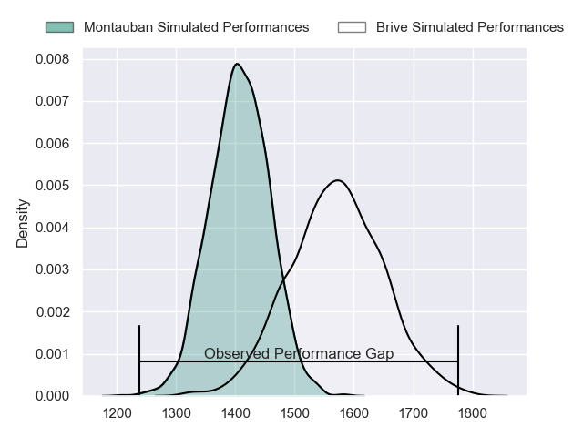
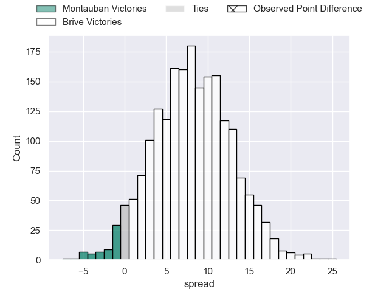
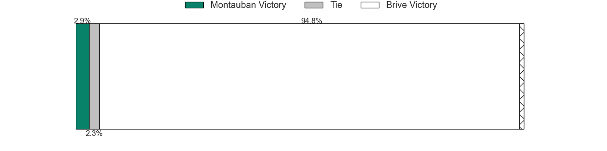
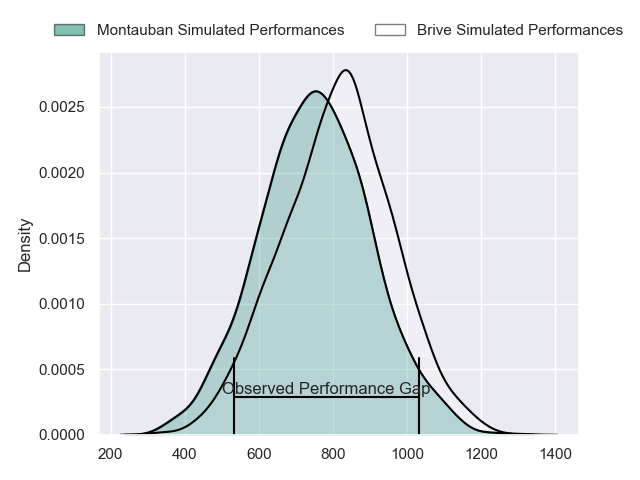
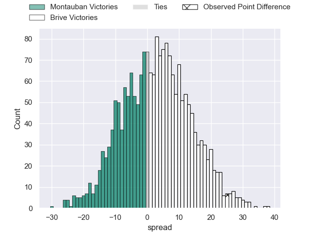
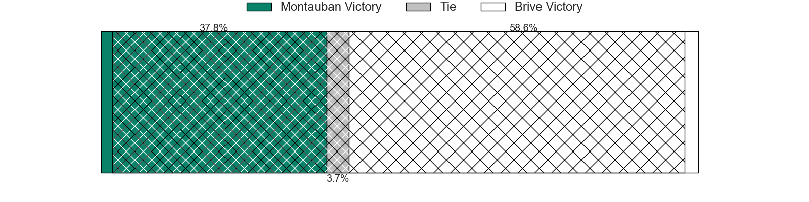
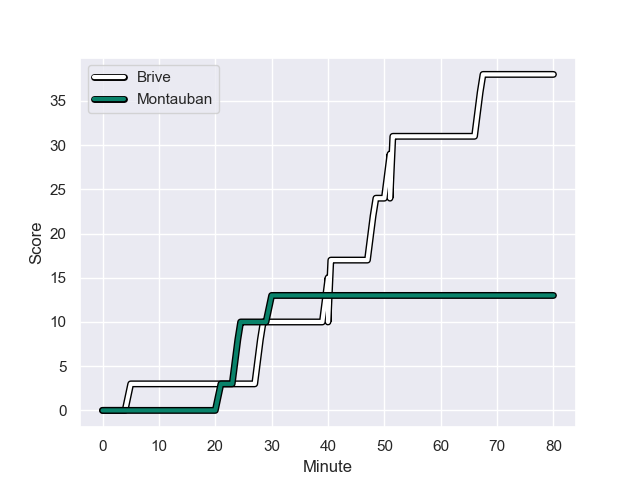
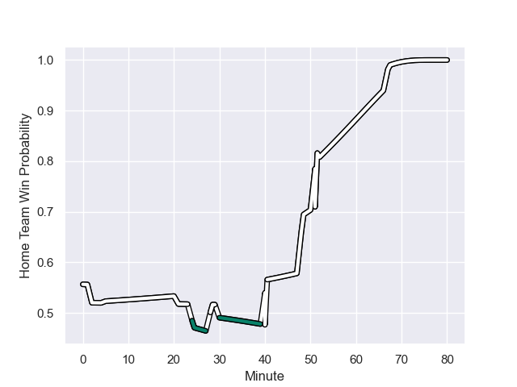

---  
layout: page  
title: Montauban at Brive; 13-38  
date: 2024-01-19 18:00:00 -0500  
categories: "Pro D2 2023" match review  
---
# Montauban at Brive; 13-38

# Club Level Predictions

The first set of predictions treats a club as the smallest object, as the club develops its members, organizes a gameplan, and deploys its players as needed for each match. This club model has a prediction of 0.717, which translates to predicting Brive to win by 8.2.

Our Over/Under is 40.5 - and combined with the spread above, we have a predicted scoreline of 16 to 24

Each club has a rating and a rating deviation (similar to a Glicko rating), and expected performances can be generated. This allows for simulated matches and spreads like the ones below.
## Projected Performances - Club Model

## Projected Spreads - Club Model

## Projected Results - Club Model

# Player Level Predictions - Version 2

Treating teams instead as an entity made up of the currently active players, I have ratings for each player in an altogether different system. These can be combined to form team ratings once teamsheets are announced, weighting starters a bit higher than the reserves. After the match is played, players can be weighted by their minutes on the field, allowing for an accurate measure of the team's composition. With these compiled team ratings, we can make predictions, measure inaccuracy, and update the individual player ratings.
## Prediction with Player Minutes: Brive by 2.5

Montauban by 5.1 on a neutral field
## Prediction without Player Minutes: Brive by 4.0

Montauban by 3.6 on a neutral pitch

## Projected Performances - Player Model

## Projected Spreads - Player Model

## Projected Results - Player Model

## Scores over Time

## Win Probability over Time

There were 13 large changes in win probability in this match

|   Away Minutes | Away Player       |   Away elo |   Number |   Home elo | Home Player               |   Home Minutes |
|---------------:|:------------------|-----------:|---------:|-----------:|:--------------------------|---------------:|
|             52 | Thomas Bue        |      50.26 |        1 |      44.93 | Wesley Tapueluelu         |             52 |
|             52 | Ru-Hann Greyling  |      41.11 |        2 |      52.18 | Issam Hamel               |             52 |
|             52 | Tietie Tuimauga   |      82.04 |        3 |      17.99 | Marcel van der Merwe      |             52 |
|             80 | Tjuee Uanivi      |      29.61 |        4 |      50.99 | Tevita Ratuva             |             52 |
|             52 | Dimitri Vaotoa    |      53.08 |        5 |      36.07 | Julien Delannoy           |             52 |
|             80 | Quentin Witt      |      34.63 |        6 |      28.72 | Sasha Gue                 |             80 |
|             80 | Frédéric Quercy   |      14.52 |        7 |      80.79 | Ross Moriarty             |             52 |
|             52 | Corentin Coularis |      40.41 |        8 |      71.53 | Rahboni Warren-Vosayaco   |             52 |
|             58 | Yoan Cottin       |      74.66 |        9 |      -1.95 | Leo Carbonneau            |             80 |
|             80 | Thomas Fortunel   |      46.47 |       10 |      22.06 | Tom Raffy                 |             80 |
|             80 | Raphael Sanchez   |      37.57 |       11 |      42.42 | Asaeli Tuivuaka           |             80 |
|             52 | Sevanaia Galala   |      87.09 |       12 |      44.86 | Guillaume Galletier       |             80 |
|             80 | Victor Olivier    |      40.78 |       13 |      71.79 | Sam Johnson               |             65 |
|             80 | Semesa Rokoduguni |     105.81 |       14 |      47.07 | Arthur Bonneval           |             80 |
|              2 | Segundo Tuculet   |       8.35 |       15 |      28.01 | Mathis Ferté              |             80 |
|             78 | Tedo Abzhandadze  |      56.4  |       16 |      27.25 | Lucas da Silva            |             28 |
|             28 | Nicolas Agnesi    |      44.05 |       17 |      48.02 | Nathan Fraissenon         |             28 |
|             28 | Noa Kanika        |      50.44 |       18 |      37.47 | Retief Marais             |             28 |
|             28 | Malino Vanai      |       4.13 |       19 |      48.82 | Asier Usarraga            |             28 |
|             28 | Kevin Gimeno      |      -6.04 |       20 |      47.91 | Taniela Sadrugu           |             28 |
|             28 | Dan Goggin        |      76.36 |       21 |      80.47 | Said Hireche              |             28 |
|             28 | WillGriff John    |      60.61 |       22 |      29.21 | Francisco Coria Marchetti |             28 |
|             22 | Alexis Bernadet   |      69.92 |       23 |      70.26 | Thomas Laranjeira         |             15 |

