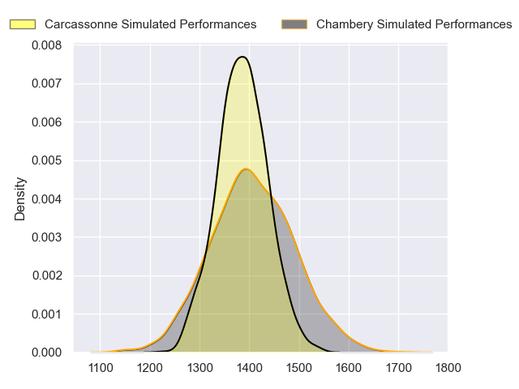
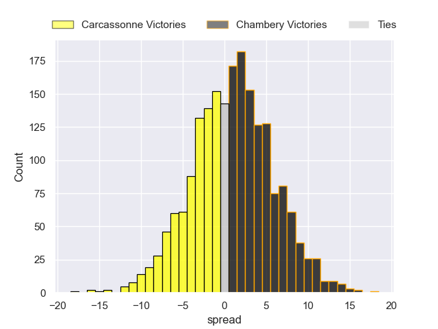
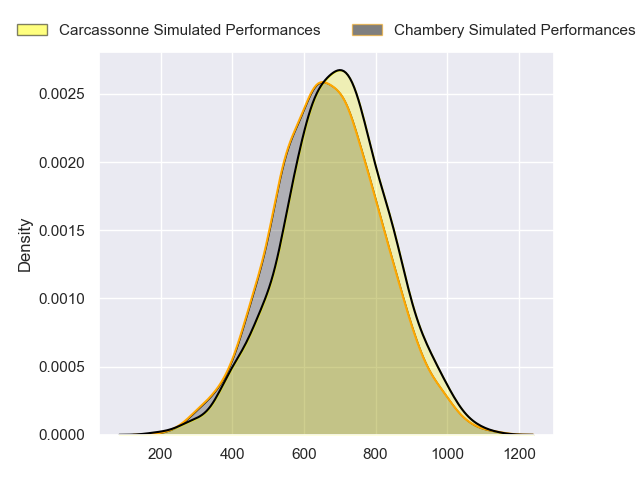
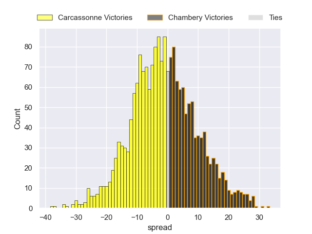
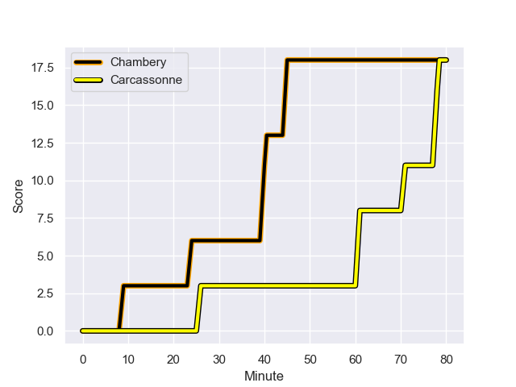
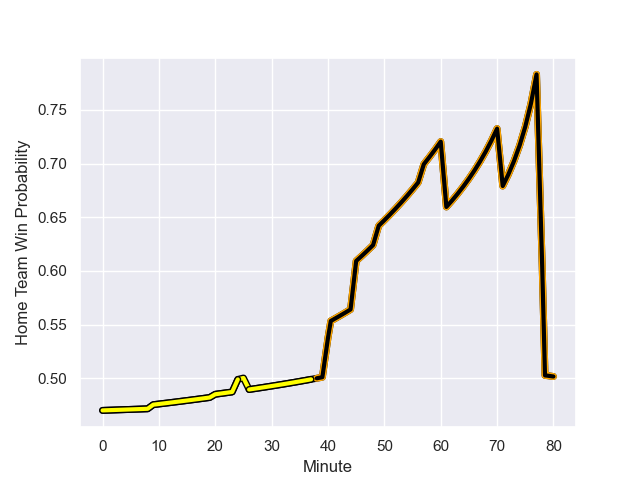

---  
layout: page  
title: Carcassonne at Chambery; 18-18  
date: 2024-01-19 18:00:00 -0500  
categories: "Nationale 2023" match review  
---
# Carcassonne at Chambery; 18-18

# Club Level Predictions

The first set of predictions treats a club as the smallest object, as the club develops its members, organizes a gameplan, and deploys its players as needed for each match. This club model has a prediction of 0.524, which translates to predicting Chambery to win by 0.9.

Our Over/Under is 33.5 - and combined with the spread above, we have a predicted scoreline of 17 to 17

Each club has a rating and a rating deviation (similar to a Glicko rating), and expected performances can be generated. This allows for simulated matches and spreads like the ones below.
## Projected Performances - Club Model

## Projected Spreads - Club Model

## Projected Results - Club Model

# Player Level Predictions - Version 2

Treating teams instead as an entity made up of the currently active players, I have ratings for each player in an altogether different system. These can be combined to form team ratings once teamsheets are announced, weighting starters a bit higher than the reserves. After the match is played, players can be weighted by their minutes on the field, allowing for an accurate measure of the team's composition. With these compiled team ratings, we can make predictions, measure inaccuracy, and update the individual player ratings.
## Prediction with Player Minutes: Carcassonne by 1.3

Carcassonne by 4.8 on a neutral field
## Prediction without Player Minutes: Carcassonne by 2.9

Carcassonne by 6.4 on a neutral pitch

## Projected Performances - Player Model

## Projected Spreads - Player Model

## Projected Results - Player Model

## Scores over Time

## Win Probability over Time

There were 7 large changes in win probability in this match

|   Away Minutes | Away Player           |   Away elo |   Number |   Home elo | Home Player                  |   Home Minutes |
|---------------:|:----------------------|-----------:|---------:|-----------:|:-----------------------------|---------------:|
|             49 | Fabien Lorenzon       |      61.58 |        1 |      51.13 | Nugzar Somkhishvili          |             52 |
|             49 | Raphael Carbou        |      50.51 |        2 |      47.46 | Gauthier Brute de Remur      |             46 |
|             49 | Florent Lorenzon      |      38.81 |        3 |      47.43 | Giorgi Pertaia               |             61 |
|             80 | Romain Manchia        |      27.17 |        4 |      38.2  | Steevy Cerqueira             |             20 |
|             80 | Clément Fontaine      |      26.73 |        5 |      36.33 | Fabien Witz                  |             80 |
|             56 | Gary Graham           |      89.33 |        6 |      35.17 | Colin Lebian                 |             57 |
|             61 | Etienne Herjean       |      48.7  |        7 |      78.39 | Matheo Triki                 |             80 |
|             61 | Romain Guyot          |      45.56 |        8 |      40.08 | Taniela Matakaiongo          |             80 |
|             80 | Gaetan Pichon         |      24.63 |        9 |      25.85 | Thibault Dufau               |             69 |
|             80 | Gabin Michet          |      66.65 |       10 |      32.07 | Jean-Luc Alewyn Cilliers     |             80 |
|             80 | Sakiusa Bureitakiyaca |      21.05 |       11 |      -4.79 | Vereniki Goneva              |             65 |
|             80 | Tutuila Vaea          |      45.49 |       12 |      53.38 | Bastien Reymond              |             80 |
|             80 | Mathys Barka          |      48.06 |       13 |      44.65 | Emmanuel Vaitulukina         |             80 |
|             37 | Léo Darrelatour       |      89.87 |       14 |      29.36 | Maewen Sao                   |             80 |
|             63 | Damien Añon           |      43.78 |       15 |      19.64 | Paul Baptiste Florent Altier |             61 |
|             31 | Andrei Ursache        |      57.57 |       16 |      43.2  | Enzo Segui                   |             28 |
|             31 | Luka Petriashvili     |      57.5  |       17 |      33.87 | Luka Begic                   |             34 |
|             31 | Vakhtangi Akhobadze   |      10.92 |       18 |      29.06 | Zauri Tevdorashvili          |             19 |
|             19 | Valentin Sese         |      33.41 |       19 |      44.46 | Steyl Barnard                |             60 |
|             19 | Ferdinand Dreno       |      44.46 |       20 |      36.49 | Thomas Coignat               |             23 |
|             43 | Clement Egiziano      |      70.78 |       21 |      21.25 | Hugo Deschaux                |             11 |
|             17 | Enahemo Artaud        |      46.65 |       22 |      51.36 | Jules Dorrival               |             15 |
|             24 | Corentin Bousquet     |      46.65 |       23 |      20.99 | Victor Pisano                |             19 |

