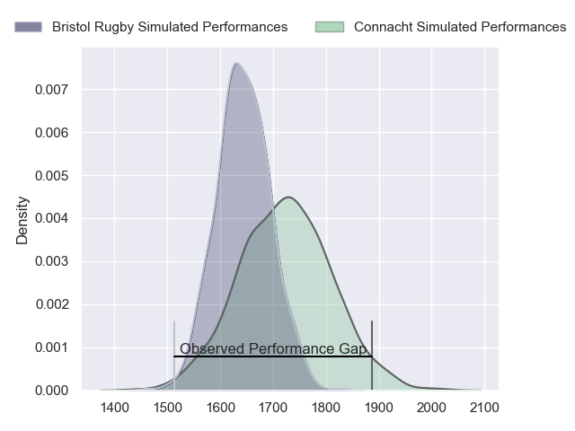
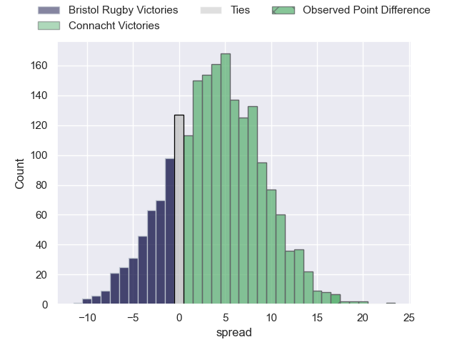
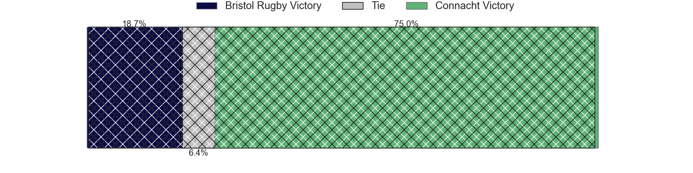
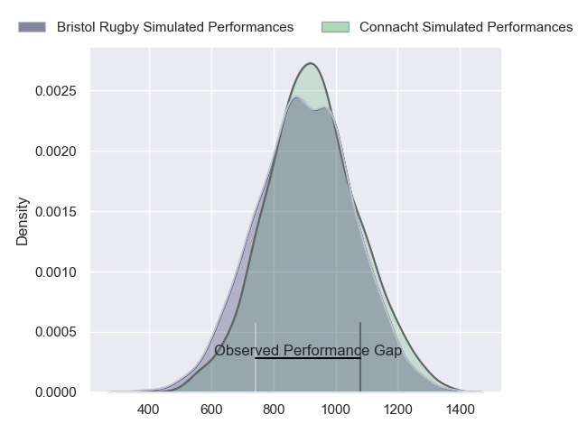
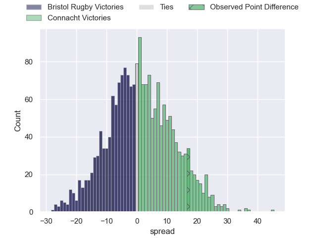
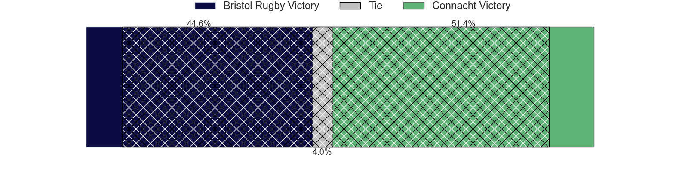
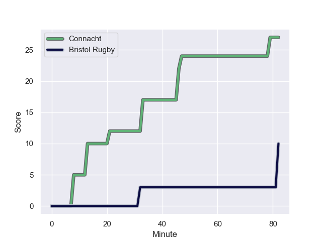
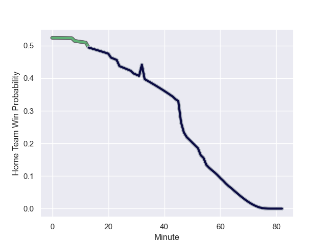

---  
layout: page  
title: Bristol Rugby at Connacht; 10-27  
date: 2024-01-19 18:00:00 -0500  
categories: "European Rugby Champions Cup 2023" match review  
---
# Bristol Rugby at Connacht; 10-27

# Club Level Predictions

The first set of predictions treats a club as the smallest object, as the club develops its members, organizes a gameplan, and deploys its players as needed for each match. This club model has a prediction of 0.608, which translates to predicting Connacht to win by 3.9.

Our Over/Under is 47.5 - and combined with the spread above, we have a predicted scoreline of 22 to 26

Each club has a rating and a rating deviation (similar to a Glicko rating), and expected performances can be generated. This allows for simulated matches and spreads like the ones below.
## Projected Performances - Club Model

## Projected Spreads - Club Model

## Projected Results - Club Model

# Player Level Predictions - Version 2

Treating teams instead as an entity made up of the currently active players, I have ratings for each player in an altogether different system. These can be combined to form team ratings once teamsheets are announced, weighting starters a bit higher than the reserves. After the match is played, players can be weighted by their minutes on the field, allowing for an accurate measure of the team's composition. With these compiled team ratings, we can make predictions, measure inaccuracy, and update the individual player ratings.
## Prediction with Player Minutes: Connacht by 1.1

Bristol Rugby by 4.3 on a neutral field
## Prediction without Player Minutes: Connacht by 0.6

Bristol Rugby by 4.8 on a neutral pitch

## Projected Performances - Player Model

## Projected Spreads - Player Model

## Projected Results - Player Model

## Scores over Time

## Win Probability over Time

There were 4 large changes in win probability in this match

|   Away Minutes | Away Player                |   Away elo |   Number |   Home elo | Home Player           |   Home Minutes |
|---------------:|:---------------------------|-----------:|---------:|-----------:|:----------------------|---------------:|
|             48 | Jake Woolmore              |      52.43 |        1 |      50.06 | Denis Buckley         |             55 |
|             44 | Gabriel Oghre              |      34.69 |        2 |      40.73 | Tadgh McElroy         |             56 |
|             74 | Kyle Sinckler              |      67.18 |        3 |      46.65 | Finlay Bealham        |             39 |
|             82 | Josh Caulfield             |      41.11 |        4 |      46.65 | Niall Murray          |             58 |
|             82 | Joe Batley                 |      53.73 |        5 |     119.44 | Joe Joyce             |             82 |
|             82 | Steven Luatua              |      90.42 |        6 |      34.39 | Cian Prendergast      |             82 |
|             62 | Fitz Harding               |      58.25 |        7 |      46.65 | Shamus Hurley-Langton |             82 |
|             82 | Magnus Bradbury            |      22.74 |        8 |      60.28 | Jarrad Butler         |             60 |
|             52 | Harry Randall              |      81.89 |        9 |      46.65 | Caolin Blade          |             73 |
|             82 | AJ MacGinty                |      90.26 |       10 |      79.14 | JJ Hanrahan           |             29 |
|             82 | Gabriel Ibitoye            |      77.64 |       11 |      46.35 | Shayne Bolton         |             82 |
|             82 | Benhard Janse van Rensburg |      76.55 |       12 |      46.65 | Bundee Aki            |             82 |
|             53 | Virimi Vakatawa            |      89.48 |       13 |      51    | David Hawkshaw        |             82 |
|             74 | Kalaveti Ravouvou          |      62.52 |       14 |       9.25 | Andrew Smith          |             82 |
|             82 | Max Malins                 |      39.42 |       15 |      46.65 | Tiernan O'Halloran    |             58 |
|             38 | Will Capon                 |      29.99 |       16 |      46.65 | Dave Heffernan        |             26 |
|              8 | Sam Grahamslaw             |      44.93 |       17 |     111.38 | Peter Dooley          |             27 |
|             42 | Max Lahiff                 |      34.01 |       18 |      46.65 | Jack Aungier          |             43 |
|             15 | Joe Owen                   |      46.65 |       19 |      41.32 | Oisin Dowling         |             24 |
|              5 | Daniel Thomas              |      46.59 |       20 |      68.22 | Conor Oliver          |             22 |
|             30 | Kieran Marmion             |      83.68 |       21 |      46.66 | Michael McDonald      |              9 |
|             19 | James Williams             |      37.08 |       22 |      87.82 | Jack Carty            |             53 |
|             10 | Piers O'Conor              |      46.65 |       23 |      46.65 | Oran McNulty          |             24 |

