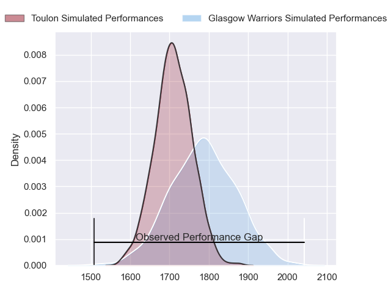
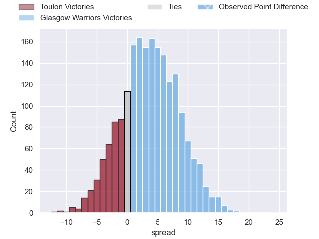
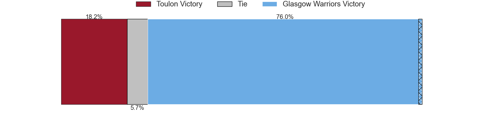
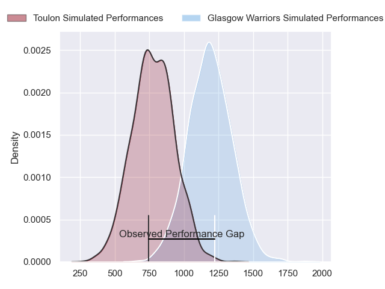
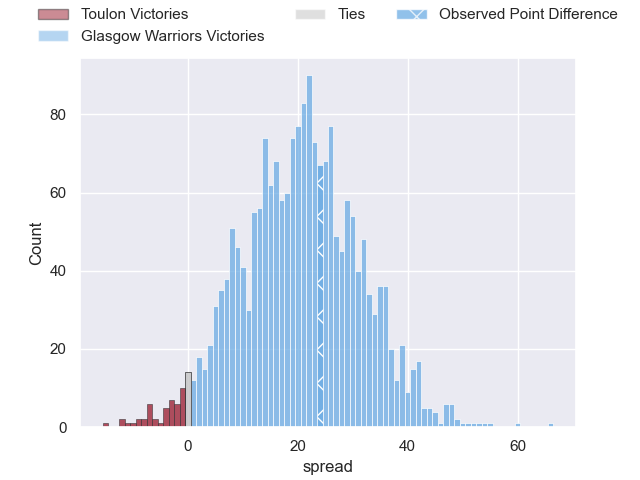
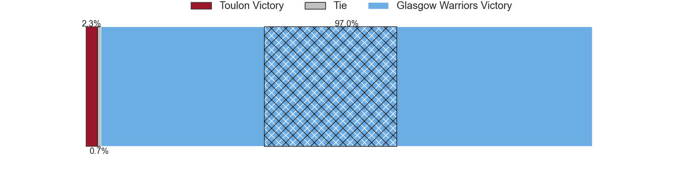
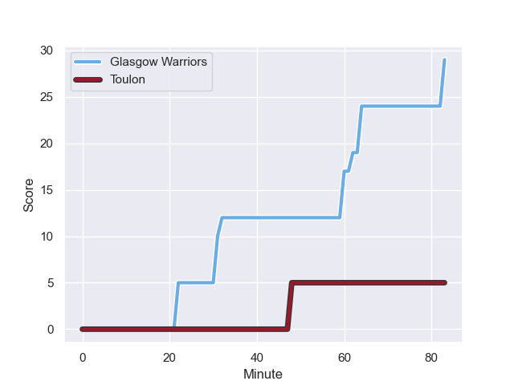
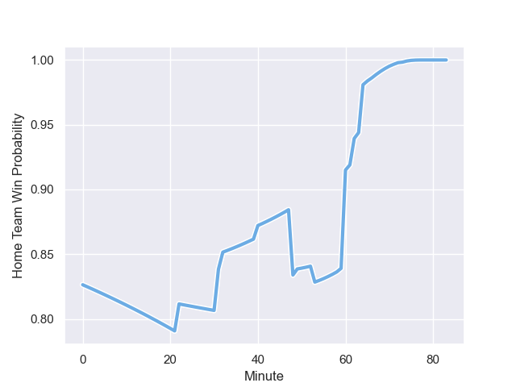

---  
layout: page  
title: Toulon at Glasgow Warriors; 5-29  
date: 2024-01-19 18:00:00 -0500  
categories: "European Rugby Champions Cup 2023" match review  
---
# Toulon at Glasgow Warriors; 5-29

# Club Level Predictions

The first set of predictions treats a club as the smallest object, as the club develops its members, organizes a gameplan, and deploys its players as needed for each match. This club model has a prediction of 0.605, which translates to predicting Glasgow Warriors to win by 3.7.

Our Over/Under is 46.5 - and combined with the spread above, we have a predicted scoreline of 21 to 25

Each club has a rating and a rating deviation (similar to a Glicko rating), and expected performances can be generated. This allows for simulated matches and spreads like the ones below.
## Projected Performances - Club Model

## Projected Spreads - Club Model

## Projected Results - Club Model

# Player Level Predictions - Version 2

Treating teams instead as an entity made up of the currently active players, I have ratings for each player in an altogether different system. These can be combined to form team ratings once teamsheets are announced, weighting starters a bit higher than the reserves. After the match is played, players can be weighted by their minutes on the field, allowing for an accurate measure of the team's composition. With these compiled team ratings, we can make predictions, measure inaccuracy, and update the individual player ratings.
## Prediction with Player Minutes: Glasgow Warriors by 17.1

Glasgow Warriors by 11.3 on a neutral field
## Prediction without Player Minutes: Glasgow Warriors by 18.1

Glasgow Warriors by 12.2 on a neutral pitch

## Projected Performances - Player Model

## Projected Spreads - Player Model

## Projected Results - Player Model

## Scores over Time

## Win Probability over Time

There were 4 large changes in win probability in this match

|   Away Minutes | Away Player       |   Away elo |   Number |   Home elo | Home Player       |   Home Minutes |
|---------------:|:------------------|-----------:|---------:|-----------:|:------------------|---------------:|
|             71 | Bruce Devaux      |      36.56 |        1 |      82.19 | Jamie Bhatti      |             53 |
|             66 | Teddy Baubigny    |      46.65 |        2 |     143.76 | George Turner     |             53 |
|             49 | Emerick Setiano   |      46.65 |        3 |      83.04 | Lucio Sordoni     |             53 |
|             83 | Swan Rebbadj      |      46.65 |        4 |      44.4  | Max Williamson    |             83 |
|             59 | Adrien Warion     |      46.65 |        5 |     106.6  | Scott Cummings    |             73 |
|             83 | Jules Coulon      |      54.07 |        6 |      19.23 | Ally Miller       |             40 |
|             62 | Matteo Le Corvec  |      46.97 |        7 |     102.84 | Matt Fagerson     |             66 |
|             83 | Facundo Isa       |      95.69 |        8 |      46.65 | Jack Dempsey      |             83 |
|             66 | Vasil Lobzhanidze |      46.65 |        9 |     162.44 | George Horne      |             73 |
|             83 | Jeremy Sinzelle   |      46.65 |       10 |      37.86 | Tom Jordan        |             83 |
|             34 | Gabin Villiere    |      46.65 |       11 |      66.77 | Kyle Rowe         |             83 |
|             41 | Mathieu Smaili    |      46.65 |       12 |      44.9  | Sione Tuipulotu   |             83 |
|             83 | Seta Tuicuvu      |      60.45 |       13 |      31.29 | Huw Jones         |             66 |
|             83 | Gael Drean        |      41.3  |       14 |      46.65 | Kyle Steyn        |             83 |
|             83 | Aymeric Luc       |      46.65 |       15 |      38.56 | Josh McKay        |             83 |
|             17 | Jack Singleton    |     103.99 |       16 |      46.65 | Johnny Matthews   |             30 |
|             12 | Fabio Gonzalez    |      46.65 |       17 |     102.79 | Oli Kebble        |             30 |
|             34 | Kieran Brookes    |      34.22 |       18 |     116.87 | Zander Fagerson   |             30 |
|             24 | Matthias Halagahu |      43.99 |       19 |      48.41 | Alex Samuel       |             10 |
|             21 | Cornell du Preez  |      84.17 |       20 |      46.65 | Euan Ferrie       |             43 |
|             17 | Jules Danglot     |      68.94 |       21 |     115.65 | Henco Venter      |             17 |
|             42 | Enzo Herve        |      46.65 |       22 |      46.65 | Ben Afshar        |             10 |
|             49 | Maelan Rabut      |      46.65 |       23 |      86.26 | Stafford McDowall |             17 |

