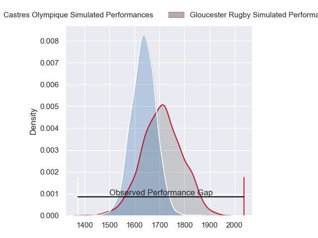
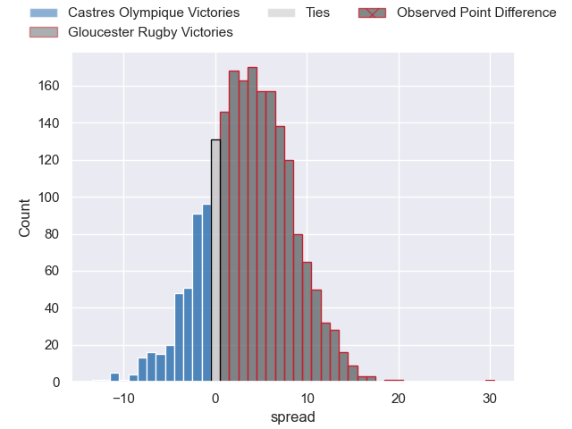
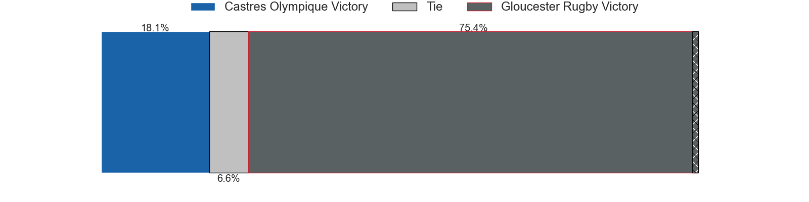
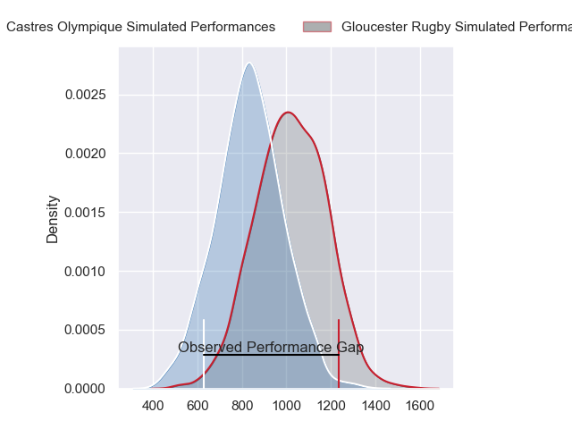
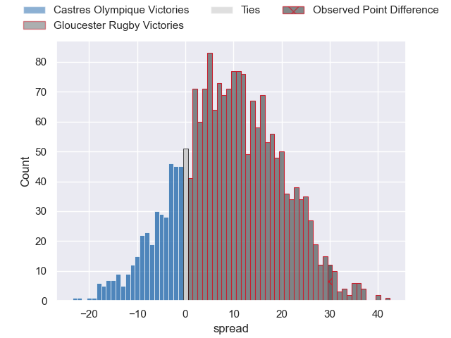
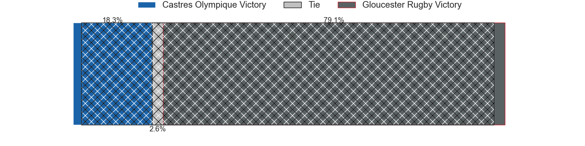
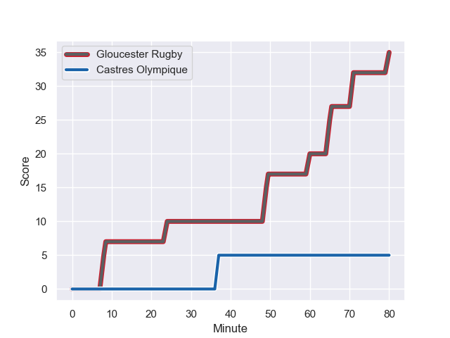
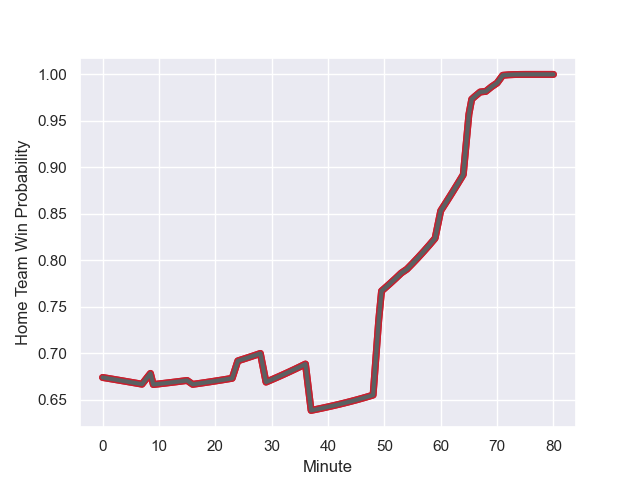

---  
layout: page  
title: Castres Olympique at Gloucester Rugby; 5-35  
date: 2024-01-19 18:00:00 -0500  
categories: "European Rugby Challenge Cup 2023" match review  
---
# Castres Olympique at Gloucester Rugby; 5-35

# Club Level Predictions

The first set of predictions treats a club as the smallest object, as the club develops its members, organizes a gameplan, and deploys its players as needed for each match. This club model has a prediction of 0.606, which translates to predicting Gloucester Rugby to win by 3.8.

Our Over/Under is 41.5 - and combined with the spread above, we have a predicted scoreline of 19 to 23

Each club has a rating and a rating deviation (similar to a Glicko rating), and expected performances can be generated. This allows for simulated matches and spreads like the ones below.
## Projected Performances - Club Model

## Projected Spreads - Club Model

## Projected Results - Club Model

# Player Level Predictions - Version 2

Treating teams instead as an entity made up of the currently active players, I have ratings for each player in an altogether different system. These can be combined to form team ratings once teamsheets are announced, weighting starters a bit higher than the reserves. After the match is played, players can be weighted by their minutes on the field, allowing for an accurate measure of the team's composition. With these compiled team ratings, we can make predictions, measure inaccuracy, and update the individual player ratings.
## Prediction with Player Minutes: Gloucester Rugby by 8.0

Gloucester Rugby by 0.1 on a neutral field
## Prediction without Player Minutes: Gloucester Rugby by 9.0

Gloucester Rugby by 0.9 on a neutral pitch

## Projected Performances - Player Model

## Projected Spreads - Player Model

## Projected Results - Player Model

## Scores over Time

## Win Probability over Time

There were 6 large changes in win probability in this match

|   Away Minutes | Away Player                |   Away elo |   Number |   Home elo | Home Player         |   Home Minutes |
|---------------:|:---------------------------|-----------:|---------:|-----------:|:--------------------|---------------:|
|             29 | Wayan de Benedittis        |      50.02 |        1 |      10.67 | Jamal Ford-Robinson |             68 |
|             62 | Gaetan Barlot              |      85.89 |        2 |      64.71 | George McGuigan     |             60 |
|             29 | Aurélien Azar              |      26.95 |        3 |      25.08 | Fraser Balmain      |             16 |
|             80 | Gauthier Maravat           |      -1.12 |        4 |      50.4  | Freddie Clarke      |             62 |
|             54 | Tom Staniforth             |      62.01 |        5 |      51.03 | Matias Alemanno     |             80 |
|             80 | Mathieu Babillot           |      59.11 |        6 |      34.17 | Jack Clement        |             62 |
|             80 | Nick Champion de Crespigny |      57.85 |        7 |     104.12 | Ruan Ackermann      |             80 |
|             62 | Abraham Papali'i           |      53.94 |        8 |      50.61 | Zach Mercer         |             80 |
|             54 | Santiago Arata             |      57.8  |        9 |      56.15 | Caolan Englefield   |             68 |
|             54 | Pierre Popelin             |      51.09 |       10 |     122.2  | Adam Hastings       |             67 |
|             80 | Nathanael Hulleu           |      68.9  |       11 |      87.68 | Ollie Thorley       |             80 |
|             80 | Adrea Cocagi               |      79.87 |       12 |       6.67 | Sebastien Atkinson  |             80 |
|             80 | Adrien Seguret             |      34.71 |       13 |      53.36 | Chris Harris        |             68 |
|              9 | Martin Laveau              |      36.69 |       14 |      45.83 | Jonny May           |             80 |
|             80 | Geoffrey Palis             |      86.02 |       15 |      83.59 | Santiago Carreras   |             80 |
|             51 | Antoine Tichit             |      90.09 |       16 |      26.23 | Harry Elrington     |             12 |
|             18 | Pierre Colonna             |      20.59 |       17 |      30.09 | Sebastian Blake     |             20 |
|             51 | Esteban Talalua            |      46.65 |       18 |      17.21 | Ciaran Knight       |             64 |
|             26 | Florent Vanverberghe       |      49.32 |       19 |      82.86 | Albert Tuisue       |             18 |
|             18 | Yann Peysson               |      47.13 |       20 |      41.65 | Lewis Ludlow        |             18 |
|             26 | Jeremy Fernandez           |      10.61 |       21 |       5.49 | Stephen Varney      |             12 |
|             26 | Vilimoni Botitu            |      56.68 |       22 |      39.55 | Josh Hathaway       |             13 |
|             71 | Josaia Raisuqe             |      55.22 |       23 |      92.13 | Max Llewellyn       |             12 |

