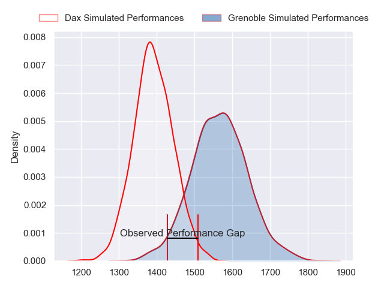
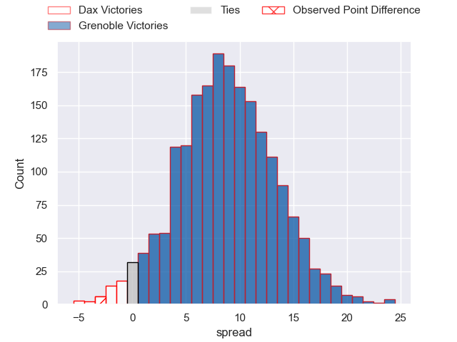
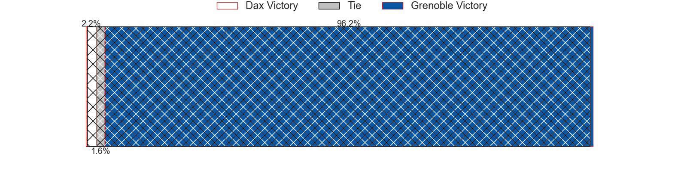
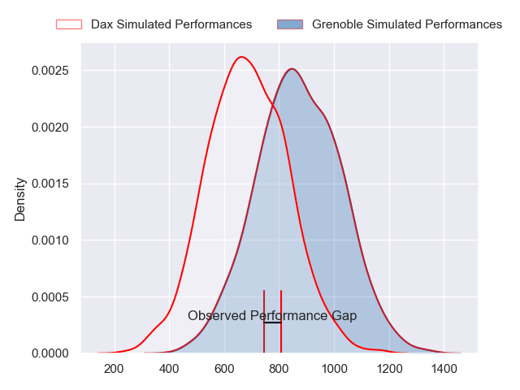
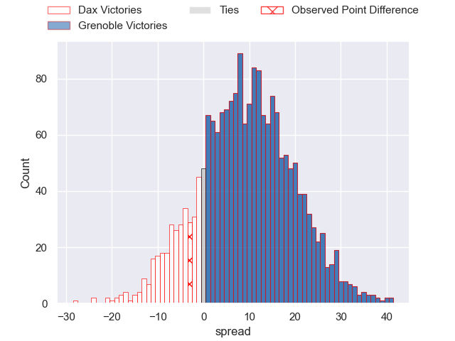
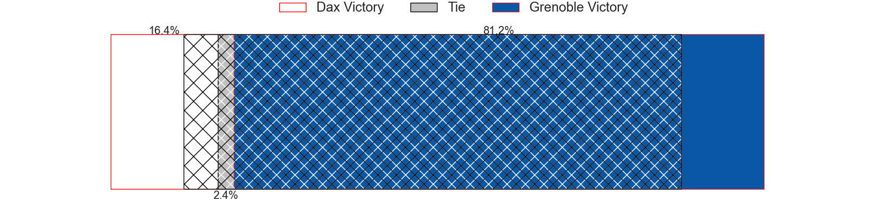
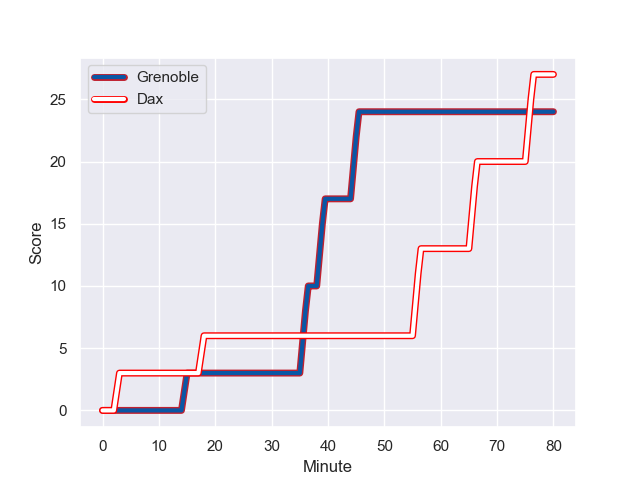
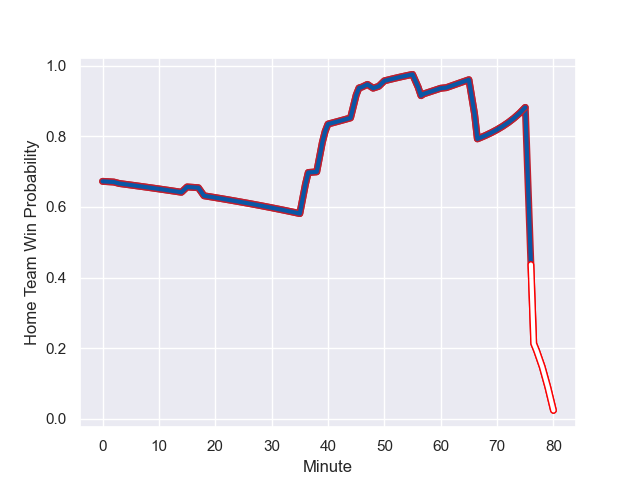

---  
layout: page  
title: Dax at Grenoble; 27-24  
date: 2024-01-19 18:00:00 -0500  
categories: "Pro D2 2023" match review  
---
# Dax at Grenoble; 27-24

# Club Level Predictions

The first set of predictions treats a club as the smallest object, as the club develops its members, organizes a gameplan, and deploys its players as needed for each match. This club model has a prediction of 0.726, which translates to predicting Grenoble to win by 8.6.

Our Over/Under is 43.5 - and combined with the spread above, we have a predicted scoreline of 17 to 26

Each club has a rating and a rating deviation (similar to a Glicko rating), and expected performances can be generated. This allows for simulated matches and spreads like the ones below.
## Projected Performances - Club Model

## Projected Spreads - Club Model

## Projected Results - Club Model

# Player Level Predictions - Version 2

Treating teams instead as an entity made up of the currently active players, I have ratings for each player in an altogether different system. These can be combined to form team ratings once teamsheets are announced, weighting starters a bit higher than the reserves. After the match is played, players can be weighted by their minutes on the field, allowing for an accurate measure of the team's composition. With these compiled team ratings, we can make predictions, measure inaccuracy, and update the individual player ratings.
## Prediction with Player Minutes: Grenoble by 7.9

Dax by 0.3 on a neutral field
## Prediction without Player Minutes: Grenoble by 6.7

Dax by 0.9 on a neutral pitch

## Projected Performances - Player Model

## Projected Spreads - Player Model

## Projected Results - Player Model

## Scores over Time

## Win Probability over Time

There were 13 large changes in win probability in this match

|   Away Minutes | Away Player           |   Away elo |   Number |   Home elo | Home Player                 |   Home Minutes |
|---------------:|:----------------------|-----------:|---------:|-----------:|:----------------------------|---------------:|
|             50 | Asa Faitotoa          |      10.62 |        1 |      57.29 | Zack Gauthier               |             48 |
|             50 | Iban Hiriart-Urruty   |      55.77 |        2 |      48.47 | Barnabé Massa               |             48 |
|             50 | Nephi Leatigaga       |       8.59 |        3 |      51.78 | Regis Montagne              |             48 |
|             80 | Mattieu Bidau         |      46.93 |        4 |      58.09 | Pierce Phillips             |             80 |
|             40 | Mat Luamanu           |      66.29 |        5 |      65.03 | Georgi Javakhia             |             61 |
|             80 | Jean-Baptiste Barrère |      32.28 |        6 |      48.63 | Thibaut Martel              |             80 |
|             50 | Paul Arnaud Ausset    |      68.37 |        7 |       6.8  | Steeve Blanc-Mappaz         |             80 |
|             80 | Genesis Mamea Lemalu  |      88.74 |        8 |      33.56 | Tala Gray                   |             80 |
|             57 | Paul Ravier           |      52.81 |        9 |      13.5  | Barnabe Couilloud           |             47 |
|             80 | Hugo Cerisier         |      54.42 |       10 |      77.84 | Sam Davies                  |             47 |
|             80 | Jope Naceava          |      51.3  |       11 |      45.19 | Karim Qadiri                |             80 |
|             40 | Alex McHenry          |      75.91 |       12 |      49.73 | Romain Trouilloud           |             61 |
|             80 | Benjamin Puntous      |      16.01 |       13 |      25.51 | Atunaisa Taulanga Vaka Manu |             80 |
|             61 | Hugo Fourquet         |      88.93 |       14 |      23.85 | Geoffrey Cros               |             80 |
|             80 | Théo Gatelier         |      45.57 |       15 |     115.04 | Julien Farnoux              |             80 |
|             40 | Theo Dachary          |      -2.47 |       16 |      91.94 | Bautista Ezcurra            |             33 |
|             40 | Étienne Loiret        |      44.61 |       17 |      15.76 | Romain Barthelemy           |             33 |
|             30 | Louis Barrere         |      26.45 |       18 |      50.79 | Siua Halanukonuka           |             32 |
|             30 | David Lolohea         |       9.47 |       19 |      22.36 | Mathis Sarragallet          |             32 |
|             30 | Diogo Hasse Ferreira  |      13.65 |       20 |      19.29 | Eli Eglaine                 |             32 |
|             30 | Théo Tremeau          |      40.05 |       21 |      46.65 | Hilan Delbois Fontaine      |             19 |
|             23 | Sylvère Reteau        |      43.16 |       22 |      15.98 | Romain Fusier               |             19 |
|             19 | Théo Duprat           |      55.96 |       23 |     nan    | nan                         |            nan |

