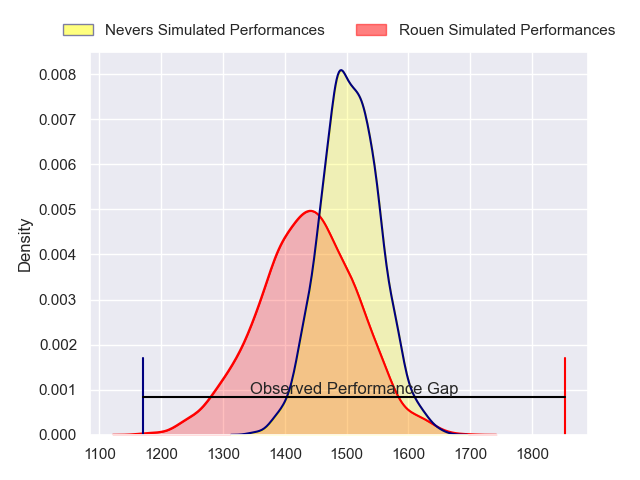
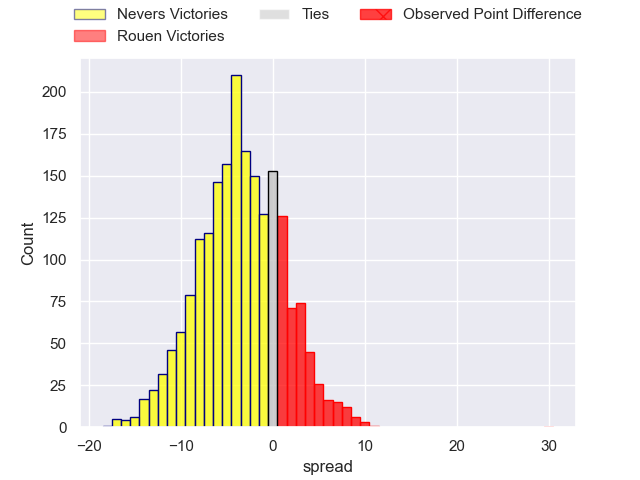
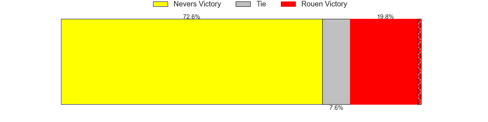
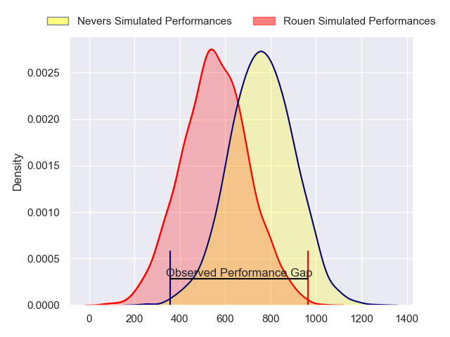
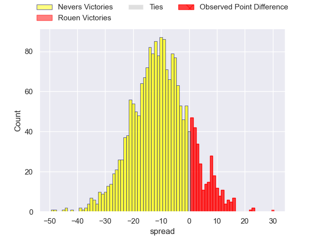
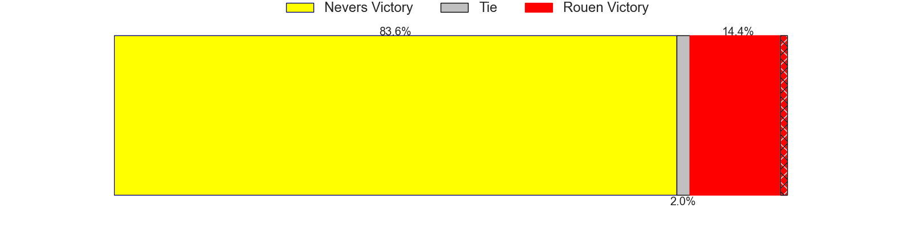
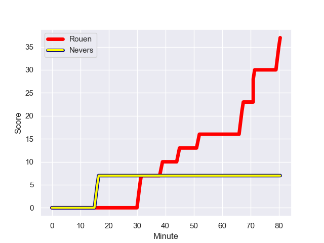
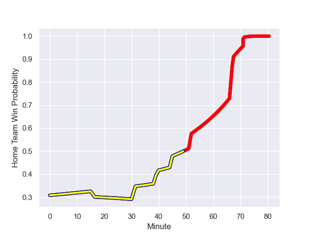

---  
layout: page  
title: Nevers at Rouen; 7-37  
date: 2024-01-19 18:00:00 -0500  
categories: "Pro D2 2023" match review  
---
# Nevers at Rouen; 7-37

# Club Level Predictions

The first set of predictions treats a club as the smallest object, as the club develops its members, organizes a gameplan, and deploys its players as needed for each match. This club model has a prediction of 0.404, which translates to predicting Nevers to win by 3.4.

Our Over/Under is 34.5 - and combined with the spread above, we have a predicted scoreline of 19 to 16

Each club has a rating and a rating deviation (similar to a Glicko rating), and expected performances can be generated. This allows for simulated matches and spreads like the ones below.
## Projected Performances - Club Model

## Projected Spreads - Club Model

## Projected Results - Club Model

# Player Level Predictions - Version 2

Treating teams instead as an entity made up of the currently active players, I have ratings for each player in an altogether different system. These can be combined to form team ratings once teamsheets are announced, weighting starters a bit higher than the reserves. After the match is played, players can be weighted by their minutes on the field, allowing for an accurate measure of the team's composition. With these compiled team ratings, we can make predictions, measure inaccuracy, and update the individual player ratings.
## Prediction with Player Minutes: Nevers by 8.9

Nevers by 12.6 on a neutral field
## Prediction without Player Minutes: Nevers by 9.4

Nevers by 13.2 on a neutral pitch

## Projected Performances - Player Model

## Projected Spreads - Player Model

## Projected Results - Player Model

## Scores over Time

## Win Probability over Time

There were 7 large changes in win probability in this match

|   Away Minutes | Away Player              |   Away elo |   Number |   Home elo | Home Player       |   Home Minutes |
|---------------:|:-------------------------|-----------:|---------:|-----------:|:------------------|---------------:|
|             41 | Tornike Mataradze        |      59.85 |        1 |      -2.2  | Elias El Ansari   |             53 |
|             55 | Quentin Beaudaux         |      54.36 |        2 |     -25.21 | Jeremie Maurouard |             53 |
|             41 | Cleopas Kundiona         |      38.22 |        3 |      45.7  | Soso Bekoshvili   |             53 |
|             68 | Christiaan van der Merwe |      -7.77 |        4 |       9.95 | Will Witty        |             57 |
|             41 | Makatuki Polutele        |      26.49 |        5 |      35.68 | Jimi Maximin      |             37 |
|             80 | Julien Kazubek           |      78.5  |        6 |      46.57 | Tienie Burger     |             80 |
|             40 | Hugues Bastide           |      82.16 |        7 |       5.98 | Samuel Maximin    |             80 |
|             80 | Kevin Noah               |      45.91 |        8 |      20.04 | Tino Mapapalangi  |             40 |
|             58 | Hugo Bouyssou            |      18.16 |        9 |      52.69 | Maxime Sidobre    |             57 |
|             58 | Shaun Reynolds           |      51.06 |       10 |      61.63 | Franck Pourteau   |             80 |
|             80 | Thomas Zenon             |      20.09 |       11 |      34.16 | Paul Vallee       |             80 |
|             80 | Alifereti Loaloa         |      87.62 |       12 |      65.98 | Taylor Gontineac  |             53 |
|             80 | Arthur Mathiron          |      58.23 |       13 |      10.63 | JT Jackson        |             80 |
|             80 | Christian Ambadiang      |      72.04 |       14 |       3.19 | Alex Luatua       |             80 |
|             80 | Kylian Jaminet           |      80.91 |       15 |      50.09 | Baptiste Mouchous |             80 |
|             40 | Luka Plataret            |      47.37 |       16 |      37.23 | Jean Leleu        |             43 |
|             39 | Jordan Seneca            |      54.45 |       17 |      76.03 | Julien Ruaud      |             40 |
|             39 | Steven David             |      43.33 |       18 |      32.06 | Pablo Patilla     |             27 |
|             39 | Ilia Kaikatsishvili      |      50    |       19 |      32.83 | Cody Thomas       |             27 |
|             25 | Jonathan Maiau           |      31.47 |       20 |      27.77 | Efi Ma'afu        |             27 |
|             22 | Guillaume Manevy         |      26.86 |       21 |      37.15 | Antoine Fournier  |             27 |
|             22 | Yohan Le Bourhis         |      44.36 |       22 |      32.04 | Abdelkarim Fofana |             23 |
|             12 | Joaquin Dominguez        |      49.64 |       23 |      20.87 | Florent Campeggia |             23 |

