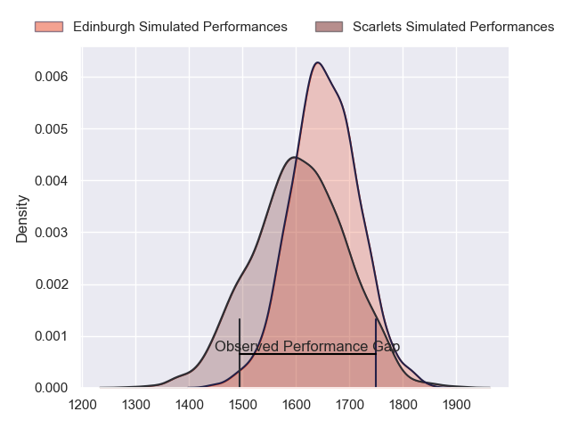
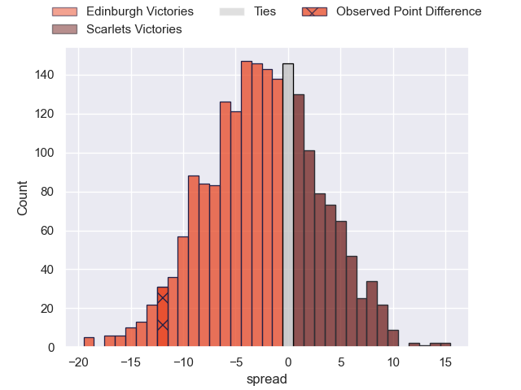
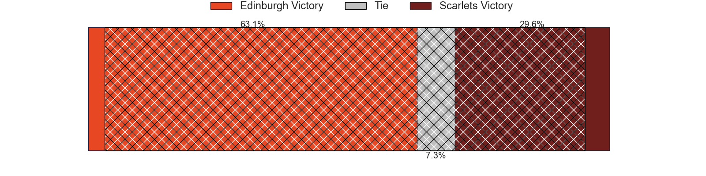
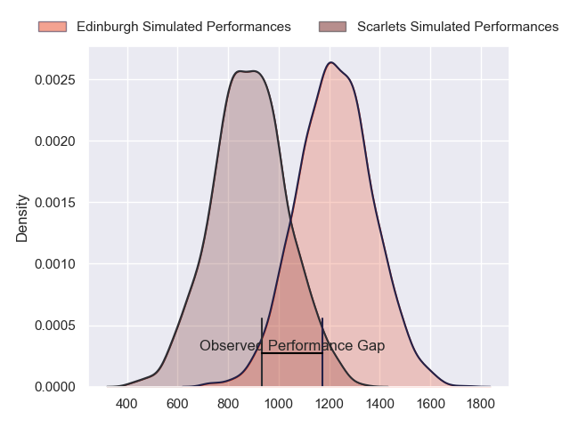
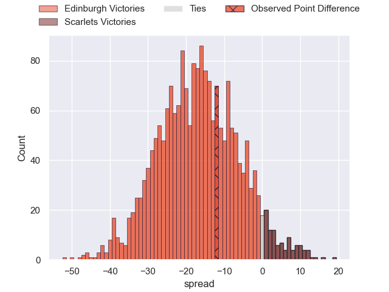
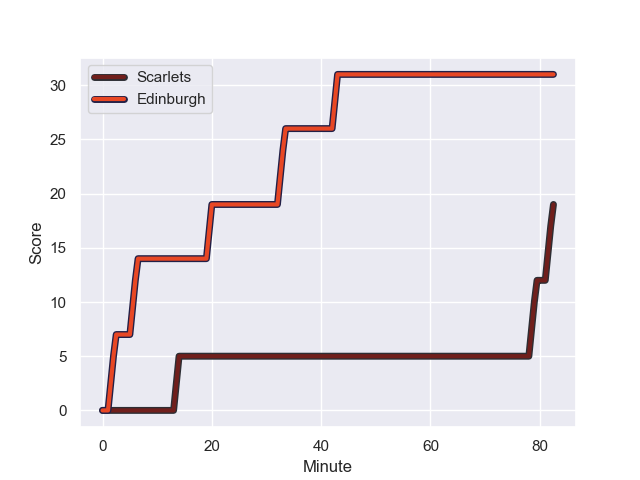
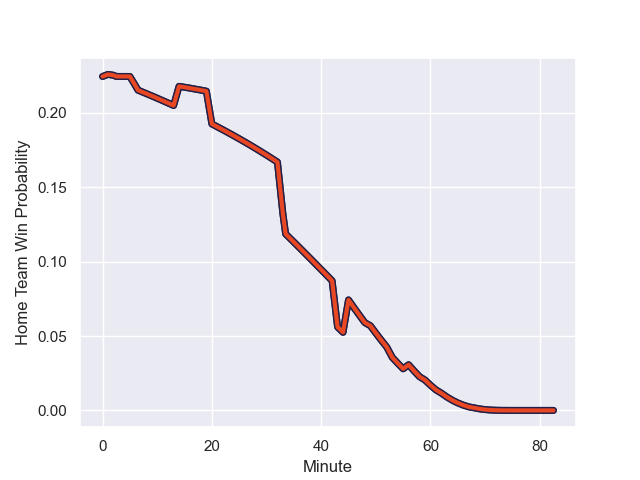

---  
layout: page  
title: Edinburgh at Scarlets; 31-19  
date: 2024-01-19 18:00:00 -0500  
categories: "European Rugby Challenge Cup 2023" match review  
---
# Edinburgh at Scarlets; 31-19

# Club Level Predictions

The first set of predictions treats a club as the smallest object, as the club develops its members, organizes a gameplan, and deploys its players as needed for each match. This club model has a prediction of 0.432, which translates to predicting Edinburgh to win by 2.4.

Our Over/Under is 45.5 - and combined with the spread above, we have a predicted scoreline of 24 to 22

Each club has a rating and a rating deviation (similar to a Glicko rating), and expected performances can be generated. This allows for simulated matches and spreads like the ones below.
## Projected Performances - Club Model

## Projected Spreads - Club Model

## Projected Results - Club Model

# Player Level Predictions - Version 2

Treating teams instead as an entity made up of the currently active players, I have ratings for each player in an altogether different system. These can be combined to form team ratings once teamsheets are announced, weighting starters a bit higher than the reserves. After the match is played, players can be weighted by their minutes on the field, allowing for an accurate measure of the team's composition. With these compiled team ratings, we can make predictions, measure inaccuracy, and update the individual player ratings.
## Prediction with Player Minutes: Edinburgh by 13.6

Edinburgh by 19.5 on a neutral field
## Prediction without Player Minutes: Edinburgh by 13.5

Edinburgh by 19.3 on a neutral pitch

## Projected Performances - Player Model

## Projected Spreads - Player Model

## Projected Results - Player Model

## Scores over Time

## Win Probability over Time

There were 2 large changes in win probability in this match

|   Away Minutes | Away Player         |   Away elo |   Number |   Home elo | Home Player      |   Home Minutes |
|---------------:|:--------------------|-----------:|---------:|-----------:|:-----------------|---------------:|
|             59 | Pierre Schoeman     |      71    |        1 |      35.26 | Steffan Thomas   |             45 |
|             59 | Dave Cherry         |      59.14 |        2 |      95.01 | Ryan Elias       |             49 |
|             59 | WP Nel              |     130.07 |        3 |      23.61 | Harri O'Connor   |             49 |
|             56 | Sam Skinner         |      80.34 |        4 |      35.12 | Alex Craig       |             80 |
|             80 | Grant Gilchrist     |      97.95 |        5 |       4.75 | Jac Price        |             53 |
|             68 | Luke Crosbie        |     110.96 |        6 |      35.64 | Ben Williams     |             80 |
|             80 | Hamish Watson       |      72.66 |        7 |      82.72 | Dan Davis        |             69 |
|             45 | Viliame Mata        |      74.12 |        8 |     115.7  | Vaea Fifita      |             80 |
|             62 | Ben Vellacott       |      79.95 |        9 |      49.73 | Kieran Hardy     |             49 |
|             68 | Ben Healy           |      78.08 |       10 |       8.11 | Ioan Lloyd       |             80 |
|             80 | Duhan van der Merwe |      82.7  |       11 |      36.37 | Ryan Conbeer     |             80 |
|             80 | James Lang          |      96.53 |       12 |      38.32 | Jonathan Davies  |             80 |
|             80 | Matt Currie         |      89.49 |       13 |      58.98 | Joe Roberts      |             80 |
|             80 | Chris Dean          |      21.14 |       14 |      75.2  | Steffan Evans    |             49 |
|             80 | Emiliano Boffelli   |      79.54 |       15 |      42.91 | Ioan Nicholas    |             59 |
|             23 | Boan Venter         |      28.26 |       16 |      69.66 | Kemsley Mathias  |             37 |
|             23 | Ewan Ashman         |      62.39 |       17 |      82.08 | Eduan Swart      |             33 |
|             23 | Angus Williams      |      47.35 |       18 |      43.48 | Sam Wainwright   |             33 |
|             26 | Glen Young          |      -1.06 |       19 |     -18.95 | Morgan Jones     |             29 |
|             14 | Thomas Dodd         |      93.35 |       20 |      14.84 | Shaun Evans      |             13 |
|             37 | Jamie Ritchie       |     179.14 |       21 |      37.02 | Gareth Davies    |             33 |
|             20 | Ali Price           |      88.14 |       22 |      43.11 | Charlie Titcombe |             23 |
|             14 | Cameron Scott       |      53.53 |       23 |      99.01 | Tomi Lewis       |             33 |

