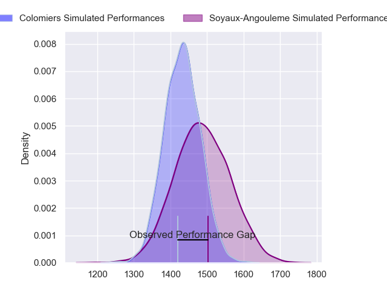
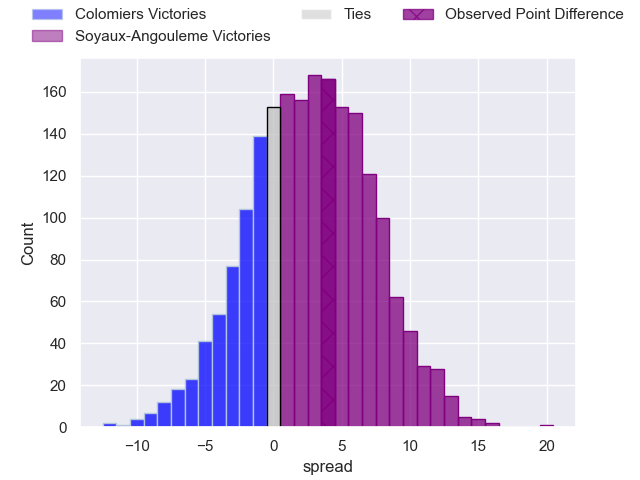
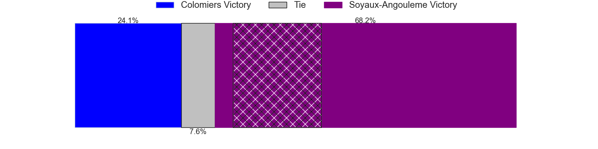
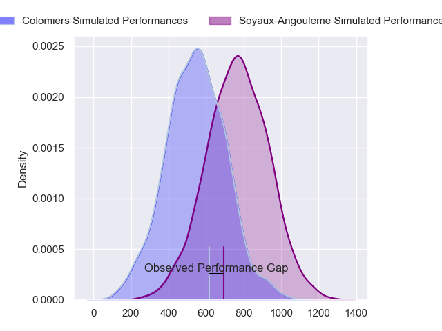
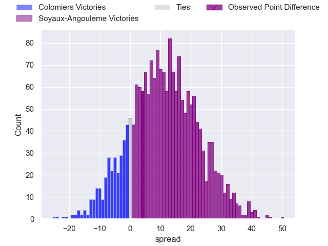
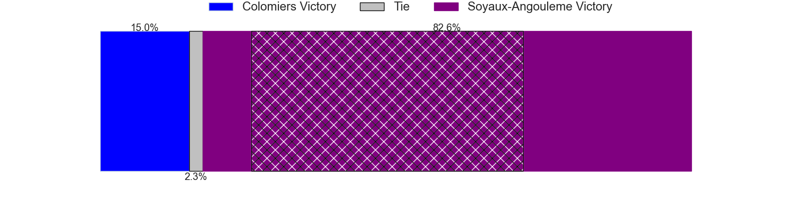
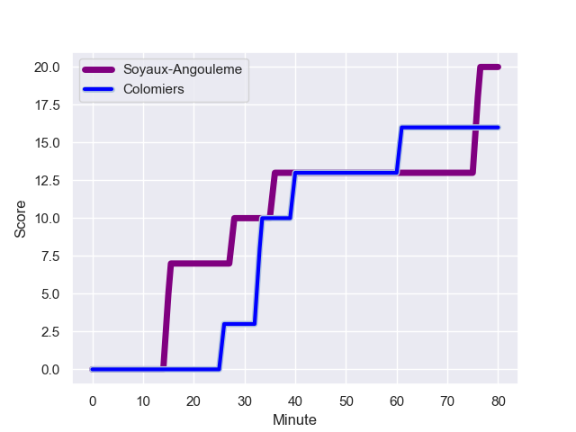
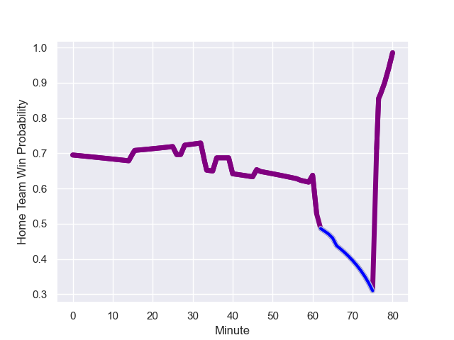

---  
layout: page  
title: Colomiers at Soyaux-Angouleme; 16-20  
date: 2024-01-19 18:00:00 -0500  
categories: "Pro D2 2023" match review  
---
# Colomiers at Soyaux-Angouleme; 16-20

# Club Level Predictions

The first set of predictions treats a club as the smallest object, as the club develops its members, organizes a gameplan, and deploys its players as needed for each match. This club model has a prediction of 0.575, which translates to predicting Soyaux-Angouleme to win by 2.7.

Our Over/Under is 46.5 - and combined with the spread above, we have a predicted scoreline of 22 to 25

Each club has a rating and a rating deviation (similar to a Glicko rating), and expected performances can be generated. This allows for simulated matches and spreads like the ones below.
## Projected Performances - Club Model

## Projected Spreads - Club Model

## Projected Results - Club Model

# Player Level Predictions - Version 2

Treating teams instead as an entity made up of the currently active players, I have ratings for each player in an altogether different system. These can be combined to form team ratings once teamsheets are announced, weighting starters a bit higher than the reserves. After the match is played, players can be weighted by their minutes on the field, allowing for an accurate measure of the team's composition. With these compiled team ratings, we can make predictions, measure inaccuracy, and update the individual player ratings.
## Prediction with Player Minutes: Soyaux-Angouleme by 9.1

Soyaux-Angouleme by 4.7 on a neutral field
## Prediction without Player Minutes: Soyaux-Angouleme by 8.6

Soyaux-Angouleme by 4.2 on a neutral pitch

## Projected Performances - Player Model

## Projected Spreads - Player Model

## Projected Results - Player Model

## Scores over Time

## Win Probability over Time

There were 11 large changes in win probability in this match

|   Away Minutes | Away Player           |   Away elo |   Number |   Home elo | Home Player            |   Home Minutes |
|---------------:|:----------------------|-----------:|---------:|-----------:|:-----------------------|---------------:|
|             66 | Hugo Djehi            |      54.08 |        1 |      58.59 | Omar Odishvili         |             57 |
|             60 | Thomas Larrieu        |      -2.7  |        2 |      58.49 | Rayne Barka            |             65 |
|             66 | Hugo Pirlet           |      45.26 |        3 |       7.79 | Yassine Boutemane      |             57 |
|             66 | Anthony Coletta       |      18.56 |        4 |      49.36 | Ian Kitwanga           |             41 |
|             80 | Jean Thomas           |      47.86 |        5 |      59.7  | Sikeli Nabou           |             80 |
|             62 | Alexis Caumel         |      46.65 |        6 |      60.58 | Germain Burgaud        |             80 |
|             80 | Jorick Dastugue       |      29.62 |        7 |      76.68 | Nicolas Martins        |             80 |
|             46 | Joseva Tamani         |      46.54 |        8 |      47.69 | Hubert Texier          |             47 |
|             46 | Mathis Galthié        |      55.67 |        9 |      -7.26 | Adrien Bau             |             62 |
|             80 | Maxime Javaux         |      26.23 |       10 |      30.08 | Corentin Glenat        |             80 |
|             80 | Farell Delourmel      |      46.65 |       11 |      41.67 | Eoghan Barrett         |             62 |
|             80 | Fabien Perrin         |      39.59 |       12 |      34.18 | Mathis Lafon           |             80 |
|             80 | Martin Dulon          |      -0.32 |       13 |      54.72 | Akuila Joeli Tabualevu |             80 |
|             80 | Vincent Pinto         |      73.31 |       14 |      30.66 | Marvin Lestremau       |             80 |
|             75 | Valentin Saurs        |      26.33 |       15 |      49.22 | Jules Dubecq           |             80 |
|             34 | Waël Ponpon           |      36.48 |       16 |      49.69 | William Greatbanks     |             24 |
|             34 | Ugo Seguela           |      29.48 |       17 |      42.32 | Alexander Masibaka     |             33 |
|             20 | Pablo Dimcheff        |      38.6  |       18 |      48.96 | Luca Tabarot           |             23 |
|             18 | Aldric Lescure        |      67.85 |       19 |      54.32 | Omar Dahir             |             23 |
|             14 | Pierre-Samuel Pacheco |      38.02 |       20 |      23.82 | Alexis Levron          |             18 |
|             14 | Romain Bezian         |      49.36 |       21 |      39.14 | Inaki Ayarza           |             18 |
|             14 | Toma Kolokilagi       |      44.65 |       22 |      50.35 | Georgy Balakarev       |             15 |
|              5 | Brett Herron          |      -8.54 |       23 |      51.69 | Léo Morand-Bruyat      |             15 |

