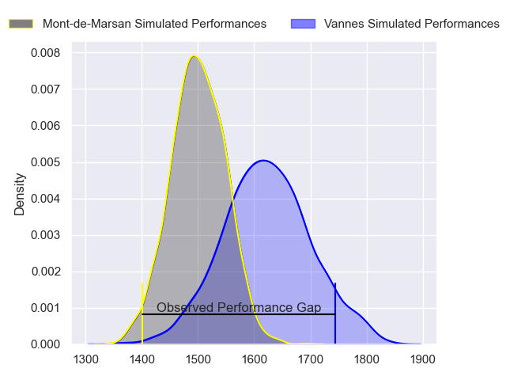
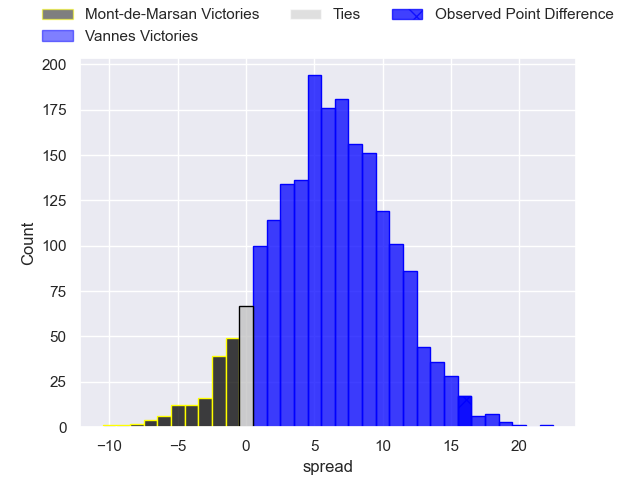
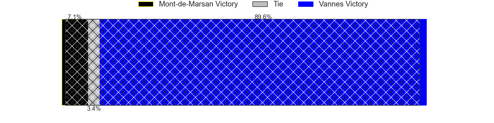
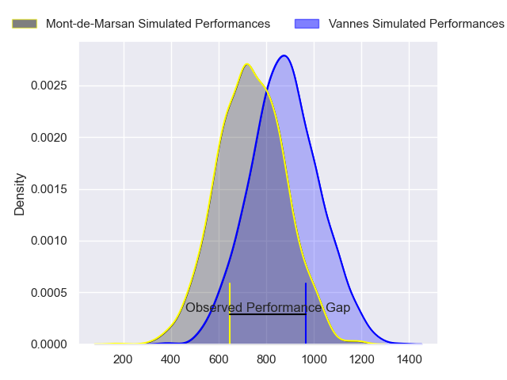
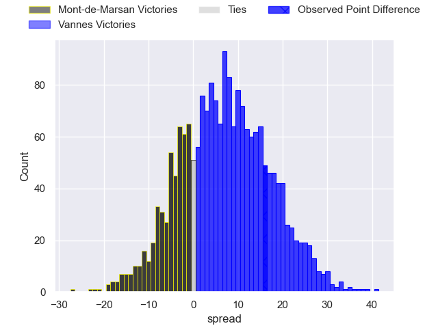
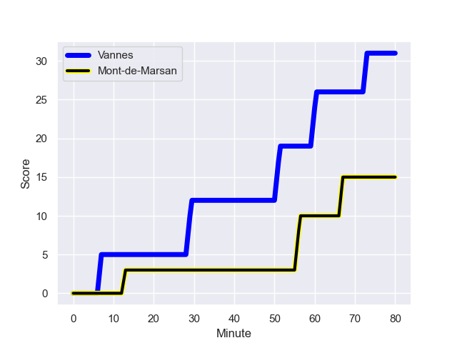
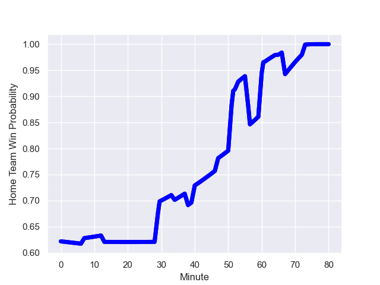

---  
layout: page  
title: Mont-de-Marsan at Vannes; 15-31  
date: 2024-01-19 18:00:00 -0500  
categories: "Pro D2 2023" match review  
---
# Mont-de-Marsan at Vannes; 15-31

# Club Level Predictions

The first set of predictions treats a club as the smallest object, as the club develops its members, organizes a gameplan, and deploys its players as needed for each match. This club model has a prediction of 0.668, which translates to predicting Vannes to win by 6.1.

Our Over/Under is 43.5 - and combined with the spread above, we have a predicted scoreline of 19 to 25

Each club has a rating and a rating deviation (similar to a Glicko rating), and expected performances can be generated. This allows for simulated matches and spreads like the ones below.
## Projected Performances - Club Model

## Projected Spreads - Club Model

## Projected Results - Club Model

# Player Level Predictions - Version 2

Treating teams instead as an entity made up of the currently active players, I have ratings for each player in an altogether different system. These can be combined to form team ratings once teamsheets are announced, weighting starters a bit higher than the reserves. After the match is played, players can be weighted by their minutes on the field, allowing for an accurate measure of the team's composition. With these compiled team ratings, we can make predictions, measure inaccuracy, and update the individual player ratings.
## Prediction with Player Minutes: Vannes by 5.4

Vannes by 1.1 on a neutral field
## Prediction without Player Minutes: Vannes by 5.6

Vannes by 1.3 on a neutral pitch

## Projected Performances - Player Model

## Projected Spreads - Player Model

## Projected Results - Player Model

## Scores over Time

## Win Probability over Time

There were 8 large changes in win probability in this match

|   Away Minutes | Away Player               |   Away elo |   Number |   Home elo | Home Player           |   Home Minutes |
|---------------:|:--------------------------|-----------:|---------:|-----------:|:----------------------|---------------:|
|             40 | Thomas Bultel             |      35.34 |        1 |      59.78 | Andy Bordelai         |             34 |
|             53 | Torsten van Jaarsveld     |     110.64 |        2 |      54.5  | Pat Leafa             |             47 |
|             40 | Mattéo Lalanne            |      46.38 |        3 |      76.46 | Paga Tafili           |             47 |
|             61 | Nicolas Garrault          |      21.12 |        4 |      65.42 | Darren O'Shea         |             47 |
|             80 | Aston Fortuin             |      29.77 |        5 |      46.41 | Anton Bresler         |             65 |
|             80 | Léo Banos                 |      77.94 |        6 |      26.79 | Léon Boulier          |             80 |
|             80 | Veresa Tuqovu Ramototabua |      72.93 |        7 |      97.1  | Francisco Gorrissen   |             80 |
|             40 | Mike Faleafa              |      33.49 |        8 |       5.31 | Karl Chateau          |             47 |
|             53 | Kevin Viallard            |      45.87 |        9 |     102.34 | Michael Ruru          |             65 |
|             53 | Joris Pialot              |      24.2  |       10 |      44.54 | Jean Cotarmanac'h     |             47 |
|             80 | Eroni Sau                 |      74.85 |       11 |      33.21 | Romaric Camou         |             80 |
|             38 | Patricio Fernandez        |      60.22 |       12 |      -0.5  | Alex Arrate           |             80 |
|             80 | Gatien Masse              |      43.92 |       13 |      73.53 | Sacha Valleau         |             80 |
|             80 | Pierre Sayerse            |      53.96 |       14 |      26.55 | Martin Alonso Munoz   |             80 |
|             80 | Simao Broeiro Bento       |      28.4  |       15 |      55.22 | Paul Surano           |             80 |
|             42 | Nacani Wakaya             |      97.86 |       16 |      42.12 | Charles-Henri Berguet |             46 |
|             40 | Jean-Luc Innocente        |      22.64 |       17 |      93.32 | Joe Edwards           |             33 |
|             40 | Myles Edwards             |      16.82 |       18 |      -7.01 | Eric Marks            |             33 |
|             40 | Anthony Alves             |      22.53 |       19 |      61.11 | Phil Kite             |             33 |
|             27 | Samuel Lagrange           |      50.92 |       20 |     102.88 | Maxime Lafage         |             33 |
|             27 | Christophe Loustalot      |      27.83 |       21 |      47.65 | Théo Beziat           |             33 |
|             27 | Willie du Plessis         |      63.47 |       22 |      42.92 | Erwan Nicolas         |             15 |
|             19 | Yann Brethous             |      30.1  |       23 |      50.04 | Hamish Bain           |             15 |

