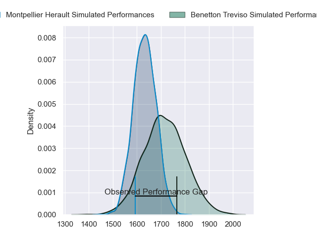
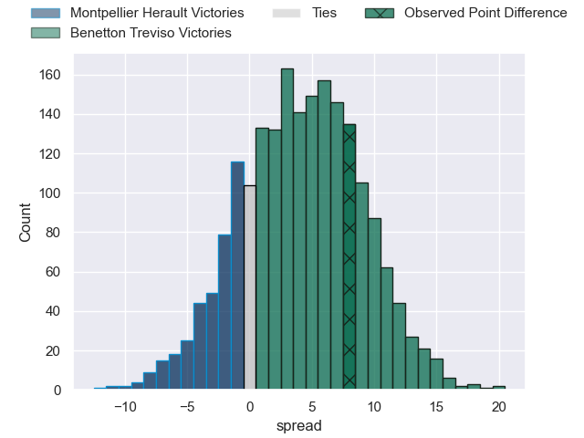
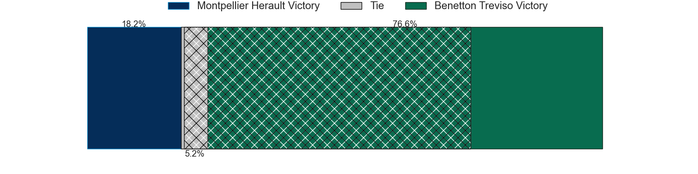
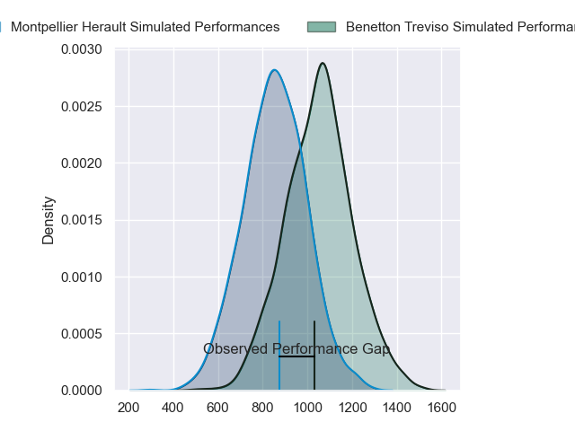
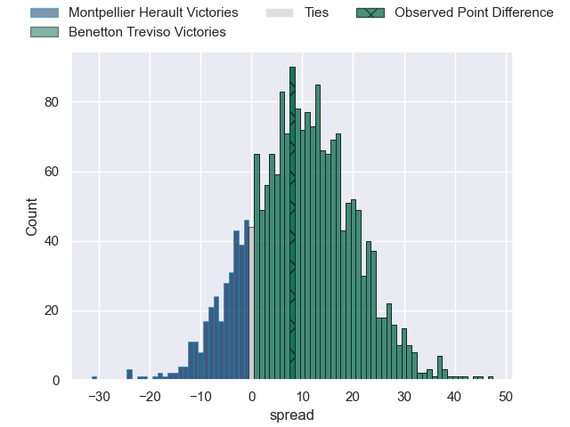
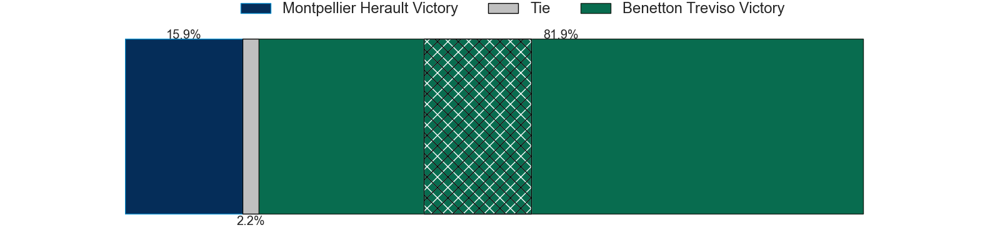
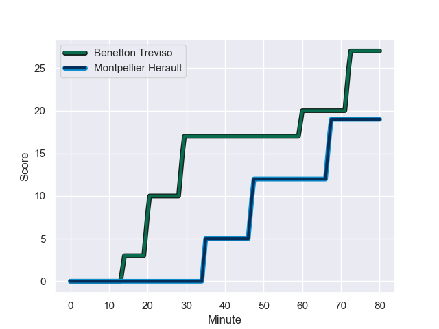
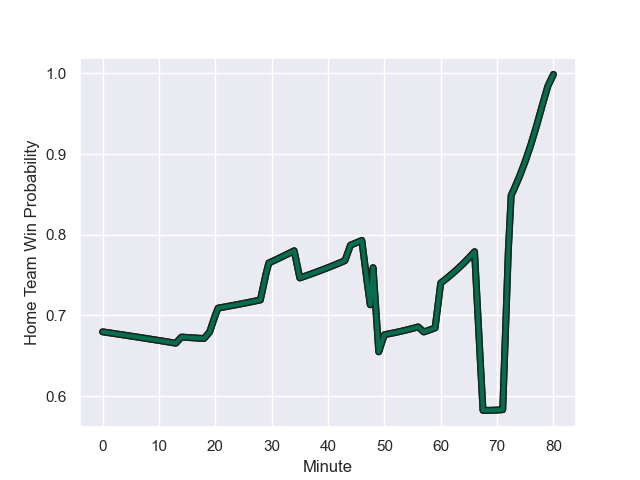

---  
layout: page  
title: Montpellier Herault at Benetton Treviso; 19-27  
date: 2024-01-20 18:00:00 -0500  
categories: "European Rugby Challenge Cup 2023" match review  
---
# Montpellier Herault at Benetton Treviso; 19-27

# Club Level Predictions

The first set of predictions treats a club as the smallest object, as the club develops its members, organizes a gameplan, and deploys its players as needed for each match. This club model has a prediction of 0.615, which translates to predicting Benetton Treviso to win by 4.1.

Our Over/Under is 47.5 - and combined with the spread above, we have a predicted scoreline of 22 to 26

Each club has a rating and a rating deviation (similar to a Glicko rating), and expected performances can be generated. This allows for simulated matches and spreads like the ones below.
## Projected Performances - Club Model

## Projected Spreads - Club Model

## Projected Results - Club Model

# Player Level Predictions - Version 2

Treating teams instead as an entity made up of the currently active players, I have ratings for each player in an altogether different system. These can be combined to form team ratings once teamsheets are announced, weighting starters a bit higher than the reserves. After the match is played, players can be weighted by their minutes on the field, allowing for an accurate measure of the team's composition. With these compiled team ratings, we can make predictions, measure inaccuracy, and update the individual player ratings.
## Prediction with Player Minutes: Benetton Treviso by 8.2

Benetton Treviso by 3.1 on a neutral field
## Prediction without Player Minutes: Benetton Treviso by 10.3

Benetton Treviso by 5.2 on a neutral pitch

## Projected Performances - Player Model

## Projected Spreads - Player Model

## Projected Results - Player Model

## Scores over Time

## Win Probability over Time

There were 12 large changes in win probability in this match

|   Away Minutes | Away Player              |   Away elo |   Number |   Home elo | Home Player         |   Home Minutes |
|---------------:|:-------------------------|-----------:|---------:|-----------:|:--------------------|---------------:|
|             48 | Baptiste Erdocio         |       2.72 |        1 |      76.41 | Thomas Gallo        |             49 |
|             48 | Brandon Paenga-Amosa     |      50.13 |        2 |      30.47 | Bautista Bernasconi |             19 |
|             48 | Titi Lamositele          |      50.9  |        3 |      55.68 | Giosue Zilocchi     |             49 |
|             80 | Bastien Chalureau        |      70.77 |        4 |      63.6  | Edoardo Iachizzi    |             44 |
|             80 | Paul Willemse            |      65.16 |        5 |      74.55 | Eli Snyman          |             57 |
|             50 | Florian Verhaeghe        |      64.6  |        6 |      59.68 | Alessandro Izekor   |             80 |
|             48 | Clément Doumenc          |      42.07 |        7 |      52.42 | Manuel Zuliani      |             44 |
|             80 | Marco Tauleigne          |      95.05 |        8 |      90.3  | Lorenzo Cannone     |             80 |
|             80 | Léo Coly                 |      19.72 |        9 |      60.67 | Alessandro Garbisi  |             60 |
|             80 | Paolo Garbisi            |      53.81 |       10 |      76.55 | Tomas Albornoz      |             80 |
|             80 | Ben Lam                  |     127.51 |       11 |      38.37 | Onisi Ratave        |             80 |
|             57 | Auguste Cadot            |      16.05 |       12 |      59.22 | Malakai Fekitoa     |             80 |
|             50 | Thomas Darmon            |       6.67 |       13 |      68.72 | Tommaso Menoncello  |             80 |
|             48 | Pierre Lucas             |      27.4  |       14 |      19.97 | Ignacio Mendy       |             80 |
|             80 | Julien Tisseron          |      61.94 |       15 |      71.08 | Rhyno Smith         |             26 |
|             32 | Enzo Forletta            |      60.82 |       16 |      58.36 | Mirco Spagnolo      |             31 |
|             32 | Harry Williams           |     133.5  |       17 |      45.99 | Gianmarco Lucchesi  |             61 |
|             32 | Vano Karkadze            |      39.88 |       18 |      59.32 | Tiziano Pasquali    |             31 |
|             30 | Tyler Duguid             |      40.75 |       19 |     101.64 | Federico Ruzza      |             36 |
|             32 | Sam Simmonds             |      68.05 |       20 |      64.96 | Sebastian Negri     |             23 |
|             23 | Louis Foursans-Bourdette |      40.57 |       21 |      92.15 | Michele Lamaro      |             36 |
|             30 | Masivesi Dakuwaqa        |      80.86 |       22 |      28.08 | Andy Uren           |             20 |
|             32 | Anthony Bouthier         |      50.27 |       23 |      70.14 | Jacob Umaga         |             54 |

