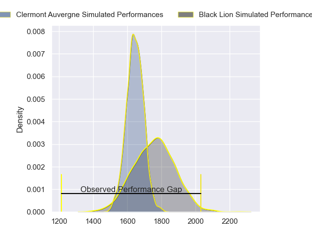
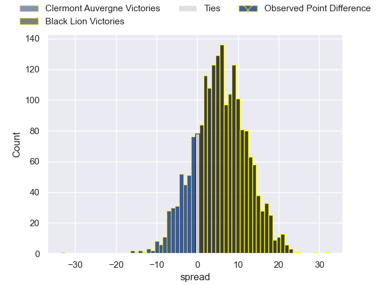
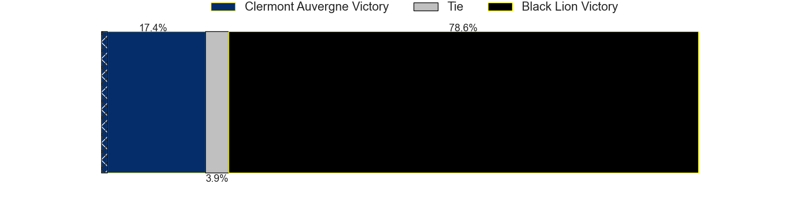
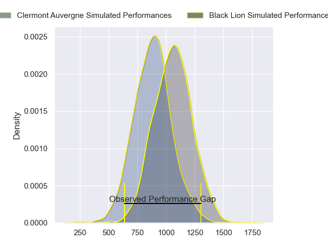
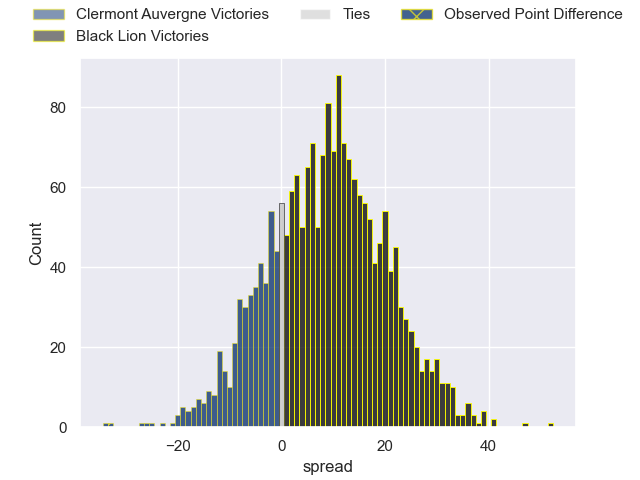
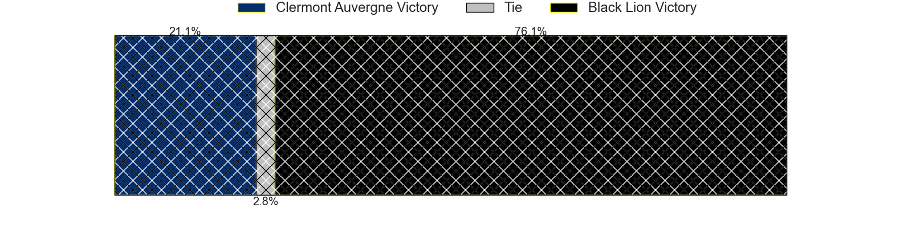
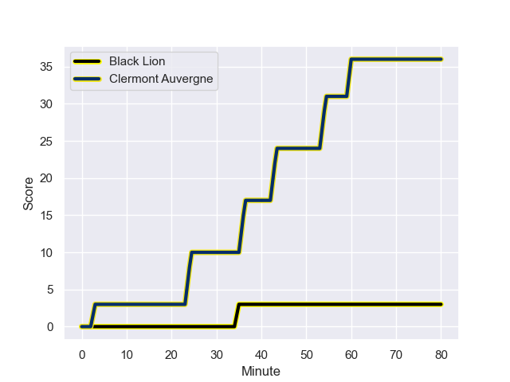
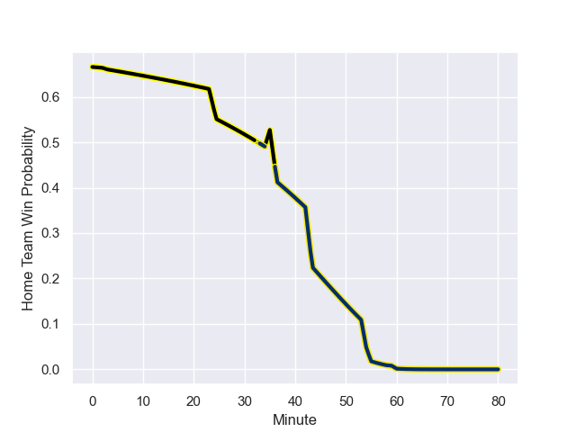

---  
layout: page  
title: Clermont Auvergne at Black Lion; 36-3  
date: 2024-01-20 18:00:00 -0500  
categories: "European Rugby Challenge Cup 2023" match review  
---
# Clermont Auvergne at Black Lion; 36-3

# Club Level Predictions

The first set of predictions treats a club as the smallest object, as the club develops its members, organizes a gameplan, and deploys its players as needed for each match. This club model has a prediction of 0.658, which translates to predicting Black Lion to win by 5.7.

Our Over/Under is 44.5 - and combined with the spread above, we have a predicted scoreline of 19 to 25

Each club has a rating and a rating deviation (similar to a Glicko rating), and expected performances can be generated. This allows for simulated matches and spreads like the ones below.
## Projected Performances - Club Model

## Projected Spreads - Club Model

## Projected Results - Club Model

# Player Level Predictions - Version 2

Treating teams instead as an entity made up of the currently active players, I have ratings for each player in an altogether different system. These can be combined to form team ratings once teamsheets are announced, weighting starters a bit higher than the reserves. After the match is played, players can be weighted by their minutes on the field, allowing for an accurate measure of the team's composition. With these compiled team ratings, we can make predictions, measure inaccuracy, and update the individual player ratings.
## Prediction with Player Minutes: Black Lion by 7.6

Black Lion by 4.5 on a neutral field
## Prediction without Player Minutes: Black Lion by 6.5

Black Lion by 3.3 on a neutral pitch

## Projected Performances - Player Model

## Projected Spreads - Player Model

## Projected Results - Player Model

## Scores over Time

## Win Probability over Time

There were 7 large changes in win probability in this match

|   Away Minutes | Away Player       |   Away elo |   Number |   Home elo | Home Player             |   Home Minutes |
|---------------:|:------------------|-----------:|---------:|-----------:|:------------------------|---------------:|
|             62 | Etienne Falgoux   |      53.76 |        1 |      57.53 | Dato Abdushelishvili    |             59 |
|             73 | Folau Fainga'a    |      92.12 |        2 |      41.94 | Tengiz Zamtaradze       |             59 |
|             62 | Cristian Ojovan   |      57.52 |        3 |      46.69 | Giorgi Chkhartishvili   |             59 |
|             69 | Thibaud Lanen     |      60.47 |        4 |      48.71 | Demuri Epremidze        |             55 |
|             80 | Tomas Lavanini    |      62.28 |        5 |      80.11 | Mikheili Babunashvili   |             80 |
|             80 | Lucas Dessaigne   |      71.71 |        6 |      59.6  | Luka Ivanishvili        |             80 |
|             80 | Marcos Kremer     |      43.07 |        7 |      74    | Sandro Mamamtavrishvili |             80 |
|             40 | Pita Gus Sowakula |      88.78 |        8 |      24.6  | Ilia Spanderashvili     |             73 |
|             69 | Baptiste Jauneau  |      22.41 |        9 |      59.04 | Giorgi Margalitadze     |             73 |
|             69 | Anthony Belleau   |      63.76 |       10 |      96.02 | Luka Matkava            |             80 |
|             80 | Joris Jurand      |      55.23 |       11 |      87.77 | Sandro Todua            |             80 |
|             66 | George Moala      |      77.1  |       12 |      48.76 | Merab Sharikadze        |             80 |
|             80 | Leon Darricarrere |      41.24 |       13 |     104.01 | Giorgi Kveseladze       |             55 |
|             80 | Bautista Delguy   |      68.25 |       14 |      80.18 | Aka Tabutsadze          |             80 |
|             80 | Alex Newsome      |      54.4  |       15 |      90.56 | Mirian Modebadze        |             62 |
|             18 | Giorgi Beria      |      43.13 |       16 |       1.25 | Nikoloz Khatiashvili    |             21 |
|             18 | Rabah Slimani     |      55.17 |       17 |      47.08 | Irakli Kvatadze         |             21 |
|              7 | Robin Couly       |      43.93 |       18 |      47.78 | Bachuki Tchumbadze      |             21 |
|             11 | Rob Simmons       |      83.71 |       19 |     137.38 | Nodar Cheishvili        |             25 |
|             40 | Killian Tixeront  |      48.33 |       20 |      42.53 | Giorgi Kervalishvili    |              7 |
|             11 | Sebastien Bezy    |      71.6  |       21 |      46.65 | Alexander Jighauri      |              7 |
|             11 | Theo Giral        |      46.65 |       22 |      54.78 | Tornike Kakhoidze       |             25 |
|             14 | Pierre Fouyssac   |      16.33 |       23 |      50.17 | Luka Tsirekidze         |             18 |

