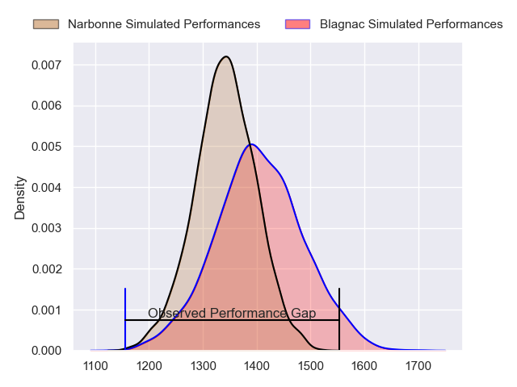
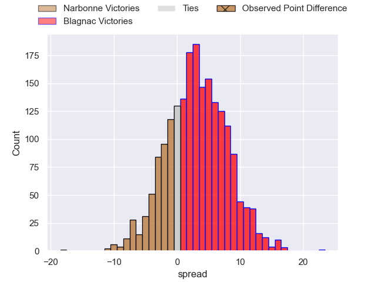
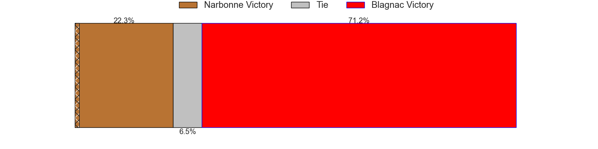
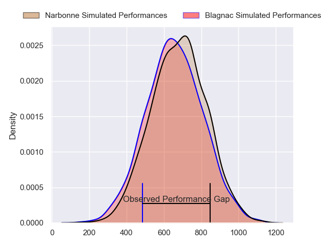
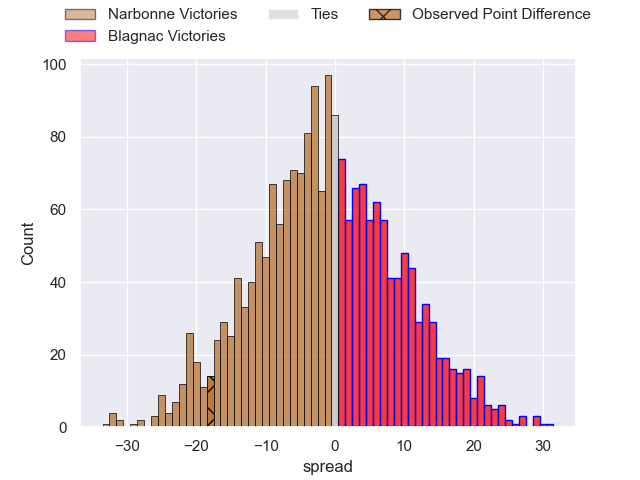
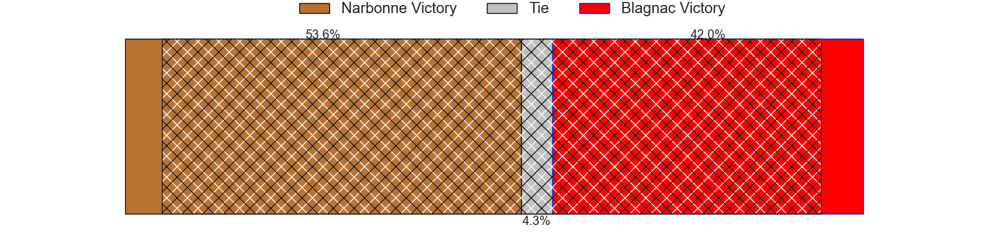
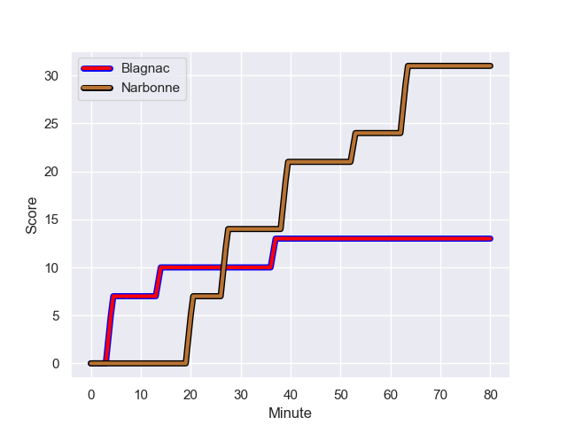
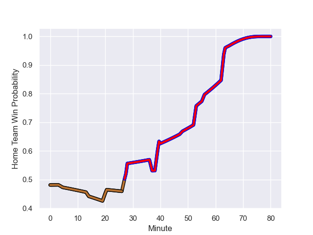

---  
layout: page  
title: Narbonne at Blagnac; 31-13  
date: 2024-01-20 18:00:00 -0500  
categories: "Nationale 2023" match review  
---
# Narbonne at Blagnac; 31-13

# Club Level Predictions

The first set of predictions treats a club as the smallest object, as the club develops its members, organizes a gameplan, and deploys its players as needed for each match. This club model has a prediction of 0.591, which translates to predicting Blagnac to win by 3.3.

Our Over/Under is 37.5 - and combined with the spread above, we have a predicted scoreline of 17 to 20

Each club has a rating and a rating deviation (similar to a Glicko rating), and expected performances can be generated. This allows for simulated matches and spreads like the ones below.
## Projected Performances - Club Model

## Projected Spreads - Club Model

## Projected Results - Club Model

# Player Level Predictions - Version 2

Treating teams instead as an entity made up of the currently active players, I have ratings for each player in an altogether different system. These can be combined to form team ratings once teamsheets are announced, weighting starters a bit higher than the reserves. After the match is played, players can be weighted by their minutes on the field, allowing for an accurate measure of the team's composition. With these compiled team ratings, we can make predictions, measure inaccuracy, and update the individual player ratings.
## Prediction with Player Minutes: Narbonne by 0.8

Narbonne by 4.5 on a neutral field
## Prediction without Player Minutes: Blagnac by 1.0

Narbonne by 2.6 on a neutral pitch

## Projected Performances - Player Model

## Projected Spreads - Player Model

## Projected Results - Player Model

## Scores over Time

## Win Probability over Time

There were 8 large changes in win probability in this match

|   Away Minutes | Away Player            |   Away elo |   Number |   Home elo | Home Player         |   Home Minutes |
|---------------:|:-----------------------|-----------:|---------:|-----------:|:--------------------|---------------:|
|             48 | Sylvain Abadie         |      30.3  |        1 |      38.41 | Benjamin Bertrand   |             54 |
|             54 | Mehdi Boundjema        |      49.78 |        2 |      42.75 | Antoine Marty-Rybak |             54 |
|             48 | Levi Tikoipau          |      46.79 |        3 |      56.24 | Baptiste Collet     |             48 |
|             80 | Marius Antonescu       |      53.12 |        4 |      31.11 | Vincent Mutel       |             56 |
|             63 | Dennis Visser          |      18.22 |        5 |     -15.15 | Victor Fromenteze   |             80 |
|             80 | Arthur Christienne     |      44.44 |        6 |      52.22 | Simon Veyrac        |             80 |
|             54 | Baptiste Abescat-Leroy |      34.3  |        7 |      74.9  | Nikita Bekov        |             56 |
|             80 | Charles Malet          |      -2.65 |        8 |      20.77 | Matthieu Thomas     |             80 |
|             40 | Josh Valentine         |      96.89 |        9 |      46.65 | Ruben Courties      |             65 |
|             40 | Gilles Bosch           |       3.22 |       10 |      53.18 | Ugo Seunes          |             80 |
|             63 | Ambrose Curtis         |      21.83 |       11 |      43.3  | Lukas Doyhenard     |             80 |
|             80 | Peter Betham           |     120.61 |       12 |      53.8  | Aurelien Labau      |             28 |
|             80 | Pierre Nueno           |      39.05 |       13 |      43.45 | Baptiste Serrano    |             80 |
|             80 | Clément Clavières      |      68.05 |       14 |      35.68 | Peïo Retegui        |             80 |
|             80 | Paul Auradou           |      49.15 |       15 |      28.93 | Gérald Augustin     |             65 |
|             32 | Théo Castinel          |      52.36 |       16 |      58.2  | Alexis Decaux       |             26 |
|             26 | Christophe David       |      62.79 |       17 |      49.42 | Enzo Rivier         |             26 |
|             32 | Mohammed Loukia        |      31.05 |       18 |      52.52 | Victor Delmas       |             32 |
|             17 | Mohamed Kbaier         |      35.08 |       19 |      34.32 | Lucas Tolofua       |             24 |
|             26 | Thibault Clauzade      |      49    |       20 |      28.56 | Nekolo Tolofua      |             24 |
|             40 | Pablo Barbaste         |      46.5  |       21 |      29.44 | William Beaudon     |             15 |
|             40 | Tom Chauvet            |      38.23 |       22 |       6.72 | Clément Vareilles   |             52 |
|             17 | Théo Mias              |      22.73 |       23 |      58.76 | Jean-Andre Vernetti |             15 |

