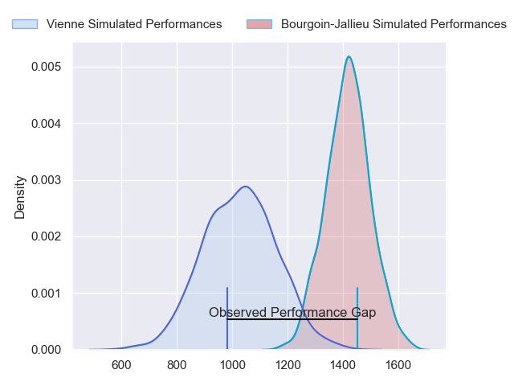
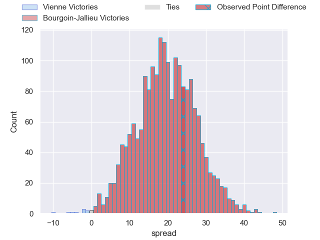
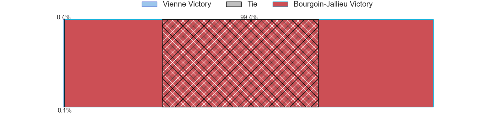
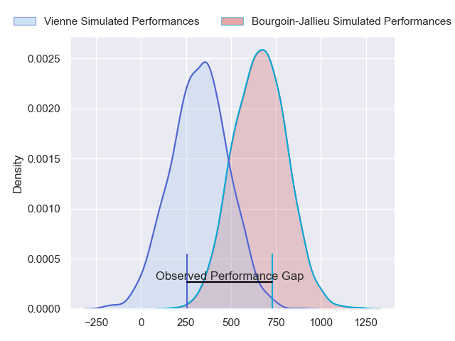
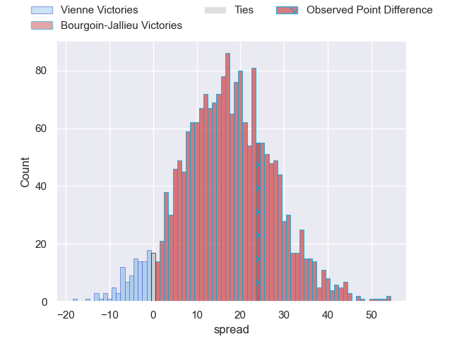
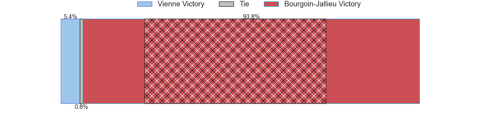
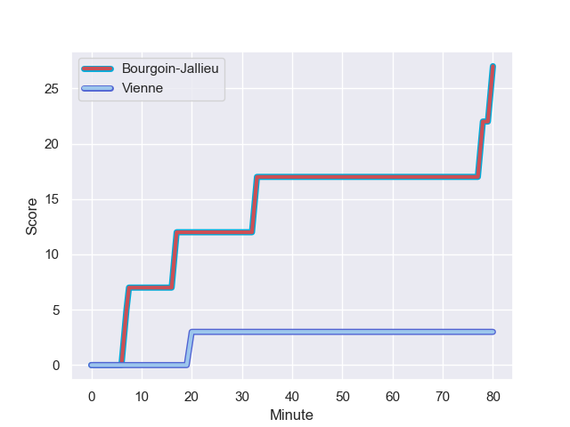
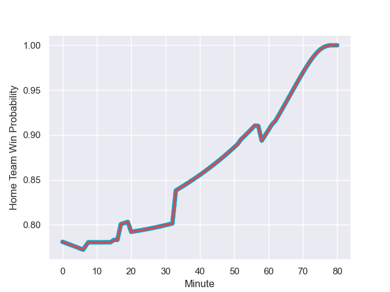

---  
layout: page  
title: Vienne at Bourgoin-Jallieu; 3-27  
date: 2024-01-20 18:00:00 -0500  
categories: "Nationale 2023" match review  
---
# Vienne at Bourgoin-Jallieu; 3-27

# Club Level Predictions

The first set of predictions treats a club as the smallest object, as the club develops its members, organizes a gameplan, and deploys its players as needed for each match. This club model has a prediction of 0.887, which translates to predicting Bourgoin-Jallieu to win by 19.4.

Our Over/Under is 26.5 - and combined with the spread above, we have a predicted scoreline of 4 to 23

Each club has a rating and a rating deviation (similar to a Glicko rating), and expected performances can be generated. This allows for simulated matches and spreads like the ones below.
## Projected Performances - Club Model

## Projected Spreads - Club Model

## Projected Results - Club Model

# Player Level Predictions - Version 2

Treating teams instead as an entity made up of the currently active players, I have ratings for each player in an altogether different system. These can be combined to form team ratings once teamsheets are announced, weighting starters a bit higher than the reserves. After the match is played, players can be weighted by their minutes on the field, allowing for an accurate measure of the team's composition. With these compiled team ratings, we can make predictions, measure inaccuracy, and update the individual player ratings.
## Prediction with Player Minutes: Bourgoin-Jallieu by 14.0

Bourgoin-Jallieu by 7.6 on a neutral field
## Prediction without Player Minutes: Bourgoin-Jallieu by 14.4

Bourgoin-Jallieu by 8.0 on a neutral pitch

## Projected Performances - Player Model

## Projected Spreads - Player Model

## Projected Results - Player Model

## Scores over Time

## Win Probability over Time

There were 1 large changes in win probability in this match

|   Away Minutes | Away Player       |   Away elo |   Number |   Home elo | Home Player              |   Home Minutes |
|---------------:|:------------------|-----------:|---------:|-----------:|:-------------------------|---------------:|
|             58 | Louan Capuano     |      22.86 |        1 |      47.56 | Rémy Gaborit             |             52 |
|             15 | Pierre Bourquin   |      34.67 |        2 |      61.19 | Killian Tripier          |             52 |
|             58 | Guram Kavtidze    |      20.37 |        3 |      41.12 | Maxime Calliet           |             52 |
|             80 | Pierre Chapelle   |      17.9  |        4 |      -9.37 | Léandre Cotte            |             80 |
|             62 | Ciaran O'Flynn    |      13.57 |        5 |      30.82 | Jonathan Kpoku           |             80 |
|             80 | Léon Peyrat       |      22.87 |        6 |     -44.67 | Morgan Eames             |             52 |
|             58 | Charles Massot    |      16.34 |        7 |      45.61 | Kevin Chaudouard         |             52 |
|             80 | Théo Minodier     |      46.77 |        8 |      49.76 | Poutasi Luafutu          |             52 |
|             80 | Enzo Ravanello    |      42.59 |        9 |      61.8  | Jeremy Gondrand          |             15 |
|             62 | Julien Hervouet   |      30.58 |       10 |      23.59 | Aviata Silago            |             80 |
|             58 | Bastien Colliat   |     -39.57 |       11 |      36.09 | Quentin Lefort           |             80 |
|             80 | Matthias Giovale  |      19.97 |       12 |      58.57 | Isaiah Leota             |             80 |
|             80 | Pierre Mollard    |       8.17 |       13 |      36.97 | Makalea Foliaki          |             57 |
|             80 | Martin Arfi       |      32.74 |       14 |      46.87 | Paul-Hugo Champ          |             80 |
|             80 | Brandon Bellavia  |       4.83 |       15 |      16.72 | Nicolas Cachet           |             80 |
|             65 | Dimitri Gibierge  |      30.18 |       16 |      74.48 | Tomas Munilla lo Duca    |             65 |
|             22 | Corentin Durand   |      47.06 |       17 |      33.11 | Zhorzhi (Jorji) Saldadze |             28 |
|             22 | Romain Eliot      |      29.27 |       18 |      15.24 | Mohamed Khribache        |             28 |
|             22 | Guillaume Moroldo |      18.11 |       19 |      46.6  | Osman Dimen              |             28 |
|             22 | Axel Derderian    |      33.94 |       20 |      40.99 | Matteo Broeders          |             28 |
|             18 | Charles Hager     |      40.81 |       21 |      19.21 | Aitor Hourcade           |             28 |
|             18 | Victor Comptat    |      18.22 |       22 |      52.36 | Théo Lepage              |             28 |
|            nan | nan               |     nan    |       23 |      12.28 | Christopher Bosch        |             23 |

