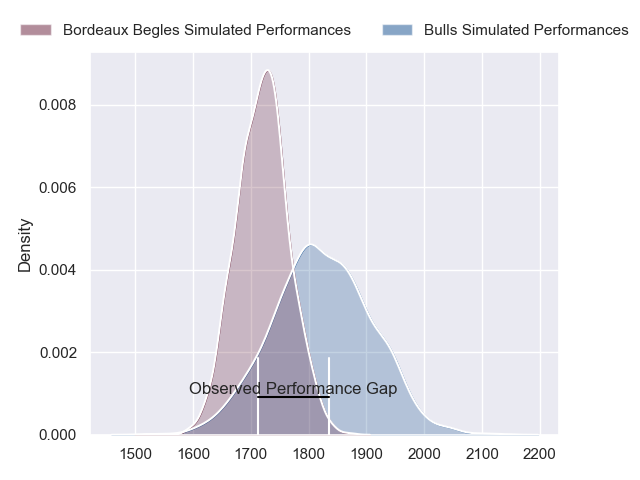
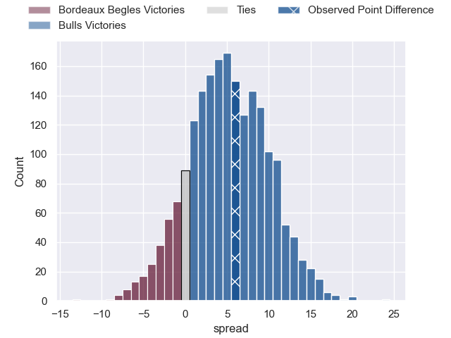
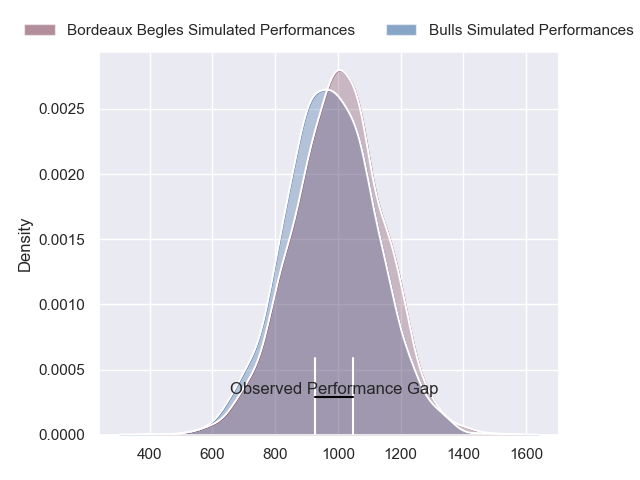
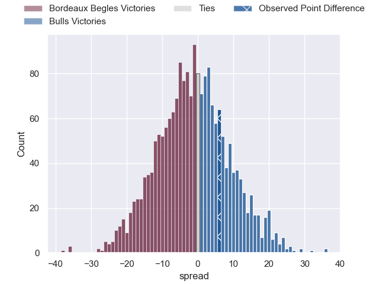
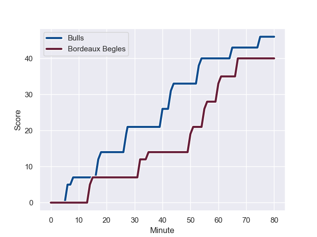
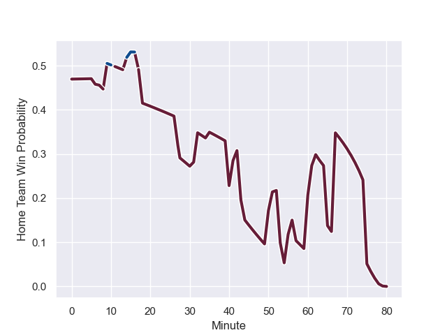

---  
layout: page  
title: Bordeaux Begles at Bulls; 40-46  
date: 2024-01-20 18:00:00 -0500  
categories: "European Rugby Champions Cup 2023" match review  
---
# Bordeaux Begles at Bulls; 40-46

# Club Level Predictions

The first set of predictions treats a club as the smallest object, as the club develops its members, organizes a gameplan, and deploys its players as needed for each match. This club model has a prediction of 0.645, which translates to predicting Bulls to win by 5.2.

Our Over/Under is 52.5 - and combined with the spread above, we have a predicted scoreline of 24 to 29

Each club has a rating and a rating deviation (similar to a Glicko rating), and expected performances can be generated. This allows for simulated matches and spreads like the ones below.
## Projected Performances - Club Model

## Projected Spreads - Club Model

## Projected Results - Club Model

# Player Level Predictions - Version 2

Treating teams instead as an entity made up of the currently active players, I have ratings for each player in an altogether different system. These can be combined to form team ratings once teamsheets are announced, weighting starters a bit higher than the reserves. After the match is played, players can be weighted by their minutes on the field, allowing for an accurate measure of the team's composition. With these compiled team ratings, we can make predictions, measure inaccuracy, and update the individual player ratings.
## Prediction with Player Minutes: Bordeaux Begles by 1.3

Bordeaux Begles by 6.1 on a neutral field
## Prediction without Player Minutes: Bulls by 0.6

Bordeaux Begles by 4.2 on a neutral pitch

## Projected Performances - Player Model

## Projected Spreads - Player Model

## Projected Results - Player Model

## Scores over Time

## Win Probability over Time

There were 23 large changes in win probability in this match

|   Away Minutes | Away Player          |   Away elo |   Number |   Home elo | Home Player                     |   Home Minutes |
|---------------:|:---------------------|-----------:|---------:|-----------:|:--------------------------------|---------------:|
|             52 | Jefferson Poirot     |      56.35 |        1 |      72.95 | Gerhard Steenekamp              |             51 |
|             42 | Clement Maynadier    |      46.65 |        2 |      45.95 | Jan-Hendrik Wessels             |             52 |
|             43 | Carlu Sadie          |      28.7  |        3 |      46.65 | Mornay Smith                    |             52 |
|             31 | Kane Douglas         |      27.93 |        4 |      37.38 | Reinhardt Ludwig                |             80 |
|             57 | Adam Coleman         |     138.33 |        5 |      53.37 | Ruan Nortje                     |             80 |
|             80 | Pierre Bochaton      |     107.48 |        6 |      83.28 | Marcell Coetzee                 |             68 |
|             41 | Marko Gazzotti       |      55.47 |        7 |      43.01 | Celimpilo Gumede                |             56 |
|             71 | Pete Samu            |      72.38 |        8 |      50.9  | Cameron Hanekom                 |             54 |
|             80 | Paul Abadie          |      21.47 |        9 |      99.13 | Embrose Papier                  |             62 |
|             59 | Zack Holmes          |      46.65 |       10 |      54.66 | Johan Goosen                    |             62 |
|             80 | Louis Bielle-Biarrey |      78.19 |       11 |      46.73 | Devon Williams                  |             80 |
|             80 | Pablo Uberti         |      36.46 |       12 |      87.21 | David Kriel                     |             80 |
|             80 | Nicolas Depoortere   |      70.4  |       13 |      50.55 | Stedman Gans                    |             80 |
|             66 | Madosh Tambwe        |      46.65 |       14 |      45.51 | Sebastian de Klerk              |             80 |
|             80 | Romain Buros         |     124.99 |       15 |      46.65 | Willie Le Roux                  |             66 |
|             38 | Maxime Lamothe       |      61.35 |       16 |      46.65 | Akker van der Merwe             |             28 |
|             28 | Ugo Boniface         |      80.32 |       17 |      59.69 | Simphiwe Matanzima              |             36 |
|             46 | Ben Tameifuna        |     119.62 |       18 |      43.79 | Khutha Mchunu                   |             28 |
|             49 | Alexandre Ricard     |      46.65 |       19 |      46.65 | Jacob Frederick Nel Van Heerden |             17 |
|             23 | Antoine Miquel       |      46.65 |       20 |      75.23 | Elrigh Louw                     |             38 |
|             39 | Tevita Tatafu        |      47.91 |       21 |      46.99 | Keagan Johannes                 |             18 |
|             14 | Theo Nanette         |      46.65 |       22 |      46.65 | Jaco van der Walt               |             18 |
|             21 | Mateo Garcia         |      46.65 |       23 |      46.65 | Cornal Hendricks                |             14 |

