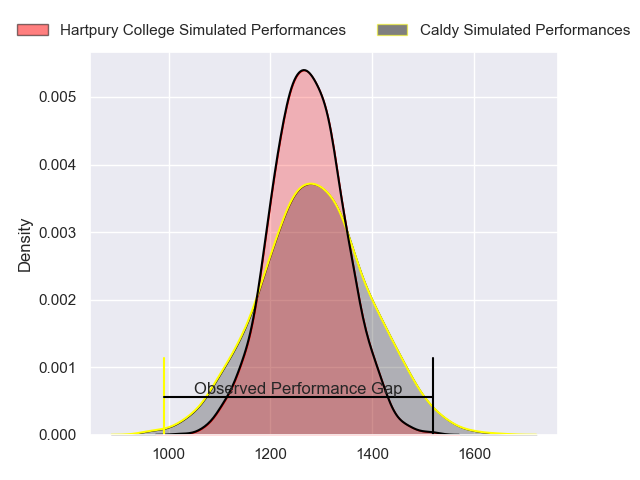
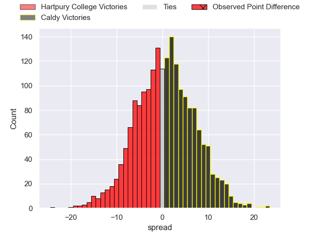
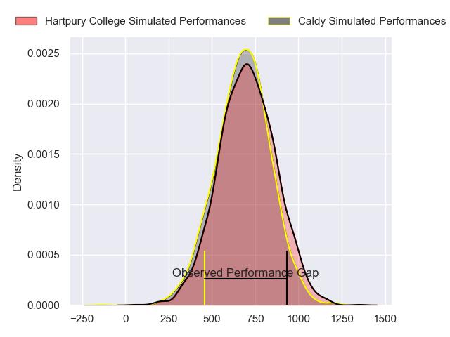
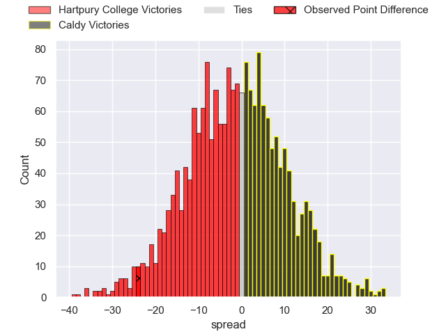
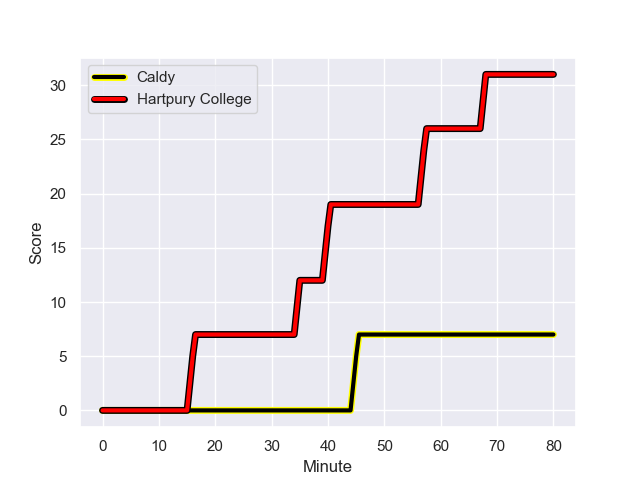
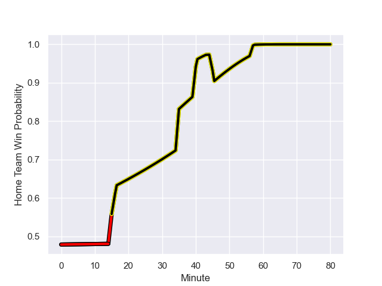

---  
layout: page  
title: Hartpury College at Caldy; 31-7  
date: 2024-01-20 18:00:00 -0500  
categories: "RFU Championship 2023" match review  
---
# Hartpury College at Caldy; 31-7

# Club Level Predictions

The first set of predictions treats a club as the smallest object, as the club develops its members, organizes a gameplan, and deploys its players as needed for each match. This club model has a prediction of 0.524, which translates to predicting Caldy to win by 0.8.

Our Over/Under is 44.5 - and combined with the spread above, we have a predicted scoreline of 22 to 22

Each club has a rating and a rating deviation (similar to a Glicko rating), and expected performances can be generated. This allows for simulated matches and spreads like the ones below.
## Projected Performances - Club Model

## Projected Spreads - Club Model

## Projected Results - Club Model

# Player Level Predictions - Version 2

Treating teams instead as an entity made up of the currently active players, I have ratings for each player in an altogether different system. These can be combined to form team ratings once teamsheets are announced, weighting starters a bit higher than the reserves. After the match is played, players can be weighted by their minutes on the field, allowing for an accurate measure of the team's composition. With these compiled team ratings, we can make predictions, measure inaccuracy, and update the individual player ratings.
## Prediction with Player Minutes: Hartpury College by 0.9

Hartpury College by 4.1 on a neutral field
## Prediction without Player Minutes: Hartpury College by 0.9

Hartpury College by 4.1 on a neutral pitch

## Projected Performances - Player Model

## Projected Spreads - Player Model

## Projected Results - Player Model

## Scores over Time

## Win Probability over Time

There were 7 large changes in win probability in this match

|   Away Minutes | Away Player           |   Away elo |   Number |   Home elo | Home Player      |   Home Minutes |
|---------------:|:----------------------|-----------:|---------:|-----------:|:-----------------|---------------:|
|             67 | Aristot Benz-Salomon  |      52.83 |        1 |      41.45 | Adam Aigbokhae   |             58 |
|             67 | William Crane         |      41.34 |        2 |      31.9  | Oliver Hearn     |             58 |
|             69 | Jonathan Benz-Salomon |      49.17 |        3 |      15.29 | Joe Sproston     |             44 |
|             62 | Dale Lemon            |      50.84 |        4 |      53.18 | Sam Dickinson    |             80 |
|             80 | Jack Davies           |      58.23 |        5 |      50.68 | Martin Gerrard   |             80 |
|             80 | Samuel Lewis          |      17.53 |        6 |      58.53 | Ewan Murphy      |             80 |
|             80 | Harry Short           |      64.49 |        7 |      61.75 | Ciaran Booth     |             73 |
|             62 | Josh Gray             |      68.6  |        8 |      38.57 | Josiah Dickinson |             40 |
|             67 | Michael Austin        |      51.8  |        9 |      23    | Chris Pilgrim    |             67 |
|             80 | Harry Bazalgette      |      69.64 |       10 |      32.36 | Rhys Hayes       |             80 |
|             67 | Alex Morgan           |      25.31 |       11 |      29.06 | Benjamin Jones   |             58 |
|             80 | Morgan Adderly-Jones  |      50.33 |       12 |      60.39 | Michael Barlow   |             80 |
|             80 | Robbie Smith          |      -1.54 |       13 |      48.75 | Connor Wilkinson |             80 |
|             67 | Bradley Denty         |      63.33 |       14 |      34.24 | Nick Royle       |             80 |
|             80 | Tommy Mathews         |      42.11 |       15 |      59.29 | Matt Kilcourse   |             15 |
|             18 | Mitchell Eadie        |      46.08 |       16 |      16.34 | Lewis Barker     |             65 |
|             18 | Freddie Thomas        |      37.93 |       17 |      33.62 | Sam Olyott       |             40 |
|             13 | Charlie Powell        |      85.89 |       18 |      32.16 | Nathan Rushton   |             36 |
|             13 | Matty Jones           |      51.23 |       19 |      42.37 | Ryan Higginson   |             22 |
|             13 | Mikey Summerfield     |      59.8  |       20 |      56.95 | Matt Gallagher   |             22 |
|             13 | Ethan Hunt            |      56.15 |       21 |       0.83 | Michael Cartmill |             22 |
|             13 | Sam Smith             |      62.29 |       22 |      39.11 | Joseph Murray    |             13 |
|             11 | Alex Gibson           |      26.27 |       23 |      27.16 | Callum Ridgway   |              7 |

