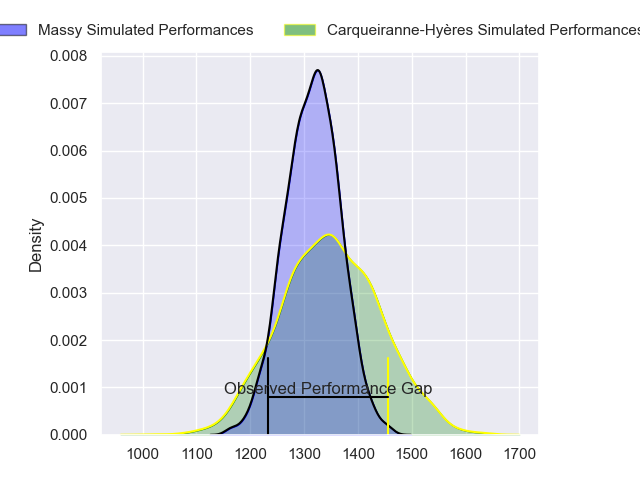
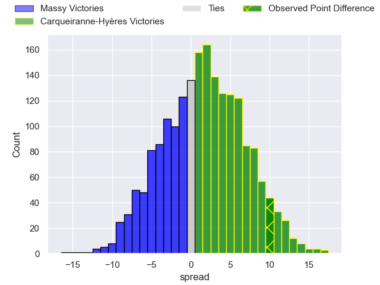
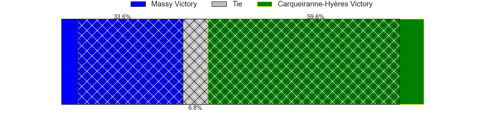
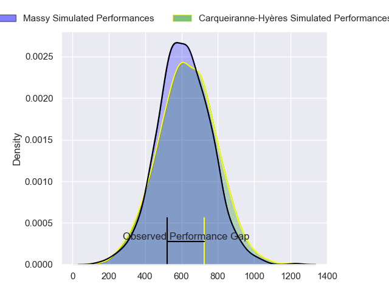
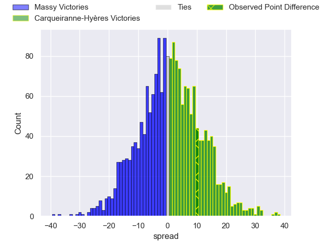
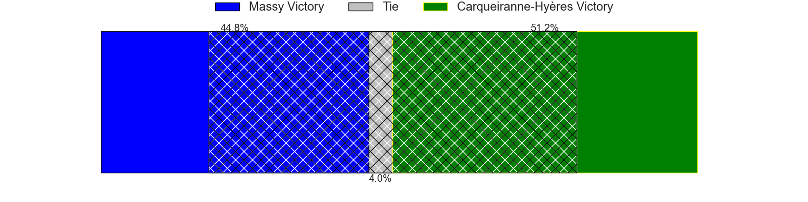
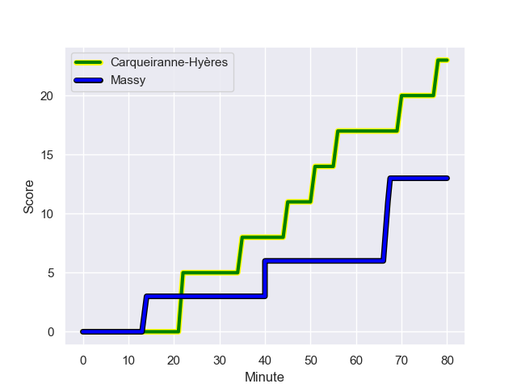
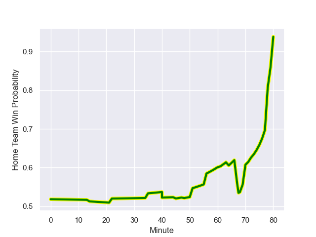

---  
layout: page  
title: Massy at Carqueiranne-Hyeres; 13-23  
date: 2024-01-20 18:00:00 -0500  
categories: "Nationale 2023" match review  
---
# Massy at Carqueiranne-Hyeres; 13-23

# Club Level Predictions

The first set of predictions treats a club as the smallest object, as the club develops its members, organizes a gameplan, and deploys its players as needed for each match. This club model has a prediction of 0.543, which translates to predicting Carqueiranne-Hyères to win by 1.5.

Our Over/Under is 33.5 - and combined with the spread above, we have a predicted scoreline of 16 to 18

Each club has a rating and a rating deviation (similar to a Glicko rating), and expected performances can be generated. This allows for simulated matches and spreads like the ones below.
## Projected Performances - Club Model

## Projected Spreads - Club Model

## Projected Results - Club Model

# Player Level Predictions - Version 2

Treating teams instead as an entity made up of the currently active players, I have ratings for each player in an altogether different system. These can be combined to form team ratings once teamsheets are announced, weighting starters a bit higher than the reserves. After the match is played, players can be weighted by their minutes on the field, allowing for an accurate measure of the team's composition. With these compiled team ratings, we can make predictions, measure inaccuracy, and update the individual player ratings.
## Prediction with Player Minutes: Carqueiranne-Hyères by 0.8

Massy by 2.4 on a neutral field
## Prediction without Player Minutes: Carqueiranne-Hyères by 2.7

Massy by 0.5 on a neutral pitch

## Projected Performances - Player Model

## Projected Spreads - Player Model

## Projected Results - Player Model

## Scores over Time

## Win Probability over Time

There were 7 large changes in win probability in this match

|   Away Minutes | Away Player              |   Away elo |   Number |   Home elo | Home Player         |   Home Minutes |
|---------------:|:-------------------------|-----------:|---------:|-----------:|:--------------------|---------------:|
|             48 | Charif Mansour           |      49.18 |        1 |      41.99 | Eli Serra-Miglietti |             49 |
|             64 | Mike Tadjer              |       5.88 |        2 |      41.65 | Yan Tabarot         |             57 |
|             48 | Nolan Pienaar            |      50.41 |        3 |      58.48 | Lasha Mchelidze     |             61 |
|             80 | Saba Pesvianidze         |      69    |        4 |      21.18 | Adam Peters         |             80 |
|             64 | Koen Bloemen             |       2.62 |        5 |       9.45 | Lucas Cazac         |             72 |
|             45 | Abongile Nonkontwana     |     -16.25 |        6 |      21.02 | Nicolas Baquer      |             80 |
|             64 | Alexandre Loubiere       |      78.1  |        7 |      58.07 | Joachim Beaumont    |             80 |
|             80 | Samuel Nollet            |      17.71 |        8 |      59.18 | Andre Gorin         |             69 |
|             48 | Lucas Rubio              |      17.36 |        9 |      28.3  | Rémi Dubié          |             61 |
|             80 | Hugo Verdu               |      25.37 |       10 |      48.21 | Juan Kotze          |             80 |
|             80 | Martin Carre             |      72.15 |       11 |       3.06 | Vincent Alessi      |             80 |
|             64 | Victorien Jacomme        |      77.24 |       12 |      58.11 | Romain Leveque      |             73 |
|             80 | Arthur Seigneuret        |      59.21 |       13 |      39.62 | Charles Brousse     |             57 |
|             80 | Giorgi Gogoladze         |      40.96 |       14 |      39.02 | Dylan Sage          |             80 |
|             80 | Tom Deleuze              |      24.24 |       15 |      31.87 | Josselyn Bouchon    |             80 |
|             35 | Pierre Trassoudaine      |      92.81 |       16 |      44.92 | Sti Sithole         |             31 |
|             32 | Alexandre Candel         |      33.04 |       17 |      28.58 | Théo Defrance       |             23 |
|             32 | Benjamin Prier           |      49.53 |       18 |      28.1  | Theo Lachaud        |             23 |
|             32 | Tijde Visser             |      48.53 |       19 |      62.88 | Thomas Sonetti      |             19 |
|             16 | Clément Vidoni           |      44.69 |       20 |      44.81 | Costel Burtila      |             19 |
|             16 | Lilian Rousset           |      42.38 |       21 |      29.5  | Spike Salman        |             11 |
|             16 | Pierre-Alexandre Duclieu |      44.71 |       22 |      42.68 | Shade Barkallah     |              8 |
|             16 | Kimami Sitauti           |     -24.72 |       23 |      50.43 | Theo Moitrier       |              7 |

